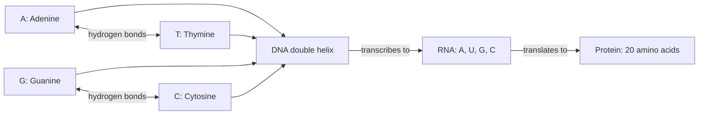
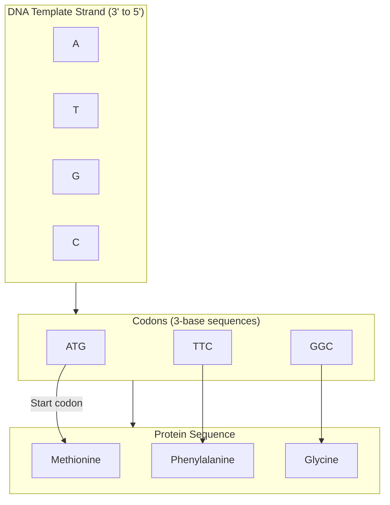

## Core Concepts and Terminology

This file maps the key scientific, historical, and ethical concepts explored
throughout the book. Each is defined in plain language and cross-referenced
to the chapter or section where it is developed in full.

---

## 1. The Gene

The fundamental unit of heredity. The concept evolved across eras:

| Historical Era | Definition |
|---|---|
| **Mendelian (1866)** | An invisible "element" that carries a trait from parent to offspring. Discrete, non-blending. |
| **Chromosomal (1910s)** | A physical location on a chromosome, mapped through breeding experiments. |
| **Molecular (1944–53)** | A sequence of DNA that encodes a functional product — typically a protein. |
| **Regulatory (1960s)** | Not just structural but also controlling: switching other genes on or off. |
| **Modern (2016)** | Any functional unit of heredity — including regulatory regions, non-coding RNA, and epigenetic marks not directly encoded in DNA sequence. |

Mukherjee never uses a single definition. The book deliberately keeps the
concept alive and evolving: the gene as it was imagined, the gene as it was
discovered, the gene as it turned out to be more complicated.

---

## 2. DNA

Deoxyribonucleic Acid. The physical molecule that carries genetic information
in almost all known organisms. A polymer of four nucleotides — A, T, G, C —
arranged in a double helix. Discovered as the genetic material in 1944 (Avery
et al.), structurally characterised by Watson and Crick in 1953.

---

## 3. The Central Dogma

Francis Crick's 1958 statement: **DNA makes RNA makes protein.** Information
flows in one direction. The DNA sequence is transcribed into messenger RNA,
which is translated into protein. Framework for all molecular biology.

| Flows | Canonical Direction | Major Exception |
|---|---|---|
| DNA → DNA | Replication | None known in conventional biology |
| DNA → RNA | Transcription | Reverse transcriptase: RNA → DNA (retroviruses) |
| RNA → Protein | Translation | None known |
| Protein → Protein | No transmission | Proposed but not confirmed in conventional biology |

---

## 4. Mendelian Inheritance

The two laws established by Mendel from his pea plant experiments:

- **Law of Segregation:** Each organism carries two copies of each
  inheritance factor. These copies separate during gamete formation, so
  each gamete carries just one copy.

- **Law of Independent Assortment:** Genes for different traits are inherited
  independently of each other, so long as they are on different chromosomes.

True for single-gene (Mendelian) disorders. Does not hold for polygenic
(complex) traits, which involve many genes interacting with each other and
with the environment.

---

## 5. Chromosomes

Thread-like structures made of DNA and protein found in the nucleus of every
cell. Humans have 23 pairs — 46 total. Before cell division, chromosomes
duplicate themselves so each daughter cell receives a full set.

| Feature | Detail |
|---|---|
| Total per human cell | 46 (23 pairs) |
| Pair 1–22 | Autosomes — identical in males and females |
| Pair 23 | Sex chromosomes: XX (female) or XY (male) |
| DNA per cell | ~3.2 billion base pairs per haploid set |
| Genes per haploid genome | ~20,687 protein-coding |

---

## 6. Gene Regulation

The control of when and where genes are turned on and off. Gene regulation
is what makes a liver cell different from a neuron — they have the same DNA
but use different subsets of genes.

Key regulatory elements covered in the book:

| Element | Function |
|---|---|
| **Promoter** | Region upstream of a gene where RNA polymerase binds to start transcription |
| **Enhancer** | Distant regulatory sequence that increases transcription of a target gene |
| **Silencer** | Sequence that reduces or blocks transcription |
| **Operator** | In operons, the binding site for repressor proteins |
| **Transcription factors** | Proteins that bind DNA and regulate transcription |

---

## 7. The Genetic Code

The mapping between DNA sequences (codons of three nucleotides) and amino
acids in proteins. Universal across all known organisms (with a few minor
variations in mitochondria and some protists).

---

## 8. The Human Genome

The complete set of genetic instructions carried in human DNA:

| Feature | Detail |
|---|---|
| Base pairs | ~3.2 billion (diploid, per cell) |
| Chromosomes | 23 pairs |
| Protein-coding genes | ~20,687 |
| Genes coding for RNA (non-coding) | Thousands more |
| Human DNA shared across all people | ~99.9% |
| Human-chimpanzee DNA shared | ~96% |
| Non-coding DNA ("junk DNA") | ~98% of total genome |

---

## 9. Single-Gene (Mendelian) Disorders

Diseases caused by mutations in a single gene, following Mendelian
inheritance patterns:

| Condition | Gene | Inheritance | Key Facts |
|---|---|---|---|
| **Huntington's disease** | *HTT* (CAG repeat expansion) | Dominant | Onset 30–50 years; no cure |
| **Cystic fibrosis** | *CFTR* | Recessive | Carrier rate ~1 in 25 (European ancestry) |
| **Sickle cell disease** | *HBB* | Recessive | Adaptation against malaria; painful crises |
| **Hereditary breast/ovarian cancer** | *BRCA1*, *BRCA2* | Dominant (incomplete penetrance) | Angelina Jolie prevention case |
| **Duchenne muscular dystrophy** | *Dystrophin* (X-linked) | X-linked recessive | Progressive muscle degeneration |

---

## 10. Polygenic and Complex Disorders

Human diseases and traits influenced by many genes plus environment. The
dominant pattern for most common diseases — heart disease, diabetes, most
cancers, most psychiatric conditions.

| Condition | Estimated Heritability | Genetic Architecture |
|---|---|---|
| Schizophrenia | ~80% | Hundreds of genes; remaining heritability unexplained |
| Type 2 diabetes | ~30% | Lifestyle + dozens of minor gene variants |
| Height | ~80% | Thousands of genetic variants of small effect |
| Breast cancer | ~25% (general) | *BRCA1/2* responsible for ~5% of cases |

---

## 11. Eugenics

The belief that human populations can be improved by controlled reproduction.
The book traces:

- Galton (1883): coining the term
- Davenport (1904–1934): building American eugenics infrastructure at Cold
  Spring Harbor Laboratory
- *_Buck v. Bell_* (1927): Supreme Court upholds forced sterilization
- American eugenics → Nazi Germany → Holocaust infrastructure
- Post-1945: genetics disassociated from eugenics; new ethical frameworks

---

## 12. The Human Genome Project

An international 13-year scientific research project to sequence the entire
human genome:

| Milestone | Date |
|---|---|
| Project launch | 1990 |
| Working draft announced | June 2000 (Clinton + Blair announcement) |
| "Complete" euchromatic genome published | April 2003 |
| Cost | ~3 billion USD (original) |
| Cost in 2016 | ~1,500 USD per genome |
| Cost in 2024 | Under 200 USD |

Key outputs: reference genome, genome databases, foundational tool for
all modern genetic research.

---

## 13. Epigenetics

Heritable changes in gene expression that do not involve changes to the DNA
sequence itself. Covered in the book as a "second layer" of biological
information.

| Mechanism | Effect |
|---|---|
| **DNA methylation** | Adds methyl groups to cytosine → silences genes |
| **Histone modification** | Changes to histone tails alter chromatin compaction |
| **Chromatin structure** | DNA "packing" controls which genes are accessible |
| **Non-coding RNAs** | RNA molecules that regulate other genes without coding for protein |

Epigenetics offers a model for how environment can affect genes — and be
transmitted to subsequent generations. The Dutch Hunger Winter studies showed
that famine conditions during pregnancy altered DNA methylation patterns in
children that could be detected decades later.

---

## 14. Schizophrenia and Psychiatric Genetics

One of the book's most personal topics. Schizophrenia is the most heritable
of the major psychiatric disorders, and yet its genetic architecture has
resisted simple explanation.

- Heritability estimated at ~80% from twin studies.
- Over 200 genetic loci associated via GWAS as of the book's publication.
- None of these loci alone is sufficient to cause the disorder.
- Environmental factors are essential triggers: prenatal infection, birth
  complications, adolescent cannabis use, social isolation.
- Age of onset: late adolescence to early thirties.
- The genetics of schizophrenia is an example of a complex trait — many
  genes, small individual effects, necessary but not sufficient environmental
  contributors.

---

## 15. CRISPR-Cas9

Clustered Regularly Interspaced Short Palindromic Repeats — a natural
bacterial adaptive immune system repurposed as a programmable genome editing
tool.

| Feature | Detail |
|---|---|
| Discovery | CRISPR sequences recognised by Francisco Mojica, early 1990s; mechanism elucidated across 2000s |
| Breakthrough | Doudna and Charpentier, 2012 — showed it can be programmed with a single RNA molecule |
| Key protein | Cas9 — the molecular scissors |
| Key RNA | Guide RNA — directs Cas9 to a specific DNA sequence |
| Precision | Programmable at the individual base pair level |
| Speed | Weeks vs. years for earlier methods |
| Cost | Less than one hundred dollars for a guide RNA since 2020 |
| First approved therapy | 2023 — Casgevy (exagamglogene autotemcel) for sickle cell disease and beta-thalassaemia |

---

## 16. Germline Editing

Genetic editing of gametes (sperm, ova) or early embryos — changes that
will be present in every cell of the resulting child, and in all their
descendants. Unlike somatic cell editing (treating an adult patient),
germline editing is heritable and cannot be reversed.

2018: He Jiankui announced the birth of twin girls (Lulu and Nana) whose
embryos had been edited with CRISPR to confer HIV resistance. The
international scientific community condemned the experiment as premature and
unethical. He served prison time in China.

The book argues that germline editing, if ever used clinically, should be
guided by pluralism — multiple voices, public deliberation, shared
governance — rather than by individual choice, national competition, or
market forces alone.

---

## 17. Personalized Medicine

The practice of tailoring medical treatment to the individual characteristics
of each patient — including their genetic profile. Already in practice in
some domains; aspirational in most.

| Current Application | Examples |
|---|---|
| Pharmacogenomics | *CYP2D6* variants affect drug metabolism; warfarin dosing |
| Cancer genomics | Matching targeted therapies to specific tumour mutations |
| Prenatal aneuploidy screening | NIPT for Down syndrome (trisomy 21) |
| Carrier screening | CFTR testing for couples before conception |
| Preventive care | Prophylactic surgery for *BRCA1/2* mutation carriers |

---

## 18. The Ethics of Genetic Knowledge

Mukherjee articulates four ethical frameworks that shape all debates about
genetic technology:

| Framework | Core Principle | Example |
|---|---|---|
| **Beneficence** | Do good; maximise benefit to the patient | Gene therapy for sickle cell disease |
| **Non-maleficence** | Do no harm; precaution principle | Precaution against off-target CRISPR effects |
| **Autonomy** | Respect patient choice; informed consent | Right not to know genetic risk |
| **Justice** | Fair access; avoid exacerbating inequality | Making CRISPR therapy affordable globally |

The book's position: no single principle dominates. All four must be in
tension with one another. Progress requires navigating between them —
which means progress is not a straight line.
