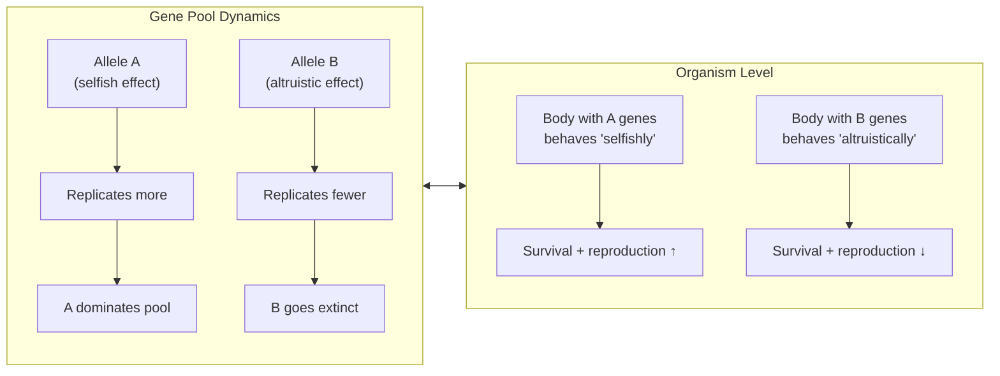
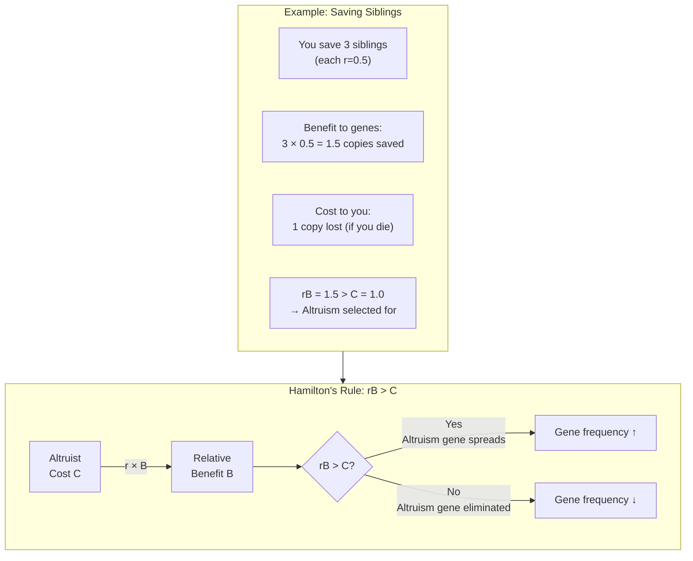
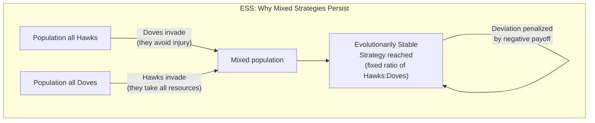
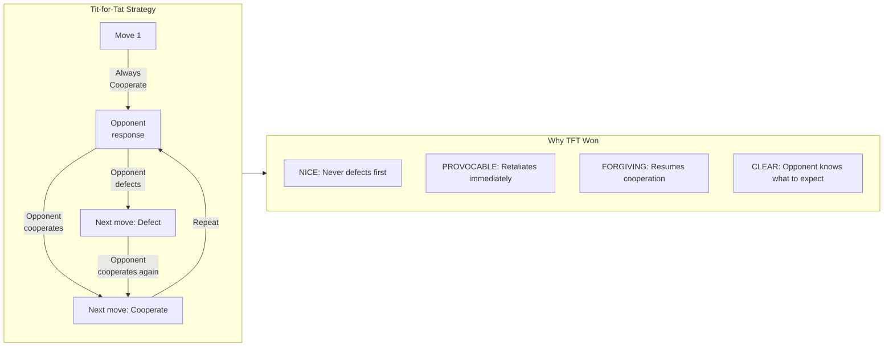
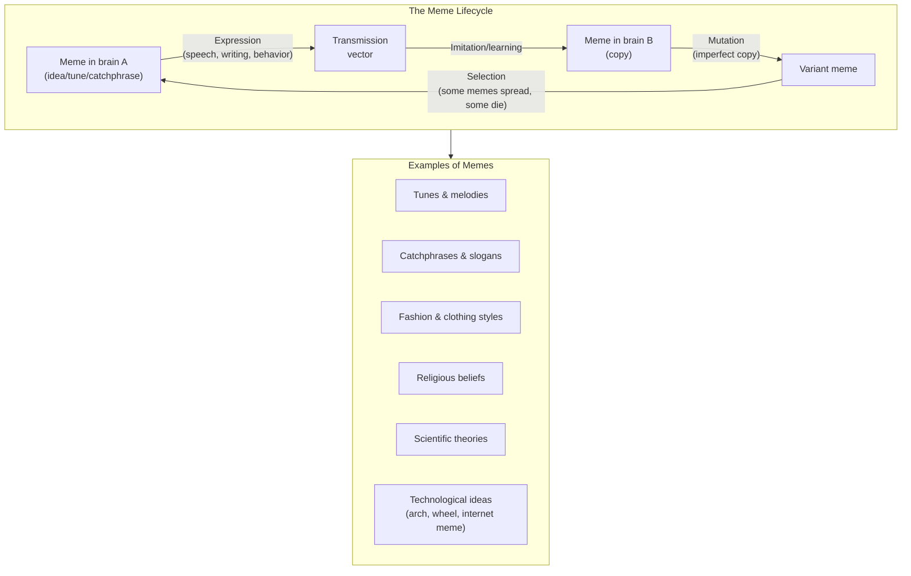
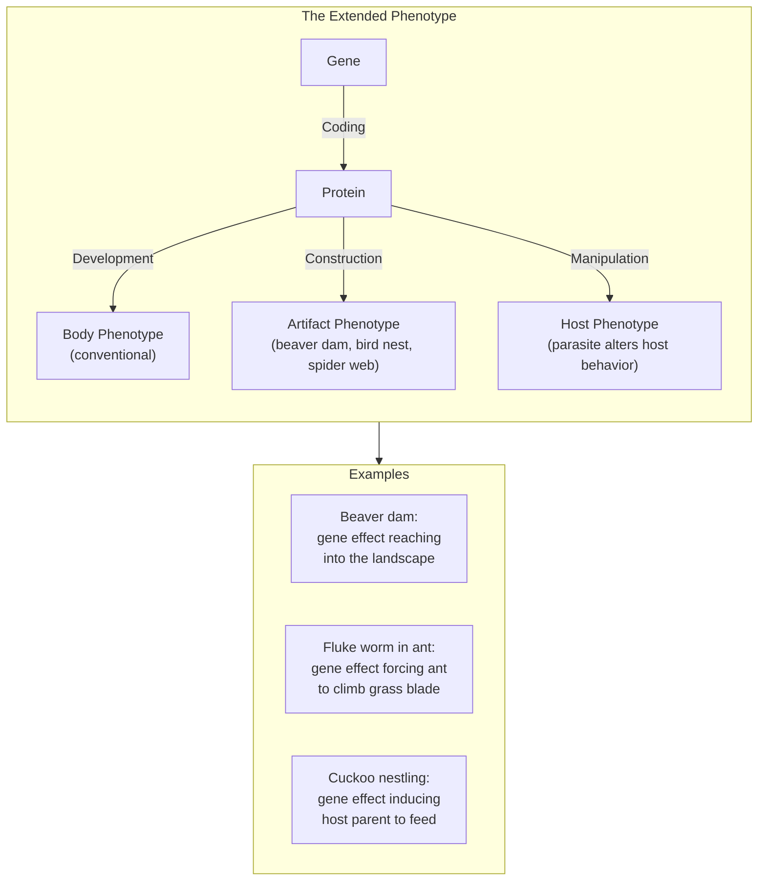
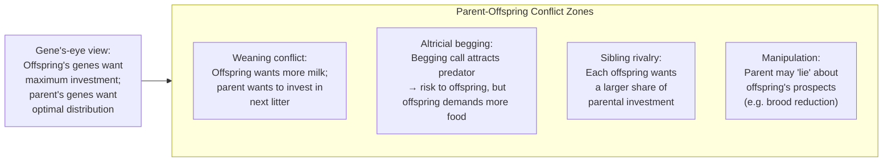

## The Replicator's-Eye View of Life

Natural selection, from the gene's perspective, is not about organisms or
species — it is about **replicators**: entities that make copies of
themselves. The first replicator was a molecule in the primordial soup
that happened to have the property of self-copying. Over billions of years,
replicators evolved increasingly elaborate **survival machines** (bodies)
to protect and propagate themselves. We are their latest models.

### Key Distinction: Replicators vs Vehicles

| Role | Entity | Properties |
|------|--------|------------|
| **Replicator** | Gene (DNA segment) | Potentially immortal; copied across generations; the unit of selection |
| **Vehicle** | Organism / body | Temporary; mortal; interacts with environment; the unit of function |

Dawkins's radical claim: the organism is not the beneficiary of evolution.
The organism is a tool. The gene is the true beneficiary.

---

## The Selfish Gene Metaphor

The title is the most misunderstood phrase in modern biology. Dawkins does
not claim that genes have motives or consciousness. The metaphor captures
an **as-if** logic: genes that, by their phenotypic effects, cause
themselves to be replicated more successfully will, as a statistical
consequence, increase in frequency. They act *as if they are selfish*.

### The Cooperation Paradox

If genes are selfish, how does cooperation exist? Answer: cooperation is
a strategy that serves gene-level selfishness. The gene for helping a
relative spreads because the relative carries copies of the same gene.

---

## Kin Selection & Hamilton's Rule

The most important equation in the book, derived from W. D. Hamilton:

> rB > C

| Symbol | Meaning |
|--------|---------|
| r | Coefficient of relatedness (probability that two individuals share a gene by recent descent) |
| B | Benefit to the recipient (in offspring equivalents) |
| C | Cost to the altruist (in offspring equivalents) |

### Relatedness Values

| Relationship | r |
|-------------|---|
| Identical twin / self | 1.0 |
| Parent-offspring | 0.5 |
| Full sibling | 0.5 |
| Grandparent-grandchild | 0.25 |
| Half-sibling | 0.25 |
| Aunt/uncle - niece/nephew | 0.25 |
| First cousin | 0.125 |
| Random member of population | ~0 |

### The Green Beard Effect

Dawkins discusses a thought experiment: a gene that causes (1) a visible
marker (green beard), (2) recognition of the marker in others, and
(3) preferential altruism toward marked individuals. Though no real
examples are known, it illustrates how kin recognition can evolve.

---

## Evolutionarily Stable Strategy (ESS)

Dawkins popularized John Maynard Smith's ESS concept — a strategy that,
once established in a population, cannot be invaded by any alternative.
ESS explains why aggression in nature is often ritualized rather than
escalated to lethal levels.

### The Hawk-Dove Game

| Encounter | Payoff to Hawk | Payoff to Dove |
|-----------|---------------|----------------|
| Hawk vs Hawk | V/2 - C/2 (50% win, 50% injury) | — |
| Hawk vs Dove | V (wins) | 0 (retreats) |
| Dove vs Dove | V/2 (share) | V/2 (share) |

Where V = value of resource, C = cost of injury.

The ESS ratio of hawks to doves is V:C. If V=C, the stable ratio is 1:1.
If injury is severe (C >> V), doves dominate.

---

## The Evolution of Cooperation: Tit-for-Tat

Chapter 12 ("Nice Guys Finish First"), added in the 1989 edition,
describes Robert Axelrod's computer tournament for iterated Prisoner's
Dilemma strategies. The winner — the simplest entry — was **Tit-for-Tat**:

1. Cooperate on the first move.
2. Thereafter, copy your opponent's previous move.

### The Four Conditions for Cooperation to Evolve

1. **Repeated interaction** — Not a one-shot game
2. **Shadow of the future** — Enough chance of meeting again
3. **Recognizability** — Players can identify each other
4. **Kin structure** — Relatedness amplifies cooperation's effect

---

## The Meme: A New Replicator

The final chapter of the original edition introduces **memes** — units of
cultural transmission that replicate through imitation. Dawkins proposed
that human culture evolves by a process analogous to genetic evolution,
with memes as the replicators.

### Virus of the Mind

Dawkins suggests that some memes are like "viruses of the mind" —
particularly those that command their hosts to spread them. Religious
memes ("spread this message or face damnation") are his primary example.
The meme concept has been criticized for lacking a precise unit analogous
to the gene, and memetics has not matured into a rigorous science.

---

## The Extended Phenotype

Dawkins's later work (and a key chapter added to later editions) extends
the gene's-eye view beyond the individual body. A gene's phenotypic
effects are not limited to the organism carrying it — they can reach into
the environment and even into other organisms.

### The Central Theorem

The extended phenotype is not just about artifacts. It is a reframing of
what a gene "does": a gene's influence on the world includes any effect
that biases the probability of that gene's survival — regardless of which
body produces the effect.

---

## Parent-Offspring Conflict

Dawkins applies the gene's-eye view to family dynamics. Parents and
offspring share only 50% of their genes. Each offspring values its own
life at 1.0, but a parent values that offspring at 0.5 (and each
sibling at 0.5). This asymmetry creates inevitable conflict.

### The Battle of the Sexes

Chapter 9 argues that because females invest more in each gamete (eggs >
sperm) and often more in offspring (gestation, lactation), they become the
limiting resource. Males compete for access; females are choosy. This
framework has been influential but criticized as overly binary and for
underplaying female-female competition and male parental care.

---

## Key Lessons

- **See evolution from the gene's perspective** — It is not "what is good
  for the species?" but "what is good for the gene?"
- **Altruism is gene-level selfishness** — Kin selection is not a
  separate force; it is natural selection operating through relatives.
- **Stability matters as much as optimization** — ESS theory shows why
  populations settle on strategies that are "good enough" rather than
  "best possible."
- **Cooperation can evolve without kindness** — Tit-for-tat shows that
  reciprocal altruism requires only repeated interaction and memory.
- **Culture has its own replicators** — The meme is a provocative concept,
  even if the science of memetics is stillborn.
- **Genes reach beyond bodies** — Phenotype is not bounded by skin.
  Beaver dams and termite mounds are extended phenotypes.
- **Evolution is not progress** — Genes have no direction, no purpose.
  They just are, and those that are better at being are more of them.

---

## Practical Applications

### In Biology & Research
- Use Hamilton's Rule to predict altruistic behavior in social species
- Model behavioral strategies using ESS theory rather than group-selection
  narratives
- Consider extended phenotype effects when studying parasitism and
  ecosystem engineering

### In Social Sciences & Economics
- Tit-for-tat is observed in human cooperation experiments (public goods
  games, trust games)
- ESS thinking applies to market strategy, arms races, and diplomatic
  relations
- Meme theory (however imperfect) provides language for analyzing viral
  content, propaganda, and cultural fads

### In Philosophy & Ethics
- The selfish gene is descriptive, not prescriptive — Dawkins explicitly
  says we can (and should) rebel against our genes
- Understanding kin selection illuminates (but does not determine) ethical
  questions about family loyalty, nepotism, and universal benevolence
- The book challenges "good of the species" thinking that still pervades
  popular biology

### For Understanding Everyday Life
- Reciprocal altruism explains why we trust strangers with repeated
  interaction (colleagues, neighbors) but not one-off encounters
- Parent-offspring conflict predicts teenage rebellion and sibling
  rivalry as features, not bugs
- The extended phenotype: our houses, clothes, and social media profiles
  are all extended phenotypes — we project our genes' influence into the
  environment
