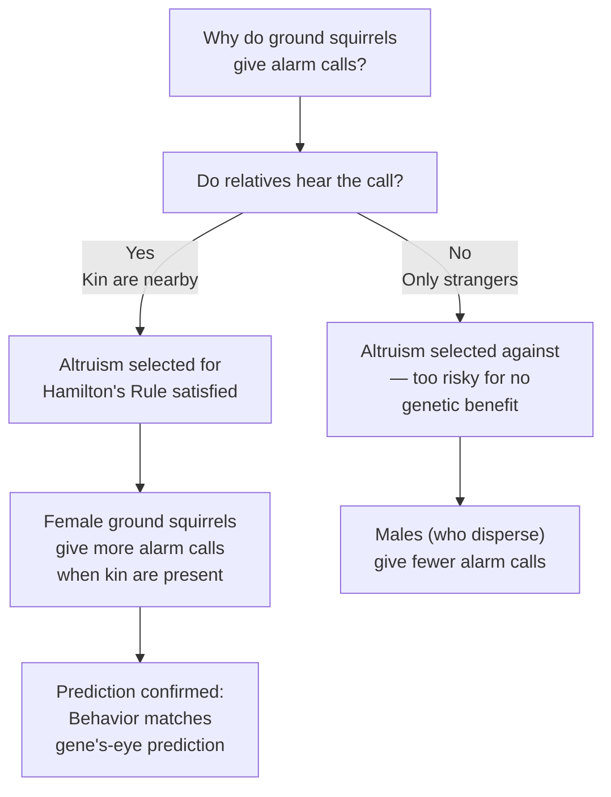
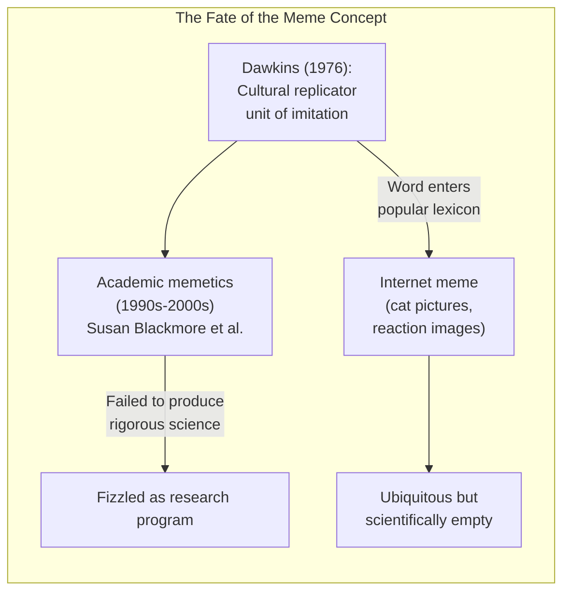
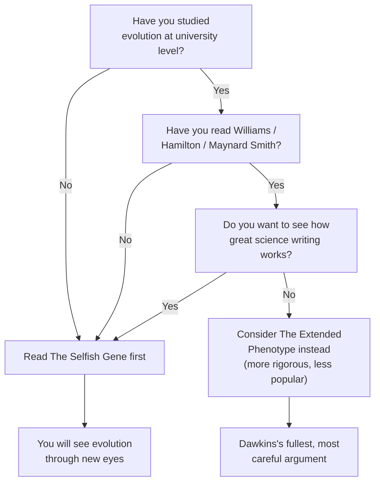

## Introduction

Welcome to BookAtlas. Today: *The Selfish Gene* by Richard Dawkins.
First published 1976, Oxford University Press. 40th anniversary edition:
464 pages. Over a million copies sold. Translated into 25+ languages.
Often called the most important popular science book since Darwin's
*Origin of Species*.

You know the phrase. You know the controversy. But have you actually
read it? We're going to settle that with two voices. On one side, an
evolutionary biologist who considers this book the reason they went into
science. On the other, a philosopher who thinks the "selfish gene"
metaphor did more harm than good.

Let's get into it.

---

## The Setup: What Is the Selfish Gene?

Dawkins opens with a breathtaking paragraph — one of the great opening
gambits in nonfiction:

> "Intelligent life on a planet comes of age when it first understands
> the reason for its own existence. ... If superior beings from outer
> space ... visited Earth, the first question they would ask ... would
> be: 'Have they discovered evolution yet?'"

Then he drops the thesis: we are survival machines — robot vehicles
blindly programmed to preserve the selfish molecules known as genes.

**Biologist:** That opening still gives me chills. Dawkins is saying:
evolution is not just a biological theory. It is the answer to "Why are
we here?" That is ambitious. And he delivers.

**Philosopher:** It is rhetorically brilliant, I grant you. But it is
also dangerous. From the first page, Dawkins frames life as
*programmed robots*. That is not a neutral description. It is a
philosophical claim about what living things *are*. He makes it sound
like settled science when it is really a metaphor.

**Biologist:** But it is the *right* metaphor. Look at it from the
gene's perspective: your genome has been copied, with edits, for 3+
billion years. Your body is a temporary container. The gene is the
survivor. That is not philosophy — that is population genetics.

---

## The Selfish Metaphor: Helpful or Harmful?

The title is the most complained-about metaphor in science. Dawkins
himself later said he wished he had called it *The Immortal Gene* or
*The Cooperative Gene*. The problem: "selfish" implies conscious motive.

**Biologist:** But that is exactly why the metaphor works. It is
intuitive. When you say "genes act as if they are maximizing their own
replication," people glaze over. When you say "genes are selfish,"
they *get it*. You can then walk them through the caveats.

**Philosopher:** The caveats get lost. Mary Midgley made this point
devastatingly in 1979. You cannot use a metaphor that implies conscious
intent, then claim it is "just a metaphor" when people take it
literally. The metaphor does work — it works *too well*. It leaves the
impression that evolution is about selfishness. And that impression has
real-world consequences. Just look at how "selfish gene" gets cited by
libertarians, social Darwinists, and bio-ethicists who think science
proves human nature is purely egoistic.

**Biologist:** That is a problem with the readers, not the book. Dawkins
is extraordinarily explicit: "Let us try to teach generosity and
altruism, because we are born selfish." He is not endorsing selfishness;
he is describing a mechanism and *then* saying we should rebel against
it.

**Philosopher:** He says that in the last two pages. For the preceding
250 pages, selfishness is the star of the show. The framing dominates
the content. A metaphor that requires a 250-page disclaimer is a
dangerous metaphor.

---

## Kin Selection: The Mathematical Core

The heart of the book is W. D. Hamilton's insight: altruism evolves
when it benefits genetic relatives. The math: rB > C.

A bird that warns its flock of a hawk is not being "altruistic for the
good of the species." It is protecting copies of its genes in its
relatives. From the gene's perspective, the behavior is selfish.

**Biologist:** This is the most beautiful idea in the book. Before
Hamilton, people thought altruism was a puzzle for Darwinism. After
Hamilton, altruism is not a puzzle at all — it is gene selfishness by
another name. Dawkins explains this with such clarity that you feel
like you discovered it yourself.

**Philosopher:** It is elegant. But it is also *post hoc*. You can
explain *any* social behavior after the fact by constructing a kin
selection story. And you cannot always measure r, B, and C precisely.
The framework is useful as a heuristic, but Dawkins presents it as
though every altruistic act can be explained by this equation. Real
biology is messier.

**Biologist:** No one denies it is messy. But the equation makes
*testable predictions*. Predict relatedness, measure costs and benefits,
and you can predict who helps whom. It works spectacularly in the
social insects. It works in birds. It works in mammals. That is not
post hoc — that is science.

---

## The ESS Revolution

Chapter 5 on aggression and the Evolutionarily Stable Strategy is where
Dawkins the popularizer really shines. John Maynard Smith had published
the ESS concept in technical papers. Dawkins made it sing.

**Biologist:** The hawk-dove game is the best explanation I know for why
animals have ritualized combat. Deer lock antlers; they do not stab
each other. Why? Because the ESS of ritualized display beats the ESS of
all-out war. The math works out.

**Philosopher:** But then Dawkins extends ESS to *everything* — to sex
ratios, to parental care, to reciprocal altruism. At some point, you
have to ask: is every animal behavior really a strategy? Or are we just
projecting strategic thinking onto creatures that are mostly running
on automatic?

**Biologist:** An ESS does not require conscious strategy. It is a
description of population-level outcomes. A bird that feeds its young
is not "choosing a strategy" — it is executing a behavioral program that
was shaped by selection. The ESS is the equilibrium that program
produces. Dawkins is clear about this. The bird does not *think*; it
just *does*.

---

## Memes: The Chapter That Changed Culture

Chapter 11 ("Memes: The New Replicators") is the most consequential and
the most controversial part of the book. Dawkins proposes that cultural
evolution runs on its own replicators: memes.

Tunes, catchphrases, fashions, religious ideas, scientific theories —
all memes. They compete for space in human brains. The successful ones
are those that replicate best, regardless of truth or utility.

**Biologist:** This was genius. Dawkins saw that the logic of evolution
does not depend on DNA. It depends on *any* system with variation,
heredity, and differential fitness. Culture has all three. Memes are
real.

**Philosopher:** Memes are a *metaphor*, not a thing. You cannot isolate
a meme the way you can isolate a gene. You cannot sequence a meme. You
cannot point to its physical substrate. The analogy breaks down because
culture is not particulate — it is holistic, systemic, and emergent.

**Biologist:** But the concept was *fertile*. It spawned research
programs. It got people thinking about culture evolutionarily. And it
gave us the word "meme" — which, love it or hate it, is now one of the
most widely used words on the planet.

**Philosopher:** The word survived. The concept did not. Memetics has
produced almost no real science. It is a dead end. The word "meme" now
means "funny picture with text" — which is about as far from Dawkins's
original idea as you can get. The concept evolved, but not in a
Darwinian way. It just became something else.

---

## The Extended Phenotype — Dawkins's Own Sequel

Chapter 13 and the later endnotes develop the extended phenotype: a
gene's effects are not limited to the body it sits in. A beaver dam is
an extended phenotype of beaver genes. A cuckoo chick's begging call
manipulates host parents — that call is an extended phenotype of cuckoo
genes. A parasite that makes its host climb to an exposed position is
extending the parasite's genes into the host's nervous system.

**Biologist:** This is Dawkins's most underappreciated idea. It breaks
the boundary between organism and environment. The gene does not stop
at the skin. It reaches out. A beaver dam is a gene's way of making
more beaver genes — through the intermediate of a pond.

**Philosopher:** It is elegant, but where does it stop? If a beaver dam
affects water flow, which affects plant growth, which affects the local
climate — is all of that the beaver's extended phenotype? At some point,
"extended phenotype" just means "everything is connected," and the
concept loses explanatory power.

**Biologist:** Dawkins is careful about this. He limits the extended
phenotype to traits that have been shaped by selection *because* of
their feedback on gene replication. Random environmental effects do
not count. It has to be an adaptation for gene propagation.

---

## The Biggest Criticisms: A Fair Hearing

Let's be honest about the book's limitations:

1. **The title is a liability.** The metaphor dominates the message.
   Dawkins spent decades clarifying what he did *not* mean. Most readers
   never get that far.

2. **It overstates competition.** The book says little about symbiosis,
   mutualism, cooperation between species. Lynn Margulis's work on
   endosymbiosis — arguably the most important evolutionary insight since
   Darwin — is almost absent. Nature is not just "red in tooth and claw."

3. **Genes are more complicated now.** Dawkins used a deliberately
   abstract definition of "gene" (a unit of selection). But modern genomics
   shows that genes are not discrete, stable entities. They overlap, they
   regulate each other, they get edited, they interact in networks. The
   selfish gene picture is a useful simplification, but it is a
   simplification.

4. **The meme concept is a dead end.** Provocative, generative, and
   ultimately unfruitful. No rigorous science of memetics emerged.

5. **The Battle of the Sexes chapter has aged poorly.** The stereotypes
   of coy females and ardent males reflect 1970s behavioral ecology, not
   the richer understanding we have today of sexual selection, female
   choice, and gender diversity in nature.

**Biologist:** All fair. But here is the thing: *The Selfish Gene* is
not a textbook. It is a *framework*. It says: try looking at evolution
from the gene's perspective and see what you see. The fact that we are
still arguing about it 50 years later means it succeeded. A bad book
gets ignored. A great book gets debated.

**Philosopher:** But a dangerously good book gets *misused*. The
selfish gene metaphor has been weaponized by people who want to argue
that human selfishness is "natural" and therefore inevitable. Dawkins
cannot control how people use his ideas, but the fact that he
persistently chose provocative framing suggests he bears some
responsibility.

---

## The Verdict: Do You Need This Book?

**Biologist:** If you have never read it, read it. It will rewire how
you see the natural world. It is one of those rare books that changes
the way you think, permanently. I read it at 16 and it is the reason I
became a biologist.

**Philosopher:** Read it critically. Enjoy the prose. Learn the
science. But keep your skeptical hat on. Ask yourself: is the metaphor
doing the work, or is the evidence doing the work? And after you
finish, read Gould and Lewontin's "Spandrels of San Marco" and
Midgley's "Gene-juggling." You will get more out of Dawkins by reading
his critics than by reading his fans.

**Biologist:** I will agree with that. Dawkins is best understood in
dialogue with his critics — that is what made the book important.
*The Selfish Gene* is not a monologue. It is an invitation to a
conversation that has been running for half a century.

---

## Final Thoughts

*The Selfish Gene* is a book about seeing the living world differently.
Its central insight — that genes are the fundamental replicators and
organisms are their vehicles — is one of the most powerful ideas in
modern biology. Its central metaphor is also one of the most
misunderstood.

Dawkins wrote a book about how evolution actually works. Many people
read it as a book about how humans *should* behave. That gap — between
description and prescription, between mechanism and morality — is the
fault line that runs through the book's entire legacy.

The irony: Dawkins ends the book by telling us to rebel against our
selfish genes. He wants us to use our big brains — "the only things in
the universe capable of understanding and defying the selfish
replicators" — to build a world based on conscious cooperation, not
genetic compulsion. That is a noble message. It is a shame the title
gets in the way.

This has been a BookAtlas narration of *The Selfish Gene* by Richard
Dawkins. Thanks for listening.
