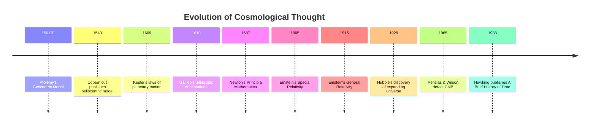
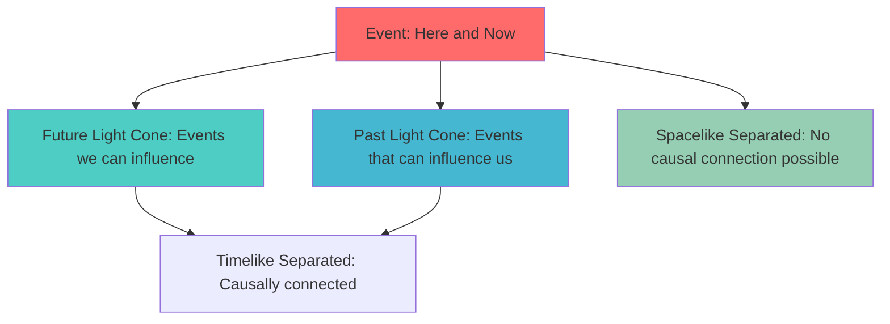
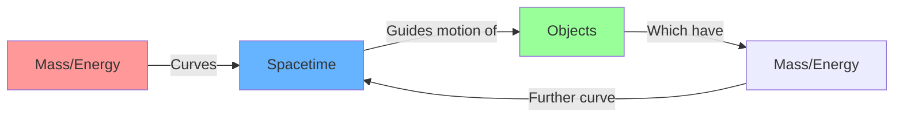
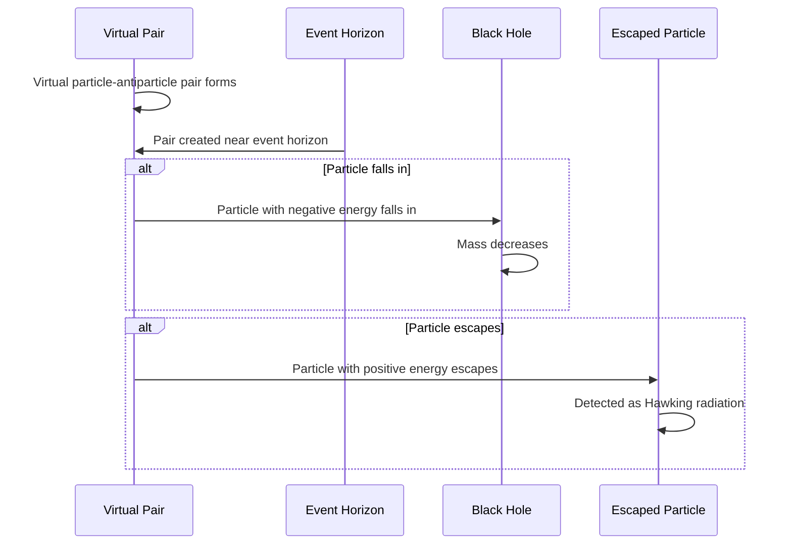

# Core Concepts of *A Brief History of Time*

## 1. The Evolution of Our Understanding of the Universe

Hawking begins with a historical sweep of cosmological thought. The ancient model of the universe placed Earth at the center, with celestial spheres rotating around it. This geocentric view, codified by Ptolemy in the 2nd century CE, dominated for over a millennium.

The Copernican revolution of the 16th century displaced Earth from the center. Nicolaus Copernicus proposed a heliocentric model in 1543, but it was Galileo Galilei's telescopic observations of Jupiter's moons in 1610 that provided the first strong evidence. Johannes Kepler's elliptical orbits further refined the model.

Isaac Newton's *Principia Mathematica* (1687) unified celestial and terrestrial mechanics under a single law of gravitation. Newton's framework reigned for over two centuries until Albert Einstein's theories of relativity fundamentally restructured our understanding of space, time, and gravity.

### Timeline of Cosmological Models



## 2. Spacetime and Special Relativity

Einstein's 1905 theory of special relativity merged space and time into a single four-dimensional continuum called **spacetime**. The key postulates are:

1. The laws of physics are the same in all inertial reference frames.
2. The speed of light in a vacuum is constant regardless of the observer's motion.

These seemingly simple postulates lead to profound consequences:

| Concept | Description |
|---|---|
| **Time Dilation** | A moving clock ticks slower relative to a stationary observer |
| **Length Contraction** | A moving object appears shorter in its direction of motion |
| **Mass-Energy Equivalence** | E = mc² — mass and energy are interconvertible |
| **Simultaneity is Relative** | Two events simultaneous for one observer may not be for another |

### The Spacetime Interval

In special relativity, the invariant quantity is the **spacetime interval**:

```
ds² = -c²dt² + dx² + dy² + dz²
```

This interval is the same for all observers, unlike spatial distances and time intervals individually, which vary between reference frames.

### Light Cones



Events inside the light cone are **causally connected**—signals can travel between them at or below the speed of light. Events outside the light cone are causally disconnected; no information can pass between them.

## 3. General Relativity and Gravity

Einstein's 1915 general relativity reconceived gravity not as a force but as the **curvature of spacetime** caused by mass and energy. The central equation is the Einstein field equation:

```
Gμν + Λgμν = (8πG/c⁴) Tμν
```

Where:
- **Gμν** is the Einstein tensor (describes spacetime curvature)
- **Λ** is the cosmological constant
- **gμν** is the metric tensor
- **Tμν** is the stress-energy tensor (describes matter and energy distribution)

### Curvature and Free Fall

Hawking explains the equivalence principle: the effect of gravity is indistinguishable from acceleration. A person in an accelerating elevator feels the same as a person standing on Earth's surface. This means free-falling objects follow **geodesics**—the straightest possible paths in curved spacetime.



The critical insight: massive objects like the Sun warp the fabric of spacetime, and planets follow the curved paths (orbits) not because they are "pulled" by a force, but because they follow the geometry of spacetime itself.

## 4. The Expanding Universe

Edwin Hubble's 1929 observations showed that distant galaxies are receding from us, and the farther they are, the faster they move—a relationship known as **Hubble's Law**:

```
v = H₀ × d
```

Where v is the recession velocity, H₀ is the Hubble constant, and d is the distance to the galaxy.

This means the universe is expanding. Extrapolating backward, the universe must have begun from an extremely hot, dense state—the **Big Bang**.

### The Cosmic Microwave Background

In 1965, Arno Penzias and Robert Wilson accidentally discovered the **Cosmic Microwave Background (CMB)** radiation—a faint afterglow of the Big Bang permeating all of space. The CMB has a temperature of approximately 2.725 K and provides strong evidence for the Big Bang theory. The COBE satellite later detected tiny fluctuations in the CMB, confirming theoretical predictions about density variations that would seed the formation of galaxies.

## 5. The Uncertainty Principle and Quantum Mechanics

Hawking introduces quantum mechanics through Heisenberg's uncertainty principle:

```
Δx × Δp ≥ ħ/2
```

This states that the more precisely you know a particle's position (Δx), the less precisely you can know its momentum (Δp), and vice versa. This is not a limitation of measurement but a fundamental property of nature.

### Wave-Particle Duality

Quantum objects exhibit both wave and particle properties simultaneously. The **double-slit experiment** demonstrates this: individual electrons, fired one at a time through two slits, gradually build up an interference pattern characteristic of waves—not particles.

### Feynman's Sum Over Histories

Hawking highlights Richard Feynman's approach to quantum mechanics: a particle takes **every possible path** simultaneously, and the probability of a given outcome is calculated by summing over all possible histories. This formulation is particularly useful for quantum gravity calculations.

### The Problem of Quantum Gravity

General relativity describes gravity as smooth spacetime curvature, while quantum mechanics describes the universe in discrete quanta. These frameworks are individually successful but mutually incompatible at extremely small scales (the Planck scale, ~10⁻³⁵ meters) where both quantum effects and strong gravity coexist—such as inside black holes or at the moment of the Big Bang.

## 6. Black Holes

A black hole forms when matter collapses to a sufficiently dense state that its gravitational field prevents anything—including light—from escaping. The boundary of no return is called the **event horizon**.

### Black Hole Types

| Type | Formation | Mass Range |
|---|---|---|
| **Stellar** | Collapse of massive stars (>3 solar masses) | ~5–100 solar masses |
| **Supermassive** | Found at galactic centers | 10⁶–10¹⁰ solar masses |
| **Primordial** | Formed in the early universe | Variable, possibly microscopic |

### The No-Hair Theorem

Hawking discusses the remarkable fact that black holes are characterized by just three externally observable quantities:
1. **Mass** — determines the size of the event horizon
2. **Electric charge** — rarely significant in astrophysical black holes
3. **Angular momentum (spin)** — determines the shape of spacetime around the hole

Everything else about the matter that formed the black hole is lost behind the event horizon—hence the saying "black holes have no hair."

### Singularity

At the center of a black hole lies a **singularity**—a point of theoretically infinite density where the known laws of physics break down. Hawking and Roger Penrose proved theorems showing that singularities are an inevitable consequence of general relativity under certain conditions.

```mermaid
graph TD
    A[Star > 3 Solar Masses] -->|Core Collapse| B[Neutron Degeneracy Fails]
    B -->|Gravitational Collapse| C[Singularity Forms]
    C --> D[Event Horizon]
    D --> E[Nothing Escapes]
    style C fill:#ff4444
    style D fill:#333333
    style E fill:#111111
```



## 7. Hawking Radiation: Black Holes Ain't So Black

Hawking's most famous contribution is his theoretical discovery that black holes are not entirely black. Quantum mechanics near the event horizon creates pairs of virtual particles and antiparticles. In normal space, these pairs annihilate almost instantly. But near the event horizon, one particle can fall in while the other escapes. The escaping particle carries positive energy, while the infalling particle carries negative energy, effectively reducing the black hole's mass.

### The Process



### Hawking Radiation Formula

The temperature of a black hole's radiation is inversely proportional to its mass:

```
T = (ħc³) / (8πGMk_B)
```

Where ħ is the reduced Planck constant, c is the speed of light, G is Newton's gravitational constant, M is the black hole mass, and k_B is Boltzmann's constant.

### Implications

- Black holes have a **temperature** and therefore emit thermal radiation.
- Black holes **evaporate** over time, losing mass until they eventually disappear.
- For stellar-mass black holes, the temperature is far below the CMB temperature (2.725 K), so they absorb more radiation than they emit. Only very small black holes would radiate noticeably.
- This raises the **black hole information paradox**: if a black hole evaporates completely, what happens to the information about everything that fell in?

## 8. The Origin and Fate of the Universe

Hawking explores the Big Bang theory in detail. The universe began approximately 13.8 billion years ago from an infinitely dense, hot singularity. As it expanded, it cooled, allowing particles to form, then atoms, then stars and galaxies.

### The No-Boundary Proposal

Hawking and James Hartle proposed that if we describe the universe using **imaginary time** (a mathematical technique replacing real time with a fourth spatial dimension), the universe becomes finite but boundaryless—like the surface of a sphere. There is no singular boundary or "creation event." The universe simply *is*.

```
Real Time: Universe begins at a singularity (t = 0)
Imaginary Time: Universe is finite but has no edge or beginning
```

This is Hawking's answer to the question "What came before the Big Bang?" In imaginary time, the question becomes meaningless—there is no "before" because there is no boundary.

### The Anthropic Principle

Hawking discusses the anthropic principle: the fundamental constants of physics appear finely tuned to allow the existence of life. If the strong nuclear force were slightly stronger or weaker, stars could not form hydrogen or fuse heavier elements. If the electromagnetic force were different, chemistry would be impossible.

Possible explanations include:
1. **Coincidence** — We happen to live in a universe with favorable constants
2. **Necessity** — A deeper theory explains why these constants must take their observed values
3. **Multiverse** — Many universes exist with different constants; we observe ours because we could only exist in one compatible with life

### Possible Fates of the Universe

| Fate | Condition | Outcome |
|---|---|---|
| **Big Crunch** | Expansion slows and reverses | Universe collapses back to a singularity |
| **Big Freeze** | Expansion continues indefinitely | Universe becomes cold, dark, and empty |
| **Big Rip** | Dark energy accelerates expansion | Everything is torn apart at the molecular level |
| **Big Bounce** | Cyclic model | Universe undergoes repeated expansion and collapse |

Current evidence favors the **Big Freeze** (or heat death), as the expansion of the universe appears to be accelerating due to dark energy.

## 9. The Arrow of Time

Hawking addresses why time seems to flow in one direction. The fundamental laws of physics (with minor exceptions related to the weak nuclear force) are **time-symmetric**—they work equally well forward and backward in time.

### Three Arrows of Time

1. **Thermodynamic Arrow** — Entropy (disorder) always increases. This is the second law of thermodynamics and the most familiar arrow of time.
2. **Psychological Arrow** — We remember the past but not the future. This is likely a consequence of the thermodynamic arrow.
3. **Cosmological Arrow** — The universe is expanding, not contracting. This may also be linked to the thermodynamic arrow.

Hawking argues that the thermodynamic arrow explains the other two: the universe began in a low-entropy state at the Big Bang, and everything since has been an increase in entropy. Time flows "forward" in the direction of increasing disorder.

## 10. Wormholes and Time Travel

Hawking discusses whether general relativity permits time travel through **wormholes**—hypothetical tunnels connecting different regions of spacetime. While the equations of general relativity allow for solutions containing wormholes (such as the Einstein-Rosen bridge), maintaining a traversable wormhole would require **exotic matter** with negative energy density, which may not exist in sufficient quantities.

Hawking introduces the **chronology protection conjecture**: the laws of physics conspire to prevent time travel on a macroscopic scale, even though they may permit it in theory. He argues this is necessary for the universe to be "safe for historians"—if time travel were possible, paradoxes would arise.

## 11. The Unification of Physics

Hawking describes the quest for a **Theory of Everything** (TOE)—a single framework that unifies all four fundamental forces of nature:

| Force | Mediator | Range | Relative Strength |
|---|---|---|---|
| **Strong Nuclear** | Gluons | ~10⁻¹⁵ m | 1 |
| **Electromagnetic** | Photons | Infinite | 10⁻² |
| **Weak Nuclear** | W and Z bosons | ~10⁻¹⁸ m | 10⁻⁶ |
| **Gravity** | Gravitons (hypothetical) | Infinite | 10⁻³⁹ |

The **Standard Model** of particle physics successfully unifies the strong, weak, and electromagnetic forces, but gravity remains outside this framework. String theory and its successor, M-theory, are the leading candidates for a complete unification, proposing that the fundamental constituents of nature are not point particles but tiny vibrating strings (or higher-dimensional membranes) existing in 10 or 11 dimensions.

Hawking is cautiously optimistic but acknowledges that we may never observe these extra dimensions directly, since they may be curled up at scales far smaller than any conceivable experiment can probe.

## Key Equations Summary

```mermaid
mindmap
  root((Hawking's<br/>Key Equations))
    Special Relativity
      E = mc²
      ds² = -c²dt² + dx²
    General Relativity
      Gμν + Λgμν = (8πG/c⁴)Tμν
    Quantum Mechanics
      Δx × Δp ≥ ħ/2
      iħ∂ψ/∂t = Ĥψ
    Black Holes
      T = ħc³/(8πGMk_B)
      S = k_B c³ A/(4Għ)
    Cosmology
      v = H₀ × d
      Friedmann Equations
```
