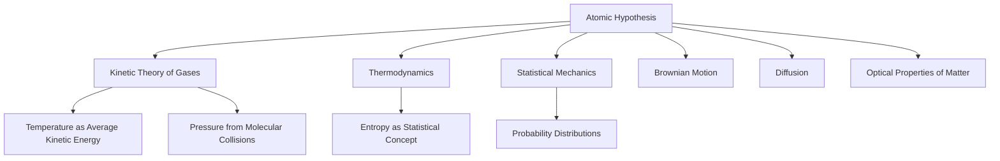
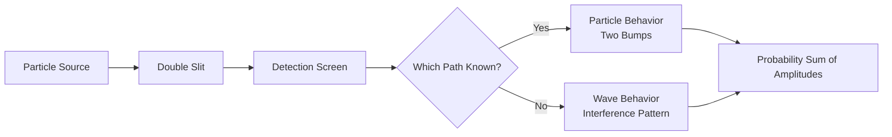

## Core Concepts

### The Atomic Hypothesis

Feynman opens Volume I with what he calls the single most important idea in all of science: **all things are made of atoms — little particles that move around in perpetual motion, attracting each other when they are a little distance apart, but repelling upon being squeezed into one another.** This atomic worldview underlies every topic that follows, from the kinetic theory of gases to the nature of heat to the behavior of light interacting with matter.

### Conservation Laws as Organizing Principles

Feynman devotes exceptional attention to conservation laws — energy, momentum, and angular momentum — treating them not as derived results but as **deep symmetry principles** that constrain all physical interactions. Chapter 4 on conservation of energy introduces the idea of "energy accounting" as a universal bookkeeping system that persists across all known physics.

> There is a fact, or if you wish, a law, governing all natural phenomena that are known to date. There is no known exception to this law — it is exact so far as we know. The law is called the conservation of energy.

Feynman's explanation of potential energy uses the memorable analogy of "counting energy tokens" that change form but never disappear.

### The Special Theory of Relativity

Volume I treats relativity as a natural consequence of the consistency of physical laws. Feynman derives the Lorentz transformations from the principle that the speed of light is constant and that physical laws must be the same in all inertial frames. He emphasizes the **relativistic energy-momentum relation** as the foundation for modern physics.

| Concept | Feynman's Approach | Key Equation |
|---------|-------------------|--------------|
| Time dilation | Thought experiments with light clocks | Δt = γΔt₀ |
| Length contraction | Measuring moving rods | L = L₀/γ |
| Mass-energy equivalence | Derives from momentum conservation | E = mc² |
| Relativistic momentum | Modifies Newton's definition | p = γmv |

### Quantum Behavior

Chapter 37, "Quantum Behavior," is one of the most celebrated introductions to quantum mechanics ever written. Feynman presents the double-slit experiment as the central mystery of quantum mechanics — the phenomenon that "contains the only mystery."

Feynman's key insight: when we do not observe which slit the particle goes through, the probability distribution shows interference. When we do observe, interference disappears. The explanation is that probabilities in quantum mechanics are the **square of the magnitude of probability amplitudes**, and these amplitudes can interfere.

### The Principle of Least Time

Optics is introduced through Fermat's principle of least time — light takes the path that requires the shortest time. This variational approach connects optics to the principle of least action in mechanics, demonstrating a deep unity in physical law.

### Thermodynamics and Kinetic Theory

Feynman treats thermodynamics as a consequence of statistical mechanics at the atomic level. The second law is explained through the behavior of a ratchet and pawl — a memorable demonstration that perpetual motion is impossible because of Brownian fluctuations. The chapter on the ratchet and pawl (Chapter 46) is widely regarded as one of the finest pedagogical explanations of the second law ever written.

<Callout type="insight">
Feynman's ratchet-and-pawl analysis shows that even a clever mechanical device cannot violate the second law because at the atomic scale, the pawl itself is subject to thermal fluctuations. The lesson: no system can extract useful work from a single heat reservoir at uniform temperature.
</Callout>

### Symmetry in Physical Laws

The final chapter of Volume I (Chapter 52) introduces symmetry as a constraint on physical law. Feynman discusses translational symmetry, rotational symmetry, time-reversal symmetry, and the connection between symmetries and conservation laws — a preview of Noether's theorem.

## Important Ideas

### The Relation of Physics to Other Sciences

Chapter 3 is a tour de force that shows how physics underlies chemistry, biology, astronomy, and geology. Feynman uses the mustard plant to illustrate how the laws of quantum mechanics and thermodynamics govern biological processes, and argues that the deepest understanding of any science ultimately rests on physics.

### Vectors and Mathematical Methods

Feynman teaches mathematics as it becomes necessary, always starting from physical problems. His treatment of vectors (Chapter 11) emphasizes the **physical meaning** of vector operations rather than formalism, using gravitational and electromagnetic examples throughout.

### The Harmonic Oscillator

Feynman devotes three chapters (21-24) to the harmonic oscillator, treating it as the archetypal physical system that appears everywhere from mechanics to electronics to quantum field theory. Resonance, transients, and linear system theory are all covered with characteristic insight.

### Waves and Oscillations

The final block of the book (Chapters 47-51) covers sound, beats, modes, harmonics, and the wave equation. Feynman builds from the simplest vibrating string to complex wave phenomena, always emphasizing the physical picture before the mathematics.

## Practical Applications

- **Engineering**: Resonance and damping in mechanical and electrical systems
- **Chemistry**: Atomic theory explains chemical bonding and reaction rates
- **Biology**: Thermodynamic limits on metabolic processes; Brownian motion in cellular transport
- **Astronomy**: The law of gravitation and orbital mechanics
- **Materials Science**: Kinetic theory and thermal properties of matter
- **Electronics**: Linear system analysis and circuit theory
- **Medical Imaging**: Wave phenomena underly ultrasound, X-ray diffraction, and MRI physics

<Callout type="tip">
Feynman repeatedly emphasizes that solving problems is essential but secondary to understanding. He advises: "You can know the name of a bird in all the languages of the world, but when you're finished, you'll know absolutely nothing whatever about the bird. So let's look at the bird and see what it's doing — that's what counts."
</Callout>

## Mental Models from the Book

| Mental Model | Description |
|-------------|-------------|
| **Atomic Lens** | Always ask: what are the atoms doing? This grounds all explanations in physical reality |
| **Conservation Accounting** | Track energy, momentum, and charge as conserved quantities through any process |
| **Symmetry Analysis** | Ask what symmetries constrain a system before solving equations |
| **Extremum Principle** | Nature optimizes — look for least action, least time, minimum energy |
| **Order-of-Magnitude Estimation** | Before calculating, estimate. Feynman famously calculated anything with simple arithmetic |
| **The Feynman Technique** | If you can't explain it simply, you don't understand it well enough |
