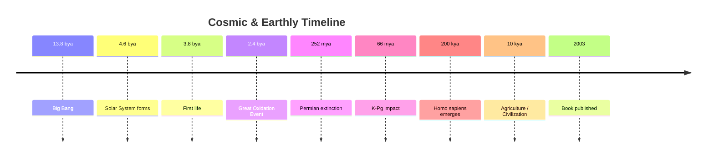
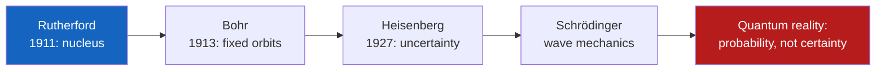
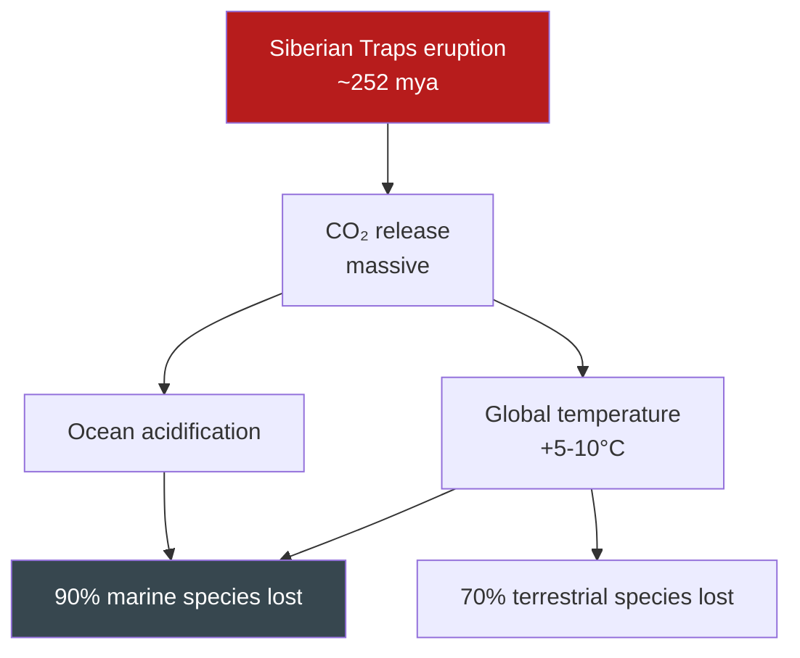

---

## Prologue

Bryson opens with a confession of near-total scientific illiteracy. He is on the roof of his hotel in Nairobi, surrounded by fellow tourists who can identify exotic birds through binoculars. He cannot name the planets in order. He does not know what a proton is, what an atom contains, how carbon dating works, or why the sea is salty. He has no idea how anyone knows the Earth is 4.5 billion years old. Most disturbingly, he realizes that *no one ever explained this to him properly.* The textbooks were impenetrable; the teachers assumed background knowledge he did not have. Science was a distant, procedural subject — a series of definitions and formulas, none of which answered the question that actually interested him: *How do we know?*

He answers that question by consulting scientists in dozens of fields — astronomers, geologists, paleontologists, chemists, physicists, biologists — and writing down what they told him. The result is this book: not a reference work, not a textbook, but a guided tour of how human beings came to understand the universe and their place in it. Bryson's fundamental methodological commitment is borrowed from travel writing, his home genre: show the reader around, introduce them to the locals, tell the stories behind the monuments, and let the landscape take on meaning through encounter rather than decree.

---

## Part 1: Lost in the Cosmos (Chapters 1–5)

### Chapter 1 — How to Build a Universe

The book begins with the largest question of all: where did everything come from? Bryson takes the reader through the standard cosmological narrative with his characteristic combination of precision and wonder. Thirteen point eight billion years ago, all of space, all of matter, all of energy, and all of time was compressed into a point smaller than the period at the end of this sentence — a point that was also, paradoxically, everywhere, because space itself did not exist yet. The Big Bang was not an explosion *in* space; it was an explosion *of* space. It did not go outward into a pre-existing void; it created the void as it expanded.

Within a fraction of a second, the universe grew from subatomic to the size of a galaxy. Within minutes, hydrogen and helium nuclei had formed — 98 percent of all the matter that would ever exist was produced in less time than it takes to make a sandwich. Within 300,000 years, the universe had cooled enough for atoms to exist. Before that, photons could not travel freely; the universe was opaque. After recombination — when electrons settled into orbit around nuclei — light could travel, and the cosmic microwave background radiation was born, still detectable today as a faint glow in every direction.

A billion years later, gravity had pulled matter together into the first stars. Inside those stars, nuclear fusion forged heavier elements: carbon, oxygen, nitrogen, iron. When those stars died — most spectacularly as supernovae — they scattered those elements across interstellar space. Three billion years after the Big Bang, our own Sun and its planets coalesced from the debris of previous stellar generations. Which means: the iron in your blood, the calcium in your bones, the carbon in your cells was manufactured inside a star that lived and died long before our Sun was born. You are, as Bryson puts it with full scientific seriousness, stardust that has become conscious of itself.

Bryson peppers this cosmic history with remarkable facts: a single thimble of neutron star material weighs about 100 million tons; if you could travel at the speed of light, it would take you 100,000 years just to cross the galaxy; the number of atoms in a single grain of sand exceeds the number of grains of sand on all the beaches on Earth.

### Chapter 2 — Welcome to the Solar System

The immensities established, Bryson pulls the camera in to our own neighborhood. The point of this chapter is scale — a subject Bryson returns to obsessively because, as he notes, the human mind has no intuitive equipment for it.

The Sun is big. If it were a hollow sphere, you could fit 1.3 million Earths inside it. If Earth were a pea, Jupiter would be a basketball and the Sun a vast balloon a hundred feet away. Pluto is forty times farther from the Sun than Earth; on the same scale where Earth is a pea, Pluto would be a mile and a half away and about the size of a bacterium. The nearest star, Proxima Centauri, on that scale would be 13,000 miles away. And the most distant objects we can observe — galaxies at the edge of the observable universe — are billions of times farther still. Bryson's central insight: "The universe is not just big. It is big in a way that is far more extreme than almost anyone has the capacity to appreciate."

He also corrects a persistent misconception: we have not known this for very long. The first serious measurement of the universe's size came from Edwin Hubble in 1929. Hubble's value was off by a factor of seven — he calculated the universe was about 1.5 billion years old (Earth alone is older than that). The modern estimate of 13.8 billion years has been stable only since the late 1990s. Before that, cosmologists debated fiercely. We have had a coherent picture of the cosmos for less than a century.

### Chapter 3 — The Reverend Evans's Universe

Bryson introduces an unlikely hero: the Reverend Robert Evans, an Australian amateur astronomer with a near-photographic memory for galaxy shapes. From his backyard in Coonabarabran, New South Wales, Evans would study photographic plates of distant galaxies, looking for momentary bright spots that signified a supernova — a star exploding. He found forty-two supernovae this way, more than any professional astronomer, and did it without sophisticated equipment, without a research budget, and without belonging to an institution. Evans is one of Bryson's recurring types: the brilliant obsessive outsider who cares more about the thing itself than about the profession surrounding it.

The chapter also explains how astronomers measure cosmic distances — the "cosmic distance ladder." Nearby stars are measured by parallax (shifting position viewed from opposite sides of Earth's orbit). Farther stars are measured by comparing their brightness to a standard candle (a type of variable star called a Cepheid). Farther still, the brightness of Type Ia supernovae serves as a standard. Each rung of the ladder depends on the one below it; errors compound upward. The history of cosmology is partly a history of refining these measurements — and of discovering, repeatedly, that the universe is bigger and older than anyone believed.

### Chapter 4 — The Measure of Things

Atoms. An atom is mostly empty space. This is the fact that will not leave the reader's head. If the nucleus of a hydrogen atom were the size of a marble, the electron would be orbiting about two miles away. If the atom were scaled to the size of a cathedral, the nucleus — containing 99.9999999999999 percent of the atom's mass — would be a fly in the center. The solidity of matter, the hardness of a table, the feeling of your body against a chair — all of it is an illusion created by the electromagnetic repulsion of electron clouds. When you sit down, you do not touch the chair. You hover approximately one angstrom above it, repelled by your own electrons and the chair's.

Bryson uses this to reframe the reader's entire sensory experience. Everything we perceive as solid, hard, continuous, is actually a vast open space at the atomic scale. And the atom itself is held together by forces we do not fully understand. Protons — positively charged particles in the nucleus — should repel each other violently; they do not, because the strong nuclear force is holding them together. This force works only at extremely short ranges (about the size of an atomic nucleus), and it is roughly 137 times stronger than electromagnetism. We do not know why. The constants of nature — the speed of light, the strength of gravity, the mass of the electron, Planck's constant — are what they are. Change any of them slightly, and atoms cannot exist, stars cannot burn, and life cannot begin. The universe, in Bryson's understated formulation, has been finely tuned for our existence in ways we do not fully explain.

### Chapter 5 — The Stone-Breakers

The single most important idea in geology is not new. Deep time — the idea that the Earth is incomprehensibly ancient, operating on scales far beyond human history — was proposed in 1788 by James Hutton, a Scottish gentleman-farmer who spent his spare time studying rock formations in the lowlands around Edinburgh. Hutton looked at the unconformities at Siccar Point — tilted, ancient sedimentary rock truncated by younger horizontal layers — and realized that the processes of erosion, deposition, and uplift visible in his own time were the same processes that had shaped the Earth over millions of years. "We find no vestige of a beginning," he wrote, "no prospect of an end." The Earth was not 6,000 years old. It was, in principle, infinitely old.

The idea was too radical for Hutton's contemporaries. For nearly a century, geology remained caught between biblical chronology and Hutton's incomprehensible depths. The breakthrough came in 1830, when Charles Lyell published *Principles of Geology*, arguing that geological features must be explained by processes observable today — uniformitarianism — not by catastrophic biblical events like Noah's Flood. Lyell's book fundamentally shaped the thinking of a young Charles Darwin, who carried it on the HMS Beagle. Darwin recognized that if the Earth was ancient enough, slow, incremental changes in organisms could accumulate into the vast diversity of life. Hutton provided the time; Lyell provided the argument; Darwin provided the mechanism. All three were needed.

---

## Part 2: The Size of the Earth (Chapters 6–10)

### Chapter 6 — Science Red in Tooth and Claw

The story of Hutton and Lyell is not a clean triumph of reason over dogma. It is a story of professional destruction, reputational warfare, and bitter academic feuds that lasted for decades. The history of science, Bryson insists throughout, is as much about human emotion — pride, vindictiveness, professional jealousy — as it is about dispassionate inquiry. Huge scientific reputations were built on theories that turned out to be wrong; brilliant outsiders were mocked into obscurity; consensus shifted only when the older generation of scientists died and was replaced by people raised on the new ideas.

Bryson's point is not that scientists are bad people. It is that science is a human enterprise, with all the mess, rivalry, and irrational commitment to existing belief that human enterprises inevitably involve. The corrective mechanism — peer review, replication, experimental test — works, but slowly. Decades can pass before a correct idea wins out over a prestigious wrong one.

### Chapter 7 — Elemental Matters

Mendeleyev and the periodic table. Bryson celebrates chemistry because it is the science that is closest to us — every material thing we touch is chemistry. The periodic table, organized in 1869 by Dmitri Mendeleyev, is, in Bryson's view, the most elegant idea in science: arrange the elements by atomic weight, notice the recurring pattern of properties, and you have the fundamental organizational chart of material reality. Mendeleyev, famously, left gaps in his table for elements not yet discovered and predicted their properties accurately enough that when those elements were eventually found, there was no doubt they were the ones he had predicted.

Bryson also tells the human stories of chemistry's giants: Humphry Davy, who discovered more elements than anyone in history using little more than batteries and curiosity; Michael Faraday, the bookbinder's apprentice who became the greatest experimental physicist of the 19th century; Henry Cavendish, who discovered hydrogen and the composition of water while composing prose so ornate and shy that he communicated with his servants by written notes rather than by speaking to them.

### Chapter 8 — The Fight Over the Age of the Earth

By the late 19th century, a bizarre paradox had emerged. Geologists, using Lyell's uniformitarianism, estimated Earth's age at hundreds of millions of years — long enough for Darwinian evolution to operate. Physicists, using thermodynamics, calculated the Earth's cooling rate and concluded it must be under 100 million years — not nearly long enough. Lord Kelvin, one of the most prominent physicists of his era and the man who defined the absolute temperature scale, was the most vocal proponent of the 100-million-year estimate. He assumed the Earth had cooled from an initially molten state by conducting heat outward through solid rock. He did not know that radioactive decay inside the Earth generates heat continuously, invalidating his entire model. The resolution came only in the early 20th century, when Ernest Rutherford and Arthur Holmes showed that radioactive decay produced heat and, more crucially, could be used as a clock. Uranium decays to lead at a known rate. Measure the ratio in a zircon crystal, read out the age. The oldest known zircons, from the Jack Hills in Western Australia, are 4.404 billion years old. Darwin died in 1882 never knowing that his theory would be vindicated by a method invented decades after his death.

### Chapter 9 — The Mohole Mystery

How do we know what the inside of the Earth looks like? We have never been there. The deepest borehole ever drilled — the Kola Superdeep Borehole in northern Russia — reached 12,262 meters (about 7.6 miles) in 1989 before the temperature at the bottom became too high to continue. The distance to the Earth's center is 6,371 kilometers. We have scratched 0.2 percent of the way down. Everything else we know about the Earth's interior comes from seismology: earthquake waves, which travel at different speeds through different materials and bend or reflect at boundaries between layers. The Mohorovičić discontinuity — named after Croatian seismologist Andrija Mohorovičić, who noticed it in 1909 — separates the thin, rocky crust from the mantle below. Beneath the mantle, at a depth of 2,900 km, the liquid outer core begins; at 5,150 km, the solid inner core starts. The inner core is as hot as the surface of the Sun — approximately 5,400 degrees Celsius — but it is solid because the immense pressure prevents it from melting.

### Chapter 10 — The Ring of Fire

Plate tectonics. The theory that the Earth's crust is broken into a dozen or so large plates that move relative to each other — at speeds comparable to the growth of human fingernails — explains virtually everything about the planet's surface: earthquakes, volcanoes, mountain ranges, mid-ocean ridges, and the fit of the continents. Wegener proposed it in 1912, based on two lines of evidence: the way Africa and South America fit together like puzzle pieces, and the way identical fossils appear on continents separated by thousands of miles of ocean. The geological establishment laughed at him. He was a meteorologist, not a geologist. He could not explain the mechanism. He died in 1930 on a glacial expedition in Greenland, still unvindicated. His ideas were confirmed in the 1960s, when mid-ocean ridges showed that new crust was being created, pushing older crust outward — seafloor spreading. By the time the establishment accepted what Wegener had proposed half a century earlier, he had been dead for 30 years. Bryson returns again and again to this pattern: scientists are not eager to be proven wrong by outsiders.

---

## Part 3: A New Age Dawns (Chapters 11–15)

### Chapter 11 — The Rise of Modern Chemistry

Bryson begins this section with a striking fact: the periodic table contains roughly 90 naturally occurring elements, but living organisms rely heavily on only about 25 of them. This is partly because life is carbon-based — carbon's ability to form four stable bonds makes it uniquely suited to complex chemistry — and partly because the heavier elements are rare and, in many cases, toxic. Bryson sketches the history of chemistry from the phlogiston theory (a hypothetical substance thought to be released during combustion — wrong, but it held chemistry back for a century) through Lavoisier's realization that combustion is oxidation, through Dalton's atomic theory, to Mendeleyev's periodic table and beyond.

The chapter is also a parade of scientific eccentrics. Humphry Davy, a Cornishman who became the most celebrated chemist of the early 19th century, had a habit of inhaling strange gases in the name of science. Nitrous oxide — laughing gas — was discovered by Davy and initially used as a recreational drug at parties before anyone thought of using it as an anesthetic. Michael Faraday, Davy's protege and arguably the greatest experimental scientist of the 19th century, was a bookbinder's apprentice who learned science by reading the books he was binding and was eventually hired by Davy as his assistant.

### Chapter 12 — The Mysterious Stuff of the Universe

The structure of the atom. What is an atom? It is mostly empty space. The positively charged nucleus — containing protons and neutrons — is tiny and dense, containing 99.9999999999999 percent of the atom's mass. The negatively charged electrons orbit in vast empty regions. Rutherford discovered the nucleus in 1909, when his students Hans Geiger and Ernest Marsden fired alpha particles at thin gold foil. Most passed through harmlessly; a tiny fraction bounced back. Rutherford is said to have described this as "the most incredible event I have ever seen in my life — it was almost as incredible as if you fired a 15-inch shell at a piece of tissue paper and it came back and hit you." The atom, he realized, must have a tiny, dense core.

From Rutherford to Bohr to quantum mechanics. Niels Bohr in 1913 proposed that electrons occupy fixed orbits around the nucleus, like planets around a star. This model is what every schoolchild learns, and it is wrong. Electrons are not particles in orbits. They are probability distributions — clouds of possible locations. Werner Heisenberg's uncertainty principle (1927) showed that you cannot simultaneously know both the position and momentum of an electron; the more precisely you measure one, the less precisely you can know the other. This is not a limitation of measuring instruments. It is a fundamental property of reality. Bryson emerges from this territory slightly the worse for wear: "I'm not sure I really understand it," he admits, "but then I don't think anyone else does either."

### Chapter 13 — Einstein's Universe

Albert Einstein in 1905 — his annus mirabilis — published four papers that rewrote physics. One explained the photoelectric effect (which showed that light comes in discrete packets called photons, laying the groundwork for quantum mechanics). One explained Brownian motion (confirming that atoms exist by showing how pollen grains jiggled in water were being bombarded by invisible molecules). One introduced special relativity (time slows down as you move faster; mass increases with velocity; energy and mass are equivalent, expressed in the famous E=mc²). The fourth showed that light always travels at the same speed regardless of the observer's motion — which made no intuitive sense and has been experimentally confirmed countless times.

Einstein was 26 years old. He was working as a patent clerk in Bern. He had no university position, no laboratory, no collaborators. He did physics in his spare time. The general theory of relativity (1915) took another decade. It showed that gravity is not a force pulling objects together (Newton's model) but a curvature of space-time caused by mass. Light bends around massive objects. Time runs slower near massive objects. Atomic clocks on Earth's surface run measurably slower than identical clocks on GPS satellites — a fact the GPS system must correct for, daily, millions of times. General relativity is not abstract philosophy; it is engineering.

### Chapter 14 — The Earth Moves (or Not)

Back to geology, now with the triumph of plate tectonics to celebrate. The chapter traces how, in the space of less than a decade in the 1960s, the entire geological establishment shifted from "continents are fixed" to "continents drift at about the speed your fingernails grow." The evidence came from multiple, independent sources: magnetic striping on the ocean floor (where new crust records periodic reversals of Earth's magnetic field as it spreads outward from mid-ocean ridges), the precise fit of continental coastlines, the distribution of identical fossils on separated continents, and the global pattern of earthquakes and volcanoes along plate boundaries. Each strand of evidence alone was suggestive. Together, they were conclusive. The scientific revolution was almost complete before most geologists had noticed it was happening.

### Chapter 15 — Dangerous Business

Earthquakes. The 1755 Lisbon earthquake — which struck on All Saints' Day, killing 60,000 people and destroying Lisbon's cathedral and most of its churches — shattered European confidence in a benevolent God and prompted the first systematic, secular study of earthquakes. Voltaire wrote *Candide* partly in response, mocking the idea that this was "the best of all possible worlds." The 1906 San Francisco earthquake finally convinced geologists that the Earth's crust is not a single, unbroken shell but a patchwork of plates sliding past each other along fault lines. Stress builds as plates lock together. When the friction is overcome, energy is released suddenly — the fault slips, and seismic waves radiate outward in all directions at up to 8 km/s. The result is the ground shaking, buildings falling, and the occasional catastrophic rupture — like the 2004 Sumatra-Andaman earthquake, which released energy equivalent to a 23,000-megaton bomb and reshaped the Indian Ocean floor.

---

## Part 4: Dangerous Planet (Chapters 16–20)

### Chapter 16 — The Indifferent Universe

The universe is trying to kill us, and it has many ways of succeeding. Asteroids. Supernovae close enough to strip away Earth's ozone layer. Gamma-ray bursts that could sterilize the planet from thousands of light-years away. The chapter is a catalog of extinction events, with special attention to the dinosaurs, who were very good at surviving — 165 million years of evolutionary success — and very bad at spotting a 10-kilometer rock approaching at 30 km/s. The Chicxulub impactor struck the Yucatan Peninsula 66 million years ago with the force of approximately 100 trillion tons of TNT — roughly a billion Hiroshima bombs. Megatsunamis crossed the Atlantic. Wildfires consumed every accessible piece of surface organic matter. Dust injected into the stratosphere blocked the Sun for years. The food chain collapsed from the top down and the bottom up simultaneously. Three-quarters of all species died. Without this event — which was, from a cosmic perspective, a minor accident — mammals would still be small, nocturnal, and marginal. There would be no humans.

### Chapter 17 — The Age of the Earth

More on deep time. Bryson returns repeatedly to a point that resists full comprehension: almost no one who has ever lived has had a mental model of Earth's actual age. Before Hutton, Lyell, and radiometric dating, the default model was biblical chronology — Bishop Ussher's famous 4004 BC creation date. This was not fringe thinking; it was the educated consensus. Shifting from 6,000 years to 4.5 billion years required not just better evidence but a complete change in how humans imagined their place in time. Bryson devotes space to a single day-compression thought experiment: if Earth's entire history were a 24-hour day, life would appear around 4 AM, multicellular organisms around 2 PM, dinosaurs around 10 PM, first humans at 11:48 PM, and all of recorded history would happen in the last 14 seconds before midnight. We are not new, exactly; we are impossibly, almost unthinkably new.

### Chapter 18 — The Origin of the Oceans

Why is the sea salty? Bryson begins with a fact that sounds absurd until you work through it: the amount of salt in the ocean is roughly equal to the amount delivered by rivers dissolving minerals from rocks over geological time. Rivers are carrying dissolved salts to the ocean continuously. So why doesn't the ocean keep getting saltier? Because the same salts are deposited onto the seafloor as fast as they arrive — through evaporation, through chemical precipitation, through the formation of new crust at mid-ocean ridges. The system is approximately in balance.

Most of Earth's water arrived early — icy comets bombarding the young hot planet, depositing the water that eventually condensed into oceans. The water we drink, Bryson notes, is the same water that dinosaurs drank, the same water that fish swam in, the same water that fell as rain 3 billion years ago. The total volume of water on Earth hasn't changed measurably in at least 2 billion years. Water, like carbon, is recycled.

### Chapter 19 — The Origin of the Air

The atmosphere is not primordial. It is a product of life, not a precondition for it. The early Earth had almost no free oxygen. The oxygen we breathe — 21 percent of the atmosphere, about a thousand billion tons of it — was produced by cyanobacteria evolving photosynthesis roughly 2.7 billion years ago. For a long time it was a poison to most life: it reacted with iron in the oceans and formed banded iron formations, then escaped to react with reduced minerals at the surface. Only when oxygen production exceeded the Earth's capacity to absorb it did free O₂ accumulate in the atmosphere — the **Great Oxidation Event**, around 2.4 billion years ago, which was, for anaerobic organisms, a mass poisoning. Those organisms that adapted to using oxygen for respiration — a far more efficient energy source than anaerobic metabolism — survived and prospered. We breathe the waste product of an ancient microbial metabolism.

### Chapter 20 — The Fire Below

Volcanoes and the Earth's internal heat. The Hawaiian-Emperor seamount chain — a 6,000-kilometer line of extinct volcanoes stretching across the Pacific — records the slow drift of the Pacific Plate over a stationary hot spot deep in the mantle. As the plate moves northwest at about 9 cm per year, new volcanoes form over the hot spot and are then carried away to become extinct seamounts. The oldest seamount in the chain is over 80 million years old. The youngest, Kilauea, is still active.

The chapter culminates with the Siberian Traps — a flood basalt eruption approximately 252 million years ago that released enough CO₂ to trigger the Permian-Triassic extinction event, the worst in Earth's history. 90 percent of marine species and 70 percent of terrestrial vertebrate species died. The eruption covered an area the size of the United States in lava up to 6 km thick and may have released enough greenhouse gas to raise global temperatures by as much as 10 degrees Celsius, acidify the oceans, and essentially shut down the planetary ecosystem for millions of years. The recovery took 10 million years.

---

## Part 5: Life Itself (Chapters 21–25)

### Chapter 21 — Lonely Planet

The origin of life. Bryson is admirably honest here: we do not know how it happened, and anyone who claims otherwise is exaggerating. Life appeared on Earth remarkably quickly — within a few hundred million years of the planet cooling enough for liquid water — which is remarkable in itself. The conditions for the origin of life may be uncommon even in a universe full of planets, or they may be inevitable given liquid water, carbon, and time. We do not know which. Bryson surveys the major hypotheses: the primordial soup (organic molecules forming in Earth's early atmosphere, catalyzed by lightning and UV radiation); the deep-sea hydrothermal vent hypothesis (life began around chemically rich, superheated vents on the ocean floor); the clay hypothesis (organic molecules assembled on the surfaces of mineral crystals). Each has problems. Each also has evidence in its favor. The origin of life is, arguably, the deepest open question in science, and Bryson does not pretend to answer it. He only makes the reader aware that it is a question — that the transition from non-living chemistry to living biology is not a settled chapter in a text book but a real, living mystery that the best minds in the field are still debating.

### Chapter 22 — Into the Troposphere

Weather, climate, and the atmosphere. Bryson is fascinated by the thinness of the breathable layer of air: the troposphere — where all weather, all life, all human activity takes place — is between 6 and 10 miles thick. Above that, stratospheric ozone protects us from UV; above that, the thin, cold upper atmosphere; above that, the exosphere, which gradually bleeds into space. "There really isn't much between you and oblivion," Bryson writes. He also walks through the basic physics of climate — the greenhouse effect is not new, not controversial, and not optional. Without it, Earth's average temperature would be -18°C rather than +15°C. The concern is not that greenhouse warming exists; it is that human activity — particularly CO₂ emissions — is increasing it faster than natural systems can compensate.

### Chapter 23 — The Bounding Main

The oceans cover 71 percent of Earth's surface, contain 97 percent of Earth's water, host the majority of Earth's biomass, and remain largely unexplored. Bryson is particularly interested in the discovery of deep-sea hydrothermal vent communities in 1977 — ecosystems that do not depend on sunlight or photosynthesis but on chemosynthesis: bacteria that derive energy from hydrogen sulfide and other chemicals spewing from volcanic vents on the ocean floor. These ecosystems — giant tube worms, blind shrimp, pale fish — showed that life does not require the Sun. It requires energy and chemistry. This discovery fundamentally changed astrobiology: the moons Europa (Jupiter) and Enceladus (Saturn), which are thought to have liquid-water oceans beneath their icy crusts, could now be considered plausible habitats for life. The lesson is that life, once it gets started, finds energy sources in surprising places.

### Chapter 24 — The Origin of Life (Redux)

Bryson returns to abiogenesis with two central scientific puzzles. First: Miller-Urey showed in 1952 that amino acids — the building blocks of proteins — could form spontaneously under plausible early-Earth conditions (by passing an electric arc through a mixture of water, methane, ammonia, and hydrogen). Amino acids, however, are not life. They are components of life. The leap from amino acids to self-replicating molecules is enormous and not understood.

Second: the RNA world hypothesis. RNA is chemically similar to DNA but is simpler and has a remarkable property: it can both store genetic information *and* act as a catalyst (like a protein enzyme). This makes RNA a plausible candidate for the first self-replicating molecule, before DNA and specialized proteins existed. Laboratory experiments have shown that short RNA sequences can form under plausible prebiotic conditions and can indeed catalyze their own replication. This is suggestive but far from conclusive. The honest answer, Bryson keeps returning to, is that we do not know, and anyone suggesting otherwise is not being honest.

### Chapter 25 — Cells

The cell is the unit of life. Robert Hooke coined the term in 1665 when he looked at cork through a compound microscope and saw tiny box-like compartments he called "cells." Schleiden and Schwann in the 1830s established that all living things are made of cells. Virchow in 1855 added that all cells come from pre-existing cells — omnis cellula e cellula. These three principles — cell as structural unit, cell as functional unit, cell as reproductive unit — remain the foundation of biology.

Bryson offers a stack of astonishments: at conception a human egg is a single cell weighing about 20 micrograms. By adulthood, the body contains roughly 37 trillion cells. The DNA in those cells, stretched end-to-end, would reach to the Sun and back — twice. Yet if you took all the DNA from all the cells in one human body and laid it end to end, it would stretch 600 billion miles. Replace one base pair in every 100,000 and you have cancer. The molecular machinery that reads, repairs, and copies DNA operates with an error rate of about one in 10 billion base pairs per cell division. Human DNA differs from chimpanzee DNA by about 1.2 percent — about 35 million base pairs out of 3 billion. We are, genetically, barely distinguishable from other great apes.

| Cell Fact | Number |
|-----------|--------|
| Cells in human body | ~37 trillion |
| Bacterial cells in human body | ~38 trillion |
| New skin cells per day | ~1 billion |
| DNA bases per human cell | ~3.2 billion |
| Stretched DNA length per cell | ~2 meters |
| Total DNA in body (laid end to end) | ~600 billion miles |
| Daily cell replacements | ~330 billion |

---

## Part 6: The Road to Us (Chapters 26–30)

### Chapter 26 — Darwin's Singular Notion

Charles Darwin. The chapter begins by correcting the myth: the famous moment when Darwin observed Galapagos finches and had his "Eureka!" breakthrough is a Victorian fable. Darwin observed the finches but did not realize at the time that they were different species on different islands. The idea came later, assembled gradually from notes, specimens, and months of reflection. The actual catalyst for publication was Alfred Russel Wallace, an English naturalist working in the Malay Archipelago, who independently arrived at the same theory and sent Darwin a manuscript asking him to pass it along to a scientific journal. Darwin, who had been sitting on his own theory for nearly 20 years, was shocked into action. On the Origin of Species was published in November 1859, and the world has not been the same since.

Bryson's emphasis is on the human drama: Darwin's anxiety, his debilitating illness, his agonizing over whether to publish, the way his wife Emma — a committed Christian — struggled with his ideas. The theory of evolution by natural selection is, Bryson argues, the single most powerful and consequential idea in the history of biology. It explains the diversity of life without invoking design or purpose. It connects every living thing through common ancestry. It is also the simple idea: individuals in a population vary; those with traits better suited to the environment tend to survive longer and produce more offspring; over sufficient time, populations change. That is it. That is the engine that produced every living thing on Earth.

### Chapter 27 — Cool Stuff

DNA and the genetic code. Bryson walks through the discovery from Friedrich Miescher's isolation of "nuclein" (DNA) in 1869, through Phoebus Levene's identification of the four bases, through Erwin Chargaff's observation that adenine always pairs with thymine and guanine with cytosine, to Watson, Crick, Franklin, and Wilkins in 1953. The breakthrough came, Bryson notes, partly because Rosalind Franklin's famous Photo 51 — an X-ray crystallograph of DNA — was shown to Watson without her knowledge or consent. Photo 51 revealed the helical structure that Franklin herself was close to deducing. Franklin died of ovarian cancer in 1958 at age 37, four years before the Nobel Prize was awarded to Watson, Crick, and Wilkins. Nobel Prizes are not awarded posthumously. Franklin was, arguably, the most significant contributor to the discovery who did not receive its highest recognition.

The Human Genome Project, completed in 2003 — the year this book was published — sequenced all 3 billion base pairs of human DNA. The project cost $3 billion and took 13 years. Today it can be done in days for under $1,000. A single copy of the human genome contains enough information to fill 200 thick phone books. And yet the number of protein-coding genes — roughly 20,000 — is comparable to that of a grain of rice, which has about 50,000. More genes does not mean more complexity. Complexity comes from how genes are used, not how many there are.

### Chapter 28 — The Rise of Life

Compressing Earth's history into a single year — Bryson returns to this analogy throughout, because it works. The planet formed on January 1 at midnight. Life appeared, probably, in late March. Complex multicellular organisms did not appear until mid-November. Dinosaurs dominated mid-December. Mammals diversified on December 25. The first humans appeared on December 31 at approximately 11:48 PM. All of recorded civilization — Sumer, Egypt, the Greeks, the Romans, the Renaissance, the voyages of discovery, the Industrial Revolution, the Internet — all of it fits into the last 14 seconds before midnight. Plants colonized land on November 24. That is how long life on Earth was confined to the ocean: four-fifths of the planet's biological history.

For 3.8 billion years, the only life on Earth was microbial. Complex multicellular life — animals, plants, fungi — is a recent experiment in geological terms. This is not because complex life is inherently difficult to produce; or at least, not obviously so. It took 3 billion years to get to the first multicellular organism, but only 500 million more to get to humans. The mystery is not how slow evolution was to produce us; it is why, given the age of the Earth, we are not surrounded by evidence of dozens of other intelligences that evolved billions of years before us.

### Chapter 29 — The World Within

The world living on and inside you. The human body carries roughly 38 trillion bacterial cells — slightly more, at any given moment, than human cells. Most of these bacteria are not parasites; they are symbionts. You cannot digest food efficiently without the bacteria in your gut that break down complex carbohydrates. You cannot synthesize certain vitamins without them. You cannot fight off certain pathogens without them. Your immune system is calibrated to interact with them. You are, in the strictest sense, not an individual organism. You are an ecosystem, and most of the constituent species are not human.

Bryson also notes, almost in passing, one of the strangest facts in biology: if you took all the DNA from every living human being on Earth and laid it end to end, it would stretch to the nearest star and back many times over. The information content of a single human genome is, as of 2003, essentially incomprehensible in scale. And yet, that genome is built from just four letters — A, T, G, C — repeated in sequences that span more than 3 billion positions. Life, at the molecular level, runs on a code. We are still learning to read it.

### Chapter 30 — The Road to Us

Human evolution. Bryson walks through the last 7 million years of hominid history — the split from the common ancestor we shared with chimpanzees, the Australopithecines, *Homo habilis*, *Homo erectus*, Neanderthals, Denisovans, and finally *Homo sapiens*. The family tree is bushy, deflated, and contentious. No two paleoanthropologists agree on every branching point. Australopithecus afarensis ("Lucy") walked upright 3.2 million years ago but had a brain the size of a chimpanzee's. *Homo erectus* had a larger brain and walked fully upright; it left Africa 1.8 million years ago and conquered most of Eurasia.

Modern humans — *Homo sapiens* — emerged in Africa around 200,000–300,000 years ago. Around 70,000 years ago, a small founder population left Africa and dispersed across the world. By 13,000 years ago, they had reached the tip of South America. Neanderthals, who had occupied Europe and western Asia for hundreds of thousands of years, disappeared about 40,000 years ago — probably not because we killed them all, but because we interbred with them and absorbed their small populations into ours. Most people of non-African descent carry between 1 and 4 percent Neanderthal DNA. We did not replace them. We absorbed them.

Neanderthals buried their dead. They made tools and jewelry. They may have had language. They had slightly larger brains than ours, though brain size alone is not a reliable indicator of intelligence. Why they disappeared remains debated; climate change, competition for resources, and genetic absorption by *Homo sapiens* are all plausible. What is certain is that we are the survivors, and the only reason we are here is that every single one of our ancestors, going back 3.8 billion years, survived long enough to reproduce. The statistical improbability of this is incalculable.

---

## Reading Guide

### Sufficiency

For a reader who wants a solid, wide-ranging scientific literacy and is willing to trust Bryson's synthesis, the entire book is worth reading. For readers pressed for time or who want to prioritize, the following path captures the book's core arguments and most memorable stories:

| Chapters | Recommendation | Why |
|----------|----------------|-----|
| Prologue, 1, 4, 5 | Read carefully | Establishes the cosmic-to-atomic perspective, the concept of deep time, and Bryson's method |
| 2, 3, 13 | Read carefully | Hubble, cosmic distances, Einstein — the intellectual architecture of modern physics |
| 6, 8, 10 | Read carefully | The fight over deep time, the plate tectonics revolution — the human drama of science |
| 12, 34, 35 | Read carefully | Chemistry, geology, evolutionary biology — the interdisciplinary core |
| 7, 9, 11 | Read carefully | Atomic structure, quantum mechanics, Earth's interior — the conceptual foundations |
| 21, 26, 27, 30 | Read carefully | Origin of life, Darwin, DNA, human evolution — the story of us |
| 20, 22, 23, 24 | Skim | Volcanoes, oceans, atmosphere — interesting but more standard material |
| 14, 15, 16, 17, 18, 19 | Optional | Plates, earthquakes, deep-time calibration — solid but supplementary to the core narrative |

### Recommended Path for Different Readers

**Quick orientation (3 hours):** Prologue, Chapters 1, 5, 13, 26, 30. You will understand the Big Bang, deep time, evolution, and the origin of humans.

**General literacy (10–15 hours):** Read the whole book. Skip 14, 16-19 without guilt; they are informative but not essential.

**Educator using as a course text:** Read all chapters; assign 5, 10, 13, 26, 30 as primary readings. The chapter on plate tectonics is especially useful for correcting students' pre-scientific intuitions.

**Science-curious technologist:** Focus on 4 (atoms), 12 (chemistry/periodic table), 13 (Einstein/relativity), 27 (DNA/genetics), 30 (evolution). The chapter on quantum mechanics (12) is Bryson's weakest; pair it with Feynman's *QED* for clarity.

### Chapters to Skip on First Pass

Chapters 14–19 are individual threads that do not advance the book's central argument as powerfully as the chapters they flank. They contain interesting material — the history of the Mohole project, the chemistry of the atmosphere — but the book is long and these chapters add length without adding equal insight. Return to them on a second reading.
