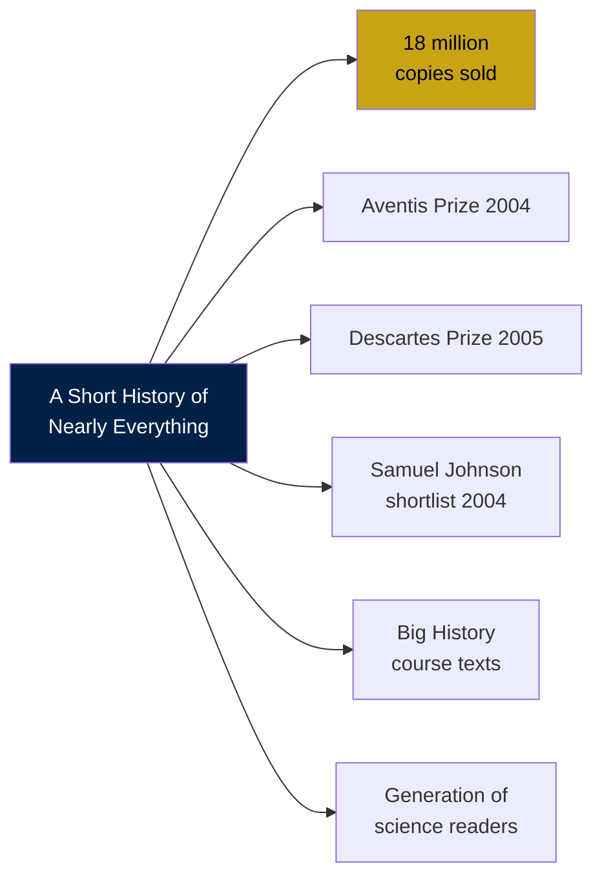

## Strengths

**The most accessible single-volume overview of science ever written.** No popular-science book attempts this sweep — from quarks to supernovae to dinosaurs to DNA — and none sustains the narrative coherence Bryson achieves. A reader with no scientific background can finish the book and hold a defensible mental model of where the universe came from, how Earth works, how life began, and where humans fit. That is no small achievement. Bryson is not a scientist, and his outsider status is precisely his gift: he writes from *inside* the reader's confusion.

**The history *of* science is the science.** Bryson's central method is to tell each topic through the story of its discovery. The reader does not just learn that the Earth is 4.5 billion years old; they live through the centuries-long argument over whether it is 6,000 or 4.5 billion. They do not just learn that plate tectonics is true; they experience the humiliation Wegener endured for proposing it in 1912. This works because humans remember stories, not facts. Hutton walking along Siccar Point. Wegener dying alone in a Greenland blizzard. Darwin agonizing for 20 years before publishing. These narratives stick in a way that the facts alone do not.

**Humor that respects the reader.** Bryson never talks down. He exposes the absurdity of scientists and the absurdity of his own ignorance in equal measure. On the Superconducting Supercollider, cancelled in 1993 after $2 billion was spent: "In perhaps the finest example in history of pouring money into a hole in the ground, Congress spent $2 billion on the project, then canceled it in 1993 after fourteen miles of tunnel had been dug." On the troposphere: "There really isn't much between you and oblivion." The book is funny without being glib.

**Honest about what we do not know.** Bryson's most distinctive quality as a popularizer is candor. The origin of life? We do not know. Dark matter? We have no idea what it is. Consciousness? The most brilliant physicists have not explained it. This is the opposite of triumphalist science writing. The effect is to make science feel *alive* — an unfinished conversation rather than a closed canon of facts.

**Emotionally calibrated scale handling.** Bryson has an instinct for the right level of astonishment. He does not overwhelm the reader with six orders of magnitude; he finds the one that produces wonder without paralysis. The year-compression thought experiment (human history fits in the last 14 seconds of December 31) is borrowed, but he uses it sparingly and precisely.

---

## Weaknesses

**Outdated in specific areas.** Written in 2001–2002, published 2003, the book predates: the discovery of the Higgs boson (2012), gravitational wave detection (2015), the New Horizons flyby of Pluto (2015), the Denisovan discovery (2010), full Neanderthal genome sequencing (2010), the James Webb Space Telescope (2021), and the entire COVID-19 pandemic. Bryson describes Pluto as a planet and refers to its orbit as "chaotic" without noting that this is only true on scales of millions of years. On the positive side, much of what Bryson describes remains accurate: evolution, plate tectonics, the Big Bang, atomic structure, and deep time have not changed significantly.

**Factual errors.** The book has been extensively fact-checked by readers. The errata page maintained at errata.wikidot.com lists corrections large and small. Errors range from the trivial (miscounting the laps of an electron in the LEP collider, which would make it faster than light) to the substantive (exaggerating the role of asteroids in mass extinctions; Bryson implies that almost all mass extinctions were caused by asteroid impacts, when the Permian extinction and probably others were driven primarily by flood-basalt volcanism). Most errors do not undermine the core argument; they are editorial rather than conceptual.

**The mathematics is absent.** Bryson explicitly avoids equations. Concepts like entropy, half-life, the Planck constant, and quantum probability are conveyed through metaphor and analogy rather than derivation. For a general audience, this is correct — you cannot ask a lay reader to integrate probability functions — but it comes at a cost. Quantum mechanics, in particular, becomes "weird" rather than mathematically precise. The reader knows *that* electrons are probabilities; they do not know *how* the probability is calculated or what makes it predictively powerful.

**Limited intellectual framework.** Bryson builds no original argument. The book is, by design, a tour, not a thesis. This distinguishes it from Diamond's *Guns, Germs and Steel*, Dawkins' *The Selfish Gene*, or Harari's *Sapiens* — books that stake claims and invite argument. *A Short History of Nearly Everything* stakes no claims beyond "science is valuable and interesting." Some readers will find this refreshing; others will find it thin.

**Underrepresentation of non-Western and women scientists.** Bryson's cast is largely European and male. It features Mendeleyev, Lavoisier, Hutton, Lyell, Darwin, Wegener, Bohr, Rutherford, Einstein, Watson, Crick — and not Meitner, Noether, Franklin (briefly), Lwoff, or any non-Western scientists. This partly reflects the historical literature Bryson was drawing on, but it perpetuates the default framing of science as a Western male enterprise. Rosalind Franklin gets a few lines — and Bryson is aware of her contribution — but Lise Meitner, excluded from the Nobel for the discovery of nuclear fission, does not appear.

---

## Academic Reception

### Named Critics and Their Arguments

**John Waller, *The Guardian*, June 21, 2003.** Waller, a research fellow at the Wellcome Trust Centre for the History of Medicine, praised Bryson's "energetic, quirky, familiar and humorous" prose. He called the book "the best rough guide to science" and noted Bryson's skill at debunking scientists' own foundation myths — the Darwin "Eureka!" moment, the Walcott/Burgess Shale accident. Waller did, however, flag the "terrible" anthropocentrism inherent in a book that measures everything against human knowledge, and noted that some of Bryson's scientifc treatments were necessarily superficial for a general audience.

**Ed Regis, *The New York Times Book Review*, May 18, 2003.** Regis was initially hostile ("Worse, the author was described on the jacket as 'one of the world's most beloved and best-selling writers,' another irritant, and so the book came across as an engraved invitation: 'Find fault with me.'"). He found Bryson's inability to judge scientific priorities sometimes misplaced — "Bryson simply lacks the insight and judgement of a trained scientist" — noting that Bryson gives too much space to speculative cosmology (inflation, the multiverse) while glossing over observationally established topics like Big Bang Nucleosynthesis and the cosmic microwave background. Regis also criticized the treatment of Snowball Earth as certain when it remains controversial among geologists. However, Regis acknowledged the book's wit and effectiveness: "From a scientific point of view, most topics are treated superficially. This renders the book of little interest to a scientist, but has certain advantages for the layperson."

**Walter Gratzer, *Nature*, August 14, 2003.** Gratzer, emeritus professor of biophysical chemistry at King's College London, reviewed the book in a two-paragraph assessment in *Nature* — relatively brief, reflecting the standard scientific ambivalence toward popularization. Gratzer called it "a stranger in a strange land," capturing Bryson's position as an accomplished travel writer venturing into unfamiliar conceptual territory. The brevity of the *Nature* review itself illustrates the conversation: professional scientists were more comfortable recommending the book to non-scientists than engaging with it on its own terms.

**Jupiter Scientific Review, 2004.** Jupiter Scientific, a research and education organization, performed a detailed fact-check and found "how few errors there are" — a qualified compliment, since they did find errors. They identified a small handful of substantive errors (the speed of the atmospheric shock wave from an asteroid impact; the cell count in the human body, which they correct from Bryson's 10,000 trillion to approximately 50 trillion; the point about atom nuclei rather than atoms passing through stars) and characterized the book as "extraordinarily well written" and "of little interest to a scientist, but has certain advantages for the layperson." They noted that large portions of Chapter 21 were drawn from Stephen Jay Gould's *Wonderful Life* — a deferential borrowing rather than plagiarism, since Bryson cites Gould explicitly.

**Kate Ayers, *Bookreporter.com*, January 23, 2011.** Ayers, writing more than seven years after publication, described it as "superbly written" and noted that "I can't vouch for the accuracy of the content, but written the way it is, it undeniably makes learning fun." She praised the character portraits — Lord Kelvin, Richter, Pasteur — and the "amusingly constructed sentences" that personalize otherwise dry scientific history.

---

### Comparison with the Broader Field of Popular Science

| Book | Approach | What Bryson Adds | What Bryson Lacks |
|------|----------|-------------------|-------------------|
| *Cosmos* (Sagan, 1980) | Poetic cosmic tour | Comprehensive earth science; British wit | Philosophical depth; poetic register |
| *The Selfish Gene* (Dawkins, 1976) | Theoretical argument | Human narrative around science | A thesis to argue |
| *Guns, Germs, and Steel* (Diamond, 1997) | Single big thesis (**geography**) | Narrative range; personality biographies | A unifying argument |
| *Sapiens* (Harari, 2011) | Provocative big-history thesis | Historical accuracy; scientist anecdotes | Intellectual provocation |
| *A Brief History of Time* (Hawking, 1988) | Physics from first principles | Biology, chemistry, geology | Technical depth in physics |
| *Ever Since Darwin* (Gould, essays) | Evolutionary argumentation | Breadth beyond evolution | Argumentative depth |

The closest comparison is Carl Sagan's *Cosmos*: both are panoramic, both are written for intelligent general readers, both convey wonder without condescension. *Cosmos* is poetic and explicitly philosophical. *A Short History of Nearly Everything* is earthier, funnier, and grounded in more history of science, but it shares the fundamental assumption that science is a human activity that produces something closer to awe than to data.

---

### Legacy and Ongoing Significance

Beginning in 2003, when it was first published, through its 2005 UK bestseller status, through the 2025 announcement of a second edition, the book has remained in print continuously. It has been used as a textbook in university "Big History" courses and as a recommended text in secondary-school science curricula in the UK. Ed Yong, Carl Zimmer, and other leading science writers of the generation that came of age in the 2000s cite it as formative. The book has been translated into more than 30 languages.

Critics of Bryson's treatment — particularly Jupiter Scientific's detailed fact-check — have made the book a touchstone for discussions of how popular science should be written. Is it better to be broadly accurate and engaging, or narrowly precise and dry? Bryson chose the first path explicitly. He knows he makes errors. He knows he simplifies. He defends the choice on grounds that matter: most people will not become scientists; they will, however, read a book. A book that reaches 18 million people with 99 percent accuracy is more valuable to public understanding of science than a technically flawless monograph that sells 5,000 copies.

---

## Bryson's Method and Its Ethical Consequences

Bryson wrote the book by reading scientific literature and interviewing working scientists. He acknowledges this plainly in the acknowledgments: "I have made no discoveries of my own." This has two consequences worth naming:

**Positive:** Bryson captures the living voice of working science — its caveats, its uncertainties, its moments of genuine puzzlement — better than almost any textbook. Scientists recognize themselves in his accounts.

**Negative:** Bryson's account is only as good as his sources. When scientists disagree — on the origin of life, on Snowball Earth, on the asteroid role in the Permian extinction — Bryson sometimes presents one view as settled when it is not. The risk of popularization is that it imposes false clarity on genuinely unsettled science.

The book's deepest achievement is cultural, not intellectual. It made science feel accessible to people who had been taught that it was not. It normalized curiosity in adults. It modeled a way of thinking — about scale, about time, about probability — that has lasting utility beyond science itself. These are not trivial accomplishments.

| Aspect | Assessment |
|--------|-----------|
| Accessibility | Exceptional |
| Comprehensiveness | Very good; outdated in specialized areas |
| Factual accuracy | High with documented minor errors |
| Original argument | None; synthesis by design |
| Literary quality | High — prose is a primary pleasure |
| Influence on readers | Significant — cited by many as formative |
| Influence on science | Indirect; evangelism for public engagement |
| Suitability for classroom | Excellent |
| Longevity | 20+ years in print; remains recommended |
