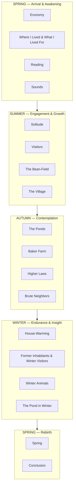
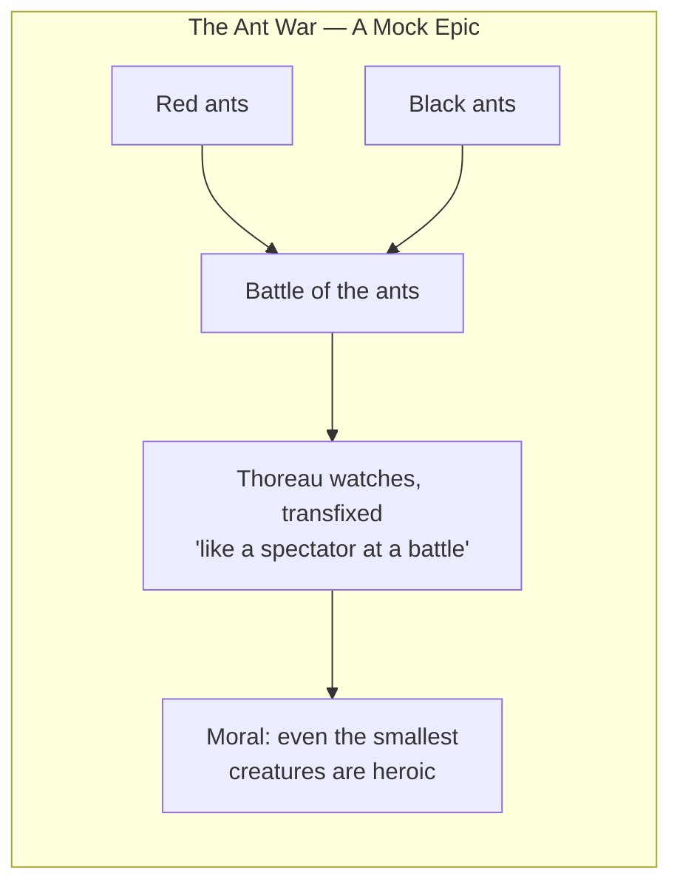

## The 18 Chapters as a Seasonal Cycle

Thoreau compressed two years into one symbolic year — spring to spring —
to mirror the human journey from awakening through maturity to rebirth.



---

## Chapter-by-Chapter Breakdown

### 1. Economy

The longest chapter — roughly one-third of the book. Thoreau details the
complete cost of his experiment: $28.12 for the cabin, 23 cents per week
for food, 6 weeks of annual labor to meet all expenses. He attacks
fashion ("Beware of all enterprises that require new clothes"), housing,
and wage labor. The chapter is built on a central economic argument: the
necessities of life are few, so most human labor is wasted on superfluities.

Key distinction: **necessities** (food, shelter, clothing, fuel) vs.
**luxuries** (everything else). Thoreau aims to prove a person can meet
all necessities with minimal work and devote the rest of life to higher
pursuits — reading, walking, contemplation.

### 2. Where I Lived, and What I Lived For

The spiritual center of the book. Thoreau explains *why* he went to the
woods — "to live deliberately, to front only the essential facts of life."
He contrasts waking life with sleepwalking, urging readers to "brag as
lustily as chanticleer" and "settle all private accounts" with existence.

Contains the book's most quoted passage and its core philosophical
injunction: simplification as the path to wakefulness.

### 3. Reading

Thoreau argues for the transformative power of classical literature —
Homer, Aeschylus, the Vedas — read in the original languages. He laments
that Concord's villagers read only newspapers and popular fiction. True
reading is not entertainment but "a noble intellectual exercise" that
elevates the reader toward the heroic.

### 4. Sounds

A counterpoint to Reading. Books are valuable, but direct experience of
nature is more so. Thoreau catalogues the sounds of Walden: the
whippoorwill at dusk, the hooting owl, the rattling train in the distance,
the frogs chorusing at night. The train is a symbol of the "progress"
Thoreau distrusts — it connects people but at the cost of rushing them past
life itself.

### 5. Solitude

Thoreau's most lyrical chapter. He argues that physical isolation does not
produce loneliness — an empty inner life does. Nature is a constant
companion: "I never found the companion that was so companionable as
solitude." Rainy afternoons, the sound of the wind, the company of a
mouse — these fill a life more richly than any party.

### 6. Visitors

Despite his celebration of solitude, Thoreau received many visitors — up
to 30 at a time. He profiles the most memorable: the **Canadian
woodchopper** (Alec Therien), an illiterate but naturally wise man whom
Thoreau both admires and pities; and a philosophical farmer. This chapter
humanizes the experiment and shows that Thoreau was not a complete hermit.

### 7. The Bean-Field

Thoreau's account of growing two acres of beans — the most meditative
chapter. He describes hoeing as a form of spiritual practice, a "connecting
link between the earth and man." He earns $8.71 from the crop but insists
the real value was in the doing, not the profit.

### 8. The Village

Thoreau walks to Concord for gossip and company. On one trip, he is
arrested for refusing to pay his poll tax — the incident that inspired his
essay "Civil Disobedience." He spends one night in jail and is released
(legend says someone, possibly his aunt, paid the tax). He uses the
episode to criticize a state that permits slavery and wages aggressive war.

### 9. The Ponds

A lyrical survey of Walden Pond and its neighbors — Flint's Pond, White
Pond, Goose Pond. Thoreau maps Walden's depth (107 feet at its deepest,
he found), describes its crystalline water, and reflects on the sacred
character of wild places. "A lake is the landscape's most beautiful and
expressive feature."

### 10. Baker Farm

A brief chapter. Thoreau takes shelter from rain in the filthy hut of John
Field, an Irish immigrant who works ceaselessly but remains poor. Thoreau
urges him to simplify — to live like Thoreau himself, free of employers
and creditors. Field cannot hear the advice; he is too deep in the dream
of American prosperity.

### 11. Higher Laws

Thoreau examines the tension between the "savage" and the "spiritual" in
human nature. He advocates vegetarianism (though he occasionally ate fish
and woodchuck), chastity, and self-control. The goal is to transcend the
merely animal — to make one's life, not just one's diet, a discipline.
"The gross feeder is a man in the larva state."

### 12. Brute Neighbors

The most playful chapter. Thoreau describes a conversation between a
**Hermit** (himself) and a **Poet** (Ellery Channing) about fishing,
punctuated by a long description of a war between red and black ants that
he frames as a mock-epic battle. Also: a loon's evasive diving on the pond,
and the mouse that shares his cabin.



### 13. House-Warming

As winter approaches, Thoreau builds a chimney and plasters his walls. He
gathers firewood and reflects on the comfort of a well-sealed home against
the cold. The act of heating his house becomes a meditation on the
elemental — fire as friend, as necessity, as symbol.

### 14. Former Inhabitants; and Winter Visitors

Thoreau imagines the people who lived near Walden before him: slaves,
farmers, a tavern-keeper, a poet who died young. History layers the
landscape. His winter visitors are few but valued — the woodchopper, the
farmer, and above all Ellery Channing, who walks through snow for
conversation.

### 15. Winter Animals

Thoreau catalogues the creatures that survive the Massachusetts winter:
snowshoe hares, red squirrels, chickadees, jays, partridges. He puts out
corn for them and observes their behaviors with the patience of a
naturalist and the reverence of a mystic.

### 16. The Pond in Winter

Thoreau sounds Walden Pond to prove it is not bottomless, finding a
uniform depth of about 100 feet. Ice-cutters arrive to harvest blocks for
shipping to the Carolinas. Thoreau reflects on the commerce of ice — a
reminder that even this wild place is connected to the broader economy.

### 17. Spring

The climax. Ice thaws with thunderous sounds; sand and clay flow down the
railroad cut in patterns that resemble leaves and plants — "sand foliage"
that demonstrates nature's generative power. Geese fly north. A hawk
circles. Thoreau is ecstatic: the rebirth of nature mirrors the possibility
of human renewal.

### 18. Conclusion

Thoreau's final call to arms. He rejects conformity, urges each person to
"step to the music which he hears," and insists that the inner frontier is
the only one worth exploring. The book ends with its most famous image:
"The sun is but a morning star."

---

## Symbolic Architecture

```mermaid
mindmap
  Walden Pond
    Surface::["Reflection — self-knowledge"]
    Depth::["The unfathomable — spirituality"]
    Ice::["Death and dormancy"]
    Thaw::["Resurrection"]
  The Bean-Field
    Labor::["Dignity of work"]
    Cultivation::["Self-cultivation"]
    Profit::["$8.71 — real value is process, not product"]
  The Railroad
    Speed::["The illusion of progress"]
    Connection::["Trade without community"]
    Sound::["Intrusion of the modern"]
  The Ants
    War::["Human conflict made miniature"]
    Heroism::["Found in the smallest creatures"]
  Sand Foliage
    Nature's creativity::["Organic forms in inorganic matter"]
    Unity::["All substance is one living thing"]
```

---

## Thoreau's Key Concepts

| Concept | Meaning | Where It Appears |
|---------|---------|-----------------|
| **Deliberate Living** | Choosing consciously how to spend each hour | Economy, Where I Lived |
| **Simplicity** | Reducing life to essentials | Economy |
| **Voluntary Poverty** | Choosing to own little so you own your time | Economy, Conclusion |
| **Wakefulness** | Being spiritually alert, not sleepwalking | Where I Lived, Conclusion |
| **Different Drummer** | Following your own conscience over society's demands | Conclusion |
| **The Necessaries** | Food, shelter, clothing, fuel — only these are truly needed | Economy |
| **The Tonic of Wildness** | Nature's rough, untamed aspect is spiritually necessary | Spring, Conclusion |
| **Morning Work** | The early hours as sacred time for creation | Where I Lived, Sounds |
| **The Heroic** | Living at the level of classical heroism in daily life | Reading, Conclusion |
