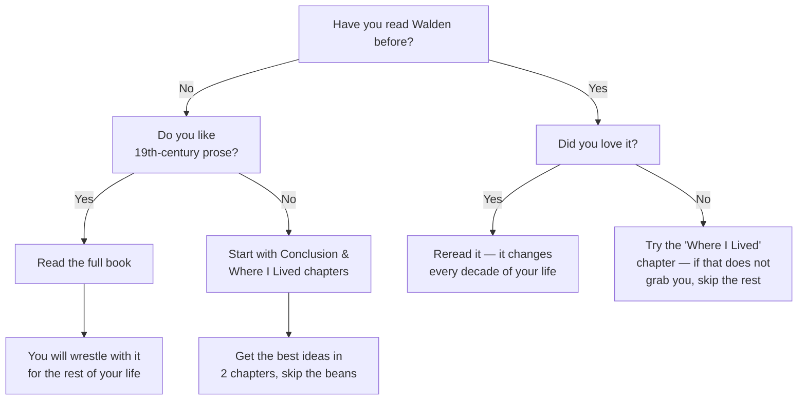

## Introduction

Welcome to BookAtlas. Today: *Walden; or, Life in the Woods* by Henry David
Thoreau. Published 1854 by Ticknor and Fields of Boston. 288 pages.
Two years and two months of lived experience compressed into one symbolic
year. An American classic. A founding text of environmentalism, minimalism,
and nonviolent resistance. And according to its author — the record of an
experiment in deliberate living.

But here is the trouble with Walden. Everyone *knows* it. "Quiet
desperation." "Different drummer." "Live deliberately." The phrases are
everywhere — graduation speeches, coffee mugs, Instagram captions. But how
many people have actually read the 80-page chapter on building a cabin?

So today we settle this book once and for all. Two voices. One is a
Thoreau scholar — someone who has spent years living inside that cabin,
mentally. The other is a skeptic who thinks Thoreau was a pampered
hypocrite whose mother did his laundry.

Let's step into the woods.

---

## The Setup: What Is Walden Actually About?

**Scholar:** Walden is not really a book about nature. It is a book about
*waking up*. Thoreau went to the woods on July 4, 1845 — Independence Day
— to declare his independence from a society he thought was sleepwalking.
He built a 10-by-15-foot cabin for $28.12, planted beans, read Homer,
watched ants fight, mapped the bottom of a pond, and wrote about it. The
result is 18 essays that ask one question: *Are you living your life, or
is your life living you?*

**Skeptic:** That is a generous reading. I see a book that is rambling,
self-indulgent, and dishonest. Thoreau claims to have gone into the woods
to live simply — but he was living on Emerson's land, eating at his
family's house, and walking into Concord every few days for gossip. His
mother did his laundry. He is the original influencer: performative
simplicity for an audience.

**Scholar:** The laundry story is almost certainly apocryphal — there is
no contemporary evidence for it. But even if it were true, so what? The
book is not a police report. It is a *philosophical provocation*. When
Thoreau says he wants to "live deliberately," he is not giving you his
schedule. He is giving you a standard to measure your own life against.

---

## The Economics of Living

**Skeptic:** Let's start with "Economy" — the longest chapter. It is
basically a spreadsheet. Thoreau itemizes the cost of every nail, every
shingle, every hinge. He tells us his food costs 23 cents a week. He
concludes that a person can meet all needs by working about six weeks
per year. The remaining 46 weeks are free.

**Scholar:** That is the whole point! The chapter is a *satire* of
economic thinking. Thoreau is mocking the very idea that life can be
reduced to ledgers — by keeping the most meticulous ledger in American
literature. He proves, on his own terms, that the economic argument for
simplicity is unassailable. If you can support yourself with six weeks of
work, why are you working 50? What are you buying with those 44 weeks of
your life?

**Skeptic:** It is incredibly boring to read. Page after page of board
prices and bean profits. And then he claims to be "self-sufficient" while
borrowing an axe and using someone else's land. It feels dishonest.

**Scholar:** It is not boring if you read it as performance. Thoreau is
doing something clever: he uses the language of commerce to attack the
values of commerce. He beats the businessman at his own game. And the
borrowed axe is not a contradiction — it is a *symbol*. He returns it
sharper than he received it. That is the moral life: leaving everything
you touch a little better than you found it.

---

## The Heart of the Book: Where I Lived, and What I Lived For

**Skeptic:** This is where the famous line lives. "I went to the woods
because I wished to live deliberately, to front only the essential facts
of life." Beautiful sentence. But what does it actually *mean*?

**Scholar:** It means stop outsourcing your life. Stop doing things because
that is what people do. Stop working a job you hate to buy things you do
not need to impress people you do not like. Thoreau's question is brutally
simple: when you die, will you have lived, or will you merely have occupied
space? He goes to the woods to find out.

**Skeptic:** It sounds like a midlife crisis that he turned into a book.

**Scholar:** Maybe. But a midlife crisis that produces a masterpiece is
still a masterpiece. And the question is real. Most people — then and now
— spend their lives on autopilot. Thoreau's challenge is: wake up. Turn
off the autopilot. Every single day, choose.

---

## The Quiet Desperation Line

**Skeptic:** "The mass of men lead lives of quiet desperation." This is the
most famous line in the book. It is also deeply insulting. Thoreau is
saying that most people — farmers, mechanics, shopkeepers — are living
meaningless lives. He was 28 years old, childless, and supported by
Emerson. Who gave him the right to judge?

**Scholar:** He earned the right by doing the experiment. He is not
judging from a distance — he went into the woods to test his theory. And
he includes himself in the judgment. "What is called resignation is
confirmed desperation." He is saying: I too was desperate. I too was
resigned. And I chose to stop.

**Skeptic:** But most people cannot stop. They have families. Mortgages.
Responsibilities. Thoreau's advice to the Irish immigrant John Field —
"simplify, simplify!" — is almost cruel. Field cannot simplify his way
out of poverty.

**Scholar:** That is the most honest moment in the book. Thoreau gives
Field the advice, and Field ignores it. Thoreau knows why: the dream of
wealth is stronger than the reality of poverty. Field is not trapped by
his boss; he is trapped by his own aspirations. Thoreau cannot free him.
No one can. Freedom has to be chosen.

---

## The Naturalist's Eye

**Skeptic:** Let's talk about the nature writing. I will grant this:
Thoreau was an extraordinary observer. His description of the thawing sand
bank in "Spring" — the way the sand flows like leaves and plants,
demonstrating that the same generative force shapes mud and trees and
humans — is stunning.

**Scholar:** That passage is the book's philosophical climax. Thoreau
watches inorganic matter take organic forms and realizes: there is no
hard line between living and nonliving. The whole universe is one
unfolding creative act. "There is nothing inorganic," he writes. That is
Transcendentalism in a sentence.

**Skeptic:** And the ants. The war between the red ants and the black
ants is absurd — he describes it like the Iliad. Tiny insects ripping
each other apart while a grown man watches, transfixed.

**Scholar:** It is absurd — and that is the point. Thoreau is mocking the
epic pretensions of human warfare. If we look ridiculous to the gods,
imagine how ridiculous the ant war looks to us. The chapter forces us to
ask: what are *our* wars except bigger versions of the same pointless
violence?

---

## The Jailing: Civil Disobedience

**Skeptic:** Thoreau is arrested for refusing to pay his poll tax. He
spends one night in jail. Someone — probably his aunt — pays the tax.
He is released. And this one night becomes the basis for his essay "Civil
Disobedience," which goes on to inspire Gandhi and Martin Luther King Jr.

**Scholar:** The irony is incredible. A man who could not even stay in
jail for a full night becomes the intellectual father of two of history's
most successful nonviolent movements. But there is a lesson there: you do
not need to be perfect to be right. Thoreau's one night was enough because
it was a *witness*. He said: I will not fund a government that enslaves
people. That witness mattered.

**Skeptic:** But he did not actually see it through. He was released. If
Gandhi had given up after one night in jail, India would still be British.

**Scholar:** Thoreau did not see himself as a political activist. He was
a writer. His job was to articulate the principle — to say it so clearly
that others could act on it. And that is exactly what happened. Gandhi
read Thoreau. King read Thoreau. The one night became the seed.

---

## The Conclusion: Different Drummer

**Skeptic:** "If a man does not keep pace with his companions, perhaps it
is because he hears a different drummer. Let him step to the music which
he hears, however measured or far away." This is beautiful. It is also
completely individualistic. Thoreau has no theory of community, no
politics beyond refusal. He is essentially saying: just be yourself, and
to hell with everyone else.

**Scholar:** That is not quite fair. Thoreau is *not* saying to hell with
everyone else. He is saying: do not let *conformity* be your guide. The
drummer you hear is your own conscience, your own sense of what is true
and good. If that happens to align with your neighbors — fine. If it does
not — follow the drummer.

**Skeptic:** And the final line. "The sun is but a morning star." What
does that even mean?

**Scholar:** It means the greatest light you know is just a herald of a
greater light to come. The book ends not with a period but with a dawn.
Thoreau is saying: I have shown you what I found. Now it is your turn. Go
into your own woods. Live your own experiment. The sun is only the
beginning.

---

## The Hypocrisy Debate: A Fair Hearing

Let's be honest about the criticisms.

- **Thoreau was not isolated.** He walked to Concord every few days. He
  had 30 visitors at a time. His solitude was spiritual, not physical. The
  book does fudge this.
- **His experiment was subsidized.** Emerson's land. Family meals. A
  borrowed axe. Thoreau's "independence" was never absolute.
- **He was selective with the truth.** He omitted hardships and exaggerated
  his isolation. *Walden* is literature, not journalism.
- **His advice is not universally applicable.** What works for a
  Harvard-educated bachelor does not work for a single mother of four.

**Scholar:** All true. And none of it matters. The book is not a tax
return. It is a *vision* — a picture of what life could be if we had the
courage to strip it down to essentials. A perfect man writing a perfect
book would be unreadable. Thoreau's imperfections — his vanity, his
inconsistency, his crankiness — make *Walden* a conversation, not a
sermon. You argue with him on every page. And in arguing, you clarify
what *you* believe.

**Skeptic:** I still think he was a hypocrite. But I admit: the book
survives its author. The "different drummer" line is true even if
Thoreau did not always live up to it. Maybe that is the final lesson:
the truth of an idea is not determined by the purity of the person who
says it.

---

## The Verdict: Should You Read Walden?

**Scholar:** If you have never read Walden, read it. Not because it is
easy — it is not. The prose is dense, the chapters ramble, the accounting
is tedious. Read it because it asks a question that no other book asks
with quite this mixture of arrogance and tenderness: *Are you awake?*

**Skeptic:** Or don't read it. Read the famous chapters — "Where I
Lived," "Solitude," "Spring," "Conclusion." You will get 80% of the value
in 20% of the pages. The rest is filler, self-indulgence, and bean prices.
Thoreau would probably scold me for saying that. But I think he would
also understand. "Simplify, simplify," he said.

**Scholar:** Fair enough. But here is a warning: if you read those four
chapters, you will probably end up reading the whole book anyway. That is
the trap of Thoreau. He gets into your head. You start questioning your
own life. You start wondering whether you could build a cabin. You start
looking at your possessions differently. And then one day you find
yourself explaining to a friend why you need fewer things. Thoreau has
won.

---

## Final Thoughts

Walden is far from the greatest prose *ever* written in English (though
its best passages approach that level). It is certainly not the most
consistent philosophy (Thoreau contradicts himself constantly). It is not
even an accurate record of its author's life (he cleaned it up,
compressed it, fictionalized it).

But it is one of the most *alive* books ever written. Reading it is like
having a brilliant, infuriating, deeply sincere friend corner you at a
party and say: *Stop wasting your life.* And whether you thank him or
punch him, you will not forget the conversation.

Henry David Thoreau died in 1862, at 44, of tuberculosis. His last
recorded words were "moose" and "Indian." He spent his final years
revising *Walden* manuscripts and studying the forest succession on
Concord's hillsides. He never became famous in his lifetime. But he left
us the best description we have of what it means to wake up.

"I learned this, at least, by my experiment: that if one advances
confidently in the direction of his dreams, and endeavors to live the life
which he has imagined, he will meet with a success unexpected in common
hours."

This has been a BookAtlas narration of *Walden* by Henry David Thoreau.
Thanks for listening.
