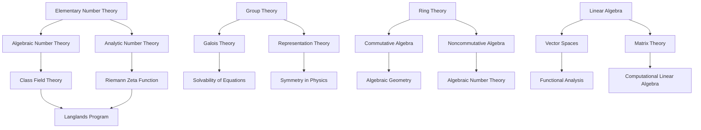

---
title: "Algebra & Number Theory"
description: "The study of abstract algebraic structures — groups, rings, fields, modules — and the deep properties of numbers, from prime distributions to Diophantine equations."
---

# Algebra & Number Theory

## Why This Subcategory Exists

Algebra and number theory are the two oldest branches of pure mathematics, and they remain among the most active research areas today. While calculus and analysis deal with continuous phenomena — limits, rates of change, infinite sums — algebra and number theory deal with discrete structures: the integers, polynomials, symmetries of geometric objects, and abstract systems of elements that can be added, multiplied, or composed according to precise axioms.

Algebra began as the study of equations. The word itself comes from the Arabic "al-jabr" in al-Khwarizmi's 9th-century treatise, referring to the operation of restoring balance in equations. Over centuries, algebra evolved from solving polynomial equations (the quadratic formula, the cubic, the quartic, and the proof by Abel and Ruffini that no general quintic formula exists) into the study of abstract structures: groups, rings, fields, modules, vector spaces, and categories. The turning point was Évariste Galois's work in the 1830s, which connected the solvability of polynomial equations to the symmetry groups of their roots — founding what we now call Galois theory. This single insight transformed algebra from a toolbox for solving equations into a deep theory of structure and symmetry.

Number theory, meanwhile, studies the integers and their generalizations. Its questions are often startlingly easy to state and impossibly hard to solve: Are there infinitely many twin primes (primes differing by 2)? Is every even number greater than 2 the sum of two primes (Goldbach's conjecture)? The field's crown jewel, Fermat's Last Theorem (proved by Andrew Wiles in 1995 after 358 of effort), states that x^n + y^n = z^n has no positive integer solutions for n > 2. The proof required connecting number theory to elliptic curves and modular forms — two areas that had previously seemed unrelated.

These two branches converge in algebraic number theory, where algebraic structures (rings, fields, ideals) are used to study number-theoretic problems (prime factorization, Diophantine equations). This fusion produces some of the deepest results in mathematics, including class field theory, the Langlands program (often called the "grand unified theory of mathematics"), and the tools underlying modern cryptography.

This subcategory holds books about both the pure theory and its applications: group theory for chemistry and physics, Galois theory for geometry, number theory for cryptography, and linear algebra (which is technically a branch of algebra) for virtually every quantitative field.

## Why This Is NOT Merged Into Other Subcategories

**Distinct from Foundations of Mathematics and Logic:** While foundations deals with the logical underpinnings of all mathematics (set theory, proof theory, model theory, Gödel's theorems), algebra and number theory are concrete mathematical domains with their own objects of study. Algebra asks "what are the possible symmetry structures?"; foundations asks "what can be proved?" A book on group theory belongs here; a book on ZFC set theory belongs in Foundations.

**Distinct from Analysis and Calculus:** Analysis studies continuous phenomena — limits, differentiation, integration, measure. Algebra studies discrete structures — finite groups, polynomial rings, finite fields. While there is overlap (functional analysis uses both, algebraic geometry bridges the two), the core methods and questions are fundamentally different. A book on Riemann integration belongs in Analysis; a book on ring theory belongs here.

**Distinct from Geometry and Topology:** While algebra and geometry increasingly merge (algebraic geometry, algebraic topology), the algebraic structures themselves — groups, rings, fields, modules — are the subject here. A book on topological manifolds belongs in Geometry & Topology; a book on group representations belongs here.

**Distinct from Applied and Computational Mathematics:** The algebraic theory (why groups have the structure they do, how prime numbers are distributed) belongs here. The computational applications (using FFT for signal processing, implementing RSA encryption) belong in Applied & Computational Mathematics.

## What Belongs Here

Books about groups, rings, fields, modules, vector spaces, Galois theory, representation theory, algebraic number theory, analytic number theory, Diophantine equations, elliptic curves, modular forms, homological algebra, category theory (when treated as algebra), commutative algebra, and algebraic geometry (when the emphasis is on algebraic structures).

## What Does NOT Belong Here

- Linear algebra as a computational/numerical tool → Applied & Computational Mathematics
- Logic and proof theory → Foundations of Mathematics and Logic
- Topology using algebraic tools (homology, cohomology) → Geometry & Topology
- Coding theory as engineering → Computer Science (Security & Cryptography)
- Algebraic geometry as geometry → Geometry & Topology

## Essential Reading: The Most Important Books

1. *Elements* — Euclid (c. 300 BCE) — The first systematic treatment of number theory (Books VII–IX) and geometric algebra
2. *Disquisitiones Arithmeticae* — Carl Friedrich Gauss (1801) — The founding text of modern number theory; introduced modular arithmetic, quadratic reciprocity, and the theory of binary quadratic forms
3. *A Course in Arithmetic* — Jean-Pierre Serre (1970) — A concise masterpiece covering quadratic forms and modular forms
4. *Abstract Algebra* — David S. Dummit & Richard M. Foote (1991) — The standard comprehensive graduate text covering groups, rings, fields, modules, Galois theory, and homological algebra
5. *Algebra* — Serge Lang (1965) — Encyclopedic treatment of graduate-level algebra; the reference against which others are measured
6. *Algebra* — Michael Artin (1991) — A more geometric approach to algebra, connecting abstract structures to symmetry and linear transformations
7. *Topics in Algebra* — I.N. Herstein (1975) — Elegant, concise, and famously challenging problems; trained generations of algebraists
8. *Galois Theory* — Ian Stewart (1973, 3rd ed. 2004) — The best introduction to Galois theory, requiring only undergraduate algebra
9. *The Theory of Algebraic Numbers* — Harry Pollard & Harold Diamond (1975) — Accessible introduction to algebraic number theory
10. *Algebraic Number Theory* — Jürgen Neukirch (1999) — The definitive modern treatment of class field theory and the cohomological approach
11. *An Introduction to the Theory of Numbers* — G.H. Hardy & E.M. Wright (1938, 6th ed. 2008) — The classic introduction to analytic and elementary number theory
12. *Multiplicative Number Theory* — Harold Davenport (1967) — Analytic number theory at its most elegant: Dirichlet L-functions, the Prime Number Theorem, and the Riemann zeta function
13. *A Classical Introduction to Modern Number Theory* — Kenneth Ireland & Michael Rosen (1982) — Bridges elementary number theory and algebraic number theory
14. *Elliptic Curves* — Dale Husemöller (1987) — The geometry and arithmetic of elliptic curves, central to Wiles's proof of Fermat's Last Theorem
15. *The Arithmetic of Elliptic Curves* — Joseph H. Silverman (1986) — Graduate-level treatment of elliptic curves over number fields
16. *Representation Theory: A First Course* — William Fulton & Joe Harris (1991) — The standard introduction to group representations, connecting algebra to geometry and combinatorics
17. *Homological Algebra* — Henri Cartan & Samuel Eilenberg (1956) — Founded the subject; derived functors, Ext, and Tor
18. *Categories for the Working Mathematician* — Saunders Mac Lane (1971) — The founding text of category theory, showing how algebraic structures relate across fields
19. *Basic Algebra I & II* — Nathan Jacobson (1974/1980) — Comprehensive graduate-level treatment covering everything from groups to Galois theory to category theory
20. *The Symmetries of Things* — Conway, Burgiel & Goodman-Strauss (2008) — A visual, accessible exploration of group theory and symmetry
21. *Fearless Symmetry* — Avner Ash & Robert Gross (2006) — Makes Galois representations and the Langlands program accessible to non-specialists
22. *Prime Obsession* — John Derbyshire (2003) — The Riemann Hypothesis explained for general readers, with real mathematical content
23. *The Music of the Primes* — Marcus du Sautoy (2003) — The history and significance of the Riemann Hypothesis
24. *Abstract Algebra: Theory and Applications* — Thomas Judson (2015) — Open-source textbook covering groups, rings, and fields with applications to cryptography
25. *Algebra: Chapter 0* — Paolo Aluffi (2009) — A category-theory-first approach to algebra, showing how universal properties unify algebraic structures

## Key Concepts and Frameworks

## How to Approach This Subcategory

Algebra and number theory have a steep learning curve. The abstraction level jumps dramatically from high school mathematics to even the first course in abstract algebra. Here is a recommended path:

1. **Start with proof literacy.** Before tackling algebra, you must be comfortable with mathematical proof. Read Velleman's *How to Prove It* or work through the first chapters of any transition-to-proof text.

2. **Begin with abstract algebra.** Herstein's *Topics in Algebra* or Dummit & Foote's *Abstract Algebra* are the standard first courses. Focus on groups first (the most intuitive algebraic structure), then rings, then fields. Work the exercises — algebra is learned by doing, not just reading.

3. **Study linear algebra properly.** Most people learn matrix computation but miss the abstract theory. Axler's *Linear Algebra Done Right* or Halmos's *Finite-Dimensional Vector Spaces* will teach you the real subject: vector spaces, linear transformations, eigenvalues, and spectral theory.

4. **Proceed to Galois theory.** Stewart's *Galois Theory* is the most accessible entry point. This is where algebra becomes truly beautiful: the correspondence between field extensions and groups explains why some equations can be solved by radicals and others cannot.

5. **For number theory, start with Hardy & Wright.** *An Introduction to the Theory of Numbers* requires only calculus and covers an enormous range: primes, congruences, quadratic reciprocity, continued fractions, and an introduction to analytic number theory.

6. **Then specialize.** Depending on your interest: Ireland & Rosen for algebraic number theory, Davenport for analytic number theory, Silverman for elliptic curves, or Fulton & Harris for representation theory.

**Connections to other categories:** Algebra is the language of Category 02 (Computer Science — through discrete math, cryptography, coding theory), Category 04 (AI/ML — through linear algebra, optimization, probability), Category 05 (Pure Sciences — through group theory in physics and chemistry), and Category 14 (Philosophy — through logic and foundations). Number theory underpins all modern cryptography (Category 02, Security & Cryptography).