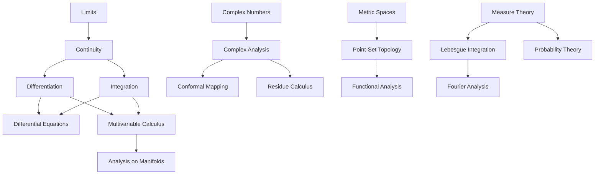

---
title: "Analysis and Calculus"
description: "The mathematics of continuity, change, and limits: from single-variable calculus through real analysis, complex analysis, and differential equations."
---

# Analysis and Calculus

## Why This Subcategory Exists

Analysis is the branch of mathematics that studies continuous change, limits, and infinite processes. It provides the rigorous foundation for calculus — the mathematics of derivatives and integrals that is indispensable to physics, engineering, economics, and virtually every quantitative discipline. Where algebra deals with discrete structures (groups, rings, finite fields), analysis deals with the continuous: smooth curves, infinite series, limits, and the real number system itself.

The history of analysis begins with Newton and Leibniz's invention of calculus in the late 17th century. Newton developed it to describe planetary motion (his *Principia Mathematica* is fundamentally a work of applied analysis) while Leibniz developed it with the notation and systematic approach that we still use today (the integral sign ∫, the derivative notation d/dx). For over a century, calculus was spectacularly successful in applications but lacked rigorous foundations. Mathematicians freely manipulated infinitesimals — quantities that were simultaneously nonzero and smaller than any positive number — without being able to explain what they actually were.

The rigorization of analysis in the 19th century, primarily by Cauchy, Weierstrass, and Dedekind, replaced infinitesimals with the epsilon-delta definition of limits, constructed the real numbers from rationals (Dedekind cuts), and proved the fundamental theorems that make calculus work. This program produced real analysis — the rigorous study of functions, limits, continuity, differentiation, and integration on the real line.

Complex analysis extends these ideas to functions of a complex variable, where the results become dramatically more powerful. A function that is differentiable once in the complex sense is automatically differentiable infinitely often and equals its Taylor series — a phenomenon with no analogue in real analysis. The residue theorem computes real integrals that are impossible by real methods. The Riemann zeta function, central to the distribution of prime numbers, is fundamentally a complex-analytic object.

Differential equations — equations relating a function to its derivatives — are the language in which the laws of physics are written. Newton's second law (F = ma) is a differential equation. Maxwell's equations for electromagnetism are partial differential equations. The Schrödinger equation of quantum mechanics is a partial differential equation. Fluid dynamics, heat transfer, population dynamics, and options pricing all use differential equations.

This subcategory holds books on the complete spectrum: introductory calculus for beginners, rigorous real analysis for mathematicians, complex analysis, Fourier analysis, functional analysis, ordinary and partial differential equations, and the history of how these ideas developed.

## Why This Is NOT Merged Into Other Subcategories

**Distinct from Algebra and Number Theory:** While algebra studies discrete structures (groups, rings, primes), analysis studies continuous phenomena (limits, derivatives, integrals). The real number system, which is the foundation of analysis, is fundamentally different from the integers. A book on Riemann integration belongs here; a book on Galois theory belongs in Algebra.

**Distinct from Foundations:** While analysis uses foundational concepts (the completeness of the real numbers, set theory), it is a concrete mathematical discipline with its own problems and methods, not the study of foundations itself.

**Distinct from Applied & Computational Mathematics:** The theoretical development of analysis (why differentiation works, when series converge, the implicit function theorem) belongs here. The computational applications (numerical methods for solving PDEs, finite element methods) belong in Applied & Computational Mathematics.

**Distinct from Probability Theory:** While probability theory uses measure theory (a branch of analysis), the probabilistic concepts (random variables, distributions, stochastic processes) are distinct from analysis proper. A book on measure-theoretic probability belongs in Probability Theory; a book on real analysis belongs here.

## What Belongs Here

Books about single-variable calculus, multivariable calculus, real analysis (measure theory, Lebesgue integration), complex analysis, Fourier analysis, functional analysis, ordinary differential equations, partial differential equations, calculus of variations, analysis on manifolds, non-standard analysis, and the history of calculus and analysis.

## What Does NOT Belong Here

- Numerical methods for solving equations → Applied & Computational Mathematics
- Probability and statistics → Probability Theory / Statistics
- Discrete mathematics and combinatorics → Foundations / Computer Science
- Abstract structures (groups, rings) → Algebra and Number Theory

## Essential Reading: The Most Important Books

1. *Principia Mathematica* — Isaac Newton (1687) — The founding text of mathematical physics and applied analysis
2. *Introduction to Calculus and Analysis* — Richard Courant & Fritz John (1965) — The best introduction to rigorous calculus; motivation and proof in equal measure
3. *Calculus* — Michael Spivak (1967) — The gold standard for a rigorous first course in calculus; proves everything, beautifully
4. *A Course of Pure Mathematics* — G.H. Hardy (1908) — The classic British introduction to real analysis; lucid and rigorous
5. *Principles of Mathematical Analysis* — Walter Rudin (1953) — "Baby Rudin": the standard graduate real analysis text; compact, powerful, challenging
6. *Real and Complex Analysis* — Walter Rudin (1966) — "Big Rudin": graduate-level measure theory and complex analysis in one volume
7. *Real Analysis* — H.L. Royden (1963) — The standard graduate text for measure theory and Lebesgue integration
8. *Measure Theory* — Paul Halmos (1950) — The classic treatment of measure theory by one of its creators
9. *Complex Analysis* — Lars Ahlfors (1953) — The standard graduate complex analysis text; geometric and elegant
10. *Functions of One Complex Variable* — John Conway (1973) — A more accessible alternative to Ahlfors
11. *Visual Complex Analysis* — Tristan Needham (1997) — Revolutionized how complex analysis is taught; geometric intuition before rigor
12. *Ordinary Differential Equations* — Vladimir Arnold (1973) — Geometric approach to ODEs; emphasizes qualitative properties and phase portraits
13. *Differential Equations, Dynamical Systems, and an Introduction to Chaos* — Hirsch, Smale & Devaney (2004) — The modern geometric approach to ODEs and dynamical systems
14. *Partial Differential Equations* — Lawrence Evans (1998) — The standard graduate text for PDEs; comprehensive and rigorous
15. *Fourier Analysis* — Elias Stein & Rami Shakarchi (2003) — Accessible and deep treatment of Fourier analysis from the Princeton Lectures series
16. *Functional Analysis* — Walter Rudin (1973) — The standard graduate text on functional analysis (Banach spaces, Hilbert spaces, spectral theory)
17. *Calculus on Manifolds* — Michael Spivak (1965) — A concise introduction to analysis on differentiable manifolds; Stokes' theorem in full generality
18. *Analysis on Manifolds* — James Munkres (1991) — A more detailed treatment of analysis on manifolds
19. *Advanced Calculus* — Lynn Loomis & Shlomo Sternberg (1968) — A modern, geometric approach to advanced calculus and differential forms (freely available)
20. *The Calculus Gallery* — William Dunham (2008) — A historical tour of analysis from Newton to Riemann, accessible to general readers
21. *Infinite Powers* — Steven Strogatz (2019) — The best popular account of calculus and its impact on science
22. *Counterexamples in Analysis* — Bernard Gelbaum & John Olmsted (1964) — Shows why every hypothesis in analysis theorems is necessary
23. *An Introduction to the Theory of Numbers* (Analytic Number Theory chapters) — Hardy & Wright — Shows how analysis solves number-theoretic problems
24. *Differential Equations and Their Applications* — Martin Braun (1975) — ODEs with applications to biology, physics, and engineering
25. *Applied Analysis* — Cornelius Lanczos (1956) — Analysis from an applied perspective; variational methods and approximation theory

## Key Concepts and Frameworks

## How to Approach This Subcategory

Analysis has a clear dependency structure that must be followed:

1. **Learn single-variable calculus first.** Spivak's *Calculus* is the gold standard for those who want rigor; Stewart's *Calculus* for those who want applications. Spivak teaches you to *think* like an analyst.

2. **Proceed to real analysis.** Rudin's *Principles of Mathematical Analysis* (Baby Rudin) is the standard. Supplement with Abbott's *Understanding Analysis* if you need gentler motivation. Focus on: epsilon-delta proofs, uniform convergence, the Riemann integral, and sequences/series of functions.

3. **Study complex analysis.** Needham's *Visual Complex Analysis* for intuition first, then Ahlfors for rigor. The Cauchy integral formula, residue theorem, and conformal mappings are the key results.

4. **Learn ordinary differential equations.** Arnold for the geometric approach (phase portraits, qualitative theory), Braun for applications. Understand existence/uniqueness theorems, linear systems, stability.

5. **Then choose your direction:** Evans for PDEs, Royden for measure theory, Rudin for functional analysis, or Munkres for analysis on manifolds.

**Connections to other categories:** Analysis is the mathematical foundation of Category 05 (Pure Sciences — through mathematical physics, differential equations), Category 04 (AI/ML — through optimization, gradient methods), Category 10 (Economics — through dynamic optimization), and Category 01's own Probability Theory subcategory (through measure theory).