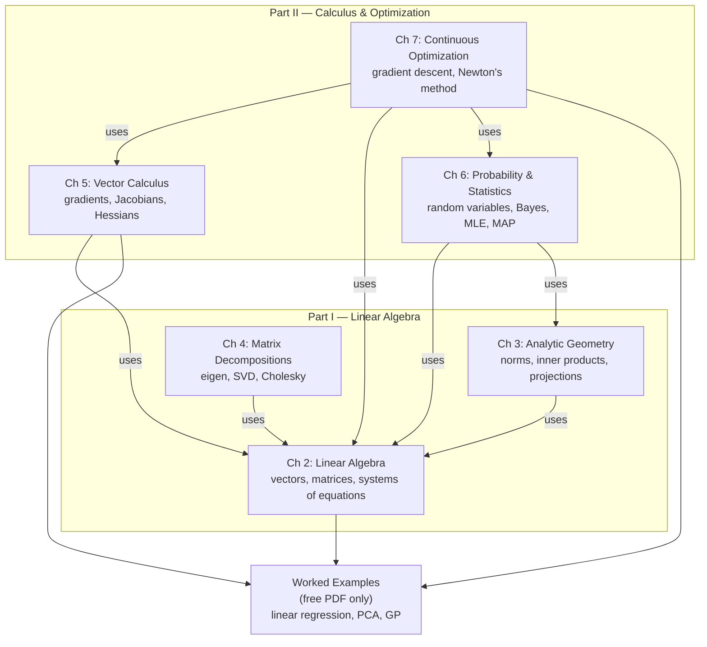
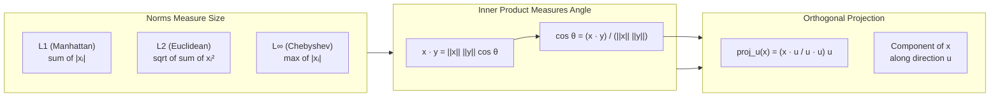
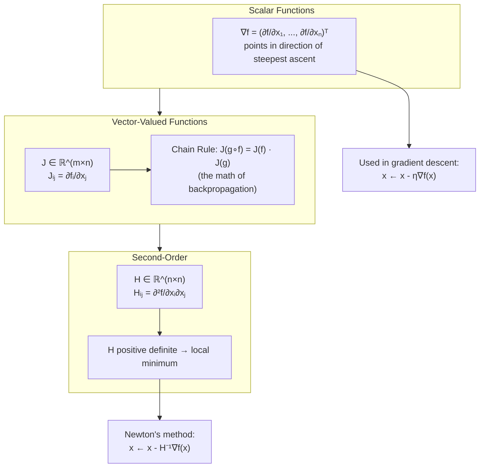

## The Structure of the Book

Before diving into the chapters, it helps to see how the four pillars
fit together. The book is organized so that each chapter builds on the
ones before it, and most ML algorithms can be read as a composition of
tools from multiple chapters.

The diagram shows that linear algebra is the foundation everything else
sits on. Probability, calculus, and optimization all reduce to operations
on vectors and matrices in the end. The worked-examples chapter (present
in the free PDF, omitted from the CUP edition for length) ties the
pieces together by deriving three ML algorithms — linear regression,
principal component analysis, and Gaussian process regression — using
only the tools developed in the earlier chapters.

---

## Chapter 2: Linear Algebra

Linear algebra is the language in which machine learning is written.
This chapter introduces the vocabulary: scalars, vectors, matrices, and
tensors, and the operations that act on them.

### Vectors as Data

A vector in ℝⁿ is an ordered n-tuple of real numbers. Geometrically, it
is a point or arrow in n-dimensional space. In ML, vectors encode
*examples*: a row of a feature matrix is a single data point, and the
columns are the features. A vector with one entry per pixel encodes an
image; a vector with one entry per token encodes a document.

The chapter develops vector operations: addition, scalar multiplication,
and the dot product. The dot product is the bridge to geometry — it
measures how aligned two vectors are. The outer product, by contrast,
builds a matrix from two vectors and underlies low-rank factorization.

### Matrices as Transformations

A matrix A ∈ ℝ^(m×n) represents a linear map from ℝⁿ to ℝᵐ. Matrix
multiplication composes maps: if A maps x to y and B maps y to z, then
BA maps x to z. This is why neural network layers are matrices — each
layer is a linear map, and stacking layers composes them.

The chapter covers matrix arithmetic, special matrices (identity,
diagonal, symmetric, orthogonal, positive definite), the transpose and
its geometric meaning (reflection across a coordinate axis), and the
determinant as a measure of volume change. Systems of linear equations
Ax = b are introduced and solved by Gaussian elimination, motivating
the more sophisticated decompositions of Chapter 4.

### Tensors

Tensors generalize matrices to higher dimensions. A 3-tensor can
represent a color image (height × width × channels), a video
(frames × height × width × channels), or a batch of feature maps in a
CNN. The book introduces tensors as multilinear maps and shows how
tensor reshaping underlies data preprocessing pipelines.

---

## Chapter 3: Analytic Geometry

Where linear algebra gives the algebra, analytic geometry gives the
geometry. This chapter makes the bridge from "we can multiply matrices"
to "we can see what matrix multiplication does in space."

### Norms

A norm measures the size of a vector. The book covers the three most
common: L¹ (sum of absolute values, robust to outliers), L² (Euclidean
distance, used everywhere in ML), and L∞ (maximum component, used in
worst-case analysis). Norms are the basis of regularization (L¹ for
sparsity, L² for small weights), loss functions (mean squared error is
the L² distance squared), and convergence analysis.

### Inner Products and Angles

The inner product generalizes the dot product to arbitrary vector
spaces. It is the foundation of similarity, projection, and
orthogonality. The angle between two vectors, defined via the inner
product, is the geometric measure of how aligned two feature vectors
are — used in cosine similarity for document retrieval and attention
mechanisms in transformers.

### Orthogonal Projections

Projecting a vector onto a subspace is the operation behind least
squares, linear regression, dimensionality reduction, and the normal
equations. The projection matrix P = A(AᵀA)⁻¹Aᵀ is the closest point
in the column space of A to any vector b — and the residual b - Pb is
orthogonal to the column space. This is the geometric content of least
squares.

### Rotations and Reflections

Orthogonal matrices preserve lengths and angles. They represent
rotations and reflections and are the building blocks of more complex
transformations. The book introduces rotations in 2D and 3D, then
generalizes to arbitrary orthogonal transformations as matrices Q
satisfying QᵀQ = I.

---

## Chapter 4: Matrix Decompositions

A matrix decomposition factors a matrix into a product of simpler
matrices. The choice of decomposition reveals the matrix's structure:
eigendecomposition exposes its principal axes, SVD exposes its
low-rank approximation, and Cholesky factors a positive definite matrix
for efficient solving.

### Eigenvalues and Eigenvectors

For a square matrix A, an eigenvector v satisfies Av = λv for some
scalar λ (the eigenvalue). Geometrically, the eigenvectors are the
directions along which A acts by pure scaling; the eigenvalues are the
scale factors. Eigendecomposition writes A = QΛQ⁻¹, where Q collects
the eigenvectors and Λ is diagonal with the eigenvalues.

In ML, eigendecomposition underlies:

- **PCA**: the principal components are the top eigenvectors of the
  data covariance matrix
- **Spectral clustering**: graph Laplacians are diagonalized to find
  clusters
- **Stability analysis**: eigenvalues of the Hessian diagnose whether
  a critical point is a minimum, maximum, or saddle
- **PageRank**: the dominant eigenvector of the link matrix gives web
  page rankings

### Singular Value Decomposition (SVD)

SVD factors any m×n matrix A as A = UΣVᵀ, where U and V are orthogonal
and Σ is a diagonal matrix of singular values. SVD is more general
than eigendecomposition (works on non-square matrices) and more
numerically stable.

The key fact: the top-k singular values and vectors give the best
rank-k approximation of A in the L² sense (Eckart–Young theorem).
This single theorem justifies:

- **Truncated SVD** for dimensionality reduction
- **Latent semantic analysis** in NLP
- **Collaborative filtering** in recommender systems
- **Image compression** via low-rank approximation

### Matrix Determinant Lemma and Friends

The book covers the practical identities used throughout ML: the matrix
determinant lemma, the matrix inversion lemma (Sherman–Morrison–
Woodbury), and the trace trick. These identities make low-rank updates
and gradient computations efficient. The Woodbury identity, in
particular, is the workhorse behind efficient Gaussian process
inference and many attention variants.

---

## Chapter 5: Vector Calculus

This chapter provides the calculus of vector-valued functions — the
language of gradients, Jacobians, and Hessians that makes
backpropagation derivable.

### Gradients

The gradient of a scalar function f : ℝⁿ → ℝ is the vector of partial
derivatives. The first fundamental theorem: the gradient points in the
direction of steepest ascent, and its magnitude is the rate of
increase. This is why gradient descent subtracts the gradient — to
follow the direction of steepest descent.

The chapter develops the partial derivative, the total derivative, and
the chain rule for scalar functions. The chain rule is then generalized
to higher dimensions.

### Jacobians

The Jacobian generalizes the gradient to vector-valued functions
f : ℝⁿ → ℝᵐ. It is an m×n matrix of partial derivatives. The
multivariate chain rule states that the Jacobian of a composition is
the product of the Jacobians — this is the mathematical statement of
backpropagation. The chapter derives this carefully and shows how it
applies to neural networks: forward pass computes the function and
stores intermediates; backward pass propagates Jacobians back through
the computation graph.

### Hessians

The Hessian is the matrix of second partial derivatives. It captures
the local curvature of a function and is the basis of second-order
optimization. For a critical point (where the gradient is zero), the
eigenvalues of the Hessian diagnose the nature of the point: all
positive → local minimum; all negative → local maximum; mixed signs →
saddle point. The Hessian is also used in Newton's method, in
Lagrangian mechanics, and in approximating the loss surface.

### Backpropagation, Formally

The chapter culminates in a formal derivation of backpropagation as an
application of the chain rule to the computational graph of a neural
network. The result: the gradient of the loss with respect to every
parameter is computable in a single backward sweep with the same
computational cost as the forward pass. This is the theorem that makes
deep learning practical.

---

## Chapter 6: Probability and Statistics

Real-world data is noisy. Real-world predictions are uncertain. This
chapter introduces the formal language of uncertainty: probability
spaces, random variables, and the statistical estimators that turn data
into model parameters.

### Probability Spaces and Random Variables

The book begins with the formal foundations: sample spaces, event
algebras, and probability measures. A random variable is a function
from the sample space to ℝ. The probability mass function (for
discrete variables) or probability density function (for continuous
variables) is the central object. The cumulative distribution function
collects all probabilities less than a threshold.

The key concept: probability is a *measure of belief*, not a frequency.
A Bayesian interprets P(A) as a degree of belief in event A, updated by
data via Bayes' rule. A frequentist interprets it as a long-run
frequency. The book is Bayesian-leaning, reflecting the ML community's
gradual shift toward probabilistic interpretations.

### Joint, Marginal, and Conditional Probability

For multiple random variables, the joint distribution P(X, Y) describes
their joint behavior. The marginal P(X) = ∑ᵧ P(X, y) integrates out
the other variable. The conditional P(X | Y) = P(X, Y) / P(Y) describes
X given knowledge of Y.

The chain rule of probability — P(X, Y) = P(X | Y) P(Y) — extends to
arbitrary numbers of variables and underlies probabilistic graphical
models.

### Bayes' Rule

The most important identity in probabilistic ML:

P(H | D) = P(D | H) P(H) / P(D)

It expresses the posterior probability of a hypothesis H given data D
in terms of the likelihood P(D | H), the prior P(H), and the evidence
P(D). The posterior is what we want to know; the likelihood and prior
are easier to specify. Bayes' rule is the foundation of:

- **Naive Bayes classifiers**
- **Bayesian linear and logistic regression**
- **Gaussian process regression**
- **Variational inference and VAEs**
- **Maximum a posteriori (MAP) estimation**

### Expectation, Variance, Covariance

The expectation E[X] is the average value of a random variable. The
variance Var(X) = E[(X - E[X])²] measures spread. The covariance
Cov(X, Y) measures joint variability; the correlation normalizes it to
[-1, 1]. The covariance matrix generalizes variance to vector-valued
random variables and underlies Gaussian distributions in high
dimensions.

### Estimators: MLE and MAP

Given data D, how do we choose parameters θ of a model? Maximum
likelihood estimation (MLE) chooses θ to maximize P(D | θ) — the
parameter values under which the observed data is most probable.
Maximum a posteriori (MAP) estimation maximizes P(θ | D) = P(D | θ)
P(θ) / P(D) — adding a prior over θ to regularize the estimate.

Both estimators have closed-form solutions in many simple cases. The
book derives them for the Gaussian and Bernoulli models and shows the
intimate connection between MLE, loss functions, and gradient descent:
minimizing the negative log-likelihood is equivalent to MLE, and
minimizing the regularized negative log-likelihood is equivalent to
MAP.

---

## Chapter 7: Continuous Optimization

Optimization is the engine of learning: training a model means solving
an optimization problem. This chapter covers the algorithms that make
high-dimensional optimization tractable.

### Gradient Descent

The simplest iterative optimization algorithm. Given a differentiable
loss f and parameters θ, update θ ← θ - η ∇_θ f(θ) for a learning rate
η > 0. The negative gradient is the direction of steepest descent;
small steps in that direction decrease the loss.

The book analyzes convergence: for convex f with Lipschitz gradient,
gradient descent converges at rate O(1/k) where k is the iteration
count. The step size is critical: too small and convergence is slow,
too large and the iterates diverge. The book covers backtracking line
search and the theoretical guarantees of various step size schedules.

### Stochastic Gradient Descent (SGD)

Computing the gradient over the full dataset is expensive at scale.
SGD approximates it with a single example (or a mini-batch) at each
step. The gradient is noisy but unbiased, and the noise can actually
help escape shallow local minima. SGD is the workhorse of deep learning
optimization.

Variants covered:

- **Momentum**: smooth the gradient direction using a moving average
- **Nesterov accelerated gradient**: look ahead before computing the
  gradient
- **AdaGrad**: adapt the step size per parameter based on historical
  gradient magnitudes
- **RMSProp and Adam**: combine momentum and per-parameter step sizes
  for robust deep learning optimization

### Newton's Method

A second-order method that uses the Hessian to scale the gradient
direction. The update is θ ← θ - H⁻¹ ∇f(θ). The Hessian inverse acts
as a preconditioner, automatically rescaling the gradient to account
for local curvature. Newton's method converges much faster than
gradient descent near the minimum (quadratic convergence) but requires
inverting the Hessian — O(n³) per step for n parameters. This is
intractable for deep networks but practical for moderate-dimensional
problems.

### Constrained Optimization

Many ML problems include constraints: weights must be non-negative,
parameters must lie on a simplex, or models must satisfy fairness
constraints. The chapter introduces:

- **Lagrange multipliers** for equality constraints
- **KKT conditions** for inequality constraints
- **Projected gradient descent** for box constraints
- **Interior point methods** for general constraints

The convex optimization section distinguishes convex problems (unique
global minimum, polynomial-time algorithms) from non-convex ones (local
minima, NP-hard in general). Most of deep learning is non-convex, but
many practical problems are "convex enough" that good local minima
suffice.

---

## Worked Examples (Free PDF Only)

The freely available PDF on `mml-book.github.io` includes a worked
examples chapter that derives three canonical ML algorithms using only
the tools from the previous chapters:

| Algorithm | Linear Algebra | Calculus | Probability | Optimization |
|-----------|----------------|----------|-------------|--------------|
| Linear regression | Normal equations | Gradient of MSE | MLE under Gaussian | Closed-form via Cholesky |
| Principal component analysis | Eigendecomposition of covariance | Maximize variance | — | Constrained optimization |
| Gaussian process regression | Kernel trick | Gradient of marginal likelihood | Bayesian posterior | Marginal likelihood optimization |

These examples are the payoff. After the abstract chapters, the worked
examples show how the pieces compose into real algorithms. The
algorithms are not ML applications dropped in for relevance — they are
chosen because they are the simplest, cleanest illustrations of the
mathematical toolkit in action.

---

## Key Lessons

- **Math is not optional.** Modern ML papers assume fluency in linear
  algebra, calculus, probability, and optimization. This book is the
  fastest way to acquire that fluency from first principles.

- **The four pillars are deeply connected.** Linear regression is
  simultaneously a linear algebra problem (solving Ax = b), a
  calculus problem (minimizing a loss), a probability problem (MLE
  under Gaussian noise), and an optimization problem (gradient descent
  or Newton's method). The book's chapter structure makes these
  connections explicit.

- **Convex problems are tractable; non-convex problems require care.**
  The book teaches the theory that separates these regimes and the
  algorithms best suited to each.

- **The book's application-free style is a feature, not a bug.** The
  math must be understood on its own terms before it can be applied
  with understanding. The worked examples chapter shows the payoff.

- **Notation is consistent with the ML literature.** The book uses
  lowercase bold for vectors, uppercase bold for matrices, and the
  indexing conventions that ML papers use. This is the bridge from
  undergraduate math to graduate ML.

---

## Practical Applications

### For ML Engineers

Use this book to fill the gaps that tutorials leave. When you read
"the gradient of the loss is backpropagated" in a paper, the calculus
chapter tells you what that means. When you read "PCA is the top
eigenvectors of the covariance matrix," the linear algebra chapter
tells you what that means.

### For ML Researchers

The book provides the derivations behind every algorithm in your
toolkit. When you propose a new model, the optimization chapter tells
you how to analyze its convergence. When you propose a probabilistic
extension, the probability chapter tells you how to compute the
posterior.

### For ML Educators

The book is structured as a one-semester course with exercises. The
notation is consistent, the examples are motivated, and the
application chapter is optional. The book is designed to be taught
from, not just read.

### For Self-Taught Engineers

The book is the most efficient path from "I can fit a model" to "I
understand why the model works." It is more rigorous than a typical
blog series and more applied than a typical math textbook.
