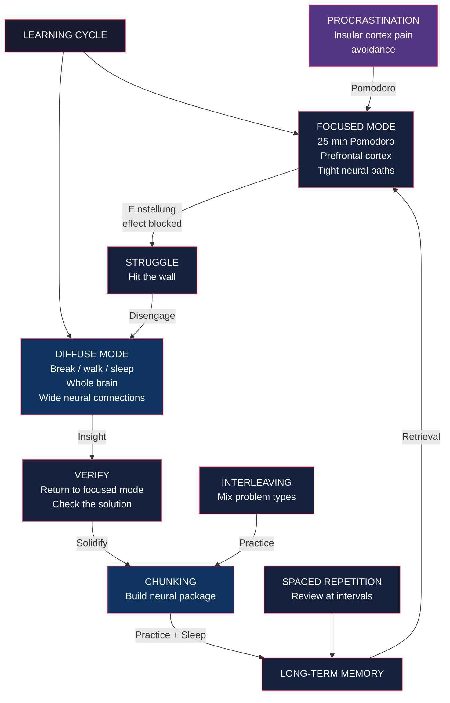

# Core Concepts

## Focused Mode and Diffuse Mode

Your brain operates in two fundamentally distinct modes, and it can only be in one at a time.

**Focused mode** engages the prefrontal cortex. Neural signals travel along tight, well-worn pathways — like a pinball machine with bumpers packed close together. Thoughts bounce in a concentrated zone, making this mode ideal for logical, sequential, analytical processing. It is what you use when solving a problem type you already know, applying familiar techniques, or following a recipe.

**Diffuse mode** is not localized to any single brain region. Neural signals travel along loose, far-flung pathways — a pinball machine with bumpers spread wide apart. Thoughts range across disparate areas, enabling big-picture connections and novel insights. The diffuse mode is active when you relax, walk, shower, daydream, or sleep. Crucially, you cannot consciously *force* diffuse-mode thinking; it arises naturally when you disengage from focused attention.

### The Einstellung Effect

This is the cost of staying in focused mode too long. German for "mindset" or "attitude," Einstellung describes the phenomenon where your initial approach to a problem blocks you from seeing a better solution. Your focused mind fixates on a familiar neural pathway, and you cannot see the answer even when it is in plain sight. Bilalic et al. (2008) demonstrated this in chess experts — grandmasters fixated on a known pattern and overlooked a clearly superior move.

The only reliable escape from Einstellung is to disengage and let diffuse mode reset the search.

### Alternating Modes

The learning process follows a rhythm: focus → struggle → disengage → insight → verify. You first funnel a problem into your brain through focused attention. When you hit a wall, you step away. During diffuse mode, your brain continues subconsciously pinging different areas. When you return, the solution often appears obvious.

Oakley uses the metaphor of a variable-focus flashlight: focused mode is a narrow, intense beam; diffuse mode is a wide floodlight. You need both to navigate. Thomas Edison and Salvador Dali used deliberate tricks to access diffuse mode — Edison would nap holding ball bearings that clattered when he relaxed, waking him just as his mind entered a creative state.

### Key Diffuse-Mode Activators

| Activity | Why It Works |
|----------|-------------|
| Sleep | Consolidates memories; processes problems subconsciously all night |
| Walking | Gentle physical activity shifts neural activation patterns |
| Shower/Bath | Relaxed, distraction-free environment allows mind-wandering |
| Exercise | Increases blood flow; shifts brain state |
| Music (no lyrics) | Occupies enough attention to disengage focused mode |
| Napping | Brief entry into diffuse state can unlock stuck problems |

---

## Chunking

A chunk is a compact neural package — a bundle of information that your brain stores and retrieves as a single unit. When you first learn to drive, every action (steering, braking, signaling) demands conscious attention in working memory. After practice, "driving" becomes a single chunk that executes automatically, freeing your working memory for navigation and conversation.

In math and science, chunks are mini-tools: a solution pattern, a formula with its usage context, a concept like "derivative" or "force = mass × acceleration." A well-formed chunk contains not just the procedure but also the conditions for its use.

### The Three-Step Chunking Process

**Step 1 — Focused Attention.** You cannot form a chunk while multitasking. The brain needs undivided attention to create the initial neural pattern. Turn off notifications, close unrelated tabs, and concentrate on the specific concept or problem.

**Step 2 — Understanding.** You must grasp the basic idea before the chunk can form. Understanding acts as superglue, binding the neural traces together. Without understanding, you may memorize a procedure, but the chunk will be brittle — unable to connect with related concepts or adapt to new problems.

**Step 3 — Context.** This is the most overlooked step. You need to know not just *how* to use a chunk but *when* to use it (and when not to). Context comes from practicing with related and unrelated problems — seeing the same concept in different settings builds the recognition triggers that make the chunk retrievable when needed.

### Bottom-Up and Top-Down

Chunking involves two complementary processes:

- **Bottom-up**: Practice and repetition strengthen each chunk so it can be accessed automatically. This is the "drill" phase.
- **Top-down**: Understanding the big picture — where each chunk fits in the larger framework. This prevents you from having a toolbox but no sense of which tool to use.

Context is where bottom-up and top-down meet.

### The Illusion of Competence

Oakley's most practical warning: passive rereading and glancing at solutions create a powerful illusion of knowing. You mistake familiarity with understanding. The solution feels obvious *after you have seen it*, so you believe you could reproduce it. You cannot.

The cure is active recall. Close the book. Attempt the problem from memory. Only then check your work. The retrieval attempt — even if it fails — strengthens the neural pathways far more than another passive pass.

---

## Procrastination

### The Neurological Mechanism

When you contemplate a task you dislike, your brain's insular cortex activates — the same region that processes physical pain. Your brain, seeking relief, redirects your attention to something pleasant (social media, email, snacks). This is not weakness; it is a hardwired pain-avoidance response.

The critical finding from neuroimaging studies (mathphobes' pain centers lit up merely *anticipating* math): the pain disappears within minutes of starting the task. It is the anticipation that hurts, not the work.

### The Habit Loop

Procrastination is a habit with four components:

1. **Cue**: The trigger that launches the habit (e.g., seeing your textbook).
2. **Routine**: The habitual response (you open social media instead).
3. **Reward**: The relief from the anticipated pain (dopamine hit from scrolling).
4. **Belief**: The underlying conviction that sustains the habit (e.g., "I need this break to function").

To change the habit, you keep the cue and reward the same but change the routine.

### Process vs. Product

Oakley's key insight for restructuring the routine: focus on *process*, not *product*. Process means "I will work for 25 minutes." Product means "I will finish this assignment." Process is controllable and small; product is open-ended and anxiety-inducing. The habitual part of your brain loves process because it can march mindlessly along.

### The Pomodoro Technique

The primary tool for beating procrastination:

1. Set a timer for 25 minutes
2. Work with full focus until it rings (no interruptions)
3. Take a 5-minute break (this activates diffuse mode)
4. Reward yourself (the break is the reward)
5. Repeat

The Pomodoro works because it converts an overwhelming task ("learn calculus") into a bounded, low-stakes action ("focus for 25 minutes"). The commitment is small enough that the insular cortex does not trigger.

---

## ZIP Mindset

ZIP stands for "Zone of Intellectual Proximity." The concept: learning happens most efficiently when you work on material that is adjacent to what you already know — close enough to connect, but far enough to stretch.

Oakley contrasts this with two common failure modes:

- **Too easy**: Material within your comfort zone produces no growth.
- **Too hard**: Material far beyond your current level causes cognitive overload and activates the pain response that drives procrastination.

The ZIP mindset means learning to recognize when you are in each zone and adjusting accordingly. If you are stuck for more than a few minutes on a problem, you may need to backfill prerequisite knowledge (your ZIP shifted). If you are breezing through, you need harder material.

---

## Working Memory and Long-Term Memory

**Working memory** is the part of memory that holds information you are actively processing. Think of it as a mental blackboard. It is severely limited — current research suggests approximately 4 slots (not the 7 from older models). When working memory is full, new information displaces old.

**Long-term memory** is like a vast warehouse. Once information is stored here, it does not need to be actively held in mind. The challenge is getting it in and retrieving it efficiently.

Chunking is the bridge between the two. When you chunk a concept, its details move from working memory to long-term memory. The chunk occupies only one slot in working memory (the "handle"), freeing the other slots for new information.

Sleep is when memory consolidation happens. During sleep, your brain replays and strengthens the neural patterns from the day, transferring them from temporary (hippocampal) storage to more permanent (cortical) storage. Sleep deprivation directly impairs this process, cutting learning capacity significantly.

---

## Spaced Repetition

Cramming (massed practice) produces short-term familiarity but rapid forgetting. Ebbinghaus's forgetting curve: without review, you lose ~70% of new information within 24 hours.

Spaced repetition counters this by reviewing material at increasing intervals — 1 day, 3 days, 1 week, 1 month, 3 months. Each review resets the forgetting curve and strengthens the neural trace. The technique is grounded in the spacing effect, one of the most robust findings in cognitive psychology.

Practical implementation: flashcards (physical or digital like Anki), self-testing on past material before starting new material, and the book's own structure (concepts reappear across chapters).

---

## Interleaving

Blocked practice — doing 20 problems of the same type in a row — feels productive but produces brittle learning. You know *how* to solve the problem because you know *which* technique the current block is practicing.

Interleaving: mixing different problem types within a single practice session. It feels harder and more confusing — this is desirable difficulty. But it forces your brain to choose the correct technique for each problem, which is exactly the skill you need on a real test. Studies show interleaving improves test scores by roughly 43% over blocked practice.

---

## Metaphors and Analogies

Metaphors are not just decorative — they are a core learning mechanism. When you compare a new concept to something familiar, your brain piggybacks new neural patterns onto existing ones. Oakley uses the pinball machine metaphor for focused/diffuse modes, the octopus for working memory, and zombie habits for automatic routines.

The advice: generate your own metaphors. If you can explain a concept using a vivid analogy, you understand it. If you cannot, the chunk is not yet solid.

---

## Deliberate Practice

Oakley draws on Ericsson's research: expertise comes not from innate talent but from thousands of hours of focused, effortful practice on the hardest aspects of a skill. For math and science, this means:

- Work problems that are at the edge of your ability
- Identify the specific step where you get stuck
- Drill that step in isolation
- Get feedback (from answer keys, peers, or instructors)
- Repeat

Deliberate practice is uncomfortable by design. If it feels easy, you are not in the learning zone.

---

# Frameworks

---

# Mental Models

| Model | Application |
|-------|-------------|
| **Pinball Machine** | Focused mode = close bumpers, tight paths. Diffuse mode = wide bumpers, distant connections. Switch between them. |
| **Attentional Octopus** | Working memory has 4 arms. Each chunk frees one arm. Multitasking tangles them. |
| **Zombie Habits** | Habits are automatic programs. Change the routine, keep the cue and reward. |
| **Einstellung Effect** | Your initial approach blocks better solutions. Step away to escape. |
| **Forgetting Curve** | Memory decays exponentially. Spaced repetition resets the curve. |
| **Desirable Difficulty** | If it feels hard, you are learning. Interleaving and retrieval feel harder and work better. |
| **Process vs. Product** | Process is controllable (25 min of work). Product is not (finishing the assignment). Choose process. |

---

# Key Lessons

1. **Math ability is not fixed.** Oakley's personal transformation — from flunking algebra to earning a PhD in systems engineering — proves that the brain can be retooled.
2. **Passive learning is an illusion.** Rereading, highlighting, and glancing at solutions create confidence without competence. Only active recall builds durable knowledge.
3. **The hardest part of learning is starting.** The pain of anticipation vanishes within minutes. The Pomodoro Technique exploits this.
4. **You need both modes.** Pure focused effort leads to Einstellung. Pure diffuse mode produces vague intuitions. The alternation is where mastery lives.
5. **Sleep is not optional.** It is when your brain consolidates chunks and processes problems. Sleep deprivation is the enemy of learning.
6. **Context matters as much as procedure.** Knowing *how* to solve a problem is useless if you do not know *when* to apply that technique.
7. **Multitasking prevents chunk formation.** Every switch pulls your brain away before neural connections can firm up. Single-task.

---

# Practical Applications

**Studying for an exam**: Use the Pomodoro Technique for focused sessions. After each session, do active recall (close the book, write what you remember). At the end of the day, interleave problem types from different chapters. Before bed, review the hardest concepts. In the morning, do a free recall brain dump. Repeat at increasing intervals.

**Learning a new math concept**: Step 1: Focused attention on the definition and a worked example. Step 2: Attempt a similar problem from scratch (no peeking). Step 3: Check your work and identify where you went wrong. Step 4: Take a walk or do something else for 10+ minutes. Step 5: Return and try a different variation. Step 6: Sleep on it. Step 7: Recall the next day without looking at notes.

**Overcoming math anxiety**: The anxiety is anticipation of pain that will vanish once you start. Set a 5-minute timer and commit to working for only 5 minutes. Usually, progress builds momentum and you continue. If not, you have lost only 5 minutes.

**Building a chunk library**: For each new concept, write a flashcard with the concept on one side and (a) the definition, (b) a concrete example, (c) conditions for use, and (d) a counterexample on the other. Review using spaced repetition. Add the concept to a mind map showing its connections to related ideas.

**Kicking the procrastination habit**: Identify the cue (e.g., sitting at your desk at 7 PM). Change the routine (open your notebook and set a Pomodoro timer before you can reach for your phone). Keep the reward (the 5-minute break after the timer). Reframe the belief ("I can focus for 25 minutes — that is not painful").

---

# Examples

**Barbara Oakley herself**: Flunked math and science, worked as a Russian translator in the Army, earned a BA in Slavic languages, then retrained in engineering in her mid-20s. She went from struggling with algebra to earning a PhD in systems engineering and becoming a professor.

**Thomas Edison**: Used deliberate naps to access diffuse mode. He would hold ball bearings in his hand while relaxing in a chair — just as he fell asleep, his grip loosened, and the clatter woke him, capturing the creative insights from the hypnagogic state.

**Salvador Dali**: Similar technique — held a key over a plate while relaxing. When sleep onset caused him to drop it, the clang woke him into the diffuse state where surrealist ideas flowed.

**Ramon y Cajal**: Father of modern neuroscience, quoted by Oakley: "Deficiencies of innate ability may be compensated for through persistent hard work and concentration. One might say that work substitutes for talent, or better yet that it creates talent."

**The M&A analyst**: Oakley recounts a student who learned to excel at complex financial modeling by alternating focused study sessions with walks and gym time. His diffuse-mode insights during exercise helped him connect accounting principles to real business problems.

---

# Action Plan

1. **Pick one difficult subject** you want to improve in (math, science, a new language, music theory)
2. **Commit to 25-minute Pomodoro sessions** — 3 to 4 per day, separated by 5-minute breaks
3. **Replace passive rereading with active recall** — after reading a section, close the book and write or say everything you remember
4. **Build at least one chunk per study session** — identify the core concept, understand it, practice it, and learn when to use it
5. **Interleave problem types** — never practice the same type for more than 3 problems in a row
6. **Set up a spaced repetition system** — use Anki or a simple notebook; review material at 1 day, 3 days, 1 week, 1 month
7. **Prioritize sleep** — aim for 7-9 hours; review difficult material just before bed
8. **Use the process mindset** — focus on "I will spend 25 minutes working" rather than "I must finish this chapter"
9. **Identify one procrastination cue** — and design a new routine that triggers work instead of avoidance
10. **Generate a metaphor for each new concept** — if you can explain it in familiar terms, it is chunked
