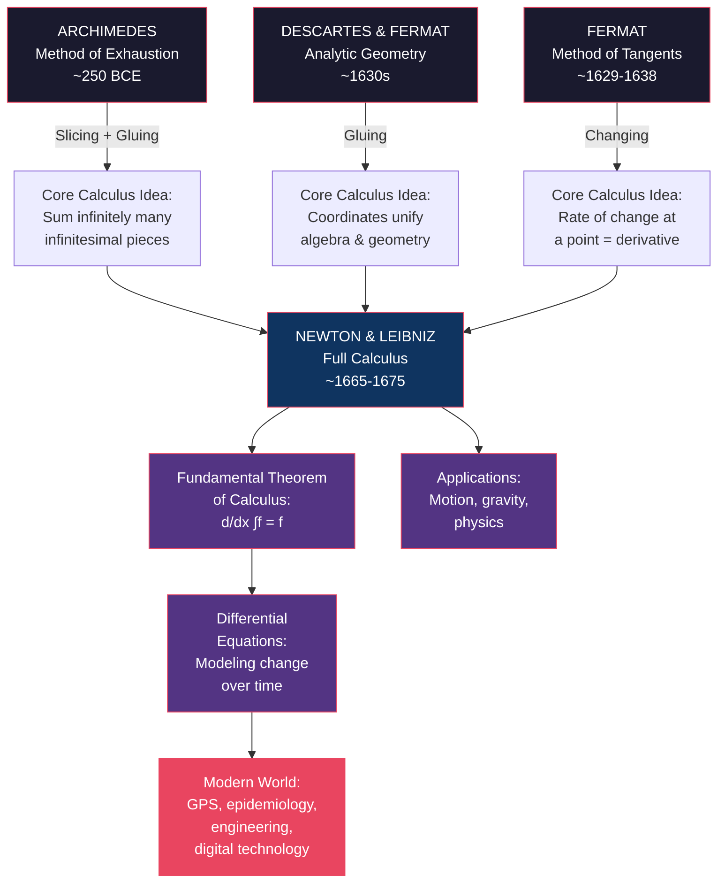
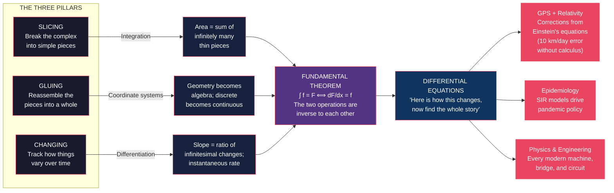

# Core Concepts — Infinite Powers

## 1. The Method of Exhaustion — Archimedes Slices Infinity

Before calculus had a name, Archimedes was doing it. In the 3rd century BCE, the Greek mathematician working in Syracuse faced a problem: how do you calculate the area of a shape with a curved boundary when your only tools are straightedge and compass, and your philosophy forbids treating infinity as a real thing?

**The method of exhaustion**: Archimedes would inscribe a polygon inside the curve (giving a lower bound) and circumscribe a polygon outside the curve (giving an upper bound). Then he would double the number of sides of both polygons. As the sides got thinner, the bounds converged — the area was *exhausted* between them. With 96-sided polygons, he calculated pi to between 3 1/7 and 3 10/71 — correct to two decimal places.

**The Calculus Pillar: Slicing + Gluing**. Archimedes was performing integration, 1,800 years before Newton. He sliced a curved region into infinitely many thin rectangles and added them up. The only thing he lacked was a notation for infinity and a formal concept of limit.

**Real-world applications**: 
- Calculating the area under a curve (the original problem — "squaring the circle")
- Approximating pi with arbitrary precision
- Estimating the volume of a sphere and a cylinder
- Engineering problems requiring area or volume approximations where exact formulas don't exist

**Example**: To find the area under a parabola y = x² from x=0 to x=1, Archimedes would construct inscribed and circumscribed rectangles, double their count, and show the true area sits between two bounds that both approach 1/3. His geometric proof is identical in structure to a modern Riemann sum converging to the integral ∫₀¹ x² dx = 1/3.

**Key insight**: Archimedes had the right idea but the wrong tools. His approach was conceptually identical to integral calculus — the only missing ingredient was a language to express "infinitely many, infinitely thin." That language, and the notation to write it compactly, would take another 18 centuries to arrive.

---

## 2. Analytic Geometry — The Marriage of Algebra and Geometry

In the early 17th century, two men — working independently, on different continents — had the same revolutionary idea: **put numbers on geometry**.

**René Descartes** (France) created coordinate geometry. Place a grid over the plane. Every point has (x, y) coordinates. Every geometric curve — a circle, a parabola, a spiral — becomes an algebraic equation. A circle: x² + y² = r². A line: y = mx + b. With this single move, geometry became a branch of algebra.

**Pierre de Fermat** (France, working in Toulouse) independently developed the same system. Fermat went further: he used coordinates to find the tangents to curves and to locate maximum and minimum points — what we now call differentiation. His manuscript, circulated privately around 1629, contains methods that are mathematically indistinguishable from the derivative.

**The Calculus Pillar: Gluing**. Analytic geometry glues together two previously separate domains — number and shape — creating a new unified framework that made calculus possible. Without coordinates, there is no way to describe "the slope of a curve at a point" with precision.

**Real-world applications**:
- Computer graphics: every point on a rendered 3D surface has (x, y, z) coordinates
- Navigation: GPS uses coordinate systems derived from Descartes' plan
- Robotics: joint positions are described as coordinate transformations
- Economics: supply and demand curves plotted as functions on axes
- Engineering: every CAD program is a direct descendant of analytic geometry

**Example**: Fermat's method for finding the maximum height of a projectile. A cannonball follows a parabolic trajectory. Fermat would write the height as a function of horizontal distance and find where its slope equals zero. The same calculation yields the range of a projectile in a physics textbook today — and Fermat invented it around 1630.

**Key insight**: The deep move was abstraction. By converting geometry to algebra, Descartes and Fermat made shape amenable to calculation. Computation replaced construction. The protractor was replaced by the equation.

---

## 3. The Method of Tangents — Fermat and the Birth of the Derivative

Fermat's most direct contribution to calculus is what he called his *method for finding maximum and minimum values*, published in aprivate letter in 1638 and circulated among the mathematical cognoscenti of Europe.

**How it works**: To find the highest point of a curve, Fermat would add a small quantity E to the input variable, evaluate the function, then set the difference to zero and cancel terms. Sound familiar? Cancel terms and you get: **df/dx = 0 at the maximum**. That is exactly the modern definition of a critical point — found with algebraic reasoning 30 years before Newton was born.

**The method of tangents**: Fermat applied the same logic to finding the slope of a tangent line to a curve at any point. By taking the ratio of the change in y to the change in x as the change in x gets smaller and smaller, Fermat was computing a derivative — without the notation, without the formal concept, but with the correct result.

**The Calculus Pillar: Changing**. Fermat focused on how quantities vary with one another — the local rate of change. This is the differential calculus in embryonic form: finding the slope, finding the extremum, finding how a small change in one quantity drives a small change in another.

**Real-world applications**:
- Optimization: finding maximum profit, minimum cost, optimal dimensions — all use the derivative = 0 condition Fermat discovered
- Physics: identifying equilibrium points in mechanical systems
- Machine learning: gradient descent, the algorithm underpinning deep learning, is Fermat's method generalized to high dimensions
- Economics: marginal analysis — finding where additional units of input no longer add value

**Example**: A box with a square base and open top must hold 1000 cm³. What dimensions minimize the surface area (and thus the material cost)? Fermat's method: write A as a function of one side length s, take dA/ds, set it to zero, solve. The answer: base 10 cm × 10 cm, height 5 cm. A 17th-century problem, still in every calculus textbook today.

**Key insight**: Fermat did not just approximate slopes — he found a systematic method that always gave the exact answer. His private circulation of these methods created the intellectual foundation that Newton and Leibniz would stand on two decades later.

---

---

## 4. Newton and Leibniz — The Calculus Breakthrough

The mid-17th century saw two men, working independently in completely different intellectual and political environments, arrive at the same breakthrough within a decade of each other.

**Isaac Newton** (England, ~1665–1666): While Cambridge was closed due to the plague, the 22-year-old Newton sat at his mother's farm in Woolsthorpe and, in roughly 18 months, invented:
- The calculus (fluxions): he described quantities as flowing and their rates as fluxions
- The binomial theorem for fractional exponents
- The inverse relationship between tangents and quadratures (areas)
- His theory of colors (using a prism)
- The foundations of his theory of gravitation

Newton did not publish his calculus. He circulated it privately among a small circle, notably in a 1669 manuscript called *De Analysi*. His thinking was geometric and physical — he invented the calculus to solve physics problems.

**Gottfried Wilhelm Leibniz** (Germany, ~1673–1676): A philosopher, diplomat, and mathematician, Leibniz approached the problem from a different angle. He developed a clear notation (∫ for integral, d for differential) and systematized the rules of differentiation and integration. His 1684 paper *Nova Methodus* was the first published account of the calculus — and it used the notation we still use today.

**The Calculus Pillars: All three**. Both men deployed slicing, gluing, and changing in their work. Newton applied them to physics; Leibniz formalized them as abstract operations with rules.

**The priority dispute**: Newton's supporters accused Leibniz of plagiarism. Modern historians largely agree: neither stole from the other. Newton had the ideas earlier; Leibniz published first with better notation. The dispute turned into a nationalistic feud that harmed both Continental and English mathematics for a generation — English mathematicians, loyal to Newton's geometric approach, largely missed the development of analysis on the Continent for 50 years.

**Key insight**: The dispute was a human tragedy that obscured a collective achievement. The calculus was in the air — the intellectual readiness of Europe in the 17th century made discovery inevitable. Newton and Leibniz were the ones who grasped it, but they stood on the shoulders of Fermat, Descartes, Barrow, Kepler, and Cavalieri.

---

## 5. The Fundamental Theorem of Calculus — The Bridge

The Fundamental Theorem of Calculus is arguably the most important theorem in all of mathematics. It states, in essence: **the operation of summing infinitesimal changes and the operation of finding the instantaneous rate of change are the same operation, viewed from opposite directions.**

Formally: If F is an antiderivative of f, then ∫ₐᵇ f(x) dx = F(b) − F(a). Or in differential form: d/dx ∫ₐˣ f(t) dt = f(x).

**What this means in practice**: Computing the area under a complex curve — which before calculus required exhausting methods like Archimedes's — can now be done in two steps: (1) find the antiderivative, (2) evaluate at the endpoints. The infinite sum collapses to a simple subtraction.

**The Calculus Pillars: Slicing + Changing (the bridge) + Gluing**. The theorem glues together the "slicing" operation (integration as summing infinitesimal parts) and the "changing" operation (differentiation as finding the instantaneous rate), showing they are inverses.

**Real-world applications**:
- Physics: position is the integral of velocity; velocity is the derivative of position
- Economics: consumer surplus is an integral; marginal cost is a derivative
- Engineering: work done by a varying force is an integral; power is a derivative
- Statistics: cumulative distribution functions are integrals; probability density functions are their derivatives

**Example**: A car's velocity at time t is v(t) = 60 − t² (km/h). How far does it travel in the first 4 hours? Before the FTC, you might approximate by summing speed × time over many small intervals. With the FTC: ∫₀⁴ (60 − t²) dt = [60t − t³/3]₀⁴ = 240 − 64/3 ≈ 218.7 km. One antiderivative, two evaluations, exact answer.

**Key insight**: The FTC transforms calculus from a technique of approximation (Archimedes's method) into a technique of exact calculation. The "trick" — finding that the slope of the accumulated area curve equals the height of the original function — is profound and non-obvious. Newton and Leibniz both found it independently. This is the heart of the calculus.

---

## 6. Differential Equations — Calculus as the Language of Change

A differential equation is an equation that relates a quantity to its rate of change. It says, in effect: "here is how this thing changes, now tell me what the thing looks like over time."

**Why differential equations are calculus's most powerful application**: They are the universal format for describing dynamical systems — any system where quantities evolve continuously according to rules. Every physical law expressed as a calculus statement becomes a differential equation: Newton's law F = ma becomes m d²x/dt² = F; the heat equation describes how temperature diffuses; Maxwell's equations describe how electromagnetic fields propagate.

**The calculus pillar: Changing**. Differential equations are the purest expression of the "changing" pillar. They describe the world as a process of ongoing transformation — ecosystems, economies, populations, epidemics, weather, the universe itself.

**Real-world applications**:
- **Epidemiology**: The SIR model (Susceptible → Infected → Recovered) is a system of differential equations that models epidemic spread. Applied to COVID-19 in 2020, it shaped every country's policy response
- **Population biology**: The logistic equation dP/dt = rP(1 − P/K) describes how populations grow and stabilize
- **Heartbeats**: The FitzHugh-Naguro equations model the electrical dynamics of cardiac cells
- **Fluid dynamics**: The Navier-Stokes equations, a system of nonlinear PDEs, describe every fluid flow from blood through capillaries to air over an airplane wing
- **Quantum mechanics**: The Schrödinger equation is the foundational differential equation of quantum theory

**Example**: A simple population model. Rabbits on an island reproduce at a rate proportional to their number: dP/dt = rP. The solution: P(t) = P₀e^(rt), exponential growth. In reality, resources limit growth: dP/dt = rP(1 − P/K). Now the solution is a logistic curve that grows exponentially at first and levels off at the carrying capacity K. A 200-year-old equation, still used today to model COVID-19 spread curves.

**Key insight**: A differential equation encodes intuition about change as a precise mathematical statement. Solving it — finding the explicit function that satisfies it — reveals the long-term behavior of the system. The calculus makes the invisible dynamics of continuous change both visible and computable.

---

## 7. Infinity and the Rigorous Foundation of Calculus

The original calculus of Newton and Leibniz worked. It produced correct answers to physics problems, enabled the design of bridges and engines, and launched the Industrial Revolution. But it rested on a logical flaw: **what exactly is an infinitesimal?**

Newton would write of "evanescent increments" — quantities that are neither zero nor nonzero, growing or diminishing to nothing. Leibniz wrote of "differences that are smaller than any given quantity." Both men used these ideas effectively without being able to define what they meant in a mathematically rigorous way.

**The crisis**: By the late 17th century, the calculus worked so well that the logical problem was ignored. But philosophers — notably Bishop Berkeley in *The Analyst* (1734) — attacked it: "the ghost of departed quantities," he called infinitesimals. Mathematicians who could calculate planetary orbits could not explain what their own symbols meant.

**The solution (1820s)**: Augustin-Louis Cauchy and Karl Weierstrass in Germany replaced the intuitive infinitesimal with the rigorous **epsilon-delta definition of a limit**. Instead of saying "dx is infinitely small," they said: for any desired precision ε, there exists a δ such that when |x − a| < δ, then |f(x) − L| < ε. The infinite is banished from the definition. Computation replaces intuition.

**The Calculus Pillars: Gluing (foundations)**. The rigorous foundation process is a gluing operation: taking thousands of years of productive but logically loose mathematical practice and assembling a formally coherent structure from the ground up.

**Real-world applications**:
- Every proof in engineering mathematics rests on limit-based rigor
- Numerical analysis (the theory behind how computers calculate derivatives and integrals) requires ε-δ precision
- Functional analysis and measure theory — the foundations of quantum mechanics — descend from the same 19th-century rigorization
- Computer verification of mathematical proofs uses the same formal framework

**Example**: The derivative of x² is 2x. In Newton's language: the evanescent increment of x² is 2x times the evanescent increment of x. In Cauchy/Weierstrass: lim_{h→0} [(x+h)² − x²]/h = lim_{h→0} [2xh + h²]/h = lim_{h→0} [2x + h] = 2x. Every step has a logical justification. No ghosts.

**Key insight**: The story of calculus's foundations is, in miniature, the story of mathematics' maturation from craft to science. The calculus worked before it was understood. Practice drove theory, not the reverse. Understanding why it works — giving it solid logical foundations — required 150 years of additional work after Newton's breakthrough.

---

## 8. Calculus and the Modern World — GPS, Epidemiology, and More

Strogatz's closing chapters make the case that calculus is not a relic of the Scientific Revolution — it is the silent infrastructure of the 21st century. The GPS in your pocket, the epidemiology models that shaped pandemic response, the AI systems optimizing data centers, all depend on calculus.

**GPS and General Relativity**: The Global Positioning System requires 24+ satellites in medium Earth orbit. Each satellite carries an atomic clock. Because the satellites are higher in Earth's gravitational field, their clocks run faster than ground clocks (general relativity predicts stronger gravitational fields slow time). In orbit, this effect makes satellite clocks run roughly 45 microseconds faster per day. Special relativity (satellites moving at ~14,000 km/h) slows them by about 7 microseconds per day. Net: 38 microseconds faster per day. Without correction, this accumulates to a position error of approximately 10 km per day. The correction is computed using the Einstein field equations — a set of differential equations derived from the calculus.

**Epidemiology and Differential Equations**: The SIR model — Susceptible, Infected, Recovered — is a system of three coupled differential equations. It models how a disease moves through a population. Applied to COVID-19 in early 2020, these centuries-old equations informed every country's lockdown and vaccination policy. The parameters (infection rate, recovery rate) were estimated from data, but the structure of the model comes entirely from calculus.

**Fluid Dynamics**: The Navier-Stokes equations, developed in the 1840s, describe how fluids move. They remain unsolved in their most general form — one of the Clay Mathematics Institute's seven Millennium Prize Problems, with a $1 million prize for a complete solution. Yet engineers use approximate solutions to design aerodynamic vehicles, model blood flow through arteries, predict weather, and design microfluidic chips for diagnostics.

**Key insight**: Strogatz's larger argument is that calculus is not just an academic discipline — it is a civilizational technology. The modern world, with its satellites, vaccines, weather forecasts, and digital communications, is a structure built on three operations: slice, glue, and change.

---

---

## Key Lessons

1. **Archimedes was doing integral calculus 1,800 years before Newton**: The method of exhaustion is mathematically identical to Riemann integration. The gap was not conceptual — it was notational and cultural.

2. **Descartes's coordinate grid made the infinite computable**: By converting geometry to algebra, Descartes created the conditions that made calculus a general tool rather than a specialized technique.

3. **Fermat's tangent method is the direct ancestor of differentiation**: Calculus textbooks owe their first major theorem to a 17th-century French lawyer-mathematician working in private, circulating answers via correspondence.

4. **The Fundamental Theorem unifies slicing and changing**: Before the FTC, integration and differentiation appeared to be unrelated techniques. The theorem reveals them as the same operation, viewed from opposite directions — the single most surprising insight in all of mathematics.

5. **Newton invented calculus to do physics**: The theory of gravitation could not be formulated without a mathematics that handles changing quantities continuously. Physics drove mathematics' greatest leap forward.

6. **Differential equations are the language of dynamical systems**: Every system that evolves over time — populations, circuits, climates, economies, epidemics — can be modeled as a differential equation, and therefore requires calculus to understand.

7. **The 19th-century rigorization completed what the 17th-century could not**: Cauchy and Weierstrass gave calculus its secure logical foundations by replacing intuitive infinitesimals with formal limits. The calculus worked for 150 years before it was understood why.

8. **Calculus is the infrastructure of the modern world**: GPS, weather prediction, vaccine modeling, AI training, and semiconductor design all depend, one way or another, on the three operations of slicing, gluing, and changing.

---

## Practical Applications

**Science and Engineering**: Every physicist, chemist, and engineer who models rate-dependent phenomena uses differential equations. Understanding the history sharpens intuition for the technique.

**Data Science and AI**: Training neural networks involves computing gradients — derivatives of a loss function with respect to millions of parameters. Backpropagation is multivariable chain-rule differentiation, a direct application of Fermat's method.

**Public Health**: Epidemiological modeling (SIR-type systems) is how governments decide on lockdowns, school closures, and vaccination priorities. The equations are simple — a calculus student can derive them — but their implications are profound.

**Navigation and Timing**: GPS correction algorithms, inertial navigation in aircraft and submarines, and the time-synchronization protocols underlying financial markets all depend on solving differential equations from relativity.

**Decision-Making Under Uncertainty**: The calculus of variations, which Strogatz touches on briefly, underlies optimal control theory — the framework behind supply-chain optimization, autonomous vehicle path planning, and portfolio theory.

---

## Action Plan

1. **This week**: Revisit the three pillars. Try to map any ongoing project or system you work on onto slicing, gluing, or changing. Which pillar dominates your day job?
2. **This month**: If you've never studied calculus formally, read a gentle introduction to limits and derivatives. Strogatz's *The Joy of x* or Deborah Hughes-Hallett's *Calculus* textbook (6th edition) are both excellent starting points.
3. **This quarter**: Read Archimedes's *The Method of Mechanical Theorems* (available in translation). Seeing the original argument — with diagrams, not symbols — changes how you think about mathematical invention.
4. **This year**: Read one book from each era of the calculus story: a biography of Archimedes, a biography of Newton, and a treatment of Cauchy/Weierstrass's rigorization. The 2,000-year span makes the collective nature of discovery vivid.
5. **Ongoing**: Whenever you encounter a system that changes over time — a project timeline, a bank account, a plant's growth — ask: what differential equation describes this? Thinking in rates of change is a transferable intellectual skill calculus directly trains.