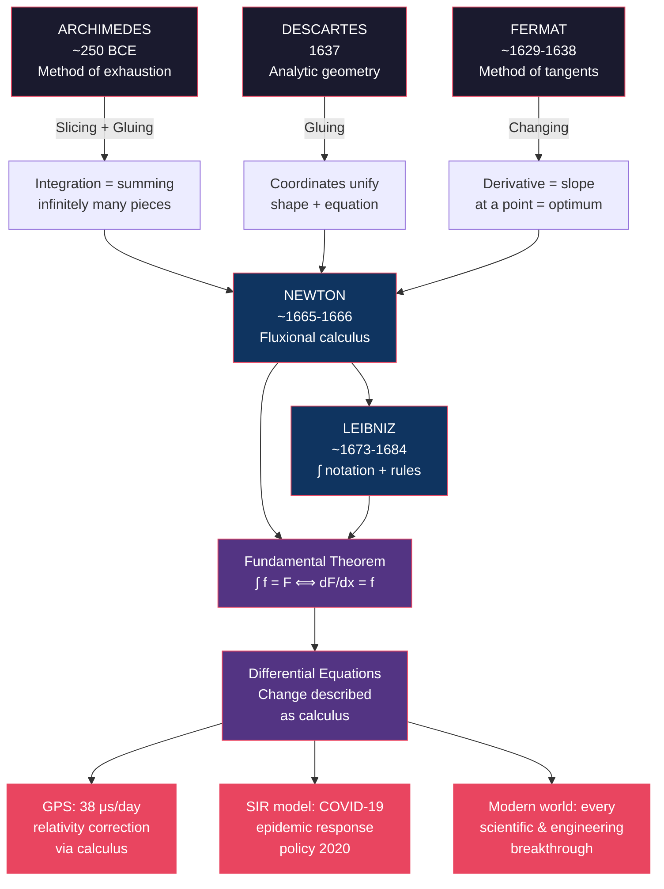

## Introduction

Welcome to BookAtlas. Today: *Infinite Powers: How Calculus Reveals the Secrets of the Universe* by Steven Strogatz. Published 2019. About 384 pages. Author: Cornell University mathematics professor, previously of *The Joy of x* and *Sync* fame, and one of the most lucid mathematical writers alive.

This is a book about the history of the single most powerful idea in science — calculus — and about the human beings who invented it, one piece at a time, over more than two thousand years. Strogatz's argument, in brief: calculus is not just something engineers use. It is a way of seeing the world. And once you internalize the calculus point of view, you can't unsee it.

---

## The Ancient Beginning — Archimedes and the Method of Exhaustion

**Host**: The book doesn't start with Newton. It starts with a Greek mathematician on the island of Syracuse, around 250 BCE, trying to figure out the area under a parabola. Why start so far back?

**Guest**: Because Strogatz's central argument is that calculus — properly understood — was invented by Archimedes, not Newton. Newton and Leibniz gave it notation and systematized it. But the core idea — slicing a curved shape into infinitely many thin rectangles and adding them up — that's Archimedes.

**Host**: And Archimedes had no concept of infinity, right?

**Guest**: Exactly. He couldn't write an infinite sum. He couldn't say "let n approach infinity." What he had was the *method of exhaustion*: inscribe a polygon inside the curve, circumscribe another outside, double the number of sides. The true area is trapped between two bounds that get tighter and tighter. With 96-sided polygons, he got pi to two decimal places. No calculus notation. No limits. Just geometry and persistence.

**Host**: That's impressive. But it's different from calculus, isn't it?

**Guest**: Conceptually, it's the same operation. Archimedes was doing integration. The only thing he lacked was a language to express what he was doing as a general procedure rather than a one-off calculation for a specific shape.

**Host**: Strogatz makes a big deal out of this — that the history of calculus didn't begin in the 1600s.

**Guest**: He does, and I think correctly. If you think calculus is "Newton and Leibniz invented it in the 1660s," you miss 1,800 years of prior work. Eudoxus developed the exhaustion method before Archimedes. Chinese mathematicians had similar area-computation techniques. The intellectual foundation was there. Newton and Leibniz saw something the earlier thinkers didn't — that the same operation that computes areas could be inverted to compute slopes — and that was the breakthrough. But they weren't starting from zero.

---

## The Bridge — Descartes, Fermat, and Analytic Geometry

**Host**: Fast forward to the 1600s. Two Frenchmen, working independently, invent analytic geometry. What does that have to do with calculus?

**Guest**: Everything. Before Descartes, geometry and algebra were separate universes. You had Euclid's geometry with its compass-and-straightedge constructions. You had algebra with its equations and variables. There was no way to translate between them.

**Host**: Descartes changes that.

**Guest**: He puts a grid over the plane. Every point has coordinates (x, y). Every curve — a circle, a parabola, a spiral — becomes an equation: x² + y² = r², y = x², and so on. Geometry was algebraized. Computation replaced construction.

**Host**: And Fermat did the same thing independently?

**Guest**: Yes, at the same time, in Toulouse, working alone. Nobody at the time knew what the other was doing. Fermat went further than Descartes: he used coordinates to find the tangent to a curve at any point and to find the curve's maximum and minimum values. That is, in effect, the derivative. He published it privately in 1638, 28 years before Newton's breakthrough.

---

## The Tangent Method — Fermat and the Birth of Differentiation

**Host**: Fermat sounds like the unsung hero of calculus.

**Guest**: He is, and Strogatz gives him a proper chapter. Fermat's method: to find the maximum or minimum of a function, he would add a small quantity E to the input, evaluate the function, then cancel terms and set the remainder to zero. After canceling, you get what is, in modern terms: **df/dx = 0**. That is exactly the condition for a critical point. Fermat found it with algebraic reasoning in the 1620s.

**Host**: And Newton was 22 when he read about this?

**Guest**: Newton was 22 when he was inventing calculus, and he was aware of Fermat's work. What Newton added was the inversion — finding not just the slope of a curve but the fact that slope and area are inverse operations. That inversion is the Fundamental Theorem. Fermat found half of it. Newton found the other half.

---

---

## The Priority Dispute — Newton, Leibniz, and a Human Tragedy

**Host**: Newton and Leibniz. The story everyone knows but the one Strogatz reframes nicely.

**Guest**: Newton was in his early twenties during the plague years — Cambridge closed, he went back to Woolsthorpe Manor, and in roughly 18 months invented calculus, the binomial theorem for fractional exponents, and laid the groundwork for the theory of gravity. He wrote it all up in a private manuscript in 1669 but didn't publish. Leibniz, a philosopher and mathematician in Germany, arrived at the same ideas independently about 10 years later and published first in 1684 with a clean notation — the ∫ sign, the d notation — that's still what we use.

**Host**: And Newton was furious.

**Guest**: To put it mildly. A priority dispute broke out that lasted decades. Newton's supporters at the Royal Society accused Leibniz of plagiarism. Modern historians mostly side with Leibniz on the plagiarism charge — there is no convincing evidence he saw Newton's work before developing his own. But Newton genuinely believed he'd been robbed, and he never forgot or forgave.

**Host**: What's Strogatz's take on the human damage?

**Guest**: He makes the sober point that the feud was genuinely harmful. English mathematics went into a self-imposed isolation for roughly a generation. English mathematicians refused to use Leibniz's notation and stuck with Newton's more cumbersome "fluxions." The Continent moved forward rapidly. By the time English math caught up, it was the 19th century. The feud cost Britain roughly 50 years of mathematical progress.

**Host**: That's a real legacy of personal pettiness.

**Guest**: Strogatz's broader point is that the calculus was in the air. The intellectual readiness of Europe in the 1600s made discovery inevitable. Newton and Leibniz were the two people who happened to grasp it. Raging about who got there first obscures the more important fact: it was a collective achievement across centuries.

---

## The Fundamental Theorem of Calculus — "It's All One Thing"

**Host**: Let's talk about the Fundamental Theorem. Because honestly, a lot of people learned it in calculus class and didn't get why it's the most important theorem in mathematics.

**Guest**: Let me try. Imagine you're Archimedes. You want to find the area under a parabola. You slice it into thin rectangles and add them up. That's integration. Now someone asks: what is the slope of that same parabola curve at a particular point? That's differentiation. Those two operations — summing areas and finding slopes — seem completely unrelated. You'd need two completely different sets of techniques, right?

**Host**: I would assume so.

**Guest**: The Fundamental Theorem says they're the same operation, in reverse. The antiderivative of a function — which computes the accumulated area — has, as its derivative, the original function. In symbols: d/dx of the integral from a to x of f of t dt equals f of x. The area accumulation and the slope are two views of the same mathematical object.

**Host**: And when you see it stated that cleanly, it seems obvious.

**Guest**: It seems obvious in retrospect, which is the hallmark of a genuinely deep insight. Newton and Leibniz both found it independently. The FTC collapses what had been two separate computational problems into one. Before the FTC, integration was an art — you had to compute areas from scratch using exhaustion methods, case by case. After the FTC, you find an antiderivative and evaluate at the endpoints. It's like someone giving you a master key.

---

## Differential Equations — The Calculus of Everything That Moves

**Host**: Strogatz says differential equations are calculus's most powerful application. Make the case.

**Guest**: A differential equation says: here is how something changes. Now tell me the whole story. It connects a quantity to its derivative — to how fast it's changing right now. That single connection lets you predict the future of the system.

**Host**: Like what kind of system?

**Guest**: Every dynamical system. A population that grows proportionally to its size — dP/dt = rP. That equation tells you the whole population curve. A planet orbiting a star. A chemical reaction that changes concentration over time. A neuron that fires when its voltage crosses a threshold. A virus spreading through a population.

**Host**: The virus one is timely.

**Guest**: It's the SIR model from the 1920s — Susceptible, Infected, Recovered. Three differential equations. Applied to COVID-19, it was the framework every government used, from the UK's Imperial College model to the CDC's. The mathematics is 1920s applied math. The data fitting is contemporary. But the equations themselves — they are calculus.

**Host**: And the Navier-Stokes equations? Those are the ones with the million-dollar prize?

**Guest**: Yes — the Clay Millennium Prize. They describe every fluid flow in the universe. Blood in your arteries. Air over an airplane wing. The Gulf Stream. Weather. We still cannot solve them in full generality. That's how hard the problem is. But engineers use approximate solutions every day to design everything from heart stents to wind turbines. The calculus isn't just theory. It's the engine.

---

## Strogatz as a Writer — Warmth Without Condescension

**Host**: Let me ask about Strogatz's writing. Because good mathematics writing is genuinely rare, and he's one of the best.

**Guest**: He's the rare writer who talks to an intelligent non-mathematician without being patronizing. He'll say "this is genuinely hard" rather than "this is easy" or — worse — just skipping past the difficulty. His background writing for the New York Times Opinionator blog shows. He spent years reading and responding to comments from regular people asking math questions, and that habit of engagement shows in the prose.

**Host**: The analogies help. The slicer-and-gluer metaphor for calculus is immediately intuitive.

**Guest**: And it's not just an analogy — it's a structural insight. The three pillars map onto the actual content of the mathematics, not just a rhetorical device. That's what makes it work. If the metaphor was superficial, it would collapse under pressure. It doesn't.

**Host**: What's the downside of this kind of accessibility?

**Guest**: Some readers may come away feeling they understand calculus without having actually engaged with any of the mechanics. You can read *Infinite Powers*, enjoy the narrative, and never compute a derivative or evaluate an integral. That's not Strogatz's goal here — he's selling intellectual history, not a tutorial — and he's honest about it. But if your goal is to *do* calculus, this book prepares your heart, not your hands.

---

## The Middle Gap — What the Book Glosses Over

**Host**: What's the weakest part of the book?

**Guest**: The middle. Newton and Leibniz in the 1670s, then we jump to Cauchy and Weierstrass in the 1820s. The 150 years of Euler, Lagrange, Laplace, and Fourier in between — who extended calculus into celestial mechanics, built the Fourier analysis that underpins digital signal processing, and effectively created the field of analysis — all of that gets compressed into a handful of pages.

**Host**: That's a lot to skip.

**Guest**: It's the hardest period to dramatize, to be fair. Euler is productive beyond belief — something like 850 pages of mathematics per year for most of his adult life — but his story is a story of relentless computation rather than a single breakthrough moment. It doesn't lend itself to the dramatic chapter structure Strogatz uses so effectively elsewhere.

**Host**: The rigorization chapter — Cauchy and Weierstrass — also feels a little thin.

**Guest**: It tells you they fixed the foundations but doesn't quite show *how* the epsilon-delta definition replaces the intuitive infinitesimal. Strogatz acknowledges it's hard, which is right, but a motivated reader who wants to understand the mechanics of a limit proof won't get it here. Which is fine — it's not a textbook — but worth noting.

---

## How to Use This Book

**Host**: Who is this book for?

**Guest**: Three audiences, really. First: anyone about to study calculus who wants the "why" before the "how." Understanding that Archimedes was trying to compute areas, that Fermat was trying to find optima, that Newton was trying to understand motion — that context transforms calculus from a random collection of techniques into a coherent intellectual project. Second: people in technical fields — engineering, data science, physics — who use calculus daily and want to reconnect with the ideas they apply mechanically. Third: anyone who thinks they're "not a math person." Strogatz is the best possible guide for that reader in particular.

**Host**: And who should skip it?

**Guest**: People who want a calculus textbook with exercises. People who want a deep scholarly monograph on, say, 17th-century mathematical priority disputes. And working analysts who want technical depth on measure theory or functional analysis. This book is about the story, not the proof. Know what you're buying.

---

## The Verdict

**Host**: Final question. This book — is it worth your time?

**Guest**: Yes. Here's why: even if you never compute another integral in your life, the calculus point of view — see the world as decomposable into infinitesimal parts, understand that continuous phenomena can be analyzed through rates of change, recognize that accumulation and change are two sides of the same coin — that worldview is genuinely enriching. It changes how you think about motion, about growth, about engineering, about the built world around you.

**Host**: And the writing quality?

**Guest**: Strogatz is one of the five best living writers about mathematics. The Archimedes chapter alone is worth the price. The GPS chapter closes the argument in a way that makes you look at your phone differently when you open Google Maps. The three-pillar framework is something I now use consciously when I encounter a new mathematical problem. It's a durable intellectual tool.

**Host**: Score?

**Guest**: 8.5 out of 10. It loses half a point for the thin middle chapters, half a point for the light rigorization treatment, and it earns every point it has for the rest. Read it before you study calculus. Read it while you study calculus. Read it after you've forgotten calculus. Each time, you'll get something different out of it.

---

## Closing

**Outro**: *Infinite Powers* by Steven Strogatz. Ecco/HarperCollins, 2019. The story of how human beings, over two thousand years, invented a mathematics of the infinite — and then used it to build the world we live in. Thanks for listening. If this episode made you want to revisit something you once studied, or start something new — share it with someone who might need a different entry point into mathematics. We'll be back next week.