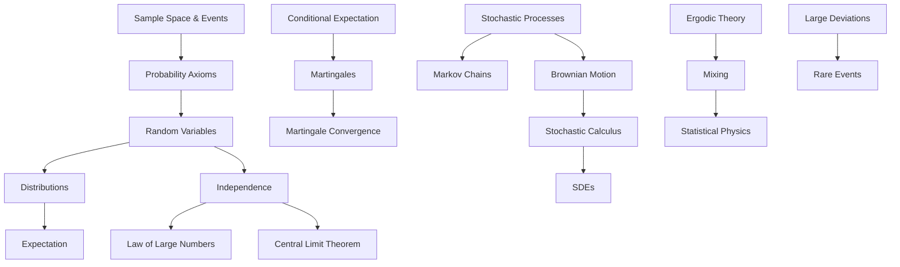

---
title: "Probability Theory"
description: "The mathematical study of randomness: from measure-theoretic foundations through stochastic processes, limit theorems, and the theory of random phenomena."
---

# Probability Theory

## Why This Subcategory Exists

Probability theory is the mathematical framework for reasoning about uncertainty, randomness, and chance. It provides the rigorous foundation for statistics, machine learning, statistical physics, financial mathematics, information theory, and quantum mechanics. Without probability theory, modern science, finance, and artificial intelligence would be impossible.

The mathematical theory of probability was born from gambling. In 1654, the Chevalier de Méré posed a problem to Blaise Pascal about the fair division of stakes in an interrupted game of chance. Pascal's correspondence with Pierre de Fermat on this problem laid the foundations of probability theory. Pascal also used his analysis to argue for belief in God (Pascal's Wager), showing how probability theory immediately raises deep philosophical questions about uncertainty and decision-making.

For two centuries, probability remained largely a collection of techniques for solving gambling and actuarial problems. The modern, rigorous foundation was provided by Andrei Kolmogorov in 1933, who axiomatized probability using measure theory. In Kolmogorov's formulation, a probability space consists of a sample space (all possible outcomes), a sigma-algebra (the events we can assign probabilities to), and a probability measure assigning numbers between 0 and 1 to events, satisfying three axioms: non-negativity, normalization, and countable additivity.

This measure-theoretic foundation transformed probability from a bag of tricks into a branch of analysis. The central limit theorem (the sum of many independent random variables is approximately normal) became a rigorous theorem with precise error bounds. Martingale theory (fair games and their generalizations) connected probability to harmonic analysis. Stochastic processes — random phenomena evolving over time — became a vast subject: Brownian motion, Markov chains, Poisson processes, Lévy processes, and stochastic differential equations.

The 20th century saw probability theory become central to physics (statistical mechanics, quantum probability, stochastic electrodynamics), finance (the Black-Scholes model for option pricing, risk management), computer science (randomized algorithms, PAC learning theory), and biology (population genetics, stochastic models of evolution).

This subcategory holds books on the full spectrum: elementary probability for beginners, the measure-theoretic foundations, stochastic processes, martingale theory, Brownian motion, limit theorems, Markov chains, ergodic theory, large deviations, and free probability.

## Why This Is NOT Merged Into Other Subcategories

**Distinct from Statistics and Data Analysis:** Probability theory provides the mathematical framework; statistics uses this framework to draw inferences from data. A book on the central limit theorem belongs here; a book on regression analysis belongs in Statistics.

**Distinct from Analysis:** While probability uses measure theory and analysis as tools, its focus on randomness, independence, and stochastic phenomena makes it a distinct discipline. A book on Lebesgue integration belongs in Analysis; a book on martingales belongs here.

**Distinct from Applied & Computational Mathematics:** The theoretical development of probability (why the central limit theorem holds, the structure of stochastic processes) belongs here. Applications (Monte Carlo methods, randomized algorithms) belong in Applied Mathematics.

**Distinct from Information Theory:** While there is deep overlap (entropy is a probabilistic concept, Shannon's theorems use probability), information theory has its own questions (compression, channel capacity) and methods that go beyond probability theory proper.

## What Belongs Here

Books about elementary probability, combinatorial probability, measure-theoretic probability, limit theorems (law of large numbers, central limit theorem, law of iterated logarithm), martingales, Markov chains, Brownian motion, stochastic calculus (Itô calculus, stochastic differential equations), Lévy processes, large deviations, random matrix theory, ergodic theory, and quantum probability.

## Does NOT Belong Here

- Statistical inference and hypothesis testing → Statistics and Data Analysis
- Monte Carlo methods and randomized algorithms → Applied & Computational Mathematics
- Information theory (entropy, compression, codes) → Information Theory and Coding
- Bayesian data analysis → Statistics and Data Analysis

## Essential Reading: The Most Important Books

1. *Doctrine of Chances* — Abraham de Moivre (1718) — The first textbook on probability theory; discovered the normal approximation to the binomial
2. *Théorie Analytique des Probabilités* — Pierre-Simon Laplace (1812) — The first comprehensive treatise on probability; introduced generating functions, the central limit theorem (in special cases), and Bayesian inference
3. *Foundations of the Theory of Probability* — Andrei Kolmogorov (1933) — The axioms that made probability a rigorous mathematical discipline
4. *Probability and Measure* — Patrick Billingsley (1979) — The standard graduate text that seamlessly integrates measure theory and probability
5. *Probability: Theory and Examples* — Rick Durrett (1991) — The most widely used graduate probability text; concise and example-rich
6. *A Probability Path* — Sidney Resnick (1999) — A gentler introduction to measure-theoretic probability
7. *Probability with Martingales* — David Williams (1991) — A brilliantly written introduction to martingale theory; entertaining and rigorous
8. *Stochastic Processes* — Sheldon Ross (1983) — The standard introduction to stochastic processes: Markov chains, Poisson processes, Brownian motion
9. *Markov Chains* — J.R. Norris (1997) — A clear, rigorous treatment of discrete and continuous-time Markov chains
10. *Probability Theory: A Comprehensive Course* — Achim Klenke (2008) — Encyclopedic coverage from foundations to large deviations and stochastic processes
11. *Brownian Motion and Stochastic Calculus* — Ioannis Karatzas & Steven Shreve (1988) — The standard graduate reference for stochastic calculus; Itô's formula, stochastic differential equations, Girsanov's theorem
12. *Stochastic Differential Equations* — Bernt Øksendal (1985) — The most accessible introduction to stochastic calculus and SDEs
13. *Continuous Martingales and Brownian Motion* — Daniel Revuz & Marc Yor (1991) — The definitive reference for the fine structure of Brownian motion
14. *Diffusions, Markov Processes, and Martingales* — Rogers & Williams (2000) — A comprehensive two-volume treatment connecting Markov processes, martingales, and stochastic calculus
15. *Limit Theorems of Probability Theory* — Valentin Petrov (1995) — A systematic treatment of limit theorems, including rates of convergence
16. *Large Deviations Techniques and Applications* — Amir Dembo & Ofer Zeitouni (1998) — The standard reference for large deviation theory
17. *An Introduction to Probability Theory and Its Applications* — William Feller (1950/1968) — The two-volume masterpiece; Volume I covers discrete probability, Volume II continuous; still the best collection of examples and problems
18. *Probabilistic Methods in Combinatorics* — Noga Alon & Joel Spencer (1986) — The probabilistic method: proving existence results using probability
19. *Random Matrices* — Madan Lal Mehta (1967) — The classic reference; eigenvalues of random matrices, connections to physics and number theory
20. *Spin Glasses and Complexity* — Daniel Stein & Charles Newman (2013) — Disordered systems where probability meets physics
21. *The Theory of Probability* — Harold Jeffreys (1939) — The Bayesian perspective on probability; Jeffreys priors
22. *Ten Great Ideas About Chance* — Diaconis & Skyrms (2017) — Ten conceptual breakthroughs in probability and statistics, from Bayes to martingales
23. *Struck by Lightning: The Curious World of Probabilities* — Jeffrey Rosenthal (2005) — An entertaining popular introduction
24. *An Introduction to Stochastic Modeling* — Mark Karlin & Howard Taylor (1998) — Modeling real-world phenomena with probability
25. *Ergodic Theory and Differentiable Dynamics* — Ricardo Mañé (1983) — The deep connection between probability (ergodic theorems) and dynamical systems

## Key Concepts and Frameworks

## How to Approach This Subcategory

1. **Begin with elementary probability.** Ross's *A First Course in Probability* or the first few chapters of Feller Volume I. Understand sample spaces, conditional probability, random variables, and common distributions (binomial, Poisson, normal, exponential).

2. **Learn measure-theoretic probability.** Billingsley's *Probability and Measure* or Durrett's *Probability: Theory and Examples*. This is where probability becomes rigorous: sigma-algebras, Lebesgue integration, convergence theorems (almost sure, in probability, in Lp).

3. **Study stochastic processes.** Ross's *Stochastic Processes* for Markov chains and Poisson processes, then Karatzas & Shreve for Brownian motion and stochastic calculus.

4. **Specialize.** Williams for martingales, Dembo & Zeitouni for large deviations, Mehta for random matrices, or Øksendal for stochastic differential equations.

**Connections:** Probability theory is essential for Category 04 (AI/ML — Bayesian learning, probabilistic graphical models, stochastic gradient descent), Category 09 (Economics — decision theory, mechanism design, financial economics), Category 05 (Pure Sciences — statistical mechanics, quantum probability), Category 02 (Computer Science — randomized algorithms, information theory), and Category 08 (Finance — option pricing, risk models).