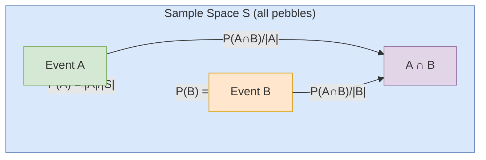
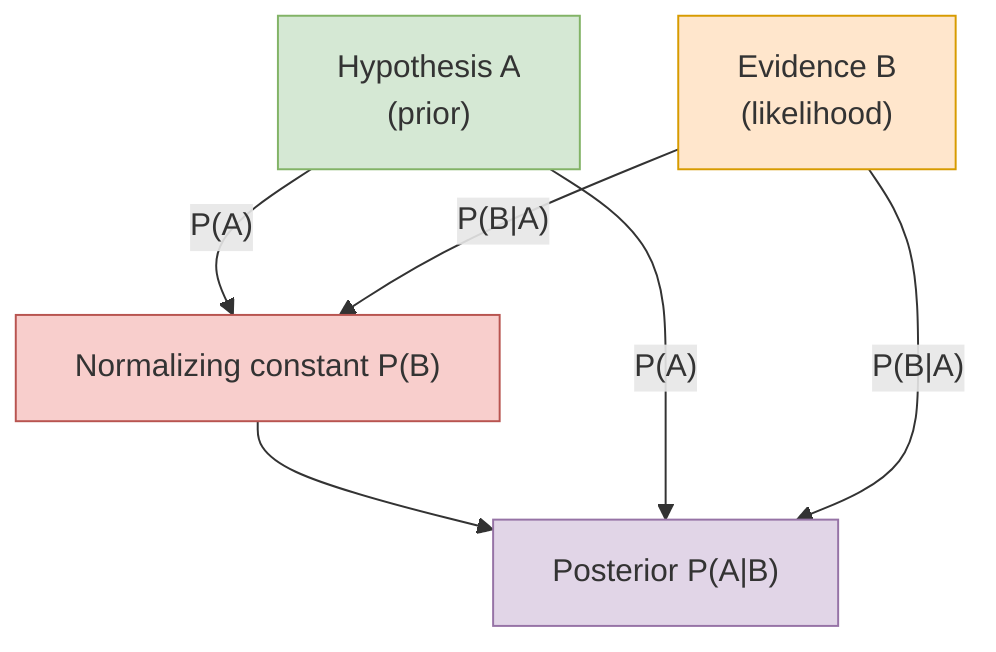
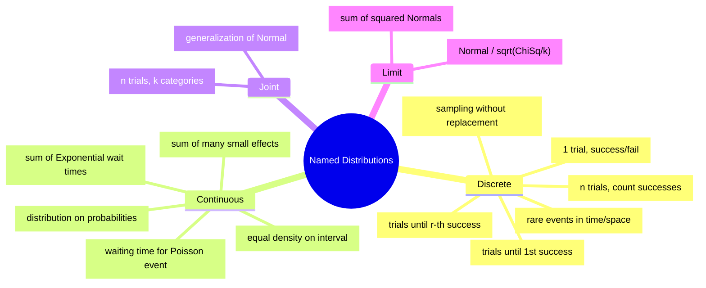
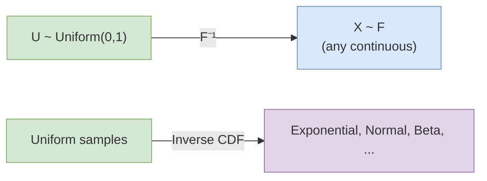
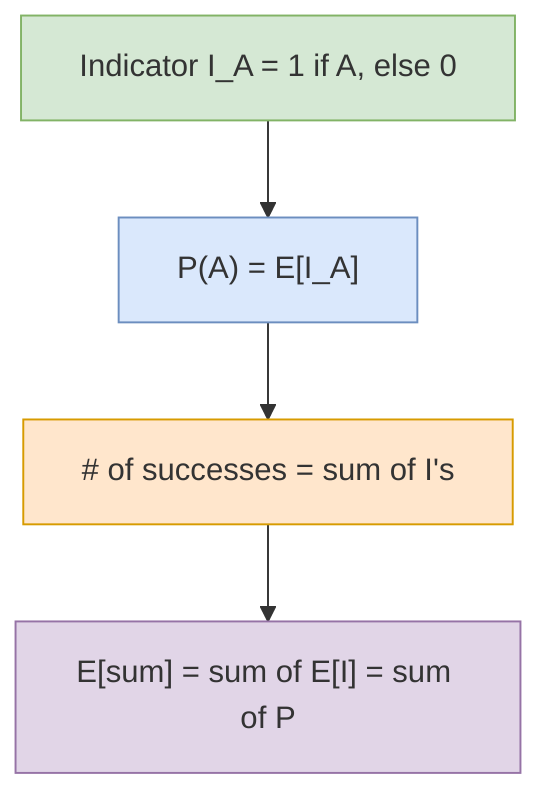
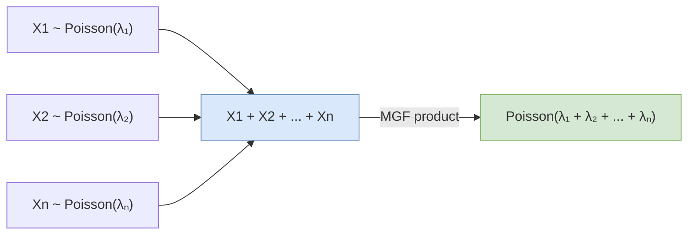
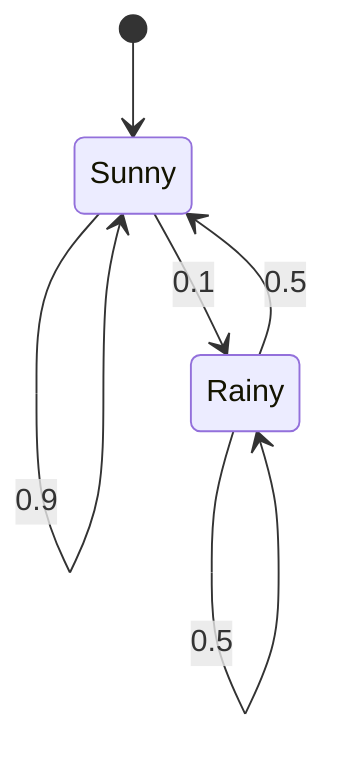
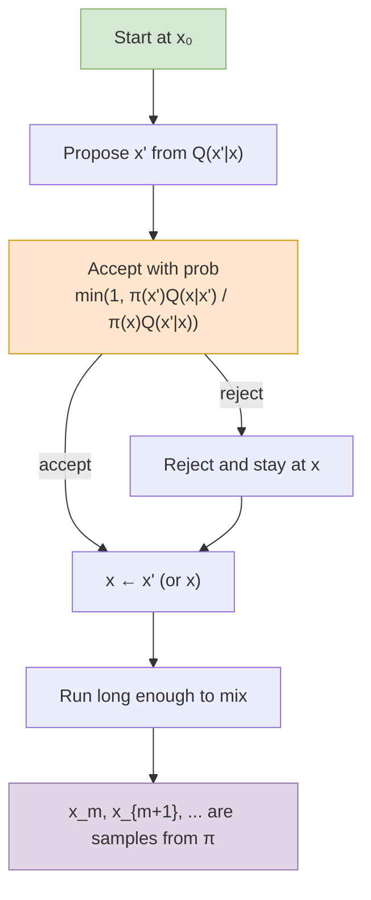
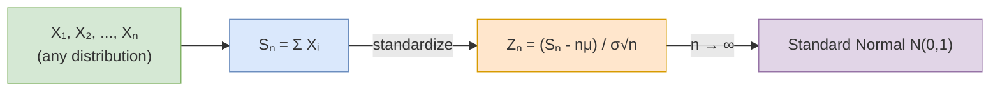

## Pebble World: The Foundational Picture

The book opens with the **Pebble World** mental model. Every random
experiment is a sample space filled with equally likely pebbles.
Probabilities are fractions of pebbles. Conditioning is carving out
a sub-sample. Independence is having two carvings of the space
intersect in proportion to the product of their sizes.

The book makes a deliberate point: even when the pebbles are **not**
equally likely (the "non-naive" definition), the entire probability
machinery still works. Pebble World is a teaching tool, not a
restriction.

---

## Bayes' Theorem and the Law of Total Probability

Two identities carry almost the entire book:

$$P(A \mid B) = \frac{P(B \mid A) \, P(A)}{P(B)}$$

$$P(B) = \sum_i P(B \mid A_i) \, P(A_i)$$ (where $A_i$ is a partition)

The book's signature move is **conditioning as a problem-solving
tool**: if a problem looks hard, condition on something. The
celebrated "Adam and Eve" examples (Chapter 9) show how conditioning
on a natural rv reduces a hard problem to a one-line identity.

---

## Distributions Are Stories

The book organizes every named distribution around a **story** — a
sentence that defines it without formulas.

| Family | Story | PMF/PDF | Mean | Variance |
|---|---|---|---|---|
| Bernoulli($p$) | Single success/fail trial | $p^x (1-p)^{1-x}$ | $p$ | $p(1-p)$ |
| Binomial($n,p$) | Count successes in $n$ trials | $\binom{n}{k} p^k (1-p)^{n-k}$ | $np$ | $np(1-p)$ |
| Geometric($p$) | Trials until 1st success | $(1-p)^{k-1} p$ | $1/p$ | $(1-p)/p^2$ |
| Poisson($\lambda$) | Rare events at rate $\lambda$ | $e^{-\lambda} \lambda^k / k!$ | $\lambda$ | $\lambda$ |
| Uniform($a,b$) | Equal density on $[a,b]$ | $1/(b-a)$ | $(a+b)/2$ | $(b-a)^2 / 12$ |
| Normal($\mu, \sigma^2$) | Sum of many small effects | $\frac{1}{\sigma\sqrt{2\pi}} e^{-(x-\mu)^2 / 2\sigma^2}$ | $\mu$ | $\sigma^2$ |
| Exponential($\lambda$) | Wait for next Poisson event | $\lambda e^{-\lambda x}$ | $1/\lambda$ | $1/\lambda^2$ |
| Gamma($k, \theta$) | Sum of $k$ Exponential wait times | $\frac{1}{\Gamma(k)} x^{k-1} e^{-x/\theta} / \theta^k$ | $k\theta$ | $k\theta^2$ |
| Beta($a, b$) | Distribution on probabilities | $\frac{1}{B(a,b)} x^{a-1} (1-x)^{b-1}$ | $a/(a+b)$ | $ab / ((a+b)^2(a+b+1))$ |

---

## The Universality of the Uniform

A foundational insight: to sample from **any** continuous distribution
with CDF $F$, take $U \sim \text{Uniform}(0,1)$ and apply
$F^{-1}(U)$. This is the bridge from discrete to continuous
probability and the engine of all simulation.

By the same token, the **symmetry** of iid continuous rvs gives
order statistics a Beta distribution and the range a clean
description.

---

## Linearity of Expectation and the Fundamental Bridge

Two of the most-used tools in the book:

**Fundamental bridge:** for an indicator $I_A$,
$\mathbb{E}[I_A] = P(A)$.

**Linearity:** $\mathbb{E}[X + Y] = \mathbb{E}[X] + \mathbb{E}[Y]$
— *no independence required.*

This pair is the secret behind most of the book. A "how many
expected matches in a deck of cards?" problem becomes: write an
indicator for each card, sum, take expectation, done. No
combinatorics required.

---

## Moment Generating Functions

The MGF of a random variable $X$ is $M_X(t) = \mathbb{E}[e^{tX}]$.
The book's key observation: for **independent** rvs, the MGF of a
sum is the product of MGFs — far easier than convolving densities.

| Distribution | MGF | Why Useful |
|---|---|---|
| Normal($\mu, \sigma^2$) | $e^{\mu t + \sigma^2 t^2 / 2}$ | Sum of Normals is Normal |
| Poisson($\lambda$) | $e^{\lambda(e^t - 1)}$ | Sum of Poissons is Poisson |
| Gamma($k, \theta$) | $(1 - \theta t)^{-k}$ | Sum of Gammas is Gamma |
| Chi-Square($k$) | $(1 - 2t)^{-k/2}$ | Sum of Chi-Squares is Chi-Square |

---

## Markov Chains and Stationarity

A Markov chain is a sequence of states where the future depends on
the past only through the present. The book formalizes this with a
**transition matrix** $P$ and asks: when does the chain settle into
a stationary distribution $\pi$ such that $\pi P = \pi$?

For the chain above, $\pi = (5/6, 1/6)$: in the long run, 5 out of
6 days are sunny. The book derives this from $\pi P = \pi$ and
$\sum \pi_i = 1$.

The **classification of states** (transient, recurrent, periodic,
ergodic) and the **reversibility** criterion
$\pi_i P_{ij} = \pi_j P_{ji}$ are presented cleanly and used to
analyze the Google PageRank algorithm as a real-world example.

---

## Markov Chain Monte Carlo (MCMC)

Some distributions are too complex to sample from directly. The
**Metropolis-Hastings** algorithm constructs a Markov chain whose
stationary distribution *is* the target, then runs the chain until
it mixes.

MCMC is the engine behind modern Bayesian inference. The book gives
the cleanest treatment available at this level.

---

## The Central Limit Theorem

The book states the Lindeberg-Levy CLT: for iid rvs $X_1, \ldots,
X_n$ with mean $\mu$ and variance $\sigma^2$, the standardized sum

$$Z_n = \frac{\sum_i X_i - n\mu}{\sigma \sqrt{n}}$$

converges in distribution to a standard Normal.

The CLT explains why the Normal appears everywhere in practice
(sum of small effects) and underpins confidence intervals and
hypothesis tests in statistics.

---

## Poisson Processes

A Poisson process is a continuous-time stream of events with two
properties: events in disjoint intervals are independent, and the
count in an interval of length $t$ is Poisson($\lambda t$).

| Quantity | Distribution | Mean |
|---|---|---|
| Count in window of length $t$ | Poisson($\lambda t$) | $\lambda t$ |
| Time until 1st event | Exponential($\lambda$) | $1/\lambda$ |
| Time until $k$-th event | Gamma($k, 1/\lambda$) | $k / \lambda$ |
| Given count $n$ in window, event times | Order stats of $n$ iid Uniform(0,$t$) | — |

The book generalizes to 2D and higher, where Poisson processes
become models for spatial point patterns (genetics, ecology,
epidemiology).

---

## Key Lessons

- **Stories are first-class objects.** When you remember that the
  Binomial is "count of successes in $n$ trials" and not a formula,
  every problem becomes a recognition task.
- **Condition first, compute second.** Almost every hard problem
  becomes easy after the right conditioning step.
- **Indicators turn counts into expectations.** Linearity of
  expectation is your most powerful hammer.
- **MGFs turn sums into products.** Whenever a problem involves
  independent sums, reach for MGFs.
- **Markov chains are everywhere.** PageRank, MCMC, queueing,
  genetics — all Markov chains.

---

## Practical Applications

- **Statistics and inference:** confidence intervals, hypothesis
  tests, regression, and the foundations of Bayesian inference
- **Data science and machine learning:** Bayesian methods, MCMC,
  expectation-maximization, hidden Markov models
- **Computer science:** PageRank, randomized algorithms, hashing
  analysis, communication channels
- **Genetics and biology:** population genetics, phylogenetic
  trees, neural spike trains
- **Finance and economics:** option pricing, risk models, queueing
- **Physics and engineering:** reliability, signal processing,
  stochastic simulation
