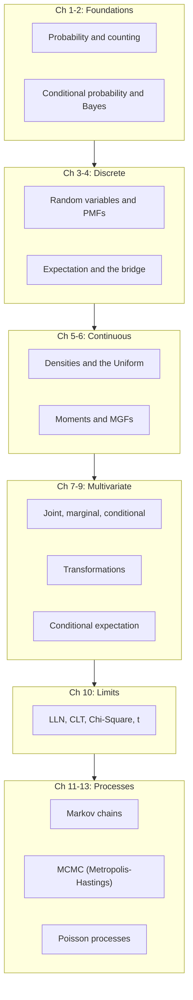

## Introduction

Welcome to BookAtlas. Today: *Introduction to Probability* by Joseph
K. Blitzstein and Jessica Hwang. Published 2014, second edition 2019,
by Chapman and Hall / CRC Press. Roughly 610 pages. The book that
grew out of Harvard's Stat 110 — and the modern default for
learning probability.

If you have ever opened a probability textbook and been beaten into
submission by a wall of formulas, this is the book you wish you
had. Blitzstein and Hwang teach you probability the way it should
be taught: with stories, with intuition, and with code that makes
the math come alive.

---

## Why Stories

**Curious:** Probability has a reputation for being dry. Why does
this book feel different?

**Reader:** Because it refuses to treat probability as a list of
formulas. Every named distribution is introduced as a **story**.
The Binomial is the number of successes in $n$ trials. The Poisson
is the count of rare events in a window of time. The Normal is the
sum of many small effects. The Beta is the distribution of an
unknown probability.

Once you know the story, the formula is almost redundant. And once
you can recall a dozen stories cold, problems stop being
recognition tasks and start being applications of the right story.

**Curious:** What about the proofs? Probability proofs can be
intimidating.

**Reader:** The book has a signature move: **story proofs**. Instead
of grinding through algebra, Blitzstein constructs a single
intuitive narrative that does the work. The classic example is
proving that the distribution of waiting times in a Poisson process
is the Exponential. No integration. Just a memoryless story. You
finish the proof and feel like you understand *why*, not just
*that*.

---

## The Map of the Book

**Reader:** The arc is deliberate. Chapters 1-2 build the language
and the most important problem-solving tool — conditioning.
Chapters 3-6 introduce the discrete and continuous families, with
the Universality of the Uniform bridging them. Chapters 7-9 handle
multivariate and conditional expectation. Chapter 10 is the limit
theorems that connect everything to statistics. Chapters 11-13 are
the modern payoff: Markov chains, MCMC, and Poisson processes.

**Curious:** Why MCMC in an intro book?

**Reader:** Because MCMC is one of the most important algorithms
of the past fifty years. If you are doing Bayesian inference, you
are running MCMC. If you are using Stan or PyMC, you are running
MCMC. Blitzstein and Hwang give you the cleanest derivation
available: build a Markov chain whose stationary distribution is
the one you want to sample from, and let the chain run.

---

## Pebble World

**Reader:** The first chapter introduces a picture that runs through
the whole book: **Pebble World**. Imagine a sample space filled
with pebbles. If all the pebbles are equally likely, probabilities
are just fractions of pebbles. Conditioning is picking a sub-region.
Independence is two regions whose intersection has the right
proportion.

**Curious:** That sounds naive. What if the pebbles are not equally
likely?

**Reader:** That is exactly the point of section 1.6 — the
"non-naive" definition. Pebble World is a **teaching tool**, not a
restriction. Even when probabilities are unequal, the same
identities work. The picture is the anchor; the formal definition
extends it.

---

## Bayes' Theorem and the Adam and Eve Law

**Curious:** What is the single most useful idea in the book?

**Reader:** Conditioning. The book says it on page 1 of Chapter 2
and shows it on every subsequent page. Bayes' theorem, the law of
total probability, the Adam and Eve law $E(X) = E(E(X \mid Y))$ —
all of them are conditioning in disguise.

The Adam and Eve examples in Chapter 9 are the climax. A character
walks through the world gaining partial information. The book shows
that the expected value of a random variable, conditioning on all
the available partial information, is the optimal prediction. The
math is just two lines. The intuition lasts a lifetime.

---

## The Central Limit Theorem

**Reader:** Chapter 10 is the bridge from probability to
statistics. The book states the Central Limit Theorem cleanly:
sums of iid random variables, standardized, converge to a standard
Normal. It does not matter whether the underlying distribution is
Binomial, Exponential, Uniform, or anything else with finite
variance.

**Curious:** Why does this matter?

**Reader:** Because the CLT is the reason the Normal distribution
shows up everywhere in practice. A measurement is the sum of many
small errors. A test statistic is the sum of many small effects.
An average is the sum of many small contributions. The Normal
emerges as the universal shape of aggregated randomness. The book
also covers the Chi-Square and Student-t distributions in this
chapter, which are the building blocks of confidence intervals and
hypothesis tests.

---

## The Verdict

**Curious:** Who is this book for?

**Reader:** Almost everyone learning probability for the first
time. Undergraduates in statistics, mathematics, computer science,
engineering, economics, physics, or any quantitative field.
Self-learners working through Stat 110 online. Data scientists who
want a rigorous foundation for Bayesian methods and MCMC. The
prerequisite is one semester of calculus. No measure theory
required.

**Curious:** Who is it not for?

**Reader:** Readers who already have a measure-theoretic background
and want a graduate-level treatment. They should read
*Probability Theory* by Varadhan or *Probability with Martingales*
by Williams. Readers who want deep coverage of statistical
inference, linear models, or causal inference will need a
follow-up text. The book is also not a cookbook — practitioners
who only want recipes will find the emphasis on understanding
frustrating.

**Curious:** The 1st or 2nd edition?

**Reader:** The 2nd edition, almost certainly. Published 2019, it
fixes typos, adds new examples and exercises, and adds online
animations that pair with the chapters. The 1st edition is fine,
but the 2nd is better in every measurable way.

---

## Final Thoughts

*Introduction to Probability* is a masterclass in pedagogy. It
takes a subject with a reputation for being abstract and makes it
genuinely intuitive. The story-based approach is not a gimmick; it
is the most efficient way to internalize the definitions and
connections that make probability work. The R simulations make the
abstract concrete. The exercises are the best in the field.

The book is also a quiet argument that the best way to learn
mathematics is to learn its **stories**, not its formulas. That
lesson generalizes far beyond probability.

This has been a BookAtlas narration of *Introduction to Probability*
by Blitzstein and Hwang. Pair the book with the Stat 110 YouTube
lectures. Work the exercises. Run the R simulations. And remember:
when a probability problem feels hard, condition on something.

Thanks for listening.
