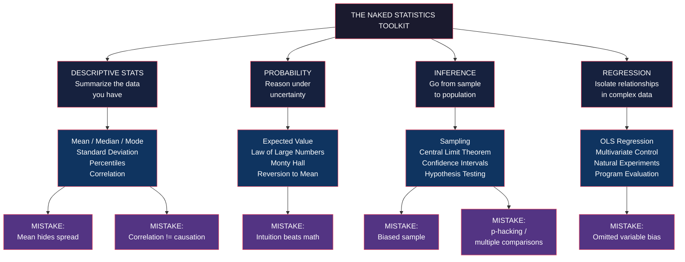

# Core Concepts

## Descriptive Statistics — Summarizing the Crime Scene

Wheelan opens with the central metaphor: data is a crime scene, and
statistics is the detective work that turns thousands of messy observations
into a meaningful answer. The first set of tools are the descriptive
statistics — numbers that capture, in a single value or two, what is true
about a dataset.

### Mean, Median, Mode

These three measures of "central tendency" answer different questions.

- **Mean** — the arithmetic average. Add everything up, divide by the count.
  Sensitive to outliers: if ten friends earn between $40,000 and $60,000,
  and a billionaire joins the lunch, the mean leaps; the friends' actual
  financial situation has not changed.
- **Median** — the true middle. Sort the values and pick the one in the
  center. Unaffected by extremes. When distribution is skewed — income,
  house prices, city populations — the median is usually the honest
  summary.
- **Mode** — the most common value. Useful for categorical data (most common
  blood type, most popular first name) and useless for continuous data with
  no repeats.

| Use the mean when… | Use the median when… |
|---|---|
| Distribution is symmetric | Distribution is skewed by outliers |
| You need to combine groups | You want a typical individual |
| You care about totals | You care about the typical person |

### Standard Deviation

The single most important number most readers were never taught. Standard
deviation is the average distance of every data point from the mean, in the
same units as the data. It is the universal currency for "how spread out is
this data."

Two SAT prep classes both post an average score gain of 50 points. In Class
A, every student gains between 45 and 55. In Class B, half the class gains
200 and half lose 100. The means are identical; the standard deviations are
wildly different; the classes are wildly different in value. Mean without
standard deviation is a half-truth.

Wheelan's instinct: always ask for the spread, not just the average. A
weather report of "average temperature 60 degrees" is meaningless without
the variance; a stock that "averages 10% annual return" without a
standard deviation could be a steady eddy or a Vegas slot machine.

### Percentiles and the Box

Percentiles sort a distribution into hundred equal pieces. The 90th
percentile height for American men is about 6'0" — 90% of men are shorter.
The interquartile range (25th to 75th percentile) is a robust, outlier-proof
measure of spread.

A box plot is the visual: a box for the middle 50%, a line for the median,
whiskers for the rest, dots for the outliers. Wheelan returns to the box
plot as a default visual because it forces honesty about spread.

---

## Correlation — The Most Misunderstood Number in the World

The correlation coefficient runs from -1 to +1.

- **+1** — perfect positive correlation (height and weight).
- **0** — no linear relationship (shoe size and IQ).
- **-1** — perfect negative correlation (outside temperature and heating
  bills).

Wheelan's warning: correlation is necessary but never sufficient for
causation. The famous examples — ice cream sales and drowning deaths, both
peaking in summer; Nicolas Cage films and pool drownings, also correlated;
per capita consumption of mozzarella cheese and the number of civil
engineering doctorates awarded — are funny precisely because the
correlations are real and the causal claims are absurd.

The mental move: a correlation establishes that two variables move
together. To claim that one causes the other, you need a third piece of
information — a theory, a randomized experiment, an instrumental variable,
a natural experiment, a time order, or a dose-response curve — that rules
out coincidence, reverse causation, and confounding.

A useful rule of thumb Wheelan never quite states but implies: if the
correlation is large and the causal mechanism is obvious, correlation may
be good enough. If either is weak, slow down. If the headline is "X causes
Y" and the underlying study is observational, treat the headline as a
hypothesis, not a finding.

---

## Probability — Why Your Intuition Is Wrong

### Expected Value

The expected value of a gamble is the average outcome if you played
infinitely many times. It is not the outcome you should expect from any
single play. A lottery ticket with a 1-in-100-million chance of winning $100
million has an expected value of $1 — but a 99.99999% chance of being
worthless.

Casinos survive on expected value. A roulette wheel with 38 numbers, one
green, pays 35-to-1 on a single number. The expected value of a $1 bet is
about $0.95. The casino collects the 5% on every spin, forever, by the law
of large numbers. The gambler is, on average, donating 5% per spin. The
house needs only one spin to win, the gambler needs millions.

### Independent Events and the Law of Large Numbers

Independent events do not have memory. A coin that has come up heads ten
times in a row is no more or less likely to come up heads on the eleventh
flip. The "gambler's fallacy" — believing that ten reds in a row makes
black due — is the systematic error of treating independent events as if
they were connected.

The law of large numbers: as the number of trials grows, the average
outcome converges on the expected value. This is why the casino always
wins in the long run and why a poll of a thousand people can predict an
election of a hundred million.

### The Monty Hall Problem

The set-up: a game show, three doors, a car behind one, goats behind the
other two. You pick a door. The host, who knows where the car is, opens a
different door to reveal a goat. He offers to let you switch to the
remaining unopened door. Should you switch?

The answer, which Wheelan treats at length: yes, you double your chance
of winning by switching. The probability your original door hides the car
is 1/3 and never changes. The probability the car is behind one of the
other two doors is 2/3. The host has revealed a goat behind one of those
two. The 2/3 collapses onto the single remaining unopened door. Switching
wins 2/3 of the time. Staying wins 1/3 of the time.

This is the most famous probability puzzle in the world. It is also
correct, and it has been empirically demonstrated in dozens of psychology
studies. The lesson Wheelan draws: human intuition about probability is
notoriously wrong, and a careful thinker has to override it with
arithmetic.

---

## Sampling — The Miracle of Modern Empirical Work

### Why a Sample Works

A random sample of about 1,000 Americans can describe a country of 300
million with about 3 percentage points of error. The reason: variability
in the sample mean shrinks as 1 over the square root of the sample size.
To halve the margin of error, you must quadruple the sample. To go from
3% to 0.3%, you need a sample 100 times larger — 100,000 people. Diminishing
returns set in early.

### The Five Biases That Wreck a Sample

Wheelan's catalogue of sample failure modes:

1. **Selection bias** — the sample is not drawn from the population you want
   to describe. Literary Digest's 1936 poll predicted Alf Landon would
   beat FDR; it sampled its own subscribers and automobile club members,
   and missed the New Deal coalition entirely.
2. **Non-response bias** — those who refuse to answer differ systematically
   from those who do. Phone surveys miss the poor; online panels miss the
   elderly; political surveys miss the disengaged.
3. **Recall bias** — people misremember. "How many sexual partners have
   you had?" gets different numbers depending on whether the researcher
   asks politely or provides a private ballot.
4. **Survivorship bias** — you see the winners and miss the failures. The
   visible planes returning from WWII combat had bullet holes everywhere
   except the engines; Abraham Wald's insight was that the missing planes
   — the ones that did not return — were the ones hit in the engines.
5. **Healthy-user bias** — observational studies that compare people who
   take vitamins to people who do not consistently find that vitamin-takers
   are healthier. But vitamin-takers also tend to exercise, eat
   vegetables, and go to the doctor; the vitamin may be innocent.

The lesson: a small, well-drawn sample beats a large, biased one. The
math of inference is unforgiving of selection effects.

---

## The Central Limit Theorem — The Wizard Behind the Curtain

This is the most important theorem in the book. Its claim: take any
population, no matter how weirdly distributed. Draw a large enough random
sample, repeat the sampling process many times, and the distribution of
sample means will look like a bell curve, centered on the true population
mean.

The theorem does not require the population itself to be normal. It does
not require large samples — usually 30 is plenty. It works for incomes,
heights, dice rolls, anything with a finite variance. It is the reason
polls work, the reason clinical trials work, the reason quality control
works, the reason weather forecasts work.

Standard error is the standard deviation of the sampling distribution.
It is the "wiggle room" in a sample mean. The standard error of a sample
mean is the population standard deviation divided by the square root of
the sample size. The central limit theorem tells you what the sampling
distribution looks like; the standard error tells you how wide it is.

This is the machinery that turns a sample into a population claim.

---

## Inference — From Data to Claims

### Confidence Intervals

A 95% confidence interval is a range constructed by a procedure that
captures the true population value 95% of the time, in the long run. It is
not a probability statement about the specific interval you just computed
(the true value is either in this interval or it is not, and we don't
know which). It is a statement about the procedure.

The subtle bit: the 95% refers to the procedure's long-run performance,
not to the specific interval's probability of being right. Most
non-statisticians (and most journalists) misinterpret this constantly. The
honest framing: "we are 95% confident the true value lies in this range,
which is a way of saying our procedure catches the true value 95% of the
time across repeated samples."

### Hypothesis Testing and the p-Value

The structure of a hypothesis test:

1. State a null hypothesis (the default assumption — usually "no effect" or
   "no difference").
2. Compute a test statistic from the data.
3. Calculate the probability of seeing a test statistic at least this
   extreme, *if the null hypothesis is true*. This is the p-value.
4. If the p-value is below the conventional threshold (usually 0.05),
   reject the null and call the result "statistically significant."

The threshold of 0.05 is a convention set by Ronald Fisher in the 1920s.
It is a habit, not a law of nature. It is also a one-size-fits-all number
applied to wildly different research contexts, which is part of why the
replication crisis hit social science in the 2010s.

### The Multiple Comparisons Problem — The Dead Salmon

If you test 20 hypotheses at the 0.05 level, you expect one of them to come
up significant by chance alone, even if all 20 null hypotheses are true.
This is the multiple comparisons problem.

Wheelan's exhibit A is the 2009 Bennett et al. study, "Neural Correlates of
Interspecies Perspective Taking in the Post-Mortem Atlantic Salmon." A dead
salmon was placed in an fMRI machine and shown emotional photos. Standard
analysis produced significant brain activity in the dead fish. The result
was a deliberate demonstration that running thousands of comparisons on a
single brain scan will turn up "activity" by chance, even in dead tissue.

The lesson: a single p-value of 0.04 in a study that ran 50 tests is
worthless. Modern practice adjusts for multiple comparisons (Bonferroni,
Benjamini-Hochberg, false discovery rate) — but many older studies, and
many in the popular press, do not.

### Reversion to the Mean

Extreme observations tend to be followed by less extreme ones. This is not
a force or a correction; it is mathematics. If you select the tallest
person in a room, their next measurement will on average be shorter.
Not because they shrank, but because the selection process captured a
random high.

The implication: any program that "selects" extreme cases for intervention
will appear to work, even if the intervention does nothing. The fire
department whose response times were terrible before training will
improve. The sports team on the cover of *Sports Illustrated* will have a
bad season. The CEO featured on the cover of *BusinessWeek* will
underperform. The intervention, the jinx, the curse — all are
reversion to the mean dressed up as causation.

---

## Regression Analysis — The Workhorse

Regression is the statistical microscope of the empirical world. It
isolates the relationship between an outcome variable and one or more
predictor variables while holding the others constant. It is the single
most-used tool in observational research, and the most-abused.

### The Core Idea

Fit a line (or curve) through a cloud of data points that minimizes the
sum of squared vertical distances. The slope of that line is the estimated
effect of the predictor on the outcome, controlling for the other
predictors in the model. A slope of 0.3 with a p-value of 0.01 says
"holding everything else equal, a one-unit increase in the predictor is
associated with a 0.3-unit increase in the outcome, and this association
is unlikely to be due to chance."

### Seven Common Mistakes

1. **Linear fit on a nonlinear relationship** — fitting a straight line
   to a U-shaped curve yields a slope of nearly zero, missing the real
   pattern.
2. **Correlation is not causation** — regression measures association, not
   cause.
3. **Reverse causation** — sometimes the arrow goes the other way. Does
   depression cause poor sleep, or does poor sleep cause depression?
4. **Omitted variable bias** — the most important and most common error.
   A regression of income on height that omits gender, age, and education
   will attribute those omitted variables' effects to height.
5. **Highly correlated predictors (multicollinearity)** — including two
   variables that measure the same thing inflates the standard errors and
   makes coefficients unstable.
6. **Extrapolation beyond the data** — the line may slope up within the
   observed range and then reverse outside it.
7. **Outliers** — a few extreme points can dominate the fit and shift the
   line dramatically.

### The Estrogen Catastrophe

The cautionary tale Wheelan returns to: in the 1990s, observational data
showed that women who took estrogen after menopause had lower rates of
heart disease. Millions of women were prescribed the drug. The
randomized Women's Health Initiative, completed in 2002, found the
opposite — estrogen *increased* the risk of heart disease, stroke, and
breast cancer. A 2003 *New York Times Magazine* estimate suggested tens
of thousands of premature deaths.

The lesson: a regression coefficient is a hypothesis, not a prescription.
Until you have a randomized trial, the policy implications are tentative.

---

## Program Evaluation — Isolating Cause and Effect

The cleanest way to determine causality is the randomized controlled
trial. Assign subjects to treatment or control by coin flip. The only
systematic difference between the two groups is the treatment. Any
difference in outcomes is causal.

When randomization is impossible, the next-best tools are natural
experiments (a policy that affected some people but not others for
reasons unrelated to outcomes), difference-in-differences (compare trends
before and after an intervention in treated and untreated groups),
regression discontinuity (compare subjects just above and just below an
eligibility cutoff), and instrumental variables (a third variable that
shifts the treatment but affects the outcome only through the treatment).

The program evaluation chapter is Wheelan's reminder that empirical
work is hard, that clean causal identification is rare, and that the
honest answer to "does this work?" is often "we don't know yet — and
anyone who claims otherwise without a randomized trial is selling you
something."

---

# Frameworks

---

# Mental Models

| Model | Application |
|---|---|
| **The crime scene** | Data is a crime scene; statistics is the detective work. A mean is the sketch; the standard deviation is the timeline |
| **Bill Gates in the bar** | Outliers break the mean. Use the median when distributions are skewed |
| **The ice cream / drowning example** | Correlation is not causation. Always ask for the missing third variable |
| **The casino's 5%** | Expected value minus stake. A losing game played enough times is a guaranteed loss for the player and a guaranteed win for the house |
| **The 1,000-person poll** | A sample of 1,000 can describe 300 million. Variability of the mean shrinks as 1 over the square root of sample size |
| **The bell curve of means** | The central limit theorem. Sample means are normal even when populations are not |
| **The dead salmon** | Run too many comparisons and you will find "significance" in a corpse. Always correct for multiple testing |
| **The Sports Illustrated jinx** | Selection at a peak is followed by regression. Programs that "work" on extreme cases may work only by reversion to the mean |
| **The 95% procedure** | A confidence interval is a statement about the long-run performance of a procedure, not about the specific interval you just computed |
| **The two engines** | Description (summarize the data you have) and inference (project from sample to population) are different jobs; do not confuse them |
| **Omitted variable bias** | The most common error in regression. If a key variable is missing, the regression will quietly attribute its effect to whatever is in the model |

---

# Key Lessons

1. **Always ask for the spread.** A mean without a standard deviation is a
   half-truth. Numbers like "average income" or "average response time" are
   incomplete without the variance.
2. **Correlation is necessary but never sufficient for causation.** A
   correlation, a theory, and ideally a randomized experiment are the
   minimum for a causal claim.
3. **Your gut is wrong about probability.** The Monty Hall problem, the
   hot-streak fallacy, the prosecutor's fallacy — all show that intuitive
   reasoning about uncertainty is systematically unreliable. Run the math.
4. **A small random sample beats a large biased one.** The math of
   inference punishes selection effects without mercy. Garbage in,
   garbage out — but with a confidence interval attached.
5. **The central limit theorem is the reason the world is knowable.** Every
   poll, every clinical trial, every quality-control chart rests on the
   fact that sample means cluster around population means in a predictable
   shape.
6. **Statistical significance is a convention, not a fact.** The 0.05
   threshold is a habit set in 1925. Many "significant" findings are
   noise. The dead salmon study is the cartoon version of the problem.
7. **Regression isolates associations, not causes.** Without randomization
   or a credible natural experiment, a regression coefficient is a
   hypothesis, not a prescription. The estrogen catastrophe is the proof.
8. **Reversion to the mean is everywhere.** Any program that selects
   extreme cases for intervention will appear to work. The improvement is
   arithmetic, not therapeutic.
9. **Confidence intervals are humility rituals.** A claim with a wide
   margin of error is a claim that knows its own limits. A claim with no
   margin at all is hiding the same uncertainty behind false precision.
10. **Statistical literacy is a civic skill.** The world is awash in
    numbers that try to influence what you buy, vote for, and believe.
    Understanding how they are produced and where they go wrong is the
    defense.

---

# Practical Applications

**Reading a poll**: Find the sample size, the margin of error, and the
field dates. A 2016 national poll of 500 likely voters with a 4.5% margin
of error is barely informative. A 2016 national poll of 2,000 likely
voters with a 2.5% margin taken three weeks before the election is
informative. Ignore the headline number; compare the candidates'
*overlapping* ranges — if they overlap, the poll cannot tell them apart.

**Evaluating a medical study**: Is it randomized? If not, the finding is
a hypothesis. If yes, how large is the effect size? A 0.001% reduction in
absolute risk may be "statistically significant" but practically
meaningless. Also: who funded it, how many participants dropped out, and
was the primary outcome pre-registered?

**Reading a regression table in the news**: Find the coefficient, the
standard error, and the p-value. A coefficient of 0.30 with a standard
error of 0.40 and a p-value of 0.45 is not significant — the journalist
who reports "study finds X causes Y" is over-claiming. Also check: what
other variables are in the model? If the obvious confounder is missing,
the coefficient is suspect.

**Evaluating a causal claim in the news**: Before believing "X causes Y,"
ask three questions. (1) Is there a plausible mechanism? (2) Does the
correlation hold up after controlling for the obvious confounders? (3) Is
there a randomized or natural experiment that confirms the relationship?
If all three are "yes," you can start to believe it.

**Choosing a sample for a survey**: Define the population clearly. Use a
random sampling frame. Pursue non-respondents. Weight the results if
some demographic groups are over- or under-represented. Report the
margin of error and the response rate.

**Interpreting a clinical trial result**: Look at the absolute risk
reduction, not just the relative one. A drug that reduces the risk of
stroke by 50% sounds impressive — but if the baseline risk is 0.002% and
the treated risk is 0.001%, the absolute benefit is 0.001 percentage
points, and 100,000 people must be treated to prevent one stroke.

**Distinguishing signal from noise in your own data**: Plot the
distribution. Look at the median, the standard deviation, and the
outliers. Be suspicious of any single observation. Trust the procedure
that produces consistent results across many samples more than any one
dramatic finding.

---

# Examples

**The Literary Digest Poll of 1936**: The magazine mailed 10 million
ballots and received 2.3 million responses, predicting Alf Landon would
beat FDR in a landslide. The actual result: FDR won 46 of 48 states.
The bias: the sample was drawn from the magazine's own subscriber list
and automobile club memberships — both skewed Republican and wealthy in
1936. Size did not save the poll. A small, well-drawn sample would have
been more accurate.

**The dead salmon in the fMRI machine**: Bennett, Wolford, and Miller
(2009) placed a dead Atlantic salmon in an fMRI scanner, showed it
emotional photographs of humans, and ran a standard analysis. The result
showed "significant" brain activity in the salmon's corpse. The point:
running thousands of voxel-wise comparisons on a single brain scan
guarantees false positives, even in dead tissue. The paper was a
deliberate demonstration of the multiple comparisons problem and became
a teaching tool in statistics courses worldwide.

**The Women's Health Initiative**: Decades of observational data showed
that postmenopausal women taking estrogen had lower rates of heart
disease. Millions of prescriptions followed. The WHI, a randomized
trial of 16,000 women, found the opposite: estrogen increased the risk
of heart disease, stroke, and breast cancer. The trial was halted early.
A 2003 *New York Times Magazine* estimate suggested tens of thousands
of premature deaths. The cause: observational regression without
randomization, treated as a prescription.

**The missing bullet holes**: During WWII, the US military studied
returning bombers to figure out where to add armor. The planes that came
back were riddled with bullet holes — everywhere except the engines.
Abraham Wald's insight: the planes that came back are the planes that
*survived* hits to non-critical areas. The aircraft that did not return
were the ones hit in the engines. The armor went on the engines. This
is the canonical example of survivorship bias.

**The case of the two SAT prep classes**: Two prep classes both post
average score gains of 50 points. Class A: every student gains between
45 and 55. Class B: half the class gains 200, half lose 100. Same mean,
wildly different value. The standard deviation — the spread — is the
only honest way to tell them apart.

**The sports team on the cover of *Sports Illustrated***: A statistical
analysis showed that teams and athletes featured on the *Sports
Illustrated* cover underperform in the period immediately afterward.
This "SI jinx" became a media cliché. The actual explanation: selection
on the dependent variable. Being on the cover means being at an extreme
high point. The next observation, on average, will be lower. The "jinx"
is reversion to the mean.

---

# Action Plan

1. **Audit the next three statistics you encounter in a news article** for
   a sample size, a margin of error, and a measure of spread. If any are
   missing, treat the number as advertising.
2. **Learn to compute and interpret a confidence interval.** Take a small
   dataset (a sample of 30 friends' incomes, say) and report the mean
   with a margin. Practice until the procedure is automatic.
3. **Before believing any causal claim, run the three-question test:**
   plausible mechanism? Confounders controlled? Randomized or natural
   experiment? Two "no" answers means the claim is a hypothesis.
4. **For any regression you encounter, check for omitted variable
   bias.** What other variables should be in the model? If a key one is
   missing, the coefficient is suspect.
5. **When evaluating a program, demand a control group.** Anecdotal
   before-and-after comparisons are vulnerable to reversion to the mean.
6. **Treat a single p-value below 0.05 as a flag, not a finding.** Ask how
   many comparisons were run. If the answer is "many," the result is
   noise.
7. **Read a research paper from start to finish at least once.** The
   appendix, the limitations section, and the discussion of effect sizes
   are where the real signal lives. Most journalistic summaries skip
   them.
8. **Maintain a healthy suspicion of your own gut.** The Monty Hall
   problem, the prosecutor's fallacy, the hot-streak fallacy, and the
   gambler's fallacy all show that intuitive probability reasoning is
   systematically wrong. Run the math.
9. **Build a habit of plotting before concluding.** A scatter plot, a
   histogram, or a box plot will reveal structure that a single summary
   statistic hides.
10. **Recommend the book.** Statistical literacy is contagious. The more
    people who can read a poll or a study critically, the better our
    public conversations about data become.
