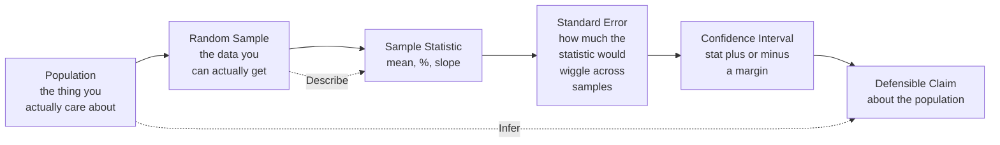

## Overview

*Naked Statistics* is Charles Wheelan's case that statistics is neither tedious
nor optional — it is the single most important body of knowledge for any
citizen who wants to read the modern world honestly. The book takes the reader
on a tour of the ideas that actually drive news headlines, medical research,
election forecasts, and economic policy: descriptive statistics, probability,
sampling, the central limit theorem, inference, regression. Along the way
Wheelan dismantles the dread that the word "statistics" triggers, replacing
formulas with intuition, jargon with stories, and anxiety with the
satisfaction of finally understanding why the polls were off, why the medical
study is being misreported, or why the regression in the news is not the
regression the journalist thinks it is.

The book follows a deliberate arc. Part One builds the descriptive toolkit —
mean, median, mode, standard deviation, correlation. Part Two introduces
probability and the Monty Hall problem as a case study in why intuition fails.
Part Three makes the leap from description to inference: sampling, the central
limit theorem, confidence intervals, hypothesis testing, and the polling
machinery that turns a few thousand phone calls into a national prediction.
Part Four lands at regression analysis, the workhorse of modern empirical
work, and ends with a sober catalogue of how it goes wrong.

This is the second installment of Wheelan's "Naked" series, following
*Naked Economics* (2002) and preceding *Naked Money* (2017). It was a *New
York Times* bestseller, and the *San Francisco Chronicle* called it
"brilliant, funny... the best math teacher you never had."

## Executive Summary

### The Two Halves of Statistics

| Half | Job | Tools |
|---|---|---|
| **Descriptive statistics** | Summarize what is true in the data you have | Mean, median, mode, standard deviation, percentiles, correlation |
| **Inferential statistics** | Use a sample to make a defensible claim about a larger population | Central limit theorem, standard error, confidence intervals, hypothesis tests, regression |

Wheelan's central claim is that almost every public misunderstanding of data
comes from conflating these two jobs — either by treating a sample like a
census, or by reading a description as if it were a causal explanation.

### The Inference Engine

The diagram captures Wheelan's main argument: the population is invisible, the
sample is all you ever see, and the entire machinery of statistics exists to
bridge the two without lying about the gap.

### Core Concepts Covered

- **Descriptive statistics** — mean, median, mode, range, standard deviation,
  percentiles, correlation coefficient.
- **Probability** — expected value, independent events, the law of large
  numbers, the Monty Hall problem.
- **Sampling and bias** — why a thousand randomly chosen Americans can
  describe three hundred million, and the five ways samples go wrong.
- **The central limit theorem** — the wizard behind every poll, every clinical
  trial, every quality-control chart.
- **Inference** — confidence intervals, hypothesis testing, statistical
  significance, p-values.
- **Regression analysis** — the workhorse of modern empirical work, and the
  seven common ways it is misused.

## Key Takeaways

1. **The mean is not the middle.** The mean is pulled toward extremes; the
   median is the true middle. When Bill Gates walks into a bar, the mean
   wealth of the patrons soars, but the median is unaffected. Use the median
   when the distribution is skewed.
2. **Standard deviation is the single most important number you are not
   taught.** It is the universal unit for "how spread out is this data."
   Two SAT prep classes can have identical mean scores and wildly different
   value, and the standard deviation is what tells them apart.
3. **Correlation is not causation.** Ice cream sales and drowning deaths
   rise together in summer. Neither causes the other. Wheelan devotes an
   entire chapter to the difference and the mental move required to hold
   them apart.
4. **The Monty Hall problem is real and stubborn.** Switching doors doubles
   your probability of winning. Thousands of people, including many PhD
   mathematicians, refuse to believe it on first contact. The example is
   Wheelan's demonstration that human intuition about probability is
   systematically unreliable.
5. **The central limit theorem is the reason the world is knowable.** Take
   any population — even a wildly non-normal one — draw a large enough random
   sample, and the distribution of sample means will look like a bell curve.
   This is the engine that makes polls, trials, and quality control possible.
6. **A confidence interval is a humility ritual.** A poll that says "52% plus
   or minus 3%" is not lying about its uncertainty — it is doing the math
   honestly. A poll that reports "52%" with no margin is hiding the same
   uncertainty behind false precision.
7. **Statistical significance is a convention, not a fact.** The 0.05
   threshold is a habit, not a law of nature. Researchers running many tests
   on the same data — the multiple comparisons problem — almost always find
   "significant" results by chance. The famous 2009 "dead salmon" fMRI
   study is Wheelan's exhibit A.
8. **Regression is the microscope of the empirical world.** With enough data
   and the right variables, regression can isolate the effect of one factor
   while holding others constant. But it can also be weaponized: the
   Women's Health Initiative showed that decades of estrogen prescriptions to
   older women were based on regression results that later randomized
   trials overturned — tens of thousands of premature deaths, by one
   estimate.
9. **A representative sample beats a large biased one.** A small sample drawn
   correctly is more valuable than a huge one drawn from the wrong
   population. The math of inference is unforgiving of selection bias.
10. **Programs that "work" often don't, because of regression to the mean.**
    The fire department that adopts a new procedure, the business featured on
    the cover of a magazine, the sports team on the cover of *Sports
    Illustrated* — they all tend to underperform afterward. The reason is
    not the new procedure. It is that they were selected at the peak of a
    random fluctuation, and random fluctuations regress.

## Who Should Read

| Reader Profile | Why This Book |
|---|---|
| The math-anxious general reader | The book exists for you. Wheelan treats the reader as intelligent but unburdened by formal training |
| Journalists, marketers, managers | Anyone who works with data and needs to stop being fooled by their own charts |
| Introductory statistics students | A friendly, story-driven supplement to a textbook — explains the *why* behind the formulas |
| Medical and health-curious readers | Will leave you far better equipped to read clinical studies and risk headlines |
| Policy professionals and analysts | Wheelan's chapters on regression, program evaluation, and program evaluation are gold |
| Citizens evaluating the news | After this book, you cannot unsee a polling error, a p-value, or a confound |

## Who Should Avoid

| Reader Profile | Why Skip |
|---|---|
| Professional statisticians | The treatment is non-technical; you will be bored by chapter 2 |
| Readers who need a textbook with proofs | The book trades rigor for accessibility and is not a substitute for a course |
| Those looking for Bayesian methods, causal inference, or machine learning | Wheelan covers the classical frequentist toolkit, not the modern extensions |
| Anyone allergic to jokes about Las Vegas, drug cartels, and HBO's *The Wire* | You have been warned |

## Difficulty

**Easy-Medium.** Wheelan writes at roughly a 7th-grade reading level (per the
book's own appendix, modeled on *Time* magazine). There are no equations in
the main text; the math is moved to an appendix for readers who want it.
Estimated reading time: **~7 hours**.

## Historical Context

*Naked Statistics* appeared in January 2013, between the 2012 and 2014 U.S.
elections — a period in which polling, Nate Silver, and the now-ubiquitous
"538" forecast turned statistical literacy into a mass political event. The
book also arrived at the crest of the data-science wave: the term
"data scientist" had just been declared the "sexiest job of the 21st
century" by *Harvard Business Review* (October 2012). Hal Varian, chief
economist at Google, had recently pronounced statistics "sexy." Wheelan's
project — strip the dread from the data — landed in a moment of acute
cultural readiness.

Wheelen's own biography shaped the project. A former correspondent for *The
Economist*, he had already written the bestseller *Naked Economics* (2002;
revised 2010), which used the same plain-English approach for economic
ideas. *Naked Statistics* extended the same formula — minimal jargon, vivid
examples, occasionally crude jokes — to the discipline whose abuse most
often appears in news headlines: statistics.

## Related Books

| Book | Author | Connection |
|---|---|---|
| *Naked Economics* | Charles Wheelan | Sister volume; same voice applied to economic thinking |
| *The Signal and the Noise* | Nate Silver | Forecasts, predictions, and why most experts are worse than a simple model |
| *How Not to Be Wrong* | Jordan Ellenberg | Mathematical thinking in everyday life, with more proofs |
| *The Drunkard's Walk* | Leonard Mlodinow | Probability and randomness for the general reader |
| *Innumeracy* | John Allen Paulos | The classic short book on mathematical illiteracy |
| *Thinking, Fast and Slow* | Daniel Kahneman | The psychology behind the cognitive errors Wheelan describes in probability |
| *Superforecasting* | Tetlock & Gardner | What separates good statistical thinkers from bad ones |
| *The Black Swan* | Nassim Taleb | A more radical critique of the same statistical tools |
| *Naked Money* | Charles Wheelan | Third volume in the series — finance, banking, monetary policy |

## Final Verdict

_** Rating: 8.5 / 10 **_

*Naked Statistics* succeeds at the very thing it sets out to do: it makes
statistics accessible to readers who would never open a textbook. The
combination of vivid stories (the SAT prep classes with identical means and
wildly different spreads, the dead salmon in the fMRI machine, the
Women's Health Initiative estrogen catastrophe), careful definitions, and a
steady drumbeat of "now you have the tools to see through this" is
genuinely liberating.

The book has clear limitations. Wheelan is faithful to the classical
frequentist toolkit, and readers who want modern causal inference (potential
outcomes, instrumental variables, directed acyclic graphs) will need to go
elsewhere — *The Book of Why* by Judea Pearl and Dana Mackenzie is the
natural next step. The book also does not engage with the replication crisis
that was gathering force in 2013 and that has since reshaped how researchers
think about p-values, preregistration, and effect sizes. A 2026 reader will
notice the absence.

Despite these gaps, the book has aged well. The core ideas — descriptive
statistics, probability, sampling, the central limit theorem, inference,
regression — are the operating system of empirical reasoning. They are not
trendy. They are not going to be overturned. And most adults in 2026 still
do not understand them. *Naked Statistics* is the friendliest, most
honest, and most useful single-volume introduction to that operating
system. Read it, and you will never read a poll, a study, or a regression
the same way again.
