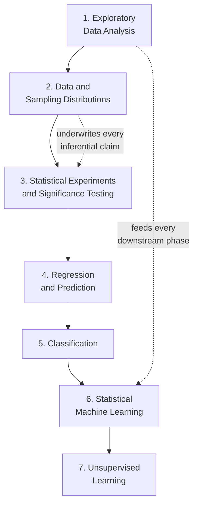
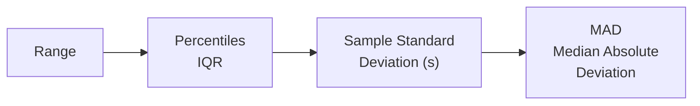
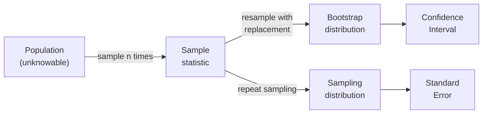
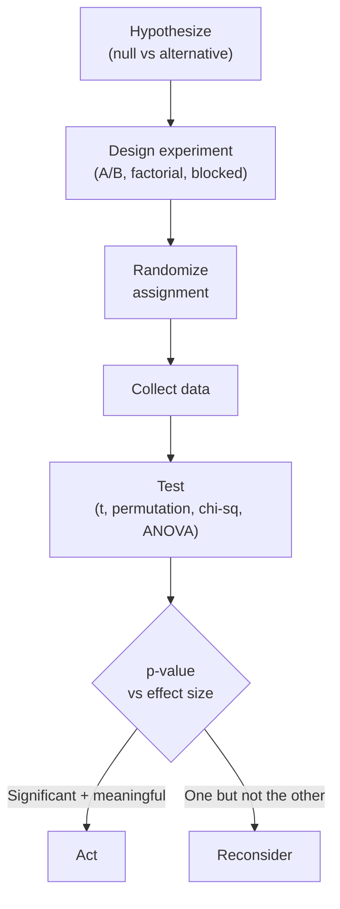
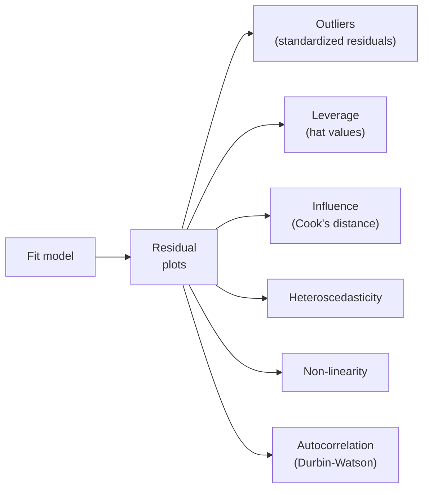
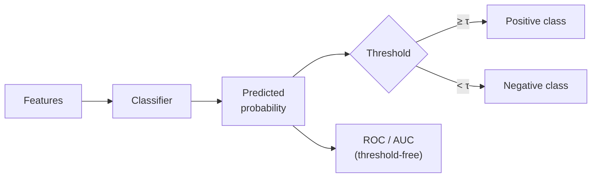
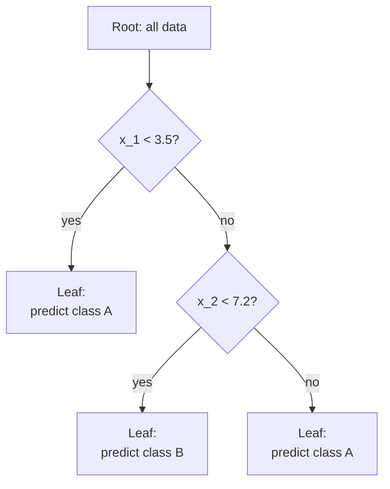
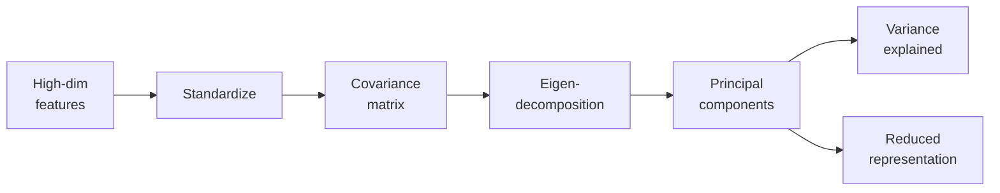

## The Seven-Chapter Map

The book moves in a deliberate arc: see the data (EDA), understand
how samples behave (sampling distributions), test claims about them
(significance testing), model them (regression, classification,
statistical ML), and finally explore their hidden structure
(unsupervised learning).

---

## Chapter 1: Exploratory Data Analysis

EDA — coined by John Tukey in 1977 — is the first task in any data
project. The Bruces argue it is also the most neglected. Their EDA
toolbox:

### Measures of Location

| Statistic | When to Use | Trap |
|---|---|---|
| Mean | Symmetric, no outliers | Not robust |
| Trimmed mean | Mild outliers | Choice of trim is arbitrary |
| Weighted mean | Unequal sample importance | Wrong weights → biased estimate |
| Median | Skew, outliers, ordinal data | Ignores magnitude |
| Mode | Categorical data | Multiple modes possible |

### Measures of Variability

The book's recurring lesson: when in doubt, prefer robust measures.
The median and MAD survive contamination that destroys the mean and
standard deviation.

### Exploring Distributions

- **Histograms and density plots** for univariate shape
- **Boxplots** for distribution at a glance plus outlier flagging
- **Frequency tables** for binned numeric data
- **Bar and pie charts** for categorical proportions
- **Contingency tables** for two-category cross-tabulation
- **Scatterplots** for two-variable continuous relationships
- **Hexagonal binning and contour plots** when scatterplots saturate

### Correlation

- Pearson's *r* for linear association
- Spearman's *ρ* and Kendall's *τ* for rank-based association
- The correlation matrix and its **correlation heatmap** as a
  one-glance pre-modeling check

The Bruces emphasize: correlation does not imply causation, and a
correlation of zero does not imply independence — only the lack of
a linear relationship.

---

## Chapter 2: Data and Sampling Distributions

### Core Concepts

- **Random sampling** beats convenience sampling every time. Bias
  is the systematic error a larger sample size will not fix.
- **Selection bias** is the silent killer of business analytics
  ("we looked at our best customers — they're great!").
- The **sampling distribution** of a statistic is the distribution
  of that statistic across hypothetical repeated samples. Its
  standard deviation is the **standard error**.
- The **bootstrap** is the practical workhorse: resample your data
  with replacement, recompute the statistic, repeat 1,000+ times,
  and read off the standard error or percentile-based confidence
  interval directly. No distributional assumptions required.

### Useful Distributions

| Distribution | Models | Example |
|---|---|---|
| Normal | Continuous, symmetric, additive errors | Heights, measurement noise |
| Student's t | Sample means, small n | Regression coefficients |
| Binomial | Yes/no trials | Conversion rates |
| Chi-square | Sum of squared normals | Independence tests |
| F | Ratio of variances | ANOVA |
| Poisson | Rare event counts | Server errors per hour |
| Exponential | Time between events | Inter-arrival times |
| Weibull | Time to failure | Survival analysis |

The book argues you do not need to memorize their formulas — you
need to recognize when each one applies.

---

## Chapter 3: Statistical Experiments and Significance Testing

### A/B Testing

Two groups, random assignment, one treatment, one control, one
metric. The Bruces stress what most teams get wrong:

- **Define the test statistic before collecting data.** Otherwise
  every analysis is post-hoc.
- **Pre-register the sample size.** Computed from desired power
  (typically 0.80), the minimum detectable effect, and the
  variability of the outcome.
- **Stop the test only at the planned endpoint.** Peeking and
  stopping early inflate the false-positive rate.

### Hypothesis Tests

- **Null hypothesis (H₀):** no effect; the status quo
- **Alternative (Hₐ):** one-sided or two-sided
- **Type I error (α):** false positive — typically 0.05
- **Type II error (β):** false negative — controlled via power
  (1 − β)
- **p-value:** probability of seeing data at least this extreme
  *if H₀ were true* — frequently misinterpreted

### Resampling-Based Tests

The book's defining stance: the **permutation test** is the
modern default. Combine all observations, shuffle group labels,
recompute the test statistic, repeat. The p-value is the fraction
of permutations that produced a statistic as extreme as the
observed one. No distribution assumed; no formula needed.

### Specific Tests

| Test | When | Replacement (Bootstrap/Permutation) |
|---|---|---|
| t-test (two-sample) | Compare two means | Permutation of group labels |
| ANOVA | Compare 3+ means | Permutation; F-statistic |
| Chi-square | Categorical independence | Permutation of contingency table |
| Fisher's exact | Small-cell contingency | Exact enumeration |
| Multi-arm bandit | Many treatments at once | Bayesian / Thompson sampling |

### Multiple Testing and Power

- **Bonferroni and FDR (Benjamini-Hochberg)** corrections
- **Degrees of freedom** as the dimension you really have
- **Power** = 1 − β; calculate before the experiment, not after

---

## Chapter 4: Regression and Prediction

### Simple and Multiple Linear Regression

The textbook fit: minimize the sum of squared residuals (OLS).
The book emphasizes interpretation over derivation:

- **Coefficient:** expected change in *y* per unit change in *x*,
  *holding other predictors constant* — a phrase most readers
  underestimate
- **Standard error of a coefficient:** computed via the bootstrap
  in practice, no need to memorize the closed form
- **R² and adjusted R²:** fraction of variance explained, with
  adjusted penalizing model complexity
- **Root mean squared error (RMSE):** the prediction-quality
  metric to report

### Diagnostics

A model that fits the training data perfectly but violates these
checks is a model that will fail on new data.

### Categorical Predictors

- **One-hot encoding** vs. **reference (dummy) coding**
- **Multicollinearity** and the dummy-variable trap

### Beyond Linearity

| Technique | Use Case |
|---|---|
| Polynomial regression | Smooth curvature |
| Spline regression | Local flexibility, controlled smoothness |
| Generalized Additive Model (GAM) | Many predictors, each with its own non-linear shape |
| Interaction terms | Effect of *x* depends on *z* |

### Regularization (foreshadowing Chapter 6)

- **Ridge** (L2): shrinks all coefficients
- **Lasso** (L1): drives some coefficients to zero (feature
  selection)
- **Elastic net:** weighted combination of both

---

## Chapter 5: Classification

### Methods

- **Naive Bayes:** strong independence assumption; surprisingly
  competitive on text
- **Linear Discriminant Analysis (LDA):** Gaussian class
  distributions, shared covariance
- **Logistic regression:** the classification analogue of linear
  regression; coefficients = log-odds changes
- **K-nearest neighbors (KNN):** lazy, distance-based; needs
  scaling

### Evaluation

| Metric | Formula | Use When |
|---|---|---|
| Accuracy | (TP + TN) / N | Classes balanced |
| Precision | TP / (TP + FP) | Cost of false positive is high |
| Recall (sensitivity) | TP / (TP + FN) | Cost of false negative is high |
| F1 | Harmonic mean of P, R | Want balance |
| ROC / AUC | TPR vs FPR across thresholds | Compare models threshold-free |
| Lift / gains | Cumulative response vs random | Marketing, scoring |

### Imbalanced Data

The Bruces dedicate substantial space to the practical reality
that most business classification problems (fraud, churn,
conversion) have rare positives:

- **Undersample the majority class** for speed
- **Oversample the minority class** for signal — SMOTE for
  synthetic samples
- **Cost-sensitive learning:** weight the loss
- **Calibrated probability thresholds** based on business cost

---

## Chapter 6: Statistical Machine Learning

### K-Nearest Neighbors

Simple, non-parametric. Scale your features first or distance is
meaningless. *K* governs the bias-variance trade-off.

### Tree Models

CART (Classification and Regression Trees) recursively splits on
the feature and threshold that maximally reduces impurity (Gini
or entropy for classification, variance for regression). Pruning
controls overfitting.

### Bagging and Random Forest

- **Bagging:** train *B* trees on bootstrap samples, average
  predictions. Reduces variance.
- **Random forest:** bagging plus a random subset of features
  considered at each split. Decorrelates the trees and improves
  performance further.
- **Variable importance:** mean decrease in impurity or mean
  decrease in accuracy when each variable is permuted.

### Boosting

Sequential, not parallel. Each tree focuses on the residuals of
the previous ensemble.

| Algorithm | Idea |
|---|---|
| AdaBoost | Up-weights misclassified examples |
| Gradient boosting | Fits trees to negative gradient of the loss |
| XGBoost | Regularized, parallelized gradient boosting — the modern default for tabular ML |

### Regularization in Practice

For both regression and classification, ridge, lasso, and elastic
net are tuned via cross-validation. Lasso doubles as a feature
selector. Standardize predictors first.

---

## Chapter 7: Unsupervised Learning

### Principal Component Analysis (PCA)

PCA finds orthogonal directions of maximum variance. Use it for
visualization (2-3 components), denoising, and as a preprocessing
step before clustering or supervised learning.

### Clustering

| Method | Assumes | Strength | Weakness |
|---|---|---|---|
| K-means | Spherical clusters, equal size | Fast, scalable | Must choose *k*; sensitive to scale |
| Hierarchical (agglomerative) | None | Dendrogram visualization | O(n²) memory |
| Model-based (GMM) | Gaussian mixture | Soft assignments, principled | Requires distribution assumption |
| DBSCAN | Density-based | Finds arbitrary shapes; flags noise | Hyperparameter-sensitive |

### Scaling and Mixed Variable Types

The chapter closes with the practical headache of clustering
when your data is part-numeric, part-categorical. **Gower's
distance** and explicit standardization of numeric features are
the standard treatments.

---

## Key Lessons Across All Chapters

- **EDA is not optional, ever** — and it pays for itself
  hundredfold by the end of the project
- **The bootstrap is the single most useful technique in the
  book** — learn it cold
- **Effect sizes communicate; p-values gate-keep** — report both
- **Regression is interpretable; tree ensembles are accurate** —
  pick based on your stakeholder, not your taste
- **Regularization is required**, not optional, the moment your
  predictors outnumber a small constant
- **Unsupervised methods produce hypotheses, not answers** — feed
  them to humans, not to systems

---

## Action Plan

1. **Audit your current EDA habit.** Are you actually producing
   histograms, boxplots, and correlation matrices on every new
   dataset? If not, build a personal EDA template.

2. **Replace one closed-form CI calculation with a bootstrap this
   week.** Pick any metric on a real dataset. Resample 10,000
   times. Read the 2.5th and 97.5th percentiles. Compare to your
   textbook formula.

3. **Recompute the last p-value you reported, with its effect
   size and CI.** Decide whether the *practical* conclusion
   changes. Apply that habit to every test going forward.

4. **For your next tabular ML problem, start with logistic
   regression, then a random forest, then XGBoost.** Compare via
   cross-validated AUC. Pick the simplest model whose performance
   loss is within tolerance.

5. **Stop A/B tests at the planned size, not when they look
   significant.** Pre-compute the sample size from power, MDE,
   and baseline variance.

6. **Standardize your features before any distance-based method**
   — KNN, K-means, PCA, hierarchical clustering, anything with a
   distance metric.

7. **Read the book in both languages.** Even if you live in one,
   the cross-language exposure tightens your understanding of the
   underlying statistics.
