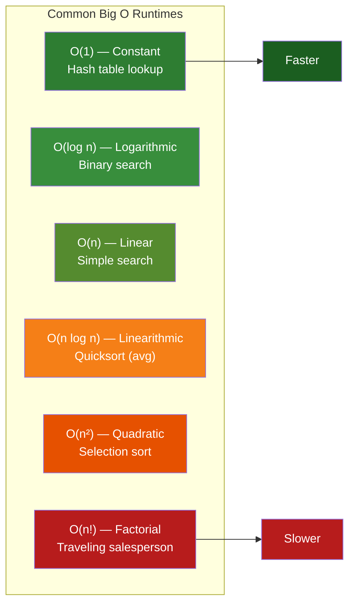
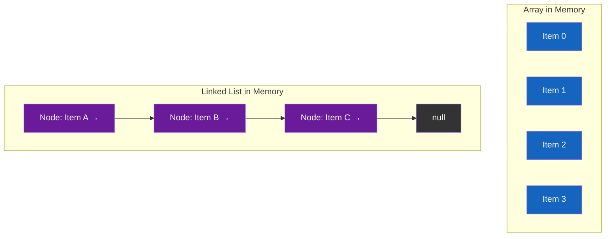
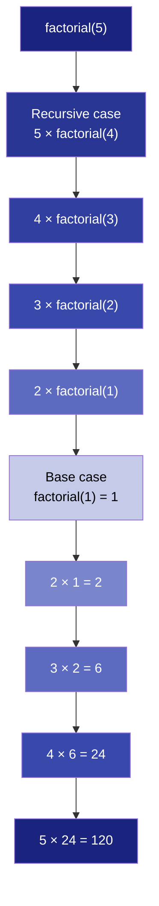
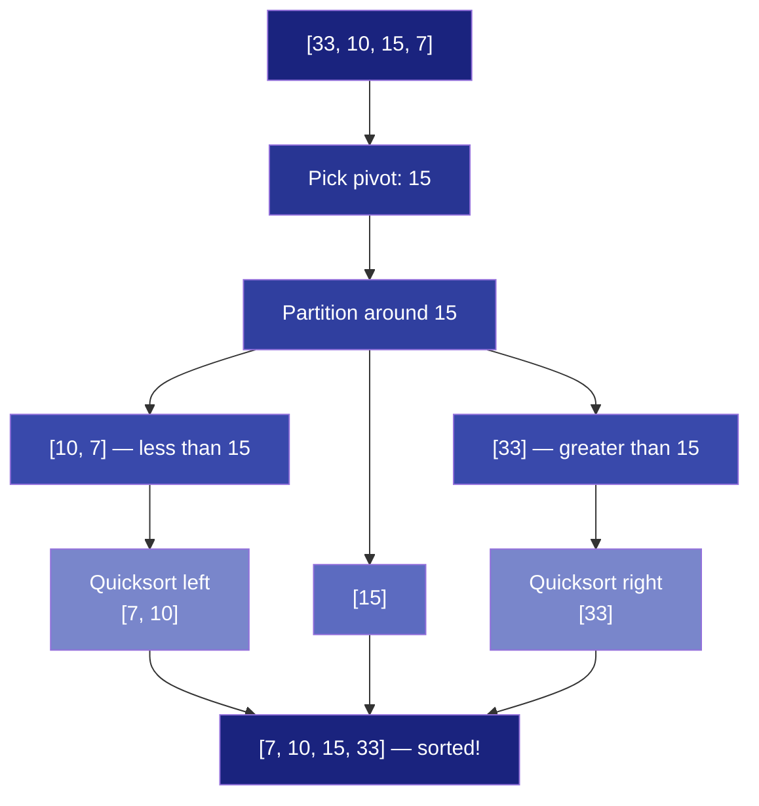
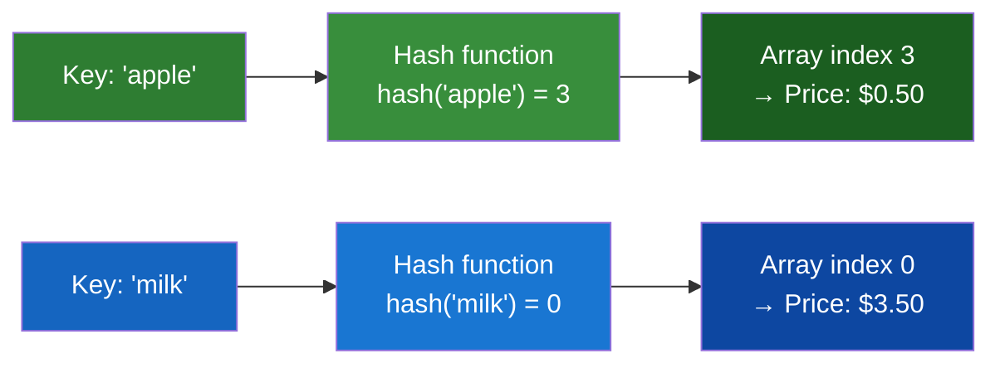
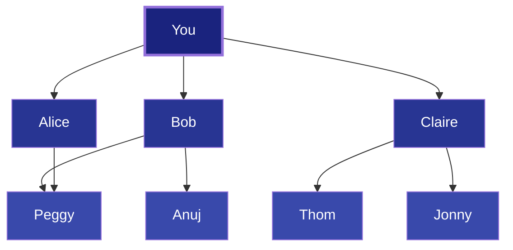
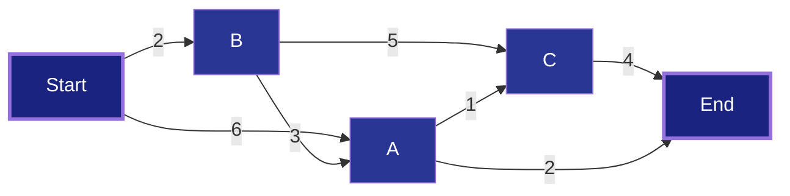

# Core Concepts — Grokking Algorithms

## 1. Binary Search — Cutting the Problem in Half

Binary search works on a **sorted** list. Instead of checking every element (simple search), it checks the middle element, eliminates half the remaining elements, and repeats. Every step halves the search space.

**Analogy**: Guessing a number between 1 and 100. Each guess tells you "higher" or "lower." Binary search always guesses the middle of the remaining range. You never need more than 7 guesses — because log₂(100) ≈ 7.

**The math**: For a list of n items, simple search takes n steps in the worst case. Binary search takes log₂(n) steps. For n = 4 billion, that's 4 billion vs. 32.

```python
def binary_search(list, item):
    low = 0
    high = len(list) - 1
    while low <= high:
        mid = (low + high) // 2
        guess = list[mid]
        if guess == item:
            return mid
        if guess > item:
            high = mid - 1
        else:
            low = mid + 1
    return None
```

**Key constraint**: The list must be sorted. Sorting costs time too — binary search's O(log n) only matters if you can amortize the sort cost over many searches.

---

## 2. Big O Notation — The Language of Algorithm Cost

Big O describes how an algorithm's runtime grows as the input grows. It's not about seconds — it's about **growth rate**.



Key runtimes from fastest to slowest:

| Big O | Name | Example Algorithm |
|-------|------|------------------|
| O(1) | Constant | Array access, hash table lookup |
| O(log n) | Logarithmic | Binary search |
| O(n) | Linear | Simple search, iterating a list |
| O(n log n) | Linearithmic | Quicksort (average), merge sort |
| O(n²) | Quadratic | Selection sort, bubble sort |
| O(n!) | Factorial | Traveling salesperson (brute force) |

**Rule of thumb**: If you see nested loops over the same input, suspect O(n²). If the problem space halves at each step, suspect O(log n).

---

## 3. Arrays vs. Linked Lists — Memory's Two Flavors



| Operation | Array | Linked List |
|-----------|-------|-------------|
| Read | O(1) — instant index | O(n) — must traverse |
| Insert at beginning | O(n) — shift everything | O(1) — just update pointers |
| Delete | O(n) — shift | O(1) — if you know the node |
| Memory | Contiguous block | Scattered, each node has overhead |

**Choose arrays** when you need fast random access and know the size in advance. **Choose linked lists** when you do frequent inserts/deletes and rarely need random access.

---

## 4. Recursion — When a Function Calls Itself

Every recursive function has two parts:

- **Base case**: when to stop (the function does NOT call itself)
- **Recursive case**: when to continue (the function calls itself)



**The call stack**: Each recursive call pushes a frame onto the call stack with its own local variables. When the base case is reached, the stack unwinds — each frame returns its result to the caller.

**Warning**: Each frame consumes memory. If recursion goes too deep, you get a stack overflow. Iteration (loops) doesn't have this problem but can be harder to read.

---

## 5. Quicksort — Divide and Conquer

Quicksort is the classic divide-and-conquer algorithm:

1. Pick a **pivot** element from the array.
2. **Partition**: create two sub-arrays — elements less than the pivot, and elements greater than the pivot.
3. Recursively quicksort each sub-array.
4. Combine: left + pivot + right.



| Case | Runtime | When |
|------|---------|------|
| Best | O(n log n) | Pivot is the median element |
| Average | O(n log n) | Random pivot |
| Worst | O(n²) | Pivot is always min or max (e.g., already sorted array with first-element pivot) |

**Practical note**: Quicksort is typically faster than merge sort because it works in-place (no extra array allocation) and has good cache locality. The worst case is avoidable by shuffling the input or picking a random pivot.

---

## 6. Hash Tables — The Superpower Data Structure

A hash table = a **hash function** + an **array**. The hash function maps a key (e.g., "apple") to an array index. Lookup, insert, and delete are all O(1) on average.



**Use cases**:
- **Lookups**: Phone book (name → number), DNS (domain → IP)
- **Deduplication**: Check if a voter has already voted
- **Caching**: Store results of expensive computations
- **Modeling relationships**: Graph adjacency lists

**Collision resolution**: When two keys hash to the same index, use a linked list at that index (chaining). To keep performance, keep the **load factor** (items / total slots) below 0.7.

| Operation | Average | Worst Case |
|-----------|---------|------------|
| Search | O(1) | O(n) |
| Insert | O(1) | O(n) |
| Delete | O(1) | O(n) |

---

## 7. Breadth-First Search — Shortest Path in a Graph

BFS answers two questions:
1. Is there a path from node A to node B?
2. What is the **shortest** path from A to B?



BFS processes nodes in order of distance from the start: first-degree connections first, then second-degree, etc. This requires a **queue** (FIFO — First In, First Out).

**Implementation pattern**:
```
1. Start with a queue containing the starting node
2. Mark the starting node as visited
3. While the queue is not empty:
   a. Dequeue a node
   b. If it's the target, return success
   c. For each unvisited neighbor, mark visited and enqueue
4. Return failure (no path exists)
```

**Runtime**: O(V + E) where V = vertices, E = edges. Each node is visited once, each edge is examined once.

---

## 8. Dijkstra's Algorithm — Weighted Shortest Path

Dijkstra's algorithm extends BFS to graphs where edges have **weights** (costs). Each edge has a non-negative number representing the cost to traverse it.



**The four steps**:
1. Find the cheapest unvisited node (lowest cost from start).
2. Update the costs of its neighbors. If the new path is cheaper, update.
3. Mark the node as visited (don't check it again).
4. Repeat until all nodes are visited.

**Critical**: Dijkstra assumes **non-negative weights**. Negative weights can cause it to miss a cheaper path discovered later. For negative weights, use Bellman-Ford.

---

## 9. Dynamic Programming — The Knapsack Grid

Dynamic programming solves problems by breaking them into subproblems and solving each subproblem once. The classic example is the **knapsack problem**: maximize the value of items you can steal given a weight limit.

**The grid approach**:

|  | 1 lb | 2 lb | 3 lb | 4 lb |
|--|------|------|------|------|
| Guitar ($1500, 1 lb) | $1500 | $1500 | $1500 | $1500 |
| Stereo ($3000, 4 lb) | $1500 | $1500 | $1500 | $3000 |
| Laptop ($2000, 3 lb) | $1500 | $1500 | $2000 | $3500 |

**The recurrence** (same for every DP problem):

```
cell[i][j] = max(
    cell[i-1][j],                           // previous best for this capacity
    value[i] + cell[i-1][j - weight[i]]     // current item + best for remaining capacity
)
```

**When to use DP**:
- The problem asks for the **maximum** or **minimum** of something
- The problem can be broken into **discrete subproblems**
- Subproblems **overlap** (same subproblem appears in multiple branches)

**DP is not divide-and-conquer**: D&C solves independent subproblems. DP solves overlapping subproblems and stores results.

---

## 10. Greedy Algorithms — Pick the Best Local Choice

A greedy algorithm makes the **locally optimal** choice at each step, hoping it leads to the globally optimal solution. This doesn't always work — but when it does, the algorithm is simple and fast.

**Set-covering problem**: You have a list of US states to cover and a list of radio stations, each covering certain states. What's the smallest set of stations to cover all states?

**Greedy approximation**:
```
1. Pick the station that covers the most uncovered states.
2. Repeat until all states are covered.
```

The greedy solution won't always be optimal, but it will be within a known bound of optimal and runs in polynomial time. For NP-complete problems (traveling salesperson, scheduling, set-covering), greedy approximation is often the best practical approach.

**Identifying NP-complete problems**:
- The algorithm runs in O(n!) or O(2ⁿ) with a small n
- "Find the smallest set" or "find the exact combination"
- Can be expressed as "all combinations of X"

---

## 11. K-Nearest Neighbors — Machine Learning in a Nutshell

KNN is a simple classification and regression algorithm. To classify a new data point, find the k closest points in the training data and take a vote.

**Classification**: Assign the category that appears most among the k nearest neighbors. Example: classify a fruit as orange or grapefruit based on size and color.

**Regression**: Predict a value (e.g., price) by averaging the values of the k nearest neighbors.

**Distance metrics**:
- **Euclidean distance**: √((x₁ - x₂)² + (y₁ - y₂)²) — for continuous features
- **Cosine similarity**: measures angle, not magnitude — for text and high-dimensional data

**Key insight from the book**: Feature extraction matters more than the algorithm. Picking the right features (normalized, relevant, independent) is the hardest part of KNN.
