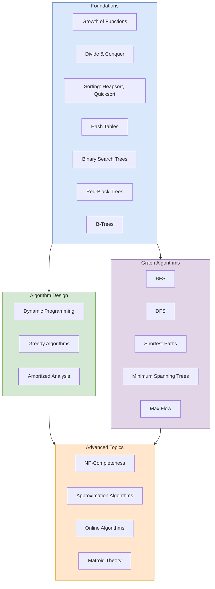

## Overview

_Introduction to Algorithms_, universally known as **CLRS** (after its
authors' initials), is the definitive textbook on algorithms and data
structures. First published in 1990, it has educated generations of
computer scientists at MIT and universities worldwide. The 4th edition
(2022) adds coverage of dynamic programming advanced techniques,
matching flow analysis, and online algorithms, while maintaining the
rigorous but accessible style that made the book a classic.

At its core, CLRS is an encyclopedia of algorithmic methods: sorting,
searching, graph algorithms, dynamic programming, greedy algorithms,
NP-completeness, and approximation algorithms. Each algorithm is
presented with pseudocode, a formal correctness proof, and a detailed
asymptotic analysis.

---

## Executive Summary

---

## Key Takeaways

**Algorithms are about correctness and efficiency.** Every algorithm in
CLRS is presented with a proof that it works and an analysis of its
running time and space usage. The central concern is asymptotic
complexity — how resource usage grows with input size.

**Asymptotic notation (Big-O, Theta, Omega) is the language.** Chapter 3
establishes the notational framework used throughout the book. You
cannot read CLRS without mastering Big-O, Big-Theta, and Big-Omega.

**Divide and conquer is the root design paradigm.** Merge sort
introduces the pattern: divide, conquer recursively, combine. This
pattern recurs in Strassen's matrix multiplication, the maximum-subarray
problem, and many others.

**Sorting is the model problem.** Heapsort, quicksort (with its
randomized variant), and counting/radix/bucket sorts cover the full
spectrum of comparison-based and non-comparison sorting. The
comparison-sorting lower bound of Omega(n log n) is derived.

**Dynamic programming = recursion + memoization + optimal substructure.**
Rod cutting, matrix-chain multiplication, LCS (longest common
subsequence), and optimal BSTs are the canonical examples. The 4th
edition adds a section on DP with bitmasks.

**Graph algorithms are the largest single topic.** Six chapters cover
BFS, DFS, topological sort, strongly connected components, shortest
paths (Bellman-Ford, Dijkstra, Floyd-Warshall), and minimum spanning
trees (Kruskal, Prim). The 4th edition adds a chapter on max flow with
the Edmonds-Karp algorithm.

**NP-completeness is not the end.** Chapter 34 defines P, NP,
NP-completeness, and gives reductions for dozens of classic problems.
Chapter 35 then shows that approximation algorithms can give provably
good solutions for many NP-hard problems.

---

## Who Should Read This

- CS undergraduates taking an algorithms course (the book follows the
  standard curriculum)
- Graduate students needing a reference for advanced topics
- Self-taught programmers who want rigorous CS foundations
- Interview candidates preparing for algorithmic coding interviews
- Working engineers who need to understand why an algorithm does or
  does not apply to their problem

## Who Shouldn't

- Beginners who have never programmed — some programming maturity is
  assumed
- Readers looking for implementation-ready code — pseudocode is the
  medium; you translate to your language of choice
- Anyone wanting a "practical" cookbook of ready-made solutions — this
  is a theory text, not a recipe book
- Readers intimidated by mathematical notation and proofs

---

## Difficulty: Hard

CLRS is mathematically demanding. It assumes comfort with:
- Mathematical induction and proof by contradiction
- Summations, recurrences, and series
- Probability (especially for randomized algorithms and amortized
  analysis)
- Basic set theory and graph theory

The book is dense. A typical reader covers 10–15 pages per hour of
focused study. The exercises at the end of each section range from
straightforward to research-level difficult.

---

## Reading Time

~80 hours for a first pass (reading the main text, skipping most
exercises). A full semester course covers roughly 600–700 pages.

---

## Editions

| Edition | Year | Pages | Major Changes |
|---------|------|-------|---------------|
| 1st | 1990 | 1028 | Original; 3 authors (no Stein) |
| 2nd | 2001 | 1180 | Added Stein as co-author; new chapters on B-trees, binomial heaps, Fibonacci heaps |
| 3rd | 2009 | 1312 | New chapters on van Emde Boas trees, multithreaded algorithms, matchings |
| 4th | 2022 | 1312 | Expanded DP (bitmasks, nonlinear knapsack), online algorithms, matrix inversions removed, new exercise sets |

---

## Historical Context

CLRS emerged from MIT's course 6.046 (Design and Analysis of Algorithms)
which had used draft lecture notes for years. The first edition was
rushed to print because of rampant photocopying of the notes. It became
the most widely used algorithms textbook globally, translated into more
than a dozen languages. The authors have maintained it across four
editions, adapting to shifts in the field while preserving the original
pedagogical approach.

---

## Related Books

| Book | Author | Relation |
|------|--------|----------|
| _The Algorithm Design Manual_ | Steven S. Skiena | More practical, less formal — "Skiena tells you what CLRS proves" |
| _Algorithms_ | Robert Sedgewick, Kevin Wayne | Java-based, more visual, less proof-heavy |
| _Algorithm Design_ | Jon Kleinberg, Éva Tardos | Problem-oriented approach, modern selection |
| _The Art of Computer Programming_ | Donald E. Knuth | Encyclopedic depth; CLRS is accessible, TAOCP is the ultimate reference |
| _Competitive Programming_ | Halim & Halim | Application-focused; assumes CLRS-level theory |

---

## Final Verdict

CLRS is the algorithms textbook. It is not the easiest, the shortest,
or the most practical — but it is the most complete and the most
rigorous. Every CS professional should own a copy. Most will not read
it cover to cover, but anyone who does will emerge with a deep,
mathematically grounded understanding of how algorithms work and why
they are correct. The 4th edition is the definitive version: updated
for modern concerns (online algorithms, multithreading), without the
accumulated cruft of earlier editions.
