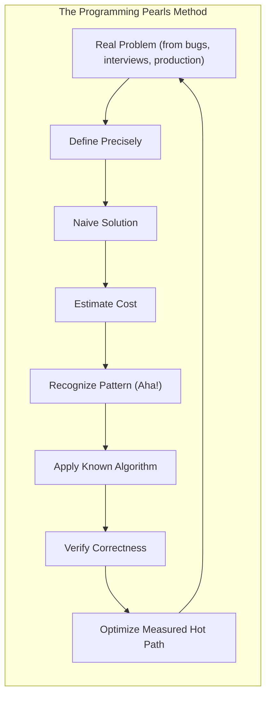
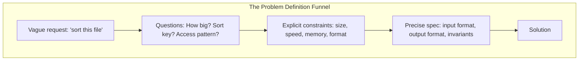
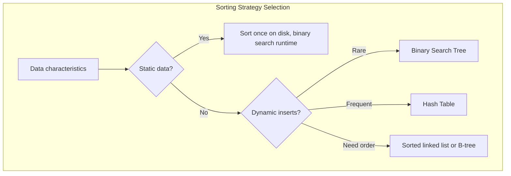
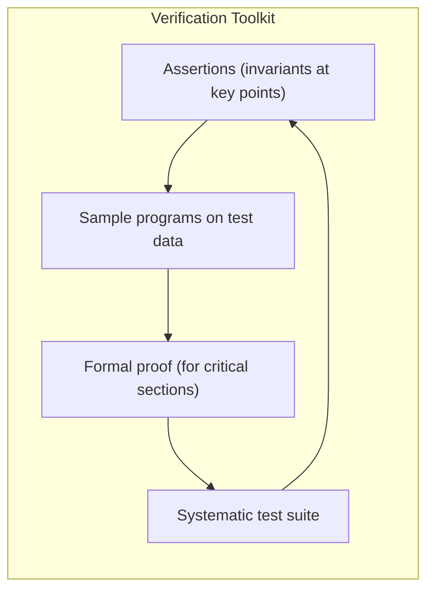
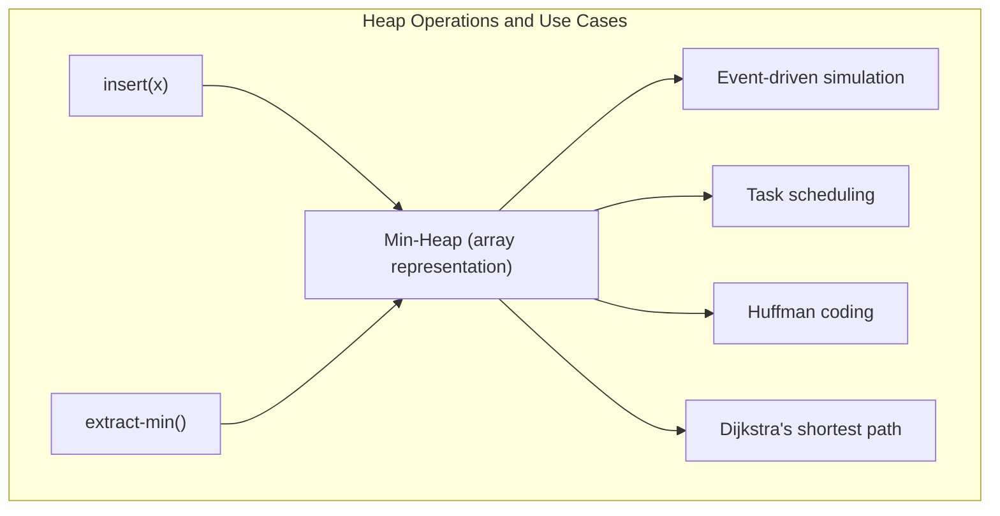

## The Column Format: Thinking in Public



Each column in Programming Pearls follows the same arc: a real-world problem arrives, the naive solution is explored and its cost estimated, an algorithmic insight (the "Aha!") reframes the problem, a known algorithm is applied, and the result is verified. Understanding this arc is more important than memorizing any single algorithm.

---

## Problem Definition: The Hardest Step



Column 1 introduces the book's thesis with a parable: a programmer receives a vague task, builds a polished solution to the wrong problem, and learns that **clarifying the task is harder than implementing the solution**. Bentley's recommendation is to write the problem statement before writing any code, then iterate on the statement until it captures the essential constraints.

---

## The Right Data Structure: Highest-Leverage Decision

The choice of data structure determines the complexity of the solution more than any other decision. Bentley returns to this theme throughout the book.

| Data Structure | Best For | Average Lookup | Insertion | Supports Order? |
|---|---|---|---|---|
| Sorted array + binary search | Static data, many lookups | O(log n) | O(n) | Yes |
| Hash table | Key-value lookup, fast average | O(1) | O(1) | No |
| Binary search tree | Ordered traversal, range queries | O(log n) | O(log n) | Yes |
| Bit vector | Membership testing on dense integer domain | O(1) | O(1) | No |
| Priority queue / heap | Priority-driven processing | O(1) min | O(log n) | No |

Bentley's rule: **before optimizing, check whether a different data structure would change the algorithmic complexity.** Switching from a linked list to a hash table, or from O(n) lookup to O(log n) binary search, is worth more hours of micro-optimization than any loop-level tweak.

---

## Sorting and Divide and Conquer



Column 11 on sorting is one of the most quoted in the book. Bentley's insight: quicksort's average O(n log n) is practical, its implementation is simple, and its cache behavior makes it faster in practice than many theoretically superior alternatives. The column also introduces the idea of **sort-based algorithms** — sort the data first, then queries become cheap (binary search rather than linear scan).

Divide and conquer appears as a recurring pattern: break a large problem into subproblems, solve each recursively, combine results. Bentley shows this in sorting (quicksort, merge sort), searching (binary search), selection (finding the kth smallest element), and string processing.

---

## Hashing: Elegance in O(1)

```mermaid
mindmap
  root("Hashing Principles")
  Hash_Function
    "Spreads keys uniformly across buckets"
    "Fast to compute"
    "Avoids clustering"
  Collision_Resolution
    "Separate chaining (linked lists per bucket)"
    "Open addressing (linear probing, double hashing)"
  Trade_offs
    "O(1) average lookup"
    "O(n) worst case (all keys collide)"
    "Rehashing load factor ~0.75"
```

Column 7 ("Larry's Problem") demonstrates the power of hashing with a case study: a program that needed to determine whether a word had appeared before could process over a million words per second using a hash table, where a sorted array with binary search was already fast but the hash table was conceptually simpler and had O(1) average insertion.

Bentley emphasizes that hashing is not always the right answer: it does not support ordered traversal or range queries, it has O(n) worst-case behavior, and it requires more memory overhead than a sorted array.

---

## Binary Search: The $O(\log n)$ Workhorse

Binary search on a sorted array is one of the most fundamental algorithms in computing. Bentley dedicates Column 7 to showing how a binary search can perform over a million lookups per second on modest hardware. The implementation is simple:

- Precondition: the array is sorted
- Repeatedly halve the search range
- Return the element or report absence in O(log n) comparisons

Bentley highlights where binary search beats hashing: when the dataset is static (sorted once, searched many times), when memory is constrained, and when range queries or ordered iteration are needed.

---

## Verification and Correctness



Column 4 ("Writing Correct Programs") establishes that verification is part of programming, not an afterthought. Bentley's hierarchy of verification tools:

1. **Assertions** — Insert `assert(condition)` at key points to document and check invariants. Remove them in production builds if needed, but keep them in during development.
2. **Sample programs** — Write small programs that exercise the code on known inputs. The output must match hand-verified expectations.
3. **Formal proof** — For the most critical sections (e.g., the binary search loop invariant), write a short proof that the algorithm terminates and is correct. The proof in the book is about 12 lines.
4. **Systematic testing** — Edge cases, typical cases, and adversarial inputs each deserve specific test cases.

Bentley's rule: **write the program to be correct first, then verify it, then optimize the tested-correct version.** Do not optimize unverified code — you will be optimizing bugs.

---

## Estimation: The Back of the Envelope

Column 8 is the most practically applicable chapter for working engineers. Bentley demonstrates quick arithmetic to estimate program resource needs:

- **Time estimation**: count operations, apply constants (memory access, arithmetic, I/O), multiply by clock rate
- **Space estimation**: multiply data structures by their size; check against available memory
- **Algorithm comparison**: estimate the constant factors (I/O vs CPU, cache effects) that determine which of two O(n log n) algorithms is faster in practice

The point is not to get an exact answer. The point is to **filter out impossible designs** before implementation. A back-of-the-envelope estimate that shows a proposed algorithm will require 10 terabytes of memory eliminates that design in minutes — cheaper than a week of implementation followed by a rewrite.

---

## Performance Tuning: Measure Before Optimizing

Bentley's approach to performance:

1. **Write correct code first.** Do not worry about performance during initial implementation.
2. **Profile to find the bottleneck.** Do not guess — measure. The hot path is rarely where you expect.
3. **Optimize the bottleneck only.** A 10x speedup on a function called 1% of the time saves 10%. Profile-guided optimization targets the 90%.
4. **Verify again after optimization.** Optimization frequently introduces bugs. Re-run your verification suite.

Bentley gives concrete examples: replacing a linear scan with a binary search, precomputing a lookup table, using a better data structure — these changes appear in the book as the result of systematic measurement, not intuition.

---

## Debugging: Finding and Fixing Bugs

Column 6 is a case study in systematic debugging. A bug is found in a widely-used sorting implementation. Bentley walks through the diagnosis:

- Reproduce the bug with a minimal test case
- Isolate the failing condition
- Form a hypothesis about the cause
- Test the hypothesis with targeted modifications
- Fix the root cause, not the symptom

The chapter reinforces: **debugging is twice as hard as writing the code.** Therefore, write clever code only if you are as clever as the person who must debug it — and that person might be you in six months.

---

## Priority Queues (Heaps)



Column 14 introduces the heap and priority queue. The heap is an array-structured tree that supports O(log n) insertion and O(log n) extraction of the minimum (or maximum) element. Bentley shows how this simple structure enables a wide range of priority-driven algorithms: simulations where events are processed in time order, task schedulers where highest-priority work runs first, and Huffman coding where the lowest-frequency symbols are merged first.

---

## String Algorithms

Column 15 turns to string processing — the domain of text, DNA sequences, log files, and any sequence of symbols. Bentley covers:

- **String hashing** — O(1) average lookup for exact string matches
- **Radix sorting** — O(n) sorting for fixed-length keys, leveraging character-by-character processing
- **Tries** — tree-structured dictionaries for prefix-based operations (autocomplete, spell check)
- **Substring search** — practical algorithms for finding one string inside another

The unifying theme: **choose the representation that matches your access pattern**. A hash table is fast for exact lookup, a trie is fast for prefix operations, and a sorted array with binary search is fast for range queries.

---

## Space-Time Trade-offs: The Recurring Decision

Throughout the book, Bentley returns to the idea that **time and space are interchangeable resources**. Every data structure decision is a trade-off:

| Decision | Saves Time | Costs Space |
|---|---|---|
| Hash table | O(1) lookup | Extra memory for buckets and entries |
| Binary search tree | O(log n) ordered ops | Node overhead per element |
| Sorted array + binary search | O(log n) lookup, cache-friendly | O(n log n) one-time sort cost |
| Lookup table / precomputation | O(1) runtime | O(n) or O(n²) stored results |
| Bit vector for membership | O(1) membership test | One bit per possible element |

Bentley never presents these decisions as having a single correct answer. The right choice depends on the access pattern, the data size, the hardware, and the performance requirement.
