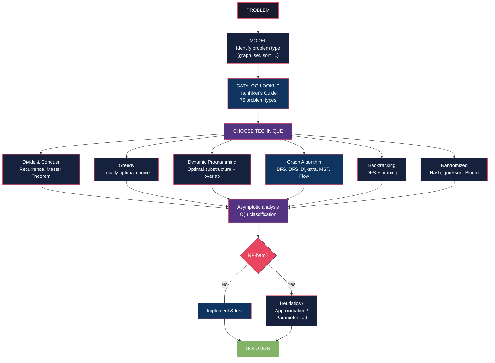

# Core Concepts

## The Two-Part Architecture

The Algorithm Design Manual is two books bound under one cover, and Skiena
is explicit that they should be read differently. **Part I: Practical
Algorithm Design** is a textbook. Read it cover to cover in 30–40 hours
and you will have a working toolkit of design techniques, data
structures, and classical algorithms. **Part II: The Hitchhiker's Guide
to Algorithms** is a reference catalog of 75 of the most important
algorithmic problems in computer science. You browse it when you
encounter a problem on the job and need to know what it is called, what
variants exist, and where to look for a known solution.

This split is the book's defining feature. Most algorithms texts are
either textbooks (CLRS) or encyclopedias (Knuth's TAOCP). Skiena
deliberately writes the practical textbook the working programmer
needs, then bolts on the problem catalog that is missing from every
other textbook on his shelf.

```mermaid
flowchart LR
    PROBLEM["Real-world<br/>problem"] --> MODEL["1. Model:<br/>what kind of<br/>problem is it?"]
    MODEL --> CATALOG["2. Look it up<br/>in the catalog"]
    CATALOG --> DESIGN["3. Design<br/>algorithm using<br/>Part I techniques"]
    DESIGN --> ANALYZE["4. Analyze<br/>asymptotic cost"]
    ANALYZE --> IMPLEMENT["5. Implement<br/>& test"]
    IMPLEMENT -->|"stuck on hard<br/>problem"| HEURISTIC["6. Heuristic or<br/>approximation"]

    style PROBLEM fill:#f9d5e5,stroke:#917192
    style MODEL fill:#d5e8d4,stroke:#82b366
    style CATALOG fill:#dae8fc,stroke:#6c8ebf
    style DESIGN fill:#ffe6cc,stroke:#d79b00
    style ANALYZE fill:#e1d5e7,stroke:#9673a6
    style IMPLEMENT fill:#d5e8d4,stroke:#82b366
    style HEURISTIC fill:#f8cecc,stroke:#b85450
```

The loop above is Skiena's algorithm design process in seven steps.
Notice that the very first step is *modeling*, not coding. This is
the book's deepest lesson: most algorithmic failures are modeling
failures, not implementation failures.

---

## Part I: Practical Algorithm Design

### Algorithm Analysis Without Tears

Skiena's chapter 2 teaches asymptotic analysis through intuition and
examples rather than formal proof. The RAM model assumes each simple
operation (+, *, dereference, function call) costs one unit. Real
machines violate this constantly — cache misses, branch prediction,
SIMD, and page faults mean constant factors can dominate the
asymptotic term — but the model is good enough to make rough
predictions about scaling.

The growth-rate table every working programmer should memorize:

| Complexity | Name | n=1,000 | n=1,000,000 |
|------------|------|---------|------------|
| O(1) | constant | instant | instant |
| O(log n) | logarithmic | instant | instant |
| O(n) | linear | instant | ~1ms |
| O(n log n) | linearithmic | instant | ~20ms |
| O(n²) | quadratic | ~1ms | ~3 hours |
| O(2ⁿ) | exponential | 10³⁰ years | heat death |
| O(n!) | factorial | 10²⁵⁶⁷ years | don't |

The last two rows are why NP-complete problems are not solved by
brute force at scale, and why the search for efficient algorithms is
not academic.

Skiena's most useful warning: do not optimize the wrong constant.
A well-designed O(n log n) algorithm with a 10× constant factor
usually beats a poorly designed O(n) algorithm at practical sizes.
The asymptotic class is the *first* thing to check, not the *only*
thing.

### Data Structures

Skiena's chapter 3 covers the structures every programmer must know:
**stacks, queues, doubly-linked lists, hash tables, binary search
trees, and priority queues (heaps)**. Each gets the same treatment:
the interface, the most common implementation, the asymptotic cost
of each operation, and a war story showing what happens when you pick
the wrong one.

The under-appreciated data structure in this chapter is the
**priority queue**, implemented as a binary heap. Priority queues are
the engine of Dijkstra's algorithm, Prim's algorithm, Huffman coding,
event-driven simulation, and most job schedulers. A heap gives you
`insert` in O(log n) and `extract-min` in O(log n), and you can
implement it in 30 lines of C.

| Structure | Insert | Find | Delete | Notes |
|-----------|--------|------|--------|-------|
| Array (unsorted) | O(1) | O(n) | O(n) | Simplest possible |
| Array (sorted) | O(n) | O(log n) | O(n) | Binary search |
| Linked list | O(1) | O(n) | O(1) | No random access |
| Hash table | O(1) avg | O(1) avg | O(1) avg | Need good hash function |
| BST (balanced) | O(log n) | O(log n) | O(log n) | Ordered iteration |
| Heap | O(log n) | O(n) | O(log n) | Extract-min only |
| Trie | O(k) | O(k) | O(k) | k = key length, strings |

### Sorting

Quicksort, mergesort, and heapsort all hit O(n log n) in the average
or worst case, but they differ in practical behavior. Quicksort is
the fastest in cache and registers, with the worst worst case (O(n²)
on already-sorted input — a fatal flaw that the 3rd edition's
randomized pivot fix addresses). Mergesort is the stable choice,
ideal for linked lists and external sorting. Heapsort is the
in-place choice with guaranteed O(n log n), at the cost of worse
cache behavior.

Skiena's war story on sorting: a real consulting client paid for a
"super-fast" custom sort that turned out to be O(n²) on their data
because the chosen pivot was always the minimum. The fix was
randomization, not a new algorithm.

### Divide and Conquer

Divide and conquer is the simplest design paradigm: split the
problem, solve the pieces recursively, combine the results.
Mergesort, quicksort, binary search, Karatsuba multiplication,
Strassen's matrix multiplication, and the Fast Fourier Transform are
all divide-and-conquer algorithms. The Master Theorem gives the
recurrence, and the recurrence gives the complexity:

| Recurrence | Solution | Example |
|------------|----------|---------|
| T(n) = aT(n/b) + O(nᶜ), a < bᶜ | O(nᶜ) | Mergesort |
| T(n) = aT(n/b) + O(nᶜ), a = bᶜ | O(nᶜ log n) | Build-heap |
| T(n) = aT(n/b) + O(nᶜ), a > bᶜ | O(n^(log_b a)) | Strassen |

### Graph Traversal

Graphs model everything: road networks, social networks, dependency
graphs, the web, molecules, computer networks, scheduling, compilers.
**Breadth-first search** finds shortest paths in unweighted graphs in
O(V + E). **Depth-first search** builds spanning trees, finds
strongly connected components, detects cycles, and topologically sorts
in O(V + E). Every other graph algorithm is built on one of these two
primitives.

DFS also has a beautiful application in **backtracking**: most
combinatorial search is DFS with pruning, and Skiena dedicates
chapter 8 to it. The lesson: when a problem has too many states to
enumerate, branch, prune, and search — then *prune more aggressively*.

### Weighted Graph Algorithms

Three classical algorithms handle the majority of weighted-graph
problems:

- **Dijkstra's algorithm** — single-source shortest paths with
  non-negative weights. O((V + E) log V) with a heap. The most
  important graph algorithm in practice.
- **Bellman-Ford** — single-source shortest paths allowing negative
  weights, with negative-cycle detection. O(VE). Use when Dijkstra
  doesn't apply.
- **Floyd-Warshall** — all-pairs shortest paths. O(V³). Simple,
  dense, and unbeatable when V is small.
- **Kruskal's and Prim's algorithms** — minimum spanning trees. Both
  O(E log V). Use MST for clustering, network design, and
  approximation algorithms.
- **Edmonds-Karp / Dinic's algorithm** — maximum flow. The single
  most versatile optimization algorithm: bipartite matching,
  network connectivity, segmentation, project selection, and
  dozens of other problems reduce to max flow.

Skiena spends serious time on max flow because it is the canonical
example of a problem that *looks* specialized but is, in fact, a
universal hammer for a large class of problems.

### Dynamic Programming

Dynamic programming is the technique that most beginners struggle
with and most professionals misuse. Skiena's chapter 9 makes it
concrete: DP applies when a problem has optimal substructure (the
optimal solution contains optimal solutions to subproblems) and
overlapping subproblems (the same subproblems are solved many times
in a naive recursion).

The technique: write the recursion, memoize, then turn the memoized
recursion into a bottom-up table. The result is polynomial time for
problems that are exponential by brute force.

Classic DP problems Skiena works through:

- **Fibonacci** — the trivial example
- **Binomial coefficients** — Pascal's triangle
- **Edit distance** — Levenshtein distance for spell checkers
- **Longest common subsequence** — diff, version control
- **Longest increasing subsequence** — O(n log n) patience sorting
- **Knapsack** — 0/1 knapsack in O(nW)
- **Matrix chain multiplication** — parenthesization for matrix
  products
- **Shortest paths in DAGs** — topological sort + relaxation
- **Floyd-Warshall** — DP formulation of all-pairs shortest paths
- **Traveling salesman via DP** — O(n²2ⁿ) — useful only for small n,
  but illustrates the technique

The single most useful DP insight: if you can identify what
information from the past you need to make the optimal decision
going forward, you have a DP problem. That information is the "state."
State design is the entire craft.

### Greedy Algorithms

Greedy algorithms make the locally optimal choice at every step and
hope to reach a global optimum. They are faster than DP (usually
polynomial) but less powerful (they only work when local optimum =
global optimum). The classic examples:

- **Dijkstra's** — pick the closest unvisited vertex
- **Prim's and Kruskal's** — pick the cheapest edge
- **Huffman coding** — pick the two smallest subtrees to merge
- **Interval scheduling** — pick the earliest-finishing interval
- **Fractional knapsack** — pick the highest value-per-weight
- **Coin change** — works for canonical coin systems, fails in
  general (e.g., US coins 1, 5, 10, 25 work; arbitrary sets don't)

The lesson: when greedy works, it is the simplest and fastest
algorithm. When it doesn't, the failure mode is subtle and a DP
solution is needed.

### NP-Completeness

NP-completeness is the wall. Once a problem is shown to be
NP-complete, the conventional wisdom is: there is no polynomial-time
algorithm, and probably never will be. The proof comes from Cook's
theorem (1971) and the thousands of reductions since.

The NP-complete classics:

- **3-SAT** — Boolean satisfiability with 3 literals per clause
- **Traveling Salesman Problem (TSP)** — visit all cities, return
  home, minimize distance
- **Graph coloring** — k-color a graph with minimum colors
- **Hamiltonian cycle** — visit every vertex exactly once
- **Subset sum** — find a subset summing to a target
- **Knapsack (decision version)** — does a subset sum to exactly W?
- **Independent set** — largest set of non-adjacent vertices
- **Vertex cover** — smallest set covering all edges
- **Clique** — largest complete subgraph
- **Partition** — can a set be split into equal-sum subsets?

Skiena's chapter 11 is the most practically useful in the book. When
you hit NP-completeness, he argues, you have five options:

1. **Smaller instances are tractable.** Branch and bound, dynamic
   programming over subsets, or smart enumeration can solve n ≤ 50
   instances easily.
2. **The worst case is rare.** Real data may avoid pathological
   inputs. SAT solvers routinely handle million-variable instances
   from industrial verification.
3. **Heuristics work.** Simulated annealing, genetic algorithms,
   tabu search, and ant colony optimization find good solutions
   without guarantees.
4. **Approximation algorithms give bounds.** A 2-approximation for
   TSP on metric instances is a 1.5-approximation (Christofides
   algorithm). These are provably close to optimal.
5. **Special cases are easy.** A problem that is NP-complete in
   general may be polynomial for specific input classes
   (planar graphs, trees, bounded treewidth, bounded degree).

The book is honest: sometimes the answer is "give up and find a
different problem."

### Heuristics and Approximation

When exact solutions are impossible, heuristics step in. Skiena
covers the canonical methods:

- **Random sampling** — pick k random solutions, return the best
- **Local search / hill climbing** — start at a random point, move
  to a neighbor if it improves the score
- **Simulated annealing** — local search that occasionally accepts
  worse moves to escape local optima
- **Tabu search** — local search with a memory of recent moves
  forbidden
- **Genetic algorithms** — population-based search with crossover
  and mutation
- **Ant colony optimization** — pheromone-trail-based search
- **Linear programming relaxation** — relax integer constraints,
  solve the LP, round

The honest assessment: heuristics are engineering, not science. They
work on some problems, fail on others, and require tuning.

---

## Part II: The Hitchhiker's Guide to Algorithms

### The Catalog Structure

The 75 catalog entries follow a uniform structure that makes them
genuinely browsable:

1. **Name and statement** — what the problem is called and what it
   asks
2. **Input/output format** — the data types involved
3. **Key variants** — common special cases
4. **Discussion** — algorithmic intuition, history, common pitfalls
5. **Algorithms** — pointers to known approaches and implementations
6. **Implementations** — code libraries in C, C++, Java, Python
7. **Related problems** — connections to other catalog entries
8. **References** — the primary literature

This uniformity is the catalog's killer feature. Once you have
browsed three or four entries, you know how to read any of the other
72.

### Catalog Coverage at a Glance

| Category | Entries | Examples |
|----------|---------|----------|
| **Numerical** | ~10 | Solving linear equations, matrix multiplication, determinant, factoring, primality testing |
| **Data structures** | ~8 | Stacks, queues, hash tables, suffix trees, priority queues, BST variants |
| **Combinatorial** | ~15 | Sorting, searching, median, permutations, subsets, backtracking, generating partitions |
| **Graph** | ~25 | Connected components, shortest path, MST, matching, network flow, topological sort, graph coloring, TSP, planar graphs |
| **String** | ~7 | Pattern matching, suffix trees, edit distance, longest common subsequence, sequence alignment |
| **Computational geometry** | ~7 | Convex hull, closest pair, Voronoi diagrams, triangulation, nearest neighbor |
| **Set** | ~3 | Set cover, set packing, string matching |

### Five Catalog Entries in Depth

**Closest Pair (Computational Geometry).** Given n points in the
plane, find the two closest. Brute force: O(n²). Divide and conquer
by sorting on x-coordinate, recursively finding closest pair in each
half, then carefully checking the strip across the divide: O(n log n).
The strip-checking step is the subtle part — by sorting the strip
points on y and checking at most 7 neighbors of each, you stay
linear per level.

**Maximum Flow (Graph).** Given a directed graph with edge
capacities, find the maximum flow from source to sink. Ford-Fulkerson
augmenting paths: O(E × max_flow) — exponential in the worst case.
Edmonds-Karp (BFS augmenting paths): O(VE²). Dinic's (blocking
flows): O(V²E). Push-relabel: O(V³) worst case, fastest in practice
on dense graphs. The whole field of combinatorial optimization
reduces to max flow.

**Suffix Trees (String).** A trie of all suffixes of a string,
built in O(n) time (Ukkonen's algorithm). Solves substring search,
longest repeated substring, longest common substring, and many
bioinformatics problems in O(n) per query after O(n) preprocessing.
Once you build it, every string query becomes a tree walk.

**Convex Hull (Computational Geometry).** The smallest convex
polygon containing all input points. Graham scan: O(n log n).
Quickhull: O(n log n) average, O(n²) worst case. Gift wrapping: O(nh)
where h is hull size. The convex hull is the foundation for many
geometric problems: diameter, farthest pair, shape approximation,
collision detection.

**Stable Matching / Stable Marriage (Combinatorial).** Given n men
and n women each with preference lists, find a matching with no
unstable pairs. Gale-Shapley algorithm: O(n²). Solves the
medical-school residency matching problem, college admissions, and
similar real-world assignment problems.

---

## War Stories

Each Part I technique chapter ends with a war story: a real
algorithmic problem from Skiena's consulting or research, told with
all the false starts, dead ends, and moments of insight. They are
not polished case studies — that is the point. They are the most
memorable part of the book.

### The "Psychic Modeling" War Story

Skiena consulted for a government agency whose problem was
"predicting the future behavior of certain foreign officials." A team
had built a complex simulation. Skiena asked what the output was
used for, and discovered the simulation was run, the output was
filed, and nobody ever read it. The lesson: **always validate the
model before building it.** A simple model whose output is
*actually used* beats a complex model whose output is ignored.

### The "Right-Size Your Solution" War Story

A startup had a problem with text search. They were considering
Elasticsearch, Solr, and custom inverted indexes. Skiena asked how
many documents they had. "About 50,000." A `grep` solved the
problem. The lesson: **the right algorithm is the simplest one that
meets the actual constraints.** Over-engineering is a disease.

### The "Reformulate, Don't Refine" War Story

A team was trying to speed up a slow O(n²) algorithm. They spent
weeks micro-optimizing the inner loop. The insight: the problem had
hidden structure — a small change of representation (sort the input
first) reduced it to O(n log n). The lesson: **often the path to a
fast algorithm is a different algorithm, not a faster one.**

### The "Listen to Your Data" War Story

A pattern-matching problem was being solved with a generic
algorithm. After profiling, the team discovered the data had very
specific structure (short patterns, biased character distribution).
A custom solution exploiting that structure ran 100× faster. The
lesson: **real data has regularities. Generic algorithms ignore
them; tuned algorithms exploit them.**

### The "Approximation Is Sometimes Exact" War Story

A TSP instance from a circuit-board drilling problem had an
asymmetric distance matrix. The team implemented the
Held-Karp O(n²2ⁿ) DP, which would have taken days. The insight:
the distances satisfied the triangle inequality, so the
Christofides 1.5-approximation gave a solution in seconds that
turned out to be optimal (provably, by checking a tight lower
bound). The lesson: **the best exact algorithm is sometimes the
approximation algorithm that happens to return the optimum.**

---

# Frameworks

---

# Mental Models

| Model | Application |
|-------|-------------|
| **The Hitchhiker's Guide** | A reference catalog of 75 known problem types, browsed when you encounter an unfamiliar problem. The problem is the hard part; the algorithm usually follows from naming it. |
| **War Stories** | Real algorithm work involves false starts, modeling failures, and moments of insight. Polished case studies lie. Skiena's war stories tell the truth. |
| **The RAM Model** | Each simple operation costs 1 unit. Real machines violate this, but the model is good enough for predicting scaling behavior. |
| **Asymptotic Class** | The growth rate (O, Θ, Ω) tells you how the algorithm scales. Constants matter, but the class is the first thing to check. |
| **Modeling is the Key** | The hardest part of an algorithmic problem is mapping it to a known abstract problem. Once named, often already solved. |
| **Greedy / DP / Backtracking** | The three core paradigms. Greedy is fastest but least powerful. DP is the workhorse. Backtracking is the brute force with smart pruning. |
| **NP-completeness as a Wall** | When you hit it, stop looking for a polynomial solution. Use heuristics, approximation, or a different problem. |
| **Algorithm Catalog Format** | Name, input/output, variants, discussion, implementations, references. Uniform structure = browsable. |
| **Master Theorem** | Solve recurrences of the form T(n) = aT(n/b) + O(nᶜ) in three cases. Covers most divide-and-conquer analyses. |
| **Heuristic Honesty** | Heuristics are engineering, not science. They work on some problems, fail on others. Always benchmark. |

---

# Key Lessons

1. **Modeling is the key skill.** The hardest part of an algorithmic
   problem is mapping the real world to the right abstract problem.
   Once you name the problem, the solution often follows from a known
   algorithm in the catalog.
2. **Problem identification comes first.** When you encounter a
   problem, browse the catalog. "Is this shortest path? Maximum flow?
   Set cover? Closest pair?" The named problem has a known solution.
3. **No theorems by design.** Skiena deliberately omits formal
   proofs. The book teaches *how to think about* algorithms, not how
   to prove them. The trade-off is accessibility.
4. **The catalog is the killer feature.** 75 problem types, each
   with uniform structure, references, and implementations. Keep
   Part II on your desk for the rest of your career.
5. **War stories teach the truth.** Real algorithm work involves
   modeling failures, dead ends, and "eureka" moments. Skiena's case
   studies are the most useful part of the book for practitioners.
6. **Asymptotic analysis is informal.** The RAM model is approximate.
   Constants matter. Profile before you optimize. The asymptotic
   class is the *first* check, not the *only* check.
7. **DP is the workhorse for hard problems.** Optimal substructure
   plus overlapping subproblems equals DP. State design is the
   craft. The rest is bookkeeping.
8. **Greedy is fast but fragile.** When greedy works, it is the
   simplest possible algorithm. When it fails, the failure is
   subtle. Have a DP fallback.
9. **NP-completeness is a wall, not a failure.** Stop looking for
   polynomial solutions. Heuristics, approximation, parameter
   complexity, and exact exponential algorithms are the
   practitioner's toolkit.
10. **Backtracking beats brute force.** DFS with aggressive pruning
    solves combinatorial search problems that would take centuries
    by naive enumeration. The art is in the pruning.

---

# Practical Applications

**Modeling a real problem.** When given a new problem, ask: what
abstract problem is this? Are we finding a shortest path? A maximum
flow? A longest common subsequence? A set cover? A 2-SAT? Map the
real data to the abstract inputs, look up the algorithm, adapt it.
The catalog exists to make this mapping fast.

**Choosing between algorithms.** For the same problem, multiple
algorithms apply. Greedy is fastest; DP is more general; backtracking
is the fallback. When the problem has structure (e.g., triangle
inequality for TSP), exploit it with an approximation algorithm.
Always benchmark on representative data — the textbook ranking is
rarely the practical ranking.

**Technical interview prep.** The book is widely used for FAANG
interviews. The 3rd edition adds LeetCode and HackerRank problems
explicitly. Read Part I for technique, browse the catalog for
problem recognition, then grind interview problems for fluency.

**Teaching algorithms.** Skiena's book is the most popular
algorithms textbook for working programmers. Its conversational
tone, real war stories, and design-first framing make it teachable
in a one-semester course without the theorem-proof overhead of CLRS.

---

# Examples

**Steven S. Skiena.** Distinguished Teaching Professor of Computer
Science at Stony Brook University. PhD from the University of
Illinois at Urbana-Champaign. Recipient of the IEEE Computer Science
and Engineering Teaching Award. Author of *The Algorithm Design
Manual* (1st ed. 1997, 2nd ed. 2008, 3rd ed. 2020) and *Programming
Challenges* (with Revilla, 2003). Researcher in combinatorial
algorithms, computational biology, and data science.

**The Hitchhiker's Guide analogy.** Skiena borrows the
Hitchhiker's Guide to the Galaxy framing deliberately: the catalog
is a guidebook for a particular kind of traveler — the programmer
wandering an unfamiliar algorithmic landscape. "Don't panic" is
the implicit advice.

**The problem of 3-SAT.** Boolean satisfiability with 3 literals
per clause. NP-complete (Cook's theorem). Yet modern SAT solvers
(CDCL, MiniSat, CryptoMiniSat) routinely solve million-variable
instances from hardware verification. The lesson: NP-complete in
theory, tractable in practice for structured inputs.

**The Traveling Salesman Problem.** Visit n cities, return home,
minimize total distance. NP-hard. Yet Concorde (Applegate et al.)
solved instances up to 85,900 cities to proven optimality using
integer programming and clever branch-and-bound. Heuristic solvers
(Lin-Kernighan) handle millions of cities to within 1% of optimal.

**The Christofides algorithm.** A 1.5-approximation for metric TSP.
Find a minimum spanning tree, double it to get an Eulerian circuit,
shortcut to a Hamiltonian cycle. The 1.5 bound has stood since 1976
and is the textbook example of a practical approximation algorithm
with a provable guarantee.

---

# Action Plan

1. **Read Part I cover to cover.** Aim for 30–40 hours over 2–3
   months. Work every problem in the book. Build the algorithms
   yourself in your language of choice.
2. **Browse the entire catalog once.** Read all 75 entries in Part II
   at a high level. The goal is recognition, not mastery: when you
   encounter a problem later, you remember the entry exists.
3. **Map every project problem to a catalog entry.** When you hit
   a new algorithmic problem at work, find it in the catalog before
   designing from scratch. The named problem has a known solution.
4. **Memorize the asymptotic table.** You should know the growth
   rates of common operations off the top of your head. Build a
   mental model: array access O(1), binary search O(log n), merge
   O(n), quadratic O(n²), exponential 2ⁿ.
5. **Master dynamic programming.** Practice until DP state design is
   automatic. The state is the entire craft. DP is the most
   under-learned technique in industry.
6. **Build a personal reference.** The 75 catalog entries are
   starting points. For each, note the libraries you use (NetworkX,
   igraph, Boost, etc.) and the runtime you have observed.
7. **Profile before you optimize.** Asymptotic class is the first
   check, not the only one. The O(n log n) algorithm with a 100×
   constant can lose to O(n²) on small data.
8. **Use the right tool for the problem.** Greedy, DP, backtracking,
   graph algorithms, randomized algorithms. Each has a place. Know
   when to reach for which.
9. **Recognize NP-completeness early.** When you suspect a problem
   is NP-hard, stop optimizing the brute force. Switch to
   heuristics, approximation, or a different problem formulation.
10. **Read the war stories.** They are the most valuable part of
    the book. Real algorithm work looks like the war stories, not
    like the polished textbook examples.
