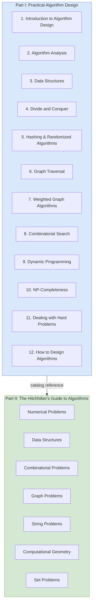

## Overview

_The Algorithm Design Manual_ by Steven S. Skiena is the rare
algorithms book that treats algorithms as a *craft* rather than a
*mathematical pursuit*. First published in 1997 and now in its third
edition (2020), it has become the go-to resource for working
programmers who need practical algorithmic solutions — without the
formal theorem-proof apparatus of traditional texts.

The book is split into two halves. **Part I: Practical Algorithm
Design** (~330 pages) teaches the fundamental techniques: algorithm
analysis, data structures, sorting, searching, graph algorithms,
dynamic programming, and heuristics. The tone is conversational and
example-driven, punctuated by "war stories" — real-world problems
Skiena solved using the techniques at hand.

**Part II: The Hitchhiker's Guide to Algorithms** (~450 pages) is a
reference catalog of the 75 most important algorithmic problems,
each presented with a description, key variants, known results,
available implementations, and pointers to the literature. This
catalog is the book's killer feature: when faced with an unfamiliar
problem, you browse the catalog to identify what you are dealing
with and how to solve it.

Skiena is Distinguished Teaching Professor of Computer Science at
Stony Brook University and recipient of the IEEE Computer Science
and Engineering Teaching Award. His philosophy: "You will not find
a single theorem anywhere in this book."

---

## Executive Summary

---

## Key Takeaways

**Design over analysis.** Skiena's central message: the hardest part
of solving a problem algorithmically is figuring out *what problem
you actually have*. Once you name the problem, the solution often
follows from known algorithms. The book spends more time on
modeling and design than on asymptotic proofs.

**The war stories.** Each technique chapter includes a "war story" —
a real problem from Skiena's consulting or research, showing how he
applied the chapter's ideas. These are not polished case studies;
they show false starts, dead ends, and moments of insight. They are
the most memorable part of the book.

**The algorithm catalog.** The second half is a reference, not a
read-through. Each of the 75 entries follows a uniform structure:
input/output specification, key variants, discussion, implemented
solutions, credits. When you encounter a problem on the job, you
look it up here.

**No theorems.** Skiena deliberately avoids formal proofs. Asymptotic
analysis is taught through informal reasoning and examples.
Correctness is argued, not proved. This makes the book accessible to
self-taught programmers and practitioners who find CLRS
intimidating.

**Modeling is the key skill.** The single most important technique,
according to Skiena, is learning to map a real-world situation to the
right abstract problem type: permutation, subset, tree, graph,
point, polygon, string. The catalog helps with this mapping.

**Interviews are a driving use case.** The 3rd edition explicitly
adds LeetCode and HackerRank problems, plus a section on interview
preparation. The book is widely used for FAANG interview prep
alongside dedicated resources.

---

## Who Should Read This

- Working programmers who need to solve real algorithmic problems
- Self-taught developers wanting a practical algorithms foundation
- CS students who find CLRS too proof-heavy
- Interview candidates preparing for algorithmic coding interviews
- Anyone who wants to understand *how* to think about algorithms

## Who Shouldn't

- Beginners who have never programmed (some coding maturity assumed)
- Readers who want formal correctness proofs and mathematical rigor
- Those looking for a comprehensive algorithms reference (use CLRS)
- Anyone expecting ready-to-run code in a modern language (examples
  are in C)

---

## Difficulty: Medium

Skiena assumes you can write code and understand basic mathematics.
The book is dramatically easier than CLRS and slightly more
demanding than Sedgewick. A typical reader covers 20–30 pages per
hour.

---

## Reading Time

~40 hours for Part I (cover to cover). Part II is a reference —
browsed as needed, not read linearly.

---

## Editions

| Edition | Year | Pages | Major Changes |
|---------|------|-------|---------------|
| 1st | 1997 | 736 | Original; two-color printing, CD-ROM with hypertext version |
| 2nd | 2008 | 736 | Updated references, expanded catalog, new war stories |
| 3rd | 2020 | 793 | Full color; new chapters on divide & conquer, hashing, randomized algorithms, approximation; quantum computing coverage; LeetCode/HackerRank problems; expanded catalog |

---

## Historical Context

Skiena wrote the first edition because he saw a gap: algorithms
textbooks of the 1990s (CLRS, Sedgewick, Aho-Hopcroft-Ullman) all
followed the same theorem-proof structure. None served the working
programmer who needed to *find* the right algorithm, not prove
correctness. The Algorithm Design Manual pioneered the
problem-catalog format, which has since been adopted by reference
works in other domains.

The 3rd edition reflects the maturation of online judge platforms
(LeetCode, HackerRank) as interview preparation tools, and the rise
of GitHub as a repository of open-source algorithm implementations.

---

## Related Books

| Book | Author | Relation |
|------|--------|----------|
| _Introduction to Algorithms (CLRS)_ | Cormen et al. | The rigorous counterpart. Skiena teaches what CLRS proves. |
| _Algorithms_ | Robert Sedgewick, Kevin Wayne | Java-based, visual, less comprehensive catalog. |
| _Algorithm Design_ | Jon Kleinberg, Éva Tardos | Problem-oriented, modern problem selection. |
| _The Art of Computer Programming_ | Donald E. Knuth | Encyclopedic depth; TAOCP is the ultimate reference. |
| _Grokking Algorithms_ | Aditya Bhargava | Beginner-friendly illustrated intro. Read before Skiena. |
| _Algorithmic Thinking_ | Daniel Zingaro | Teaches through competitive programming; good follow-up. |

---

## Final Verdict

_The Algorithm Design Manual_ is the most practical algorithms book
ever written. It is not the most rigorous, the most comprehensive,
or the most mathematically beautiful — but it is the one that will
most often help you solve a real problem. Every working programmer
should own a copy. Read Part I to build your toolkit; keep Part II
on your desk for the rest of your career.

The 3rd edition is the definitive version: full color, updated
references, and modern problem coverage. If you own the 2nd edition,
the new chapters on hashing, divide-and-conquer, and randomized
algorithms justify the upgrade. If you are buying your first
algorithms book and you want one you will actually use, buy this
one.
