## The Compiler Pipeline

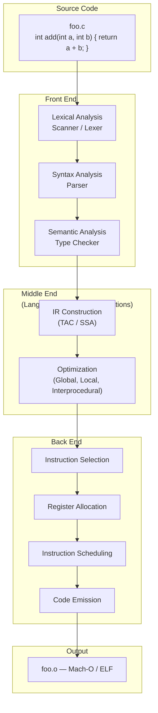

---

## Part I: Foundations of Language Theory

### Regular Languages and Finite Automata

The theoretical foundation for lexical analysis rests on **regular languages** — languages describable by regular expressions and recognized by finite automata.

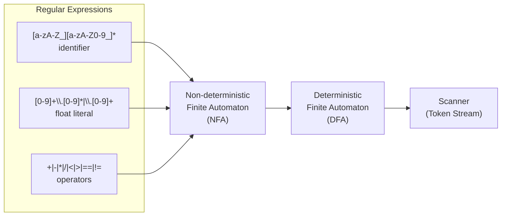

**Key properties:**
- **Kleene's theorem**: regular expressions, NFAs, and DFAs are all equivalent in expressive power
- **Subset construction**: converts NFA to DFA; the DFA may have exponentially more states
- **Minimization**: Hopcroft's algorithm reduces the DFA to the smallest equivalent DFA
- **The scanner generator problem**: tools like Flex automate NFA→DFA→minimize→C code

### Context-Free Grammars and Pushdown Automata

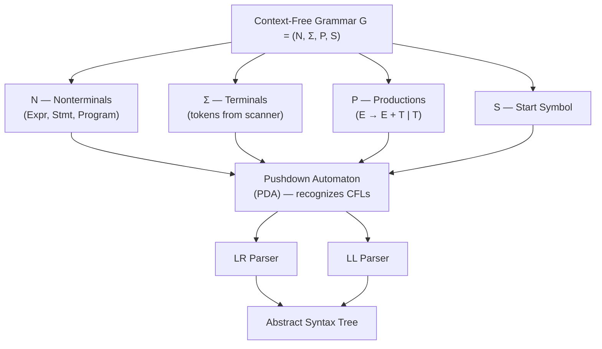

---

## Part II: Front End

### Lexical Analysis (Scanning)

The scanner transforms a raw character stream into a sequence of `(token-type, lexeme, position)` tuples. It is the first semantic boundary in the compiler: below it, everything is bytes; above it, everything is structured.

| Concern | Approach | Tool |
|---------|----------|------|
| Keyword recognition | DFA states + reserved word check | Flex/Lex |
| String and character literals | Escaped character handling, length tracking | Hand-coded or Flex |
| Comment removal | Single/multi-line comment DFA branches | Scanner preprocessing pass |
| Position tracking | Line/column state in scanner | Line-number-aware Flex patterns |
| Error recovery | Panic mode or global correction | Scanner error handler |

**The scanner's contract with the parser:**
```
On success:  return(TokenType, lexeme_string, line, column)
On error:   report + recover (skip to next token boundary, sync on semicolon or brace)
EOF:        return(EOF)
```

### Syntax Analysis (Parsing)

The parser consumes the token stream and verifies it matches the language's grammar. Two dominant families:

**LL (Top-Down) Parsers:**
- Predict the production rule before recursing
- Recursive descent is the canonical implementation
- Limited to LL(1) grammars without backtracking
- Excellent error messages — easy to map parser errors to source locations
- Used by: Clang (partial), Rust (rustc), TypeScript

**LR (Bottom-Up) Parsers:**
- Shift tokens onto a stack; reduce matched handles to nonterminals
- LR(1) is the practical minimum for full CFG coverage
- LALR(1) trades some accuracy for smaller parse tables (used by Yacc/Bison)
- Better at handling ambiguous grammars automatically
- Used by: GCC, Bison-generated parsers, Java's javac

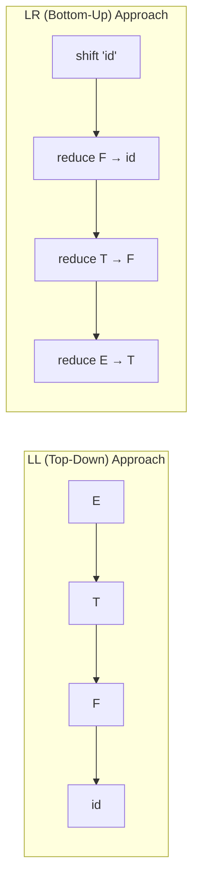

### Semantic Analysis

After the parse tree is built, the semantic phase applies language rules that cannot be encoded in a CFG:

| Check | Example |
|-------|---------|
| Type checking | Cannot add `int` to `string` |
| Scope resolution | `x` declared in function scope vs. block scope |
| Declaration checking | All variables declared before use (where required) |
| Signatures | Function called with correct arity and argument types |
| Flow analysis | Reads before writes in strict evaluation modes |

The **symbol table** is the central data structure — a hash map keyed by identifier name, storing type, scope level, and linkage information. Scope chains are typically implemented as linked stacks pushed/popped on `{` and `}`.

---

## Part III: Intermediate Representation and Optimization

### Three-Address Code (TAC)

Three-address code is the simplest useful intermediate representation. Each instruction does at most one operation:

```
// TAC for: return a + b
t1 = a + b
return t1
```

Ernest distinguishes **quadruples** `(op, arg1, arg2, result)` from **triples** and **indirect triples`**, showing the trade-offs:

- Quadruples: easy to optimize, easy to regenerate, 4-tuple overhead
- Triples: no result field (uses position), saves space, harder to reorder
- Indirect triples: triples + pointer array; best of both for large programs

### Static Single Assignment (SSA)

SSA is the most important optimization enabler in modern compilers. The rule: **each variable is assigned exactly once**. Variables with multiple definitions are renamed (φ-functions at join points).

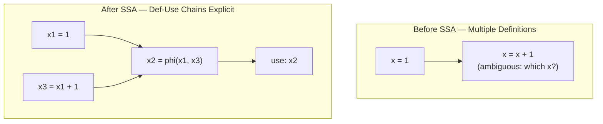

**φ-function semantics:** at a control flow join point, the φ-function selects which incoming value of a variable applies based on the control path taken.

**SSA construction algorithm:**
1. Compute Dominance Frontiers (Cytron et al. 1991)
2. Insert φ-functions at each join point for each live variable
3. Rename all variables to be version-unique

### Dataflow Analysis Framework

All classical optimizations are instances of dataflow analysis running on the CFG:

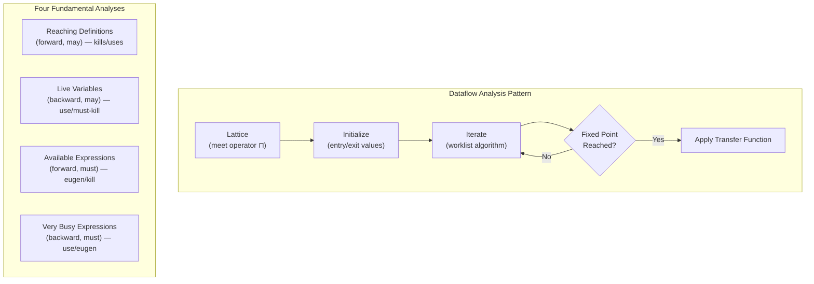

**The four MFP (Maximal Fixed Point) analyses and their optimizations:**

| Analysis | Direction | Bitwise | Optimization |
|----------|-----------|---------|--------------|
| Reaching definitions | Forward | May | Constant propagation, CSE |
| Live variables | Backward | May | Dead code elimination, register allocation |
| Available expressions | Forward | Must | Common subexpression elimination |
| Very busy expressions | Backward | Must | Dead code elimination |

### Classical Optimizations

**Local optimizations (within a basic block):**
- Constant folding: `3 + 5` → `8` at compile time
- Constant propagation: propagate known constant values through expressions
- Algebraic simplifications: `x * 1` → `x`, `x + 0` → `x`
- Strength reduction: multiplication by constant → shift-add sequence

**Global optimizations (cross-basic-block):**
- Common Subexpression Elimination (CSE): eliminate duplicated computation
- Dead Code Elimination (DCE): remove code with no observable effect
- Copy propagation: replace `y = x` with uses of `y` replaced by `x`
- Loop-invariant code motion: move invariant computations to pre-header
- Induction variable elimination: replace induction variable arithmetic with simpler forms

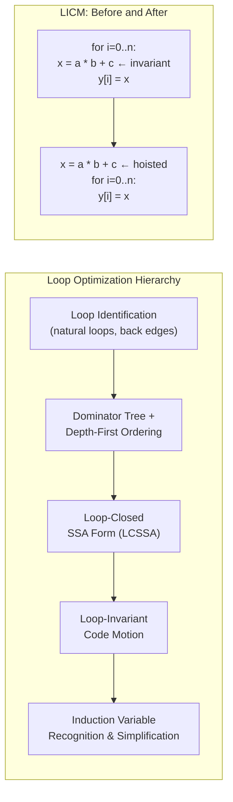

---

## Part IV: Back End — Instruction Selection, Register Allocation, and Code Generation

### Instruction Selection

Three strategies for mapping IR to target machine instructions:

1. **Pattern matching**: tree-pattern matching (code generation by Burg-style tools), where each node in the expression DAG is matched to the cheapest covering of target instructions
2. **Covering**: linear-scan selection for VLIW architectures where instruction bundles must be formed
3. **DAG covering**: optimal for expression DAGs; NP-hard in general; heuristic coverings used in practice

### Register Allocation

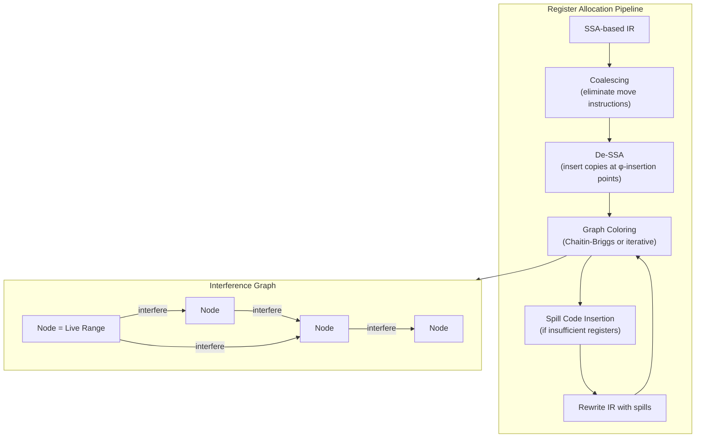

**Key concepts:**
- **Live range**: set of program points where a variable holds a live value
- **Interference**: two live ranges overlap → they cannot share a register
- **Coalescing**: if move `x = y` exists and no interference between `x` and `y`, merge live ranges to eliminate the move
- **Spilling**: when the graph cannot be colored with K colors (K = available registers), spill the lowest-priority live range to the stack
- **Linear scan**: O(n log n) alternative to graph coloring; used by HotSpot JVM and LuaJIT

### Peephole Optimization

Applied after instruction selection — small windows of emitted instructions are replaced with cheaper sequences:

```
; before
mov eax, 0
add eax, 1

; after (peephole eliminated the zero-and-add pattern)
mov eax, 1
```

---

## Part V: Runtime Systems

### Stack Frame Layout

The compiler and runtime co-design the stack frame layout for every function:

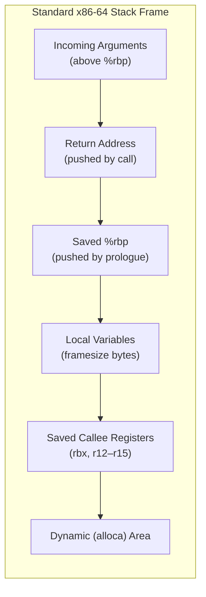

### Calling Conventions

The calling convention defines the contract between caller and callee. Ernest treats this as a *compiler design* problem rather than an ABI detail:

| Aspect | x86-64 System V | ARM64 AAPCS |
|--------|-----------------|-------------|
| Integer arg registers | %rdi, %rsi, %rdx, %rcx, %r8, %r9 | x0–x7 |
| Float arg registers | %xmm0–%xmm7 | v0–v7 |
| Return register | %rax | x0 |
| Caller-saved | %rax, %rcx, %rdx, %rsi, %rdi, r8–r11 | x0–x18 except x19–x28 |
| Callee-saved | %rbx, %rbp, %r12–%r15 | x19–x28, lr(fp=x29) |
| Stack alignment | 16-byte aligned before call | 16-byte aligned at call |

### Garbage Collection Integration

For managed-language compilers, the runtime GC imposes direct constraints on the back end:

- **No raw pointers**: the compiler must track which stack slots and registers contain pointers vs. non-pointers (the *precise GC* problem)
- **Write barriers**: store operations into the heap must trigger incremental marking
- **Stack scanning**: the GC suspends all threads and walks their stacks; the compiler must either emit stack maps or precompute them

### Exception Handling and Zero-Cost EH

Modern compilers implement *zero-cost* (table-driven) exception handling:

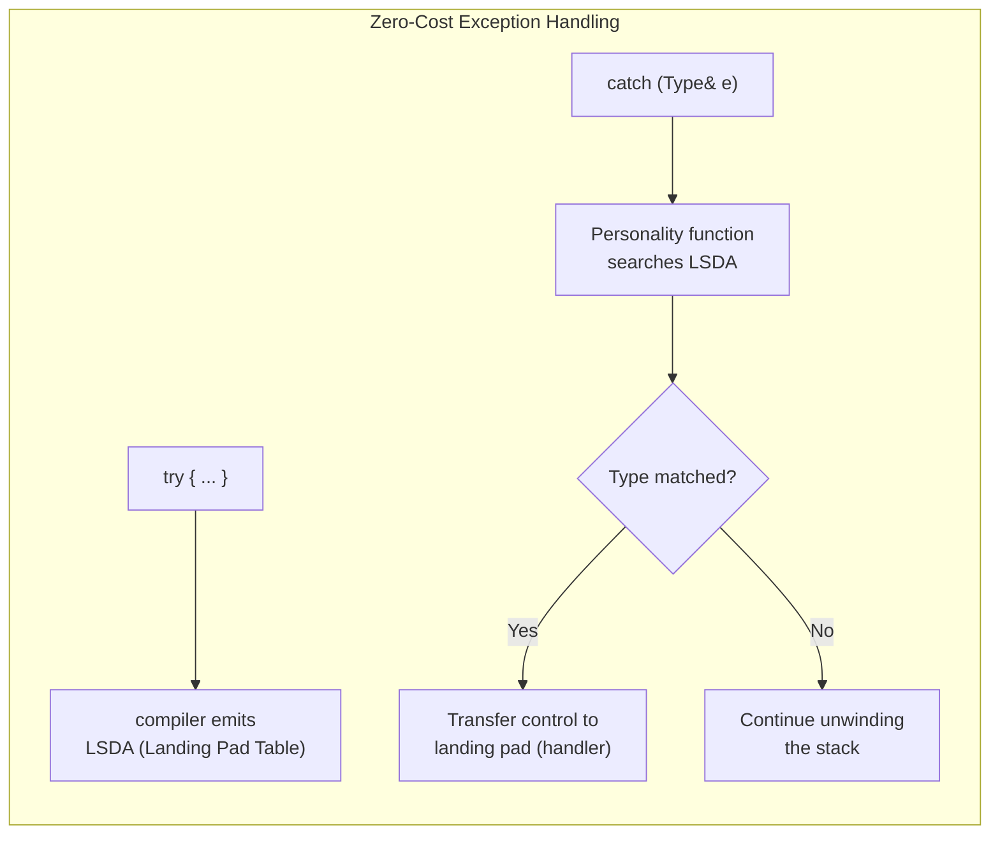

---

## Part VI: Advanced Techniques

### Just-In-Time (JIT) and Ahead-of-Time (AOT) Compilation

| Dimension | AOT | JIT |
|-----------|-----|-----|
| When compiled | Install time or build time | At or just before first execution |
| Compile-time budget | Unlimited (minutes/hours if needed) | Milliseconds; must be fast |
| Runtime info available | None (no profile data unless PGO) | Runtime type feedback, branch profiles, call counts |
| Deoptimization | Rarely needed | Critical — JIT code must be reversible |
| Code cache | N/A | Must manage memory, invalidate when classes change |

### Profile-Guided Optimization (PGO)

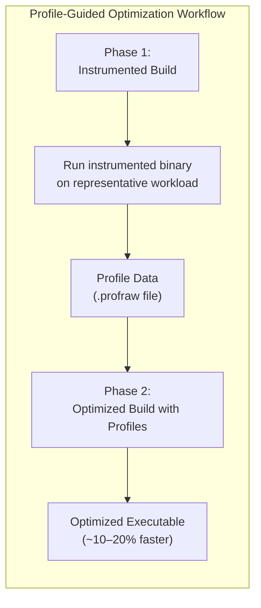

PGO provides three categories of feedback:
- **Value profiling**: which constants appear at call sites (enables devirtualization)
- **Edge profiling**: which branches are taken (enables basic block layout optimization)
- **Indirect call profiling**: which targets polymorphic calls dispatch to (enables type-specialized inlining)

### MLIR: Modern Multi-Level IR

Ernest devotes a full chapter to MLIR (Multi-Level Intermediate Representation), a dialect-based IR infrastructure developed as part of the LLVM/MLIR ecosystem:

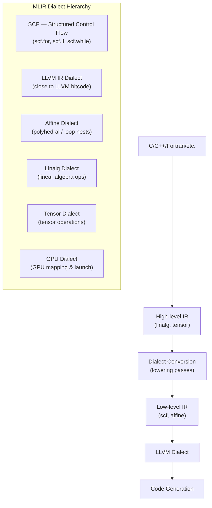

MLIR's key insight: different compilation problems live at different levels of abstraction, and *mixed-level* optimization across dialect boundaries is more powerful than forcing everything into a single flat IR.

---

## Key Algorithms Summary

| Algorithm | Input | Output | Appears In |
|-----------|-------|--------|------------|
| Thompson subset construction | Regex → NFA | DFA | Scanner generation |
| Hopcroft minimization | DFA | Minimal DFA | Scanner optimization |
| CYK / Earley | CFG + string | Parse tree / confirmation | General CFG parsing |
| LALR(1) state machine | LR(1) items | Parser table | Parser generation |
| Cytron SSA construction | CFG + live variables | SSA-form IR | Middle end preparation |
| Dominance frontier computation | CFG + dominators | DF for each node | SSA construction |
| Worklist MFP | Lattice + transfer functions | Fixed point solution | All dataflow analyses |
| Chaitin-Briggs coloring | Interference graph + K colors | Register assignment | Back end |
| Iterative global CSE | Available expressions | Optimized IR | Middle end |
| Linear scan register allocation | In-order live intervals | Register assignment | JIT compilers |

---

## Summary of the Book's Approach

Ernest organizes the canon of compiler design around the pipeline concept but emphasizes that **optimization is not a single phase** — it is a cross-cutting activity that recurs at every level: peephole in the back end, local in basic blocks, global (intraprocedural) in the IR, interprocedural across function boundaries, and link-time across translation units.

The book closes by pointing forward: **modular, composable compiler infrastructure** (LLVM passes, MLIR dialects) represents the most significant shift in how compilers are built since the 1986 Dragon Book appeared. The engineer who understands both the classical algorithms and their modern encapsulation in compiler frameworks will be the engineer who builds the next generation of language tooling.
