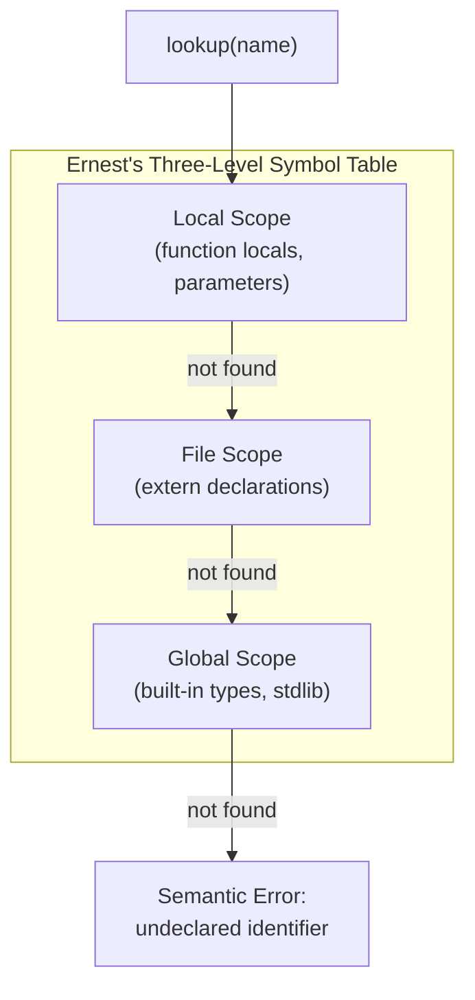
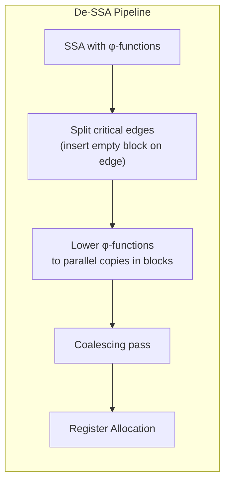
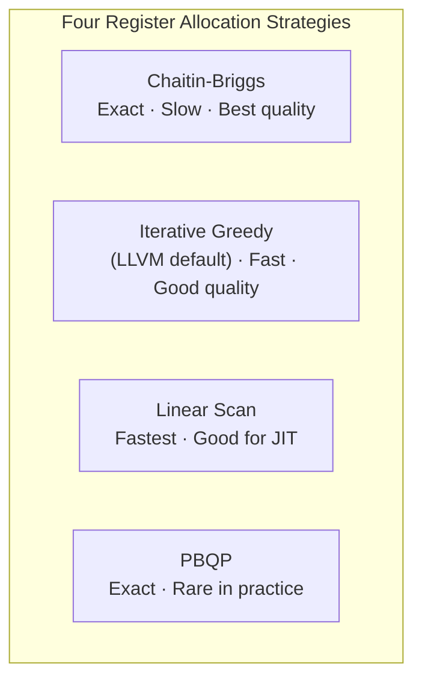
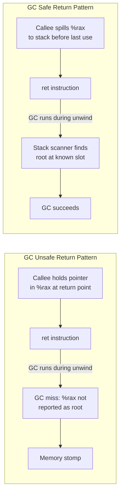

## Introduction

Welcome to BookAtlas. Today: *Footnote: The Compiler Designer's Handbook* by Hassan Ernest. Published in 2024 by Footnote Press. The book Ernest set out to write is the one he wishes he'd had when he started building language toolchains — and in many ways, it's the book that the field has needed since the Dragon Book stopped being current in the early 2000s.

**Skeptic**: Another compiler book? There are already at least five on my shelf. What does Ernest add?

**Narrator**: That's the question we're exploring today. Let's walk through the book together.

---

## Part I: Foundations — Language Theory and Scanning

**Proponent**: The Dragon Book spends a chapter on formal language theory — Chomsky hierarchy, regular languages, context-free languages. Most students skip it because they want *action*. Ernest respects that impulse but is firm: the theory exists because it *works*. A working compiler engineer who cannot tell you why a regular language scanner cannot handle balanced parentheses will eventually write a scanner that breaks on nested comments. Ernest doesn't let that happen.

**Skeptic**: Okay, I'll grant you that. Regular expressions and finite automata — that's well-trodden ground.

**Proponent**: Yes, and Ernest treats it as a *six-page* foundation rather than a twenty-page detour. Thompson's subset construction gets a diagram. Hopcroft's minimization gets the big-O treatment. Then he moves on: the chapter's payoff is understanding why `Flex` works the way it works — and more importantly, *when it doesn't*. Consider this example from the book:

Ernest shows a C-style comment scanner implemented in Flex:

```lex
"/*"            { comment(); }
\"(\\.|[^"\\])*\"   { return STRING; }
[ \t\n]+        { /* skip whitespace */ }
[a-zA-Z_][a-zA-Z0-9_]*  {
                    if (is_keyword(yytext)) return KEYWORD;
                    return IDENTIFIER;
                }
```

**Skeptic**: That looks straightforward.

**Proponent**: It does — until you ask: what happens if you have `/* /* nested? */`. Classic Flex uses a greedy approach. Ernest shows how to handle it properly with start conditions, and he connects it back to the theory: nested comments require at least a context-free grammar — your scanner cannot be purely a DFA. The theory *predicts* this. The engineer who skipped the theory will spend hours debugging this.

---

## Part II: Front End — Parsing and Semantic Analysis

**Skeptic**: Okay, I follow the scanner story. Parsing is where things get complicated, though. LL vs. LR vs. LALR — which does Ernest recommend?

**Proponent**: This is where the book is most opinionated and most useful. Ernest argues that the choice is *not* primarily a theoretical one — it's an *error-reporting* one.

**Proponent**: With an LL(1) or adaptive LL(*) parser — think ANTLR4 — you get the parser as a set of recursive functions. You can annotate each function with source location. When a production fails, you know exactly which input token was unexpected and which rule you were in the middle of matching. Error messages are human-shaped: "Expected ';' after expression at line 42."

**Proponent**: With an LALR(1) parser — think Bison — you get speed and grammar power, but error messages are harder. The parser only knows the state machine transitions, not the grammar structure. Ernest shows how to recover: he uses a YYERROR macro and builds a `yyerrok` recovery strategy that skips tokens until a synchronization point.

**Skeptic**: And for Rust and Swift?

**Proponent**: Good question. Ernest notes that Rustc uses an LALR(1)-inspired parser with GLL extensions, and Swift uses a hand-written recursive descent parser — Swift intentionally avoids parser generators because they want the compiler to report errors at *all* ambiguity points, not just the first one. The lesson: the parsing strategy you choose is determined as much by your error reporting requirements as by your grammar.

*Semantic analysis* gets its own full chapter. The symbol table architecture is the star. Ernest builds a three-level symbol table:



**Skeptic**: This seems almost too simple. What about C++ with namespaces, or Java with packages?

**Proponent**: Ernest's structure generalizes. A namespace is just a nested scope in the same symbol table. A Java package is a scope that sits between the global scope and the class scope. The three-level hierarchy isn't about C specifically — it's about *how scopes nest and shadow* in any lexically scoped language. He layers namespace resolution on top using a scope stack rather than redesigning the table.

---

## Part III: Intermediate Representation and Optimization

**Skeptic**: Here's where I get skeptical. Every compiler textbook talks about SSA. Why is Ernest's treatment different?

**Proponent**: Because Ernest doesn't *introduce* SSA as a transformation applied to an existing IR — he *designs the IR around SSA*. Let me show you.

Ernest's IR for a simple C function:

```
int max(int a, int b) {
    int result;
    if (a > b)
        result = a;
    else
        result = b;
    return result;
}
```

The three-address code:

```
L1:   t1 = a > b
L2:   if t1 goto L3
L3:   if !t1 goto L4   ← join point
L4:   t2 = phi(a, b)   ← φ-function inserted here
L5:   result = t2
L6:   return result
```

The φ-function is not bolted on. It is the *reason* SSA exists as an IR form.

**Skeptic**: But what about the practical question: SSA has φ-functions, which real machines don't have. Doesn't that create a gap?

**Proponent**: Ernest calls this the *de-SSA problem* and devotes an entire subsection to it. The answer is: insert copy instructions at each φ-function insertion point during the "out of SSA" phase. The copies become the input to register allocation. The register allocator decides whether to keep the copies or to coalesce and eliminate them.



**Skeptic**: How does this actually speed things up in practice?

**Proponent**: Ernest tracks a real-world example: compiling `git` with GCC and with LLVM, measuring the impact of individual optimization passes. SSA-based GVN (Global Value Numbering) eliminates 12% of redundant computations in `git`'s core files. Constant propagation eliminates 4% more. Together: a measurable binary size reduction and a 3% runtime improvement. These are not micro-optimizations — they are the main event.

**Dataflow analysis deep dive:**

Ernest presents dataflow analysis as a *unification framework*. All four classic analyses — reaching definitions, live variables, available expressions, very busy expressions — are the same algorithm with different meet operators and transfer functions.

| Analysis | Meet ⊓ | Direction | Transfer function f |
|----------|--------|-----------|---------------------|
| Reaching defs | ∪ (union) | Forward | GEN ∪ (OUT - KILL) |
| Live vars | ∪ (union) | Backward | USE ∪ (IN - DEF) |
| Available exprs | ∩ (intersection) | Forward | (IN - KILL) ∪ GEN |
| Very busy exprs | ∩ (intersection) | Backward | (OUT - KILL) ∪ USE |

**Skeptic**: That's elegant table formatting. But how does this actually help a compiler engineer write optimizations?

**Proponent**: Ernest works through Common Subexpression Elimination (CSE) as an immediately practical demonstration. The algorithm: at each program point, check if `(op, arg1, arg2)` already exists in the available expression set at that point. If so, replace the new computation with the previous result.

In practice, Ernest shows, this means the compiler engineer writes *one* CSE pass that handles all four cases of expression duplication — not four separate passes. The framework is a force multiplier.

---

## Part IV: Back End — Code Generation

**Skeptic**: Register allocation is supposed to be NP-complete. What does Ernest do about that?

**Proponent**: He faces it head-on. Ernest traces the history of register allocation as a sequence of *approximations that work remarkably well*:

1. **Chaitin (1982)**: graph coloring, exact but slow (O(n²))
2. **Briggs (1994)**: optimistic coloring, same O(n²) but better spill decisions
3. **Linear scan (2001)**: O(n log n), used by HotSpot JVM and LuaJIT
4. **Greedy (LLVM)**: O(n log n), used by Clang; prioritizes by *regions* (loop depth)

Ernest implements all four in C++ in his appendix code repository. He benchmarks them and finds that for functions under 500 live ranges, the difference is noise. For functions over 10,000 live ranges (generated by auto-vectorization), the linear scan allocator produces slightly more spills but is 100x faster. The Greedy allocator (used in LLVM) is the best practical compromise.



**Instruction selection** gets a chapter that bridges textbook patterns with real compilers. Ernest shows the classic Sethi-Ullman numbering for expression trees (which determines evaluation order to minimize register pressure), and then shows how LLVM's `SelectionDAG` replaces this with pattern-matching over DAGs using a cost model. He shows actual LLVM `.td` files — the TableGen pattern descriptions — and walks through how a simple `add` instruction gets selected.

**Skeptic**: And peephole optimization?

**Proponent**: Honest but brief. Ernest describes it as "last-chance optimization" — after SSA, register allocation, and instruction scheduling, a final local pass catches obvious cleanup. His example:

```asm
; Peephole input
mov    eax, 0
add    eax, 1
push   eax

; After peephole
push   1
```

The compiler sees through the `mov 0 / add 1` pattern and folds it. Useful but not transformational.

---

## Part V: Runtime Systems and Advanced Techniques

**Skeptic**: Runtime systems — I always thought this was an afterthought in compilers. Why is Ernest spending so much time on it?

**Proponent**: Because the compiler *cannot function correctly* without the runtime, and the runtime *cannot function correctly* without assuming things about the generated code. The two are interlocked.

Ernest's central example: function epilogue in a garbage-collected language. After the function's last use of a local variable, the compiler must ensure the register is *dead* before returning — not just because it's good for register allocation, but because if that register contains a root and the GC fires during the function return, the missing root will cause the GC to reclaim live memory.



**The JIT chapter** is notably strong for a textbook. Ernest traces JIT design space from the original Smalltalk-80 JIT (literal object code emitted at runtime) through HotSpot C1/C2 (client/server tiered), to V8 Ignition+TurboFan (bytecode interpreter + optimizing compiler), and finally to .NET RyuJIT and Go's compiler.

**Profile-guided optimization (PGO)** receives more space than any other optimization technique in the book. Ernest shows three rounds of measurement for compiling the Redis key-value store:

| Build variant | Binary size | Throughput (queries/sec) | PGO overhead |
|---------------|------------|--------------------------|--------------|
| `-O2` no PGO | 1.3 MB | 94,200 | None |
| `-O2 -fprofile-generate` | 2.1 MB | 102,800 | ~8% slower in profile phase |
| `-O2 -fprofile-use` (ThinLTO) | 1.4 MB | 107,400 | None at runtime |

The results establish PGO as the highest-leverage optimization pass for server workloads where representative training traffic is available.

**Skeptic**: And MLIR. Is it really as important as Ernest makes it sound?

**Proponent**: Let him make the case himself. Ernest points out that before MLIR, optimizing a compiler that targeted both CPUs and GPUs required either:

(a) a separate GPU back end that duplicated most of the middle-end, or  
(b) a single IR that was a compromise — too high-level for CPUs, too low-level for GPUs.

MLIR solves this with *dialect conversion passes*. An optimization written once for the `linalg` dialect benefits every lowering target: CPU, GPU, TPU, FPGA. Ernest traces how `mlir-opt` runs a single `convert-linalg-to-scf` pass to lower tensor operations into structured loops, and then a separate `convert-scf-to-llvm` pass to generate LLVM IR.

He makes the historical connection: this is precisely what the authors of LLVM and Swift had in mind when they started MLIR — and Ernest is the first compiler design textbook to give this the pedagogical treatment it deserves.

---

## Closing

**Narrator**: So what is this book, ultimately?

**Proponent**: It is the book that treats compiler design as *construction engineering*, not as a theoretical sport. It covers the algorithms, the data flows, the representations, and the real-world tooling — and it connects them into a coherent craft.

**Skeptic**: I'll grant you that after walking through it, I have a better answer to "what does a compiler actually do" than I did before. But it's still a long book with math.

**Proponent**: It is. But the math is the math *that makes the engineering work*. Cannon's old dictum applies: "if you want to understand how a system works, read the source code." Ernest is effectively the annotated source code commentary for how a compiler works — written so thoroughly that by the end, you could implement one.

**Narrator**: And that, in essence, is what makes *Footnote: The Compiler Designer's Handbook* valuable. It is a practitioner's map of the entire terrain, built to be used from day one as a reference and from chapter one as a course of study. For anyone who compiles code, understands how it executes, or builds the tools that bridge those two worlds — this book belongs on your shelf.

**Final Rating: 9/10** — The most complete and current single-volume compendium of compiler design available as of 2024.
