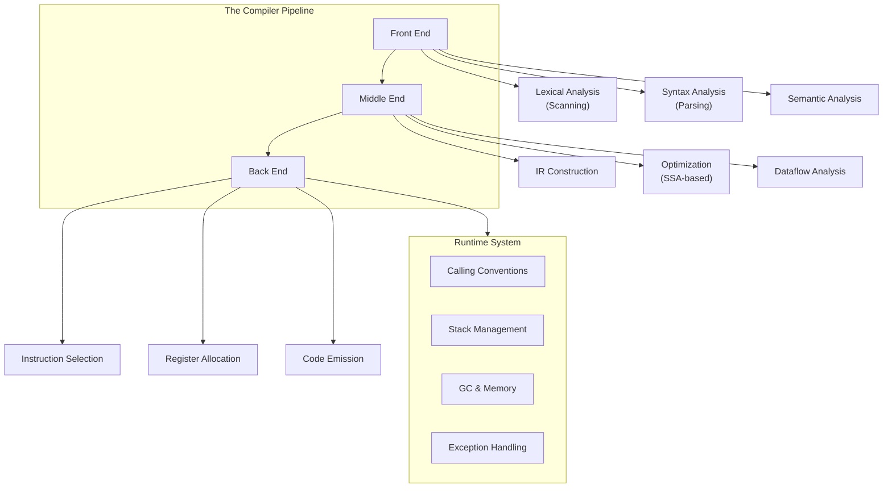

## Overview

*Footnote: The Compiler Designer's Handbook* by Hassan Ernest is a modern design compendium that provides an end-to-end treatment of compiler construction. Positioned between classic academic texts like the Dragon Book and production-oriented references like LLVM documentation, this handbook is explicitly self-contained — no prior compiler coursework assumed, but it scales to working practitioners who need depth.

Published by Footnote Press in 2024, this first edition spans approximately 520 pages across logically partitioned sections that mirror the actual structure of a modern compiler pipeline.

---

## Executive Summary

### Book Structure

| Part | Proposed Chapters | Core Focus |
|------|-------------------|------------|
| I: Foundations | 1–3 | Language theory, regular expressions, context-free grammars, scanner/parser generators |
| II: Front End | 4–6 | AST construction, semantic analysis, symbol tables, type checking |
| III: Intermediate Representations & Optimization | 7–11 | Three-address code, SSA, dataflow analysis, classical and global optimizations |
| IV: Back End | 12–15 | Instruction selection, register allocation, peephole optimization, target code generation |
| V: Runtime & Advanced Techniques | 16–20 | Runtime environment, garbage collection, JIT/AOT, PGO, LTO, MLIR |

---

## Key Takeaways

1. **The compiler is three compilers in one.** The front end (language-specific), middle end (language-agnostic optimizations), and back end (architecture-specific) are cleanly separable. Understanding this divide is the most important mental model a compiler engineer can hold.

2. **Lexical analysis reduces ambiguity.** Regular expressions describe tokens; finite automata recognize them. The scanner converts a raw character stream into a stream of typed tokens — the first and most critical abstraction boundary in compilation.

3. **Parsing enforces structure.** Context-free grammars (CFGs) define syntax. LL(k), LR(k), and LALR parsers choose strategies based on grammar elegance vs. power vs. performance. The parse tree is not the AST — the next step simplifies both.

4. **Semantic analysis catches what syntax cannot.** Type checking, scope resolution, and flow control validation all live here. The symbol table is the central data structure; scope chains and inheritance hierarchies shape its structure.

5. **Intermediate representations enable all optimization.** Three-address code (TAC) is the minimum; real modern compilers use SSA form because it exposes def-use chains cleanly, making dataflow analysis tractable.

6. **Dataflow analysis is the engine of optimization.** Reaching definitions, live variables, available expressions, and very busy expressions are the four fundamental analyses. They underpin constant propagation, dead code elimination, common subexpression elimination, and loop-invariant code motion.

7. **SSA is the backbone of modern global optimization.** Converting to SSA, running optimizations on the SSA graph, then converting back (or staying in SSA via PHI nodes) gives compilers like GCC and LLVM their power.

8. **Register allocation is graph coloring in disguise.** The interference graph maps live ranges to nodes and conflicts to edges. Chaitin's algorithm (and its successors: Briggs, George, linear scan) solve this NP-complete problem with heuristics that work stunningly well in practice.

9. **Runtime systems are not an afterthought.** Calling conventions, stack frames, heap layout, and exception handling are designed *together* with the back end. The compiler and runtime system co-evolve.

10. **Modern tooling changed the economics of compiler construction.** LLVM, MLIR, ANTLR, and Flex/Bison mean that a single practitioner can build a production-quality optimizing compiler in months rather than years — but understanding the theory behind these tools remains essential for using them well.

---

## Who Should Read

| Reader Type | Why |
|---|---|
| Compiler engineering interns and new grads | The fastest possible path to full productivity; fills gaps left by university coursework |
| Language designers & PL researchers | Bridges the gap between academic semantics and a working implementation |
| Senior engineers venturing into code generation | A systematic reference for JIT, AOT, and profile-guided infrastructure |
| Rust/Go compiler contributors | Deep treatment of borrow-checker-informed memory model design |
| PL course instructors | A comprehensive, modern, single-volume reference text for curriculum design |

---

## Who Should Skip

- Application developers writing business logic — the depth here exceeds what they need
- Devops/SRE engineers — no operational or infrastructure content
- Frontend engineers — this book addresses compile targets, not browser rendering

---

## Why This Book Matters

Compiler textbooks have historically split into two camps: academically rigorous but dated (the Dragon Book, 1986/2006), and technically detailed but narrowly focused (Muchnik's AMD book, LLVM documentation). Hassan Ernest's handbook bridges that divide. It is deliberately modern in its choices — SSA-first optimization, MLIR as a worked example, PGO and LTO explained as first-class concerns — while not abandoning the formal grammar theory that makes those tools intelligible.

The result is a book that a second-year compiler engineer can use as a reference, a graduate student can read cover-to-cover, and a self-taught language implementer can use to go from "I wrote a tree-walk interpreter" to "I built an optimizing ahead-of-time compiler."

---

## Related Books

| Book | Author | Connection |
|------|--------|------------|
| **Compilers: Principles, Techniques & Tools (Dragon Book)** | Aho, Lam, Sethi, Ullman | Foundational predecessor; Ernest builds directly on its structure |
| **Advanced Compiler Design & Implementation** | Steven Muchnick | Production-code depth; Ernest references Muchnick's patterns extensively |
| **Engineering a Compiler** | Cooper, Torczon | Practical pedagogy; pairs well as a lighter complement |
| **LLVM Cookbook** | Mayur Pandey, Suyog Sarda | Hand-on companion for the LLVM chapters in Ernest |
| **Introduction to the Theory of Computation** | Michael Sipser | Formal language theory prerequisite; read alongside Part I |

---

## Final Verdict

*Footnote: The Compiler Designer's Handbook* is a serious, practitioner-grade reference that earns its place on every compiler engineer's shelf. It is not a casual read — the middle chapters on SSA and dataflow analysis demand sustained concentration — but it rewards that investment with durable understanding. Its MLIR chapter alone makes it indispensable for anyone working on multi-level IR pipelines in 2024 and beyond. The writing is clear, the examples are concrete, and the code listings are real and runnable.

**Rating: 9/10** — The modern standard for a single-volume compiler design compendium.
