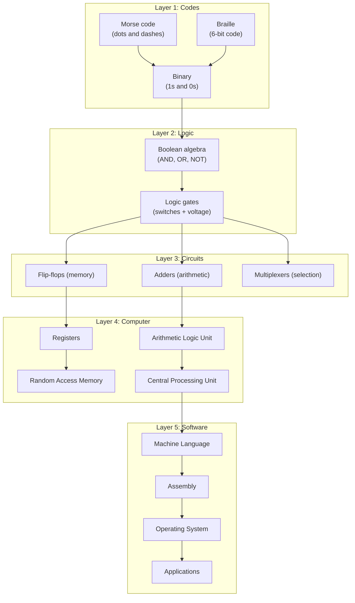
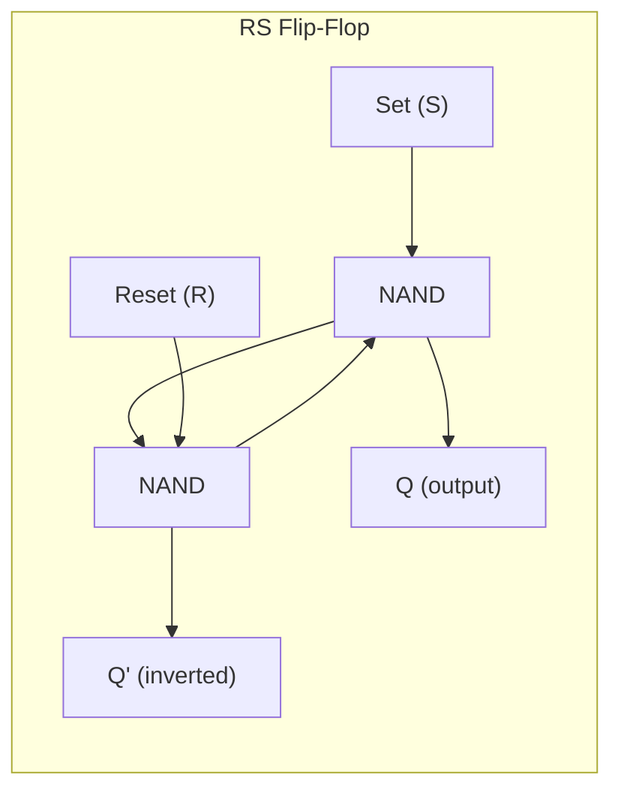
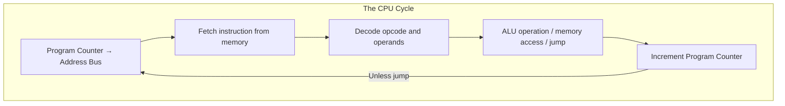

## The Journey from Codes to Computers

---

## Chapters 1-3: Codes

The book opens with a simple scenario: two neighbors communicating by
flashing a flashlight. This is Morse code — a binary code (light on or
off, but with timing differences). From here, Petzold introduces:

- **Braille** — A 6-bit code with 64 possible combinations
- **Binary** — Two symbols (1 and 0), but the meaning depends entirely
  on how you interpret them

The key insight: **codes are agreements** about what symbols represent.
Once you understand this, binary is no more mysterious than any other
code.

---

## Chapters 4-6: Binary and Boolean

Binary arithmetic follows the same rules as decimal:
- 0 + 0 = 0
- 0 + 1 = 1
- 1 + 1 = 0 carry 1

Boolean algebra, invented by George Boole, maps logical propositions
to mathematical symbols:
- AND: both true
- OR: at least one true
- NOT: invert

The crucial connection: **Boolean expressions can be implemented as
electronic circuits.** Claude Shannon proved this in his 1937 master's
thesis — one of the most important documents in computing history.

---

## Chapters 7-9: Logic Gates

Logic gates are the physical implementation of Boolean functions.

| Gate | Function | Symbol |
|------|----------|--------|
| AND | Output 1 only if ALL inputs are 1 | \\& |
| OR | Output 1 if ANY input is 1 | >=1 |
| NOT | Output is opposite of input | 1 (inversion) |
| NAND | NOT AND — output 0 only if ALL inputs are 1 | \\& with circle |
| NOR | NOT OR — output 1 only if ALL inputs are 0 | >=1 with circle |
| XOR | Output 1 if inputs are DIFFERENT | =1 |

Seminal fact: **you can build any digital circuit using only NAND
gates** (or only NOR gates). NAND is a universal gate.

---

## Chapters 10-12: Memory

How does a circuit remember? Petzold shows the simplest memory element:
the flip-flop.

A flip-flop crosses two NAND gates so each gate's output feeds the
other's input. This feedback creates a stable state — memory.

From flip-flops, Petzold builds:
- **Latches** — Levels of gated memory
- **Registers** — Groups of flip-flops storing a byte or word
- **RAM** — Arrays of registers with addressing

---

## Chapters 13-15: Arithmetic

Building an adder from logic gates:

1. **Half adder** — XOR gives sum; AND gives carry
2. **Full adder** — Three inputs (two bits + carry-in); sum + carry-out
3. **Ripple-carry adder** — Chain of full adders for multi-bit addition
4. **Subtraction** — Using two's complement (negate and add 1)

The arithmetic logic unit (ALU) is a collection of adders combined with
logic for subtraction, AND, OR, and comparison — all controlled by
operation-select lines.

---

## Chapters 16-18: The System Bus

A computer's components communicate through three shared pathways:

| Bus | Function | Width |
|-----|----------|-------|
| **Address bus** | Carries memory addresses | 16/32/64 bits |
| **Data bus** | Carries data values | 8/16/32/64 bits |
| **Control bus** | Carries control signals | Varies |

The CPU places an address on the address bus, asserts read or write on
the control bus, and data flows on the data bus. This shared bus
architecture is the backbone of the classic von Neumann machine.

---

## Chapters 19-22: The CPU

The CPU's fundamental operation — the **fetch-decode-execute cycle**:

1. **Fetch** — Load instruction from memory at the address in the
   Program Counter (PC)
2. **Decode** — Interpret the instruction (opcode + operands)
3. **Execute** — Perform the operation (ALU, memory access, jump)
4. **Increment PC** — Move to next instruction

The instruction set is the CPU's native language. Everything —
operating system, programs, games — must ultimately be expressed in
these primitive operations.

---

## Chapters 23-25: Memory Hierarchy

| Memory Type | Speed | Size | Persistence |
|-------------|-------|------|-------------|
| Registers | 1 cycle | Bytes | Volatile |
| Cache (L1/L2/L3) | Few cycles | KB-MB | Volatile |
| RAM (main memory) | 10-100 cycles | GB | Volatile |
| Disk/SSD | Millions of cycles | TB | Persistent |
| ROM/Flash | Slow | MB-GB | Persistent |

---

## Chapters 26-28: Software

- **Machine language** — Binary instructions the CPU executes directly
- **Assembly** — Mnemonic representation of machine code
- **Assemblers** — Translate assembly to machine code
- **Operating systems** — Manage multiple programs, memory, devices
  through interrupts and system calls

The final chapters tie everything together: the OS is just a program
that runs when the computer starts, loads programs into memory, and
handles hardware through interrupts.

---

## Key Lessons

- Computers are built from incredibly simple components — complexity
  comes from scale, not sophistication
- Binary is not magic — it's the most practical representation for
  electronic circuits
- Boolean algebra connects logic (AND, OR, NOT) directly to hardware
  (gates, circuits)
- Memory is just feedback — crossed signals that sustain a state
- The CPU repeatedly does one thing: fetch, decode, execute
- Everything above the CPU is abstraction
- Understanding the machine makes you a better programmer at every
  level

---

## Practical Applications

- Debugging becomes easier when you understand memory, addresses, and
  the stack
- Performance optimization benefits from understanding the memory
  hierarchy
- Security concepts (buffer overflows, exploits) are grounded in
  machine-level behavior
- System design benefits from understanding what happens below your
  programming language

---

## Action Plan

1. **Build a logic gate circuit.** Use a simulator (Logisim) or actual
   hardware
2. **Write a short program in assembly.** Understanding the native
   level changes how you think about code
3. **Trace a high-level concept to hardware.** For example: how does
   an if-statement become machine code?
4. **Read Shannon's 1937 thesis.** It's surprisingly accessible and
   foundational
5. **Build a computer from NAND gates.** Work through Nand2Tetris
   (nand2tetris.org) for the full experience
