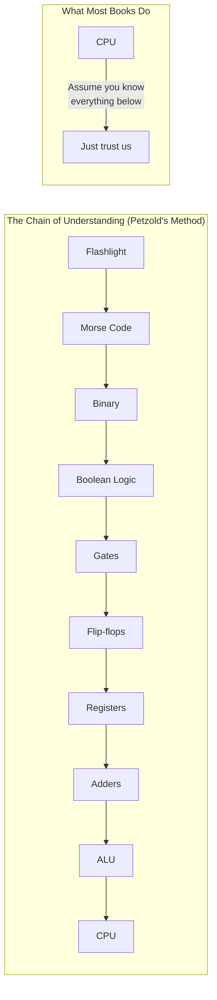

## Introduction

Welcome to BookAtlas. Today: *Code: The Hidden Language of Computer
Hardware and Software* by Charles Petzold. Published 1999, Microsoft
Press. 400 pages.

This is widely considered one of the best computer books ever written.
It takes the reader from a flashlight blinking in the dark to a
complete understanding of how a CPU works — without skipping a single
step.

Today: a programmer who credits this book with their entire
understanding of computing, and a computer architecture professor who
teaches the same material to university students.

---

## The Flashlight Opening

**Programmer:** The opening is perfect. Two neighbors signaling with a
flashlight. That's all computing is — the simplest possible
communication system. From there, Petzold adds one layer at a time.
Morse to binary. Binary to Boolean. Boolean to gates. Gates to
circuits. Circuits to CPUs. By the end, you realize computers are not
magic. They are the inevitable result of stacking simple things on top
of each other.

**Professor:** The pedagogical approach is genuinely remarkable.
Petzold never asks the reader to accept anything on faith. Every new
concept is wired into something already established. This is how
teaching should work but almost never does.

---

## The Beauty of Binary

**Programmer:** The binary chapter changed how I see information.
Binary is not a technical requirement of computers — it's a
consequence of building reliable electronic circuits. Two states are
easy to distinguish. Ten states (decimal) are not. It's elegant how
trade-offs in the physical world dictate the logical design.

**Professor:** Petzold's handling of binary is excellent, but I
would push back on one thing. He does not emphasize enough that binary
is a code — the same bits can represent numbers, characters,
instructions, or colors. It's all about interpretation. This is the
concept my students struggle with most.

---

## Logic Gates and Boolean Algebra

**Programmer:** Shannon's master's thesis — proving that Boolean
algebra maps directly to switching circuits — is presented as the
breakthrough it is. Before Shannon, people thought about circuits and
logic separately. After Shannon, they became the same thing. That's
the kind of insight that makes this book special.

**Professor:** The gate-level chapters are superb. But I wish Petzold
had spent more time on the minimisation of logic — Karnaugh maps,
Quine-McCluskey. The book shows you what gates do but not how to
optimize them. For a book that aims to build understanding, the
optimization piece is important.

---

## The Missing Exercise

**Programmer:** My only complaint is that there are no exercises.
Understanding by reading is great, but building stays with you longer.
I would love to see a workbook companion.

**Professor:** Agreed. I assign Nand2Tetris alongside this book.
Nand2Tetris has you actually build a computer from NAND gates.
Together, they are unbeatable. *Code* provides the intuition;
Nand2Tetris provides the practice.

---

## The Verdict: Still Essential?

**Programmer:** Absolutely. The fundamentals have not changed. Binary,
logic gates, flip-flops, ALUs, the fetch-decode-execute cycle — all of
it is as true today as in 1999. The examples may be from an older era,
but the principles are timeless.

**Professor:** Yes, but I would add one caveat: the book should be the
FIRST book on computer architecture, not the last. After reading
*Code*, students should move to more advanced topics — pipelining,
caching, multi-core, virtual memory — that Petzold barely touches.

**Programmer:** That's fair. But as a foundation, nothing comes close.

---

## Final Thoughts

*Code* is the book that demystifies the computer. If you have ever
felt that there is a layer of magic between your high-level code and
the machine, this is the book that will pull back the curtain.

It is not the only book you need on computer architecture. But it
might be the only one you NEED to read — because after *Code*,
everything else is elaboration on a foundation you already understand.

This has been a BookAtlas narration of Code by Charles Petzold. Thanks
for listening.
