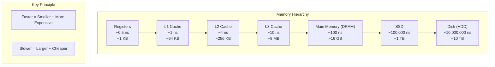
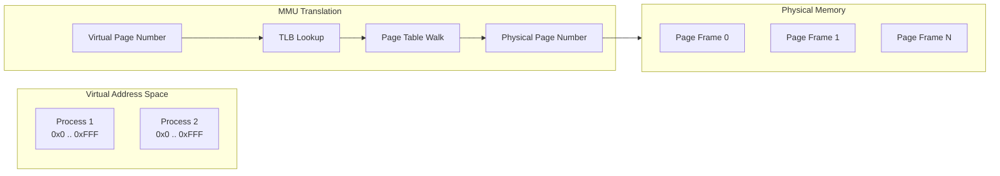
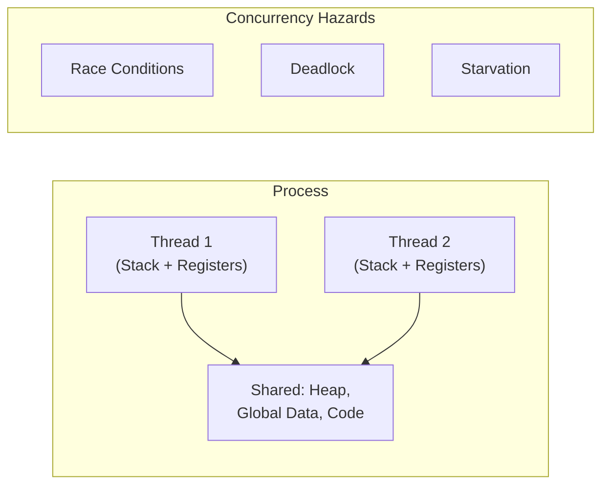

## The Memory Hierarchy

### Locality: The Performance Lever
- **Temporal locality**: if you access a memory location, you are likely
  to access it again soon (loops, counters)
- **Spatial locality**: if you access a memory location, you are likely
  to access nearby locations (arrays, structs)
- Writing cache-friendly code means maximizing both — iterate in
  row-major order, use contiguous data structures, and reuse data while
  it is still in cache.

### Cache Organization
A cache is organized as S sets, each containing E lines. Each line holds
a block of B bytes. The memory address is split into: tag (identifies the
block), set index (chooses the set), and block offset (selects the byte
within the block). Direct-mapped (E=1), set-associative (E=2-16), and
fully associative (E=all) caches trade off complexity vs hit rate.

---

## Virtual Memory

### Key Virtual Memory Concepts
- **Page table**: per-process mapping from virtual pages to physical page
  frames; managed by the OS, consulted by the MMU hardware
- **TLB (Translation Lookaside Buffer)**: a hardware cache of
  recently-used page table entries; a TLB miss triggers a page table walk
- **Demand paging**: pages are loaded from disk only when accessed; this
  enables programs larger than physical RAM
- **Protection**: each page has permission bits (read/write/execute);
  the kernel sets these; dereferencing an invalid pointer causes a
  segfault (page fault → OS delivers SIGSEGV)

---

## Assembly: x86-64 at a Glance

| Concept | Description |
|---------|-------------|
| Registers | 16 general-purpose: %rax, %rbx, %rcx, %rdx, %rsi, %rdi, %rsp, %rbp, %r8-r15 |
| Operand types | Immediate ($0x4), register (%rax), memory (%rdi) |
| Common instructions | mov, add/sub, cmp, jmp/jcc, call/ret, push/pop, lea |
| Calling convention | %rdi, %rsi, %rdx, %rcx, %r8, %r9 for args; %rax for return; caller/callee-saved |
| Condition codes | CF, ZF, SF, OF set by arithmetic; read by conditional jumps |

---

## Concurrency: Threads and Synchronization

### Synchronization Primitives
- **Mutex**: binary lock — only one thread can hold it at a time
- **Semaphore**: generalization of mutex with a counter — controls
  access to a pool of resources
- **Condition variable**: allows threads to wait for a condition to
  become true, releasing the mutex while waiting

---

## Key Lessons

- **Understanding the memory hierarchy is worth more than any
  algorithm optimization.** Cache misses dominate performance.
- **Virtual memory is the foundation of process isolation.** A bug in
  one process cannot corrupt another — the page table enforces
  separation.
- **The stack and heap are fundamentally different.** The stack is
  fast, automatic, and limited (~8 MB). The heap is general-purpose
  but requires explicit management.
- **Every pointer has a type, a value, and an address.** In C, the
  type determines the interpretation; the compiler does not enforce
  correctness — it trusts you.
- **Concurrency is non-deterministic.** The same program can produce
  different results on different runs. Synchronization is not optional.

---

## Practical Applications

### For Performance Optimization
- Organize data for spatial locality (struct of arrays vs array of
  structs)
- Use profiling tools (perf, gprof) to identify cache misses
- Avoid unnecessary memory allocation — reuse buffers

### For Debugging
- Understand segfaults: null pointer dereference, stack overflow,
  accessing freed memory, writing past array bounds
- Valgrind detects memory leaks and invalid accesses
- GDB at the assembly level reveals compiler optimizations

### For Concurrent Programming
- Always acquire locks before accessing shared data
- Establish a lock ordering to prevent deadlock
- Use thread-safe data structures (or wrap them in locks)
