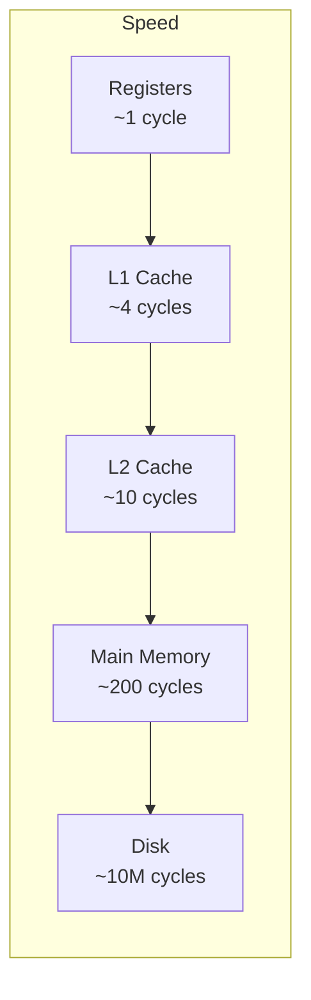

## Introduction

Welcome to BookAtlas. Today: *Computer Systems: A Programmer's
Perspective* by Randal Bryant and David O'Hallaron. Known to every CS
student as CS:APP. The textbook for CMU's legendary 15-213 course.

This is the book that fills the gap between "I can write code" and "I
understand what the computer does with it."

---

## The CS:APP Philosophy

**Proponent:** Most programmers learn to code in a high-level language —
Python, Java, JavaScript. They write loops and functions and classes,
and it works. But they have no idea *why* it works. What happens when
they malloc? What is a segfault, really? Why does iterating a matrix
row-by-row vs column-by-column make a 100x difference?

CS:APP answers all of these.

**Skeptic:** But do most programmers *need* to know this? Isn't it
enough that their code compiles and runs?

**Proponent:** It depends. If you're building a web app in React, you
probably don't need to know about cache associativity. But if you write
system software, databases, game engines, real-time systems, or
performance-critical code — this knowledge is the difference between
adequate and excellent.

---

## The Memory Hierarchy

**Proponent:** This diagram is the most important thing you will learn
in this book. The CPU executes an instruction in about 0.3 nanoseconds.
Reading from main memory takes about 100 nanoseconds. That's a 300x
gap. The cache hierarchy exists to hide this gap.

Every optimization decision flows from this: keep hot data small, access
it sequentially, and reuse it while it's still in cache.

**Skeptic:** So the whole book is about... cache?

**Proponent:** Not just cache. But cache is the unifying performance
theme. Virtual memory? Page tables cached in the TLB. Linking? How the
compiler and loader organize code and data. Concurrency? How threads
share caches and false sharing kills performance. Everything connects.

---

## The Bomb Lab and the Malloc Lab

CS:APP is famous for its labs. Two stand out:

**The Bomb Lab:** You are given a binary bomb. You need to "defuse" it
by entering the correct strings at each of six phases. But you don't
have the source code. You have to use GDB to disassemble the binary,
step through the assembly, reverse-engineer the logic, and figure out
the input. It is terrifying. It is also the fastest way to learn
x86-64 assembly ever invented.

**The Malloc Lab:** You have to implement your own version of malloc,
free, and realloc. You manage a heap with explicit free lists,
segregated fits, and block splitting. Your implementation competes
against the system malloc on throughput and utilization. Students spend
weeks on this. They learn why memory allocation is hard.

---

## The Verdict

**Proponent:** CS:APP is the single most important book a systems
programmer will ever read. It doesn't just teach you facts — it changes
your mental model of computation. You stop thinking in terms of
variables and functions and start thinking in terms of registers,
caches, page tables, and pipeline hazards.

**Skeptic:** But it's also 1,100 pages, assumes C proficiency, and
requires significant math fluency. Most programmers will never need 90%
of this material. For them, CS:APP is overkill.

**Proponent:** But for the 10% who do need it — systems engineers,
performance engineers, compiler writers, OS developers, database
engineers — it is indispensable.

**Skeptic:** Fair. But let's be honest about who it's for. It's a
textbook for a specific CMU course. Solo readers will struggle.

**Proponent:** Yes. But the struggle is the point.

---

## Final Thoughts

CS:APP is not an easy read. It is not a bathroom book. It is a
challenging, comprehensive, and ultimately transformative textbook
that bridges the gap between your code and the machine. If you are a
programmer who wants to understand *why* your program runs fast or
slow, this is where you start.

This has been a BookAtlas narration of Computer Systems: A Programmer's
Perspective by Bryant and O'Hallaron. Thanks for listening.
