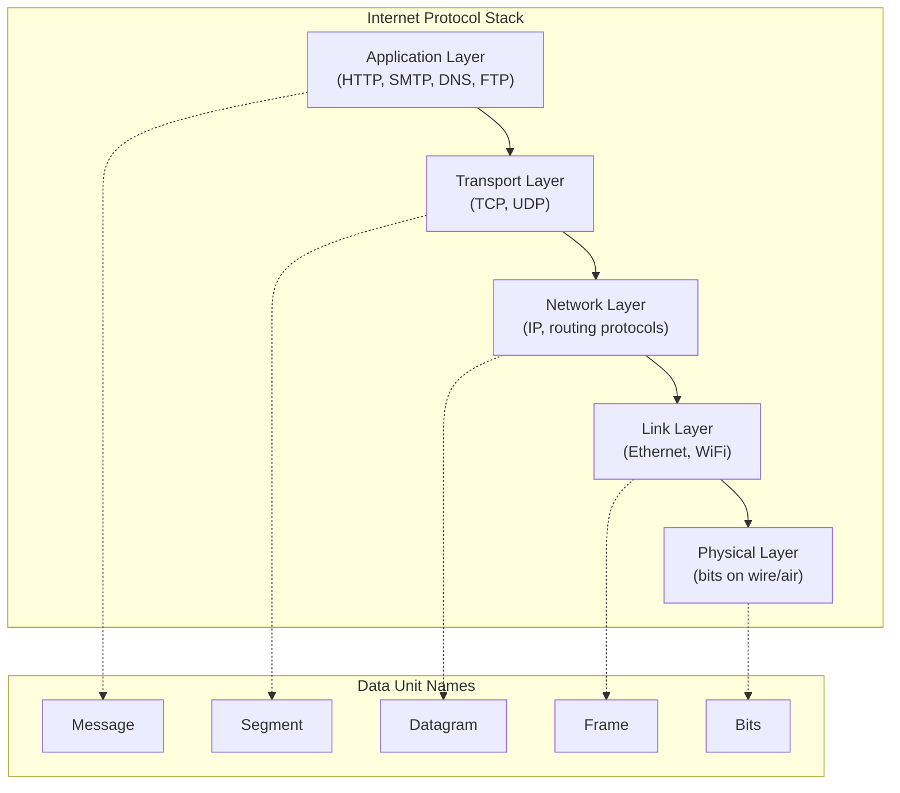
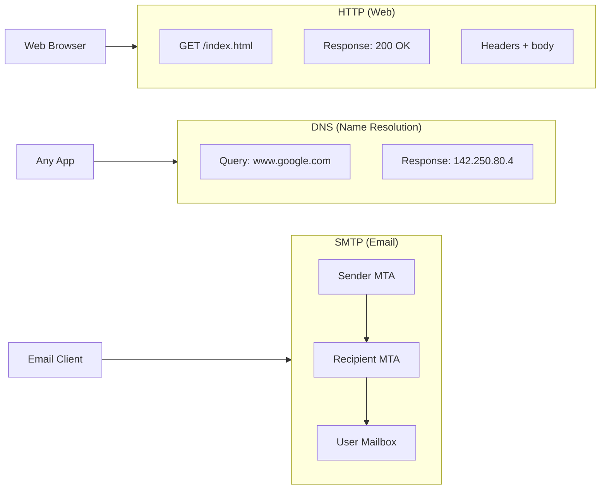
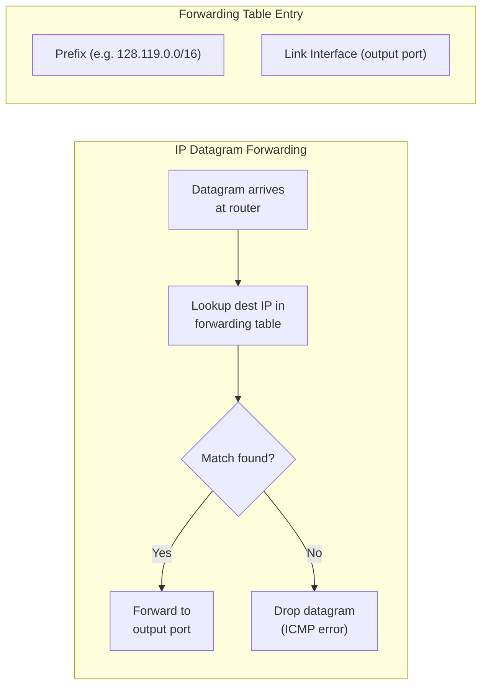

## The Internet Protocol Stack (Five-Layer Model)

### Layer 5: Application Layer
The layer closest to the user. Protocols: HTTP (web), SMTP (email), DNS
(domain resolution), FTP (file transfer). Applications exchange messages
using the services of the transport layer below.

### Layer 4: Transport Layer
Provides logical communication between application processes. Two main
protocols:
- **TCP**: Connection-oriented, reliable, in-order delivery with
  congestion control and flow control
- **UDP**: Connectionless, unreliable, no-frills delivery for
  latency-sensitive apps (streaming, VoIP, gaming)

### Layer 3: Network Layer
Provides logical communication between hosts. The Internet Protocol (IP)
moves datagrams from source to destination through routers. It is
best-effort — no guarantees on delivery, order, or integrity. The control
plane (routing protocols like OSPF, BGP) determines paths; the data plane
forwards packets.

### Layer 2: Link Layer
Transfers frames from one node to the next node along the path.
Protocols: Ethernet (wired), WiFi/802.11 (wireless), PPP (point-to-point).
Handles framing, MAC addressing, error detection, and medium access.

### Layer 1: Physical Layer
The actual bits on the wire or over the air. Defines signal encoding,
transmission rates, and physical medium characteristics.

---

## Application Layer Protocols

### HTTP (HyperText Transfer Protocol)
The foundation of web data communication. HTTP/1.1 uses persistent
connections with pipelining. HTTP/2 adds multiplexed streams and server
push over a single TCP connection. HTTP/3 uses QUIC over UDP for lower
latency. Key concepts: cookies, caching, conditional GET, proxy servers.

### DNS (Domain Name System)
The phonebook of the Internet. A hierarchical, distributed database that
maps domain names to IP addresses. Uses UDP primarily, with TCP for zone
transfers. Root servers → TLD servers → authoritative servers.

### SMTP (Simple Mail Transfer Protocol)
Push protocol for transferring email between mail servers. Uses TCP.
POP3 and IMAP are pull protocols for retrieving email from a server.

---

## Transport Layer: TCP vs UDP

| Feature | TCP | UDP |
|---------|-----|-----|
| Connection | Connection-oriented | Connectionless |
| Reliability | Reliable (acks, retransmits) | Best-effort (no acks) |
| Ordering | In-order delivery | No ordering guarantee |
| Congestion Control | AIMD, slow start, fast recovery | None |
| Flow Control | Sliding window | None |
| Header Size | 20-60 bytes | 8 bytes |
| Use Cases | Web, email, file transfer, SSH | Streaming, gaming, DNS, VoIP |

### TCP Reliable Data Transfer
TCP uses a sliding window protocol with cumulative acknowledgments,
sequence numbers, and retransmission timers. The sender maintains a
window of unacknowledged segments; upon receiving an ACK, the window
slides forward. Timeout triggers retransmission.

### TCP Congestion Control
TCP uses Additive Increase Multiplicative Decrease (AIMD): the
congestion window increases by 1 MSS per RTT until packet loss is
detected; then it halves. Slow start begins with a small window and
doubles every RTT until a threshold. Fast retransmit and fast recovery
handle duplicate ACKs without waiting for timeouts.

---

## Network Layer: IP Forwarding

IPv4 uses 32-bit addresses; IPv6 uses 128-bit addresses. Subnetting
divides an IP network into smaller subnets. CIDR (Classless InterDomain
Routing) enables arbitrary prefix lengths written as /n.

---

## Key Lessons

- **Layering is the Internet's most important architectural principle.**
  Each layer solves a specific problem without burdening other layers.
- **The end-to-end argument favors intelligence at the edges.** Keep the
  network core simple and place advanced functionality at endpoints.
- **TCP's congestion control is what makes the Internet stable.** Without
  it, the network would collapse under its own traffic.
- **Latency is the new bottleneck.** As bandwidth increases, propagation
  delay and processing delay dominate.
- **Security must be designed in, not bolted on.** Every layer has
  vulnerabilities; defense requires depth.
- **Understanding the network stack is essential for building robust
  distributed systems.** Timeouts, retries, backpressure, and load
  balancing all trace back to transport-layer principles.

---

## Practical Applications

### For Web Developers
- Understand how HTTP/2 multiplexing avoids head-of-line blocking
- Use connection keep-alive to reduce TCP handshake overhead
- Cache at the browser, CDN, and reverse proxy layers

### For Backend Engineers
- Set appropriate TCP keepalive and timeout values for services
- Use connection pooling to amortize TCP connection setup cost
- Choose TCP vs UDP based on reliability/latency tradeoffs

### For Network Engineers
- Understand BGP path selection to troubleshoot routing issues
- Use traceroute and ping to diagnose network paths and latency
- Monitor queue lengths to detect congestion before packet loss

### For Security Engineers
- Firewalls operate at multiple layers: packet filters, stateful, and
  application-layer gateways
- TLS protects application data; IPsec protects at the network layer
- DDoS mitigation requires understanding amplification attacks (NTP,
  DNS, Memcached)
