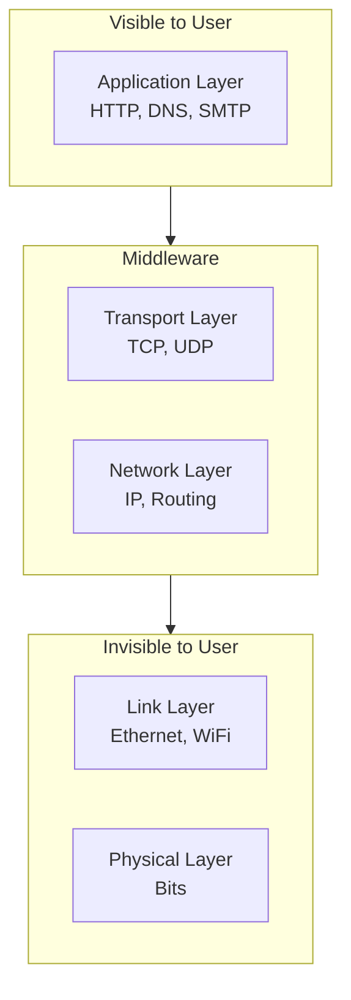
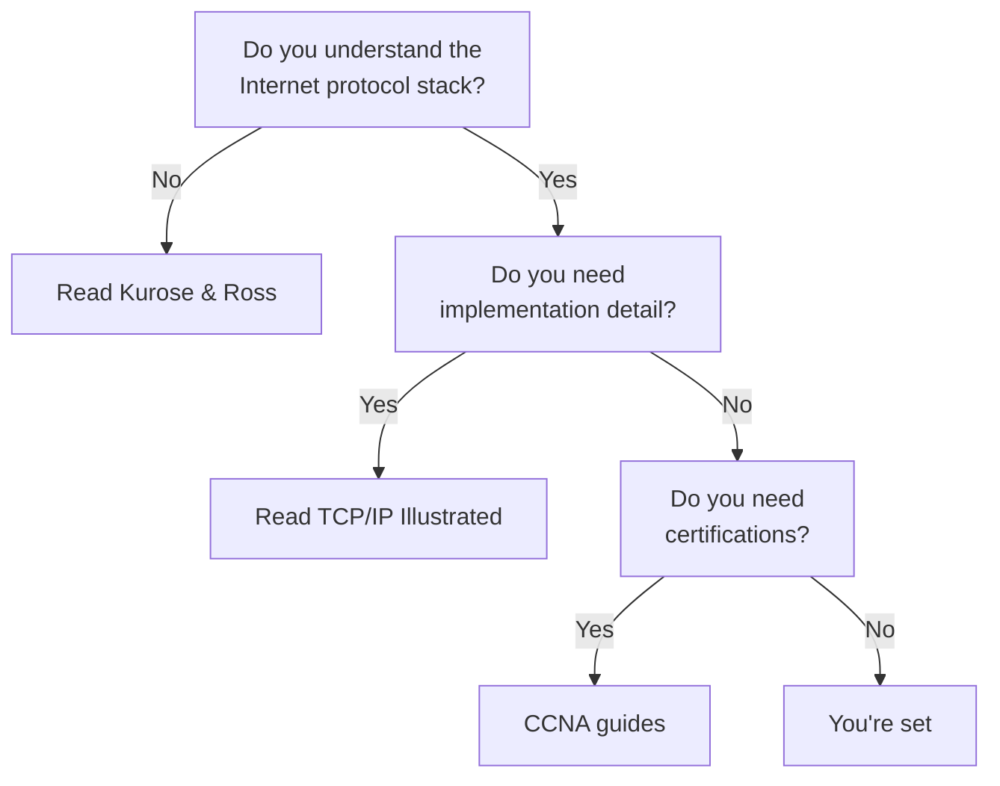

## Introduction

Welcome to BookAtlas. Today: *Computer Networking: A Top-Down Approach*
by James Kurose and Keith Ross. First published 2000. Now in its 8th
edition. The standard networking textbook used at over 1,000 universities.

This book is famous for one pedagogical bet: start at the top — the
application layer — and work down. Instead of teaching you about bits,
voltages, and Ethernet frames on page one, it opens with your web browser.
Then it shows you what happens when you type a URL.

Let's figure out if this approach actually works.

---

## The Big Bet: Why Top-Down Matters

**Professor:** The genius of Kurose and Ross is understanding that
students don't care about signal encoding. They care about the web. By
starting with HTTP — something every student has used — you create
immediate relevance. The student thinks: "Oh, I can actually build
something with this."

**Skeptic:** But isn't this just a gimmick? You can't understand the
application layer without knowing what happens beneath it. How do you
explain TCP without the network layer? How do you explain the network
layer without the link layer? At some point, top-down becomes a
pretzel.

**Professor:** Actually, it works because of abstraction. The application
layer treats TCP as a reliable pipe. You don't need to know how TCP
achieves reliability to write a socket program. You only need the API.
The top-down approach reveals one layer at a time — and the student
always has a stable foundation to stand on.

---

## The Internet's Layered Cake

**Skeptic:** That's the five-layer stack. I know this from every
networking interview I've ever failed.

**Professor:** Exactly. And that's why this book is so useful. Every
interview question about networking — "what happens when you type
google.com into your browser" — is just walking this stack from top to
bottom. DNS resolution at the application layer. TCP handshake at
transport. IP routing at the network layer. Ethernet frames at the link
layer. The book teaches you how to think about networks as a stack of
abstractions.

---

## TCP: The Internet's Traffic Cop

The single most important protocol in the book is TCP. It's the protocol
that makes the Internet reliable.

**Professor:** TCP is astonishing. It detects packet loss, retransmits
lost segments, keeps data in order, prevents the sender from overwhelming
the receiver (flow control), and prevents everyone from overwhelming the
network (congestion control). And it does all of this with a single
mechanism: the sliding window.

**Skeptic:** But TCP is also the reason the web can be slow. Head-of-line
blocking — if one packet is lost, everything behind it waits. That's why
HTTP/3 ditched TCP for QUIC over UDP.

**Professor:** True, and the 8th edition covers this. TCP's congestion
control is the reason the Internet didn't collapse in the 1990s. But for
latency-sensitive applications, TCP's reliability guarantees can be a
liability. The book does a good job explaining this tradeoff — and why
you might choose UDP for real-time video or gaming.

---

## Security: The Afterthought Chapter

**Skeptic:** Chapter 8 is network security, and it's a single chapter at
the end of the book. This is a problem. Security isn't a layer — it's a
property that should permeate every layer. TLS lives at the transport
layer. IPsec at the network layer. WPA3 at the link layer. Why is it
relegated to the final chapter?

**Professor:** Fair criticism. Security as an afterthought mirrors the
Internet's own history — security was not designed in; it was bolted on.
But the chapter itself is solid. It covers symmetric/asymmetric
cryptography, digital signatures, TLS handshake, IPsec, firewalls, and
common attacks. It's not deep enough for a security specialist, but it's
enough for a generalist.

---

## The Bottom Line

**Professor:** If you want to understand how the Internet works — not
just how to configure a router but how packets actually get from your
laptop to a server in Tokyo — this is the book. It's comprehensive,
clear, and updated for the modern era.

**Skeptic:** But if you already understand the basics — if you know what
a TCP handshake is and why DNS matters — there are deeper books. Stevens
for implementation detail. Tanenbaum for engineering rigor. Kurose and
Ross is the best *teaching* book, not the best *reference* book.

**Professor:** For 99% of software engineers, that's exactly what they
need. A teacher, not an encyclopedia.

---

## Final Thoughts

*Computer Networking: A Top-Down Approach* is a masterpiece of technical
education. Its top-down structure was a genuine innovation, and its
explanations have taught a generation of engineers how the Internet works.
It's not perfect — it's verbose, expensive, and security deserves more
than one chapter. But as an introduction to networking, nothing comes
close.

This has been a BookAtlas narration of Computer Networking: A Top-Down
Approach by Kurose and Ross. Thanks for listening.
