## The Browser's Networking Stack

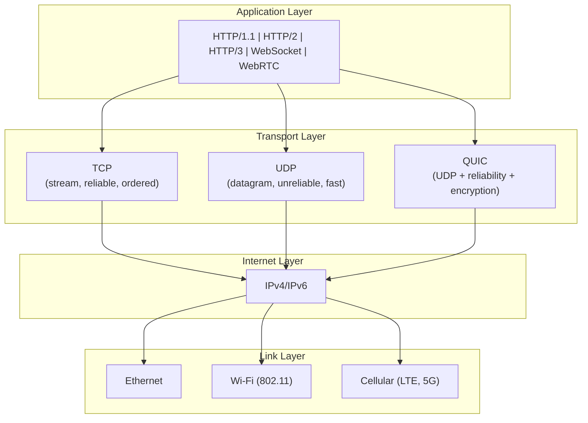

Every byte leaving a browser passes through these layers on the way to
the server, and back through them on the way to the screen. Understanding
the behavior — and limits — of each layer is the entire argument of this
book.

---

## TCP: The Internet's Workhorse

### The TCP Handshake

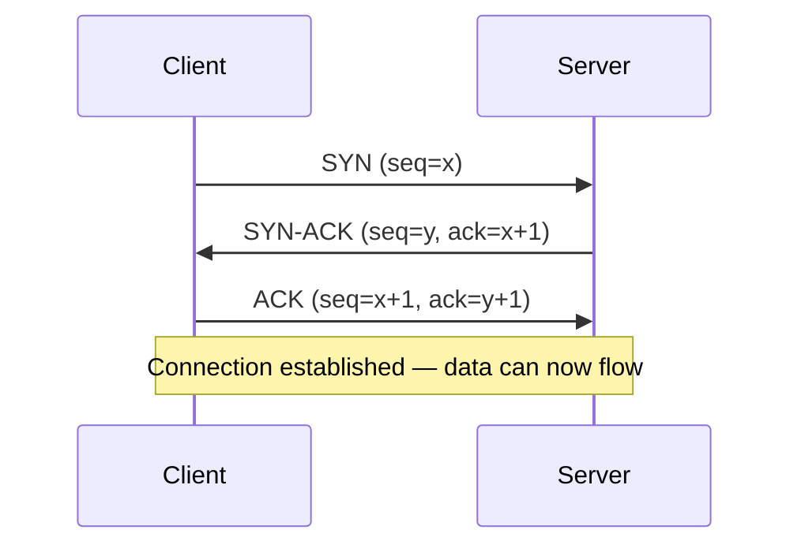

TCP requires one round trip just to establish the connection before any
application data can be sent. In a browser opening six parallel
connections to fetch assets, six handshakes serialize in the DevTools
waterfall before you see a single response.

### Slow Start: Why New Connections are Slow

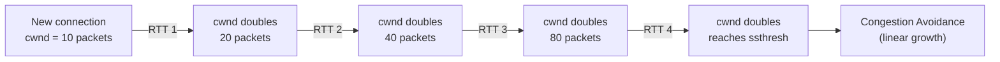

Every new TCP connection begins with **slow start**: the congestion
window starts small (10 packets in modern OSes with an increased initial
window, up from 1 in the original spec) and doubles each round trip.
This means a fresh connection is structurally penalized. Reusing
connections (keep-alive, HTTP/2) eliminates this cost entirely.

### Nagle's Algorithm and Delayed ACK

Two separately reasonable TCP mechanisms interact badly with HTTP's
request-response pattern:

- **Nagle's algorithm**: when the sender has small messages, it waits a
brief moment for more data to batch into a larger packet — unless an ACK
arrives or the buffer fills.
- **Delayed ACK**: the receiver waits up to 40ms to ACK, hoping the
application will generate data to piggyback on the ACK.

In combination: the browser sends a small request, Nagle waits. The
server receives it, sends a small response, delayed ACK waits. Both
sides are waiting for the other to move first. This adds up to a 40ms
penalty per request-response pair on many TCP stacks — often the hidden
cost behind "why does this request take so long?"

**Fixes**: disable Nagle with `TCP_NODELAY` on the server, set
`TCP_QUICKACK` on the client, or (best of all) use HTTP/2
multiplexing, which eliminates the small-pattern on a single connection.

### TCP Fast Open

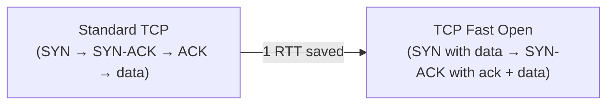

TFO pushes application data into the initial SYN packet. The server can
respond in the SYN-ACK. One round trip eliminated for connection
establishment when the client has a valid TFO cookie. Requires OS and
NAT support; not universally available as of 2026.

### TCP Features the Book Covers in Depth

| Feature | Purpose | Impact on Web Performance |
|---|---|---|
| Slow start | Congestion control | New connections start slow; reuse beats new |
| Nagle's algorithm | Reduce small packets | Adds latency with request-response traffic |
| Delayed ACK | Reduce ACK packets | Interacts badly with Nagle for HTTP |
| TCP Fast Open | Eliminate one RTT | Saves one round trip when cookie is available |
| Selective ACK (SACK) | Identify lost blocks | Faster recovery from packet loss |
| Window scaling | BDP > 64KB | Required for high-bandwidth, high-latency links |
| `TCP_CORK` / `TCP_NODELAY` | Fine-grained send control | Server-side tuning for HTTP response framing |

---

## UDP: The Fast and Loose Cousin

UDP is a datagram protocol: send a packet, hope it arrives. No ordering,
no retransmission, no congestion control. Why does it matter?

Because **TCP is structured to solve problems the web does not always
have** — or that the application wants to solve differently. For
real-time media (audio, video, gaming), delayed delivery is worse than
dropped delivery. You want the next frame, not last frame retransmitted.

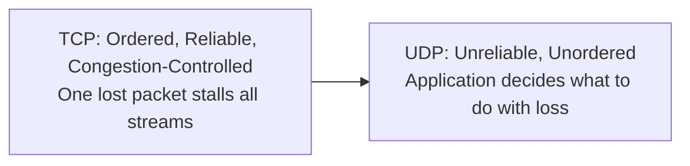

UDP is the substrate for QUIC, which adds back reliability and ordering
per stream, plus TLS 1.3, using the space between the transport layer
and the application — in user space, where innovation is not gated by
OS kernel releases.

---

## TLS: Security and Performance Combined

### The Pre-TLS 1.3 Handshake

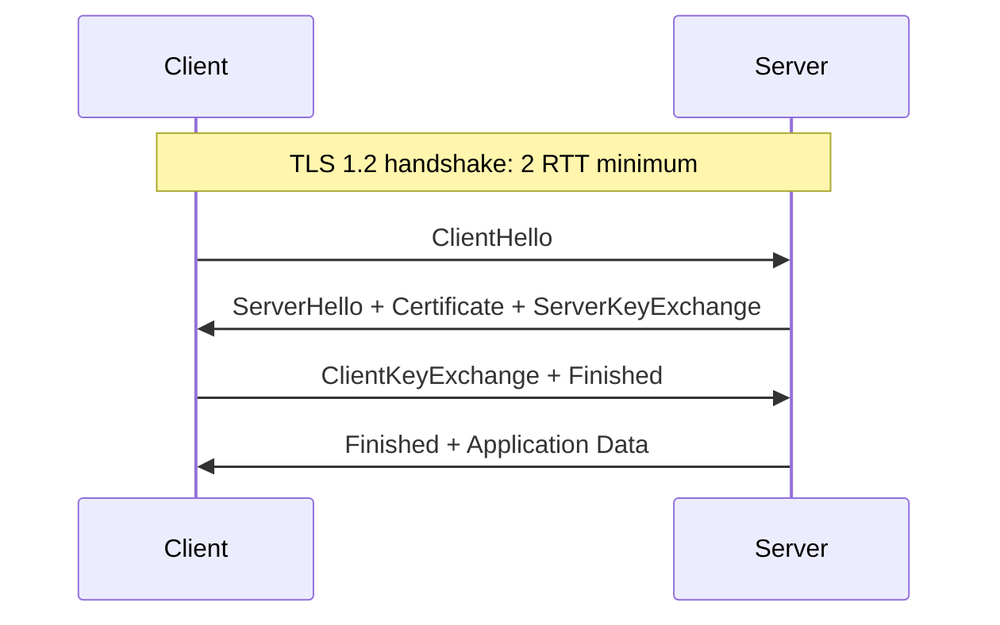

TLS 1.2 required at least two round trips before any application data
could flow. On a 50ms RTT mobile link, that was 100ms of pure protocol
overhead — before the browser even started fetching the resource.

### TLS 1.3: The Performance Revolution

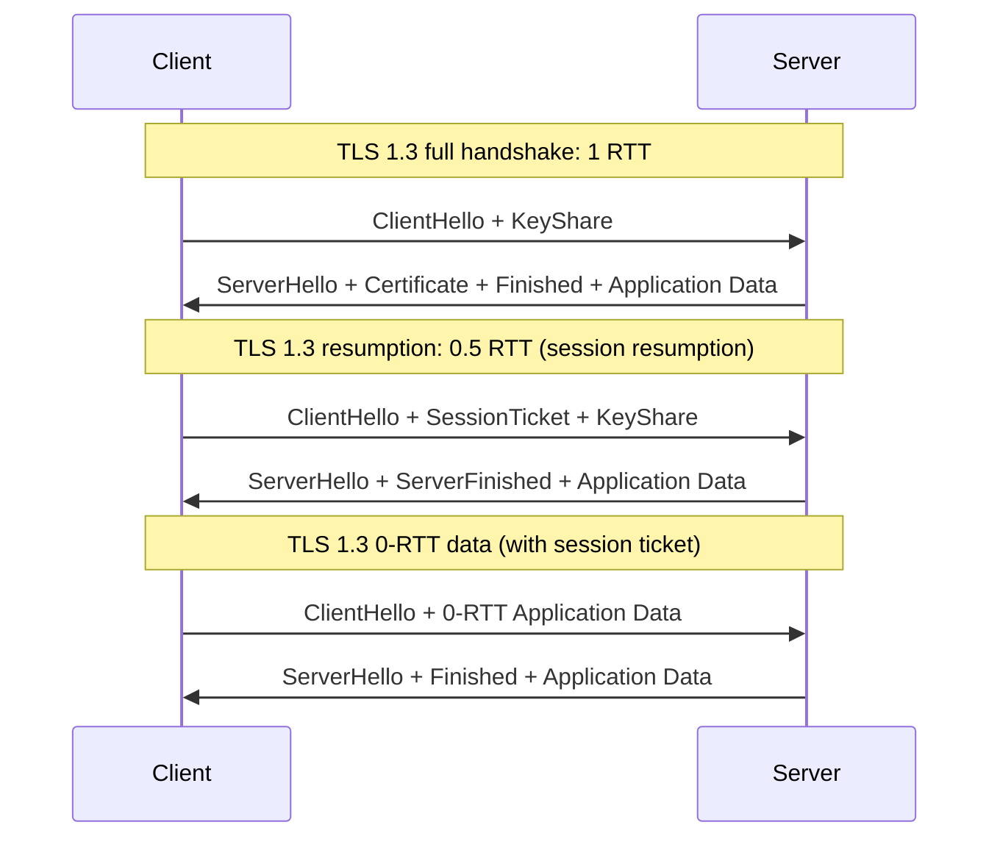

TLS 1.3 collapses the handshake to a single round trip. Session
resumption goes to half a round trip (the server only ACK-style
responds). 0-RTT data — using a session ticket from a previous handshake
— can deliver application data in the first packet the client sends.

The key mechanisms: TLS 1.3 removes all insecure and unnecessary cipher
suites. Key exchange defaults to ephemeral Diffie-Hellman (ECDHE); RSA
key transport is gone. Session tickets with encrypted early data are the
resumption path. The result is less CPU, fewer round trips, and more
security.

### TLS Performance Facts the Book Quantifies

| Scenario | TLS 1.2 | TLS 1.3 | Savings |
|---|---|---|---|
| Full handshake (new connection) | 2 RTT | 1 RTT | 50% fewer RTTs |
| Session resumption | 2 RTT | 1 RTT | 50% fewer RTTs |
| Session ticket (0-RTT) | N/A | 0 RTT (data in first packet) | One full RTT |
| Cryptographic cost | RSA, AES-CBC | ECDHE, AES-GCM/ChaCha20-Poly1305 | Lower CPU, smaller messages |

## DNS: The Foundation Every Byte Depends On

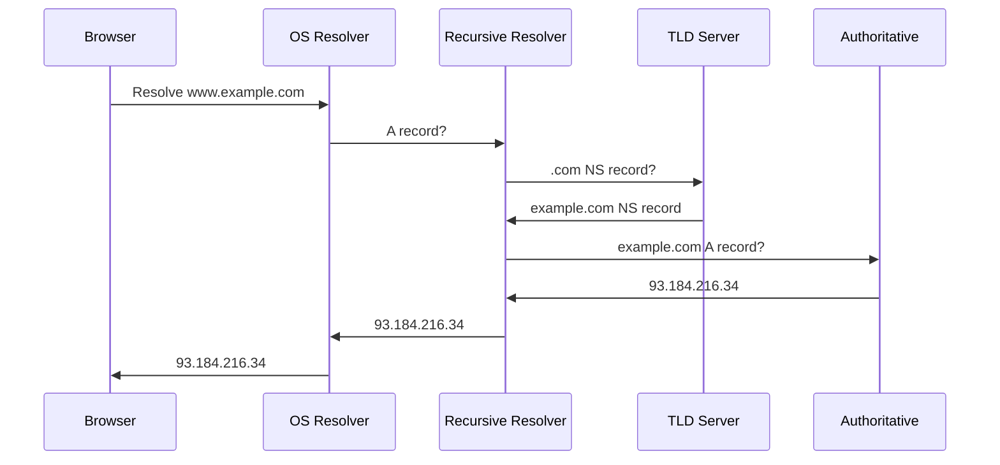

A full cold DNS lookup requires visiting a TLD server and then an
authoritative server — at minimum two round trips before any application
protocol runs. The book covers how browser prefetch and OS-level caching
eliminate this cost for connections the browser has seen recently.

| DNS Optimization | What It Does |
|---|---|
| OS and browser cache | Keeps popular records local; TTL governs freshness |
| Preconnect / prefetch hints | `rel="preconnect"` and `dns-prefetch` trigger DNS before it is needed |
| EDNS0 / larger UDP payloads | Reduces TCP fallback for large responses |
| DNS over HTTPS (DoH) | Adds ~one RTT per lookup; trade-off with privacy and caching |

---

## Wireless and Mobile Networks: The Real World

### Bandwidth vs. Latency

The most important conceptual point in the book:

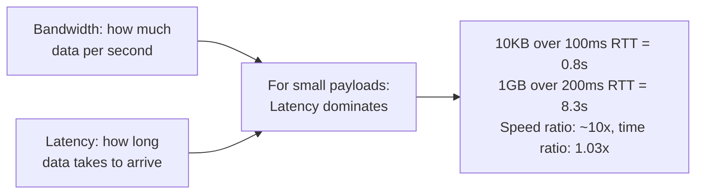

For the size of most web responses (tens to hundreds of kilobytes), the
time of flight dominates the transfer time. Doubling bandwidth has
negligible effect; cutting RTT by 50% has an immediate, visible effect.

### Wi-Fi Retries and Hidden Stations

Wi-Fi uses CSMA/CA: listen before talk, exponential backoff on collision.
The book quantifies retry overhead — at 50% packet loss, throughput
collapses to ~10% of peak rate. This is the hidden cost of coffee-shop
Wi-Fi and dense office environments.

### Cellular Radio State Machines

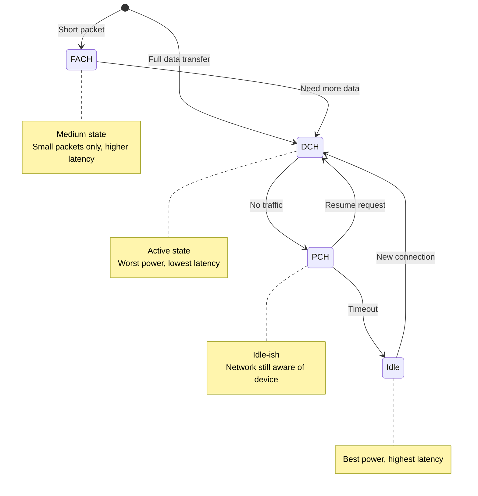

The radio idle state is where real-world latency hides. When a phone's
radio has been idle, the next network request must re-establish the RRC
connection — adding 100–500ms that no CMS optimization can eliminate.

The book recommends: keep-alive pings, prefetch warm connections, and
batch requests to avoid cycling the radio through idle repeatedly.

---

## TCP Congestion Control: The Invisible Policeman

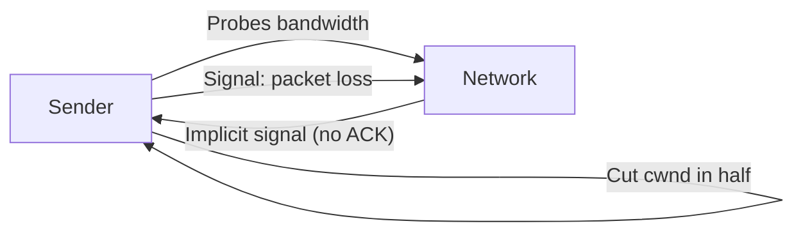

TCP's congestion control is entirely implicit: the only loss signal is
a missing ACK. The algorithm (CUBIC, the modern Linux default) has no
knowledge of what happened in the network — only that something did not
come back.

For HTTP, this matters because:

1. **Slow start** means early data is slow
2. **Loss recovery** cuts the window in half, triggering a cold start
feeling
3. **Many small connections** each wake slow start independently
4. **Reused connections** accumulate window size beneficially — HTTP/2
exploits this directly

| Concept | Signal | Effect on Web Traffic |
|---|---|---|
| Slow start | Window doubles per RTT | Early data slow on new connections |
| Congestion avoidance | Linear growth | Stabilizes but never fast-starts |
| Loss recovery | Halve cwnd | Visible throughput dips on mobile/congested links |
| RTT fairness | Long-RTT flows get less bandwidth | Satellites, Australia, constrained markets disadvantaged |

---

## Key Lessons

- **TCP slow start shapes every new connection.** Six parallel HTTP/1.1
connections each start slow; one HTTP/2 connection starts slow once and
then benefits from cumulative window growth.
- **Nagle + delayed ACK is a 40ms tax on small HTTP requests.** Disable
Nagle on HTTP servers; set TCP_QUICKACK on HTTP/2 connections.
- **TLS 1.3 changes the calculus.** Session resumption and 0-RTT make
HTTPS feel faster than HTTP over TLS 1.2, and comparable to HTTP
without TLS.
- **Bandwidth is abundant; latency is scarce.** Optimize for RTT first,
throughput second.
- **Wireless is not wired.** Plan for retries, variable bandwidth, radio
state transitions, and inherently unreliable media.
- **QUIC's per-stream recovery is the key insight.** Losing one packet
bottlenecks the entire HTTP/2 connection over a lossy link; QUIC loses
only the affected stream.
- **DNS upfront cost compounds.** Preconnect and prefetch eliminate
waiting time the user never asked for — but abuse creates speculative
traffic that the server pays for.
