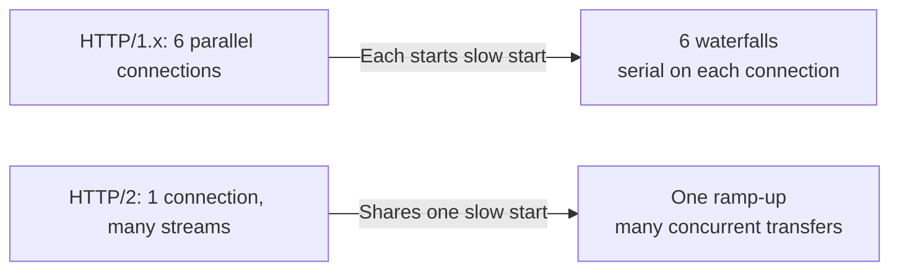
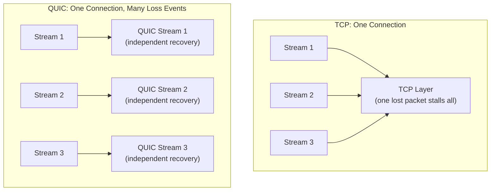
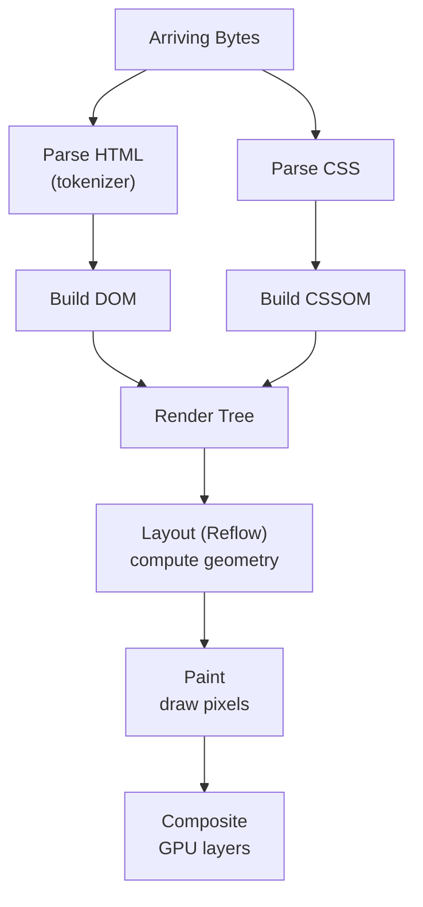

## Introduction

Welcome to BookAtlas. Today: *High Performance Browser Networking: What
Every Web Developer Needs to Know About Browser Networking*. Second
edition, 2021. Author: Ilya Grigorik. Roughly 380 pages.

This is a book about what no one sees: the network traffic that happens
between the moment a user clicks a link and the moment something appears
on screen. It is also a book about what engineers feel but cannot name:
the milliseconds that add up to a page feeling slow, the waterfalls in
DevTools, the why-is-this-fast-on-wired-but-not-on-latte-Wi-Fi question.

Grigorik is the right author for this material. He was a performance
engineer who worked on HTTP/2 outreach at Google. He made the argument
to the web's largest properties that HTTP/2 was worth adopting before it
was standard. He was right.

---

## Why This Book Exists

**Host:** Most engineers think of the network as something out there — a
black box that either works or doesn't. We write code, we deploy, we
hope.

**Guest:** That framing is the problem. The network is not a black box.
It is a stack of protocols, each with invisible behaviors, each with
specific costs. TCP has slow start. TLS has a handshake. HTTP/1.x has a
six-connections-per-origin limit. DNS has a cold-start cost. The browser
has a rendering pipeline that cannot start until it has assembled CSSOM
and DOM. Every one of those is a millisecond you can eliminate if you
know it exists.

**Host:** And most web developers don't know any of that?

**Guest:** They know some of it. They know "minimize HTTP requests." They
know "serve over HTTPS." But they do not know why. The why matters
because the specific lever — connection reuse, TLS session resumption,
rendering-blocking CSS — is different in each case. Minimizing HTTP
requests was the right advice for HTTP/1.x. It is mostly wrong for
HTTP/2, where fewer, larger transfers over one connection is faster.

---

## TCP: The Room Where It Happens

**Host:** Let's start with TCP. It is the foundation of the web. What
does a web developer need to understand about it?

**Guest:** Three things, really. First, slow start. Every new TCP
connection starts with a congestion window of 10 packets. That window
doubles every round trip until it reaches some limit. The result: the
first few RTTs on every connection are structurally slow. This is why
HTTP/1.x's six parallel connections are a symptom of slow start — six
connections means six slow starts happening in parallel. HTTP/2's one
connection per origin shares one slow start across all streams.

**Host:** So connection reuse is not just a hygiene thing. It is a real
performance lever.

**Guest:** Much more real than most developers assume. Second: Nagle's
algorithm and delayed ACK. Nagle says "if you have small data, wait a
bit before sending, in case there is more." Delayed ACK says "wait a bit
before acknowledging, in case the application has data to piggyback."
Together, on a request-response protocol like HTTP, they create a deadlock.
The client sends a request, Nagle waits. The server ACKs, delayed ACK
waits. Both are waiting for the other to move first. That is a 40ms cost
per request on many systems, baked into the TCP stack.

**Host:** That is a hidden tax.

**Guest:** Every millisecond is a hidden tax until you measure it. And
most developers never see it because it is inside the TCP stack, not in
their application code.

**Host:** What about the third thing?

**Guest:** TCP Fast Open. It pushes application data into the initial SYN
packet. The server can respond in the SYN-ACK. One round trip eliminated.
It is not universally available — NATs and middleboxes break it — but in
environments where it works, it is a genuine first-load win.

---

## TLS: Security and Performance Are Not Opposites

**Host:** TLS used to be the reason people said "HTTPS is slow."
Has that changed?

**Guest:** Completely. TLS 1.3 is a performance breakthrough. The old
TLS 1.2 handshake required two round trips. TLS 1.3 does it in one.
Session resumption is half a round trip. And with a session ticket from
a previous visit, TLS 1.3 can send actual application data in the very
first packet the client sends. That is zero round trips for the
application data.

**Host:** That sounds like a lot.

**Guest:** Quantify it: on a 50ms RTT mobile link, full TLS 1.3 is 50ms
instead of 100ms. That is a full page load saved before any bytes are
requested. cryptographically, TLS 1.3 removed all the insecure and slow
ciphers. RSA key transport is gone. All key exchange is ephemeral
Diffie-Hellman. The same handshake that is faster is also more secure.
This is one of those cases where optimization and correctness went in the
same direction.

---

## HTTP/1.x: The Waterfall Is Protocol Behavior, Not Bad Code

**Host:** HTTP/1.x is often blamed for slow sites. What actually goes
wrong?

**Guest:** Everything in HTTP/1.x serializes. The browser limits
connections to six per origin. Each request goes on its own connection
and waits for the response before the next request on that connection
pipeline. In DevTools, this looks like a staircase — a waterfall of many
small round trips.

**Host:** People think that means their server is slow.

**Guest:** Often the server is fast. It is the protocol. The request
reached the server in 20ms. The response returned in 5ms. But between
them, the browser waited for the previous response, and the connection
was idle because of the per-origin limit. That is not server latency; it
is protocol latency.

---

## HTTP/2: Multiplexing as the Answer

**Host:** HTTP/2 fixes this with multiplexing?

**Guest:** That is the headline, yes. One connection per origin, many
concurrent streams. But the deeper fix is a change in the cost model:

Under HTTP/1.x, the cost of adding another asset is a full round trip on
a connection that also has to do slow start. Under HTTP/2, the cost of
adding another stream is a small framing overhead on a connection that is
already mature and has a large congestion window.



**Host:** And compression?

**Guest:** HPACK. Header compression. HTTP requests are mostly the same
headers with small variations. HPACK builds a static and dynamic table so
that repeated headers — `Host`, `User-Agent`, `Accept` — are sent as
small index references instead of full text. This matters on high-
latency, low-bandwidth links where every byte counts.

Server push is the other headline feature. The server can, in the initial
response, begin sending assets it knows the client will need — CSS,
JavaScript that the HTML references. Push eliminates the request round
trip entirely for those assets. It requires careful Cache-Digest and
management to avoid sending assets the client already has, but when it
works, it is genuine page-load acceleration.

---

## HTTP/3 and QUIC: Fixing the Final Layer

**Host:** If HTTP/2 solved head-of-line blocking, why do we need HTTP/3?

**Guest:** HTTP/2 solved head-of-line blocking at the application layer.
But TCP still has it at the transport layer. TCP is a byte stream: one
lost packet means all streams waiting on that connection wait for
retransmission. On a lossy mobile link, this is a real, measurable drag.

**Host:** So QUIC fixes that at the transport layer.

**Guest:** Exactly. QUIC is TCP reimplemented in user space over UDP. It
solves congestion control, ordering, and reliability — but it does it
*per stream*, not per connection. One lost packet stalls one HTTP/3
stream. All other streams continue. Combined with TLS 1.3 built in, QUIC
also saves round trips on the security handshake.



The book explains that QUIC's other feature — connection migration —
means your phone does not lose its state when switching from Wi-Fi to
cellular. TCP connections are identified by a 4-tuple of source IP,
source port, dest IP, dest port. Change IP and the connection breaks.
QUIC uses a connection ID in the encrypted payload — change the IP and
the connection follows. This is why QUIC matters more on mobile than on
desktop.

---

## WebRTC: Beyond Browsers to Peer-to-Peer

**Host:** The book covers WebRTC. What does a web performance book need
to say about it?

**Guest:** WebRTC is in the book because it is a browser networking
primitive that sits outside the usual request-response model. The
browser can open a peer-to-peer data channel — no server in between
carrying the traffic — using ICE, STUN, and TURN to traverse NATs.

STUN asks a public server: "what is my public IP and port?" TURN
relays the traffic when STUN alone fails.

**Host:** When does TURN fire?

**Guest:** Symmetric NATs, mobile carrier-grade NATs, enterprises behind
firewalls that block UDP. TURN is the fallback. The data channel still
works, but latency goes through TURN server, and bandwidth costs you
per gigabyte.

---

## The Rendering Pipeline: The Invisible Final Mile

**Host:** The book ends on rendering. Why does a networking book care
about reflow and repaint?

**Guest:** Because arriving bytes hit a rendering pipeline before the
user sees anything. The fastest server in the world cannot deliver a
perceived speed win if the browser is sitting in layout thrashing.



Render-blocking CSS means: `link rel="stylesheet"` in the `head`. The
browser sees the CSS, builds CSSOM, builds the render tree, and only
then starts layout and paint. If your CSS is mid-page, nothing paints.

The book explains render-blocking CSS: inlining critical CSS above the
fold, async-loading non-critical stylesheets with `media="print"`, and
`preload` for fonts. These are network-side optimizations that live in
the HTML — the first thing the network delivers.

JavaScript that writes to the DOM forces reflow. Animating a property
that affects layout forces a full reflow every frame. The render pipeline
is where "the network is fast but the page feels janky" hides.

---

## Reporting APIs: Measuring What You Cannot See

**Host:** You cannot optimize what you cannot measure. The book has a
real emphasis on this.

**Guest:** The Navigation Timing API gives you a timing profile of a
page load from the perspective of the browser: DNS time, TCP handshake
time, TLS time, Time to First Byte, DOM processing, load event. It is
the only way to correlate network behavior with user-perceived speed at
scale.

```javascript
const [nav] = performance.getEntriesByType('navigation');
console.log({
  dns: nav.domainLookupEnd - nav.domainLookupStart,
  tcp: nav.connectEnd - nav.connectStart,
  tls: nav.requestStart - nav.connectStart,
  ttfb: nav.responseStart - nav.requestStart,
  dom: nav.domContentLoadedEventEnd - nav.responseEnd,
  load: nav.loadEventEnd - nav.responseEnd,
});
```

The Resource Timing API does the same for individual fetched assets.
Together, these APIs are the feedback loop: you change a setting, you
deploy, and you see in real user data whether the waterf fall got
shorter.

**Host:** And the setup cost of these APIs is zero — it is built into
every modern browser.

**Guest:** Exactly. The book's position: if you are not collecting
`performance.getEntriesByType()` data from your real users, you are
optimizing blind.

---

## The Verdict

**Guest:** *High Performance Browser Networking* is a book written by an
engineer who was in the room where the standards were being written and
who has run the servers under real traffic. It is not a textbook and it
is not a journalism project. It is a field manual.

It covers the protocol stack in the order you encounter it — TCP, TLS,
DNS, HTTP/1.x, HTTP/2, HTTP/3, WebRTC — and ends where performance is
measured: the rendering pipeline and the browser timing APIs.

**Host:** And the argument?

**Guest:** The argument is consistent and quantifiable: latency is the
bottleneck, not bandwidth. Every layer has a specific cause and a
specific fix. TCP slow start. Nagle's algorithm. TLS handshakes. DNS
cold-start. Render-blocking CSS. None of these require a faster server.
They require understanding.

**Host:** Final rating?

**Guest:** 9.5 out of 10. The notes that follow each chapter — the
specific config flags, the sequence diagrams, the TCP constant values —
are worth the cover price on their own. If you write web code for a
living and have not read this, read it. If you have read it and it has
been a few years, the second edition's QUIC section is enough reason to
revisit.

This has been a BookAtlas narration of *High Performance Browser
Networking* by Ilya Grigorik. Thanks for listening.
