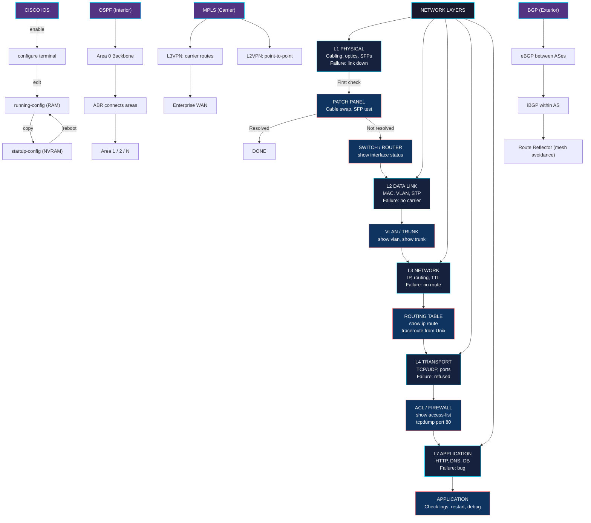

# Core Concepts

## The OSI Model as a Working Map

Donahue treats the OSI seven-layer model the way working engineers actually use it: as a triage checklist. When something is broken, you walk the layers top-down (or bottom-up) and isolate where the failure lives. He is explicit that the model is a teaching tool, not a description of how packets actually flow — but the discipline of asking "is this an L1, L2, or L3 problem?" prevents hours of wasted debugging.

The book consistently maps commands and symptoms to layers:

- **L1 (Physical)**: Cable type, SFP optics, signal strength, PoE negotiation
- **L2 (Data Link)**: MAC addresses, VLANs, STP, switch ports, frame errors
- **L3 (Network)**: IP addressing, routing tables, TTL, ICMP
- **L4 (Transport)**: TCP/UDP ports, session state
- **L7 (Application)**: HTTP, DNS, the protocols you wrote

A "the network is slow" complaint usually lives at L1, L2, or L3. A "the application is slow" complaint usually lives at L4 or L7. *Network Warrior*'s first job is to teach that distinction by reflex.

---

## Cabling and the Physical Layer

The book opens with cables and optics, and it is the right call. Most network outages, especially in enterprise wiring closets, are physical. Donahue covers:

- **Copper**: Cat5e, Cat6, Cat6a — when each is appropriate, the 100m limit, the perils of running cable parallel to power lines
- **Fiber**: Single-mode vs multi-mode, LC vs SC connectors, the wavelength chart, why your 10GBase-LR optic will not talk to a 10GBase-SR
- **Autonegotiation**: The default that bites everyone. A gigabit port and a 100M device that fail to negotiate often run at 10M half-duplex, killing throughput silently
- **SFP/GBIC transceivers**: Vendor locking, DOM (Digital Optical Monitoring), and why "compatible" optics sometimes brick your switch

The war story that anchors the section: a network that mysteriously lost packets on Friday afternoons. The cause: a fiber patch cable in a server room that was being slowly bent by a door swinging open and closed during business hours. Replacement took 10 minutes. Diagnosis took two weeks. Lesson: check the patch panel first.

---

## Cisco IOS as a Language

For software engineers raised on Unix, the Cisco command line is a foreign country. *Network Warrior* is the best short orientation. Donahue walks through the grammar of IOS:

```
enable
configure terminal
interface GigabitEthernet0/1
 ip address 10.1.1.1 255.255.255.0
 no shutdown
exit
router ospf 1
 network 10.1.1.0 0.0.0.255 area 0
exit
copy running-config startup-config
```

Key concepts he hammers home:

- **Running-config vs startup-config**: The router loads `startup-config` at boot, runs from `running-config` in RAM. Edits to running-config are lost on reboot unless you `copy` them across. This is the single most common mistake for newcomers.
- **The `show` family is your diagnostic interface**: `show ip interface brief`, `show ip route`, `show interfaces`, `show cdp neighbors`, `show mac address-table`, `show vlan`, `show spanning-tree`, `show version`. Memorize these.
- **`debug` is a production hazard**: It runs at process-switch speed and can melt a busy router. Use it on a lab device, never on a live core.
- **Context-sensitive help**: `?` after any partial command shows options. IOS has the best inline help of any major network OS. Use it constantly.

The book is not a Cisco certification prep book, but its IOS chapters will get you productive faster than any CCNA study guide.

---

## VLANs, Trunks, and Layer 2 Segmentation

VLANs are how you carve a single physical switch into multiple broadcast domains. Donahue's VLAN chapter is the clearest short treatment available:

- **Access ports**: Carry traffic for exactly one VLAN. The user's machine does not know or care.
- **Trunk ports (802.1Q)**: Carry traffic for multiple VLANs, tagged. The trunk "knows" which VLAN each frame belongs to. Used between switches and to hypervisors/VMs.
- **Native VLAN**: A single untagged VLAN on a trunk (default VLAN 1). **Native VLAN mismatch between two switches** is a classic "the link is up but traffic won't pass" failure.
- **VTP (VLAN Trunking Protocol)**: Cisco's mechanism for propagating VLAN databases across switches. Donahue treats VTP with suspicion — a misconfigured VTP server can wipe a whole campus's VLANs. The default recommendation: leave VTP in transparent mode and configure VLANs manually.
- **Inter-VLAN routing**: Requires a Layer 3 device (router-on-a-stick with subinterfaces, or a Layer 3 switch with SVIs).

The war story: a junior admin added a new VLAN to a switch in the wrong VTP domain. The server VTP domain "won" the negotiation and erased 30 VLANs across the building. Recovery required console access to every switch and manual re-entry. Lesson: never enable VTP server mode without understanding the blast radius.

---

## Spanning Tree Protocol (STP)

Spanning Tree prevents L2 loops, which would otherwise flood broadcast traffic forever. The book covers:

- **The problem**: Two switches connected with two cables for redundancy would form a loop. A broadcast frame would be copied around the loop infinitely.
- **The solution**: STP elects a root bridge, computes shortest paths, and blocks redundant links. When a link fails, STP unblocks a backup.
- **Variants**: 802.1D (classic, slow), 802.1w (Rapid Spanning Tree, fast), 802.1s (Multiple Spanning Tree, for VLANs), MSTP (Cisco's favorite).
- **The war story**: An enterprise ran 802.1D STP. A link flap caused a 50-second reconvergence, during which half the campus lost connectivity. Migrating to Rapid Spanning Tree cut it to under a second.

Donahue's practical advice: enable PortFast on access ports (so a single user rebooting their PC does not trigger STP recomputation), enable BPDU Guard on those same ports (so a rogue switch cannot hijack the STP topology), and **never connect two switches with more than one cable without configuring an EtherChannel** — otherwise STP will silently block one of your bandwidth links.

---

## OSPF — The Default Interior Gateway Protocol

OSPF is the workhorse IGP of enterprise networks. Donahue's OSPF chapters are widely cited as the clearest non-textbook treatment:

- **Link-state, not distance-vector**: Every router has a complete map of the area. Updates are LSA (Link-State Advertisements), triggered by topology change.
- **Areas**: OSPF uses a hierarchical area design. **Area 0 (the backbone)** is mandatory. All non-backbone areas must connect to Area 0. This is the single most-violated OSPF design rule.
- **Router types**: Internal routers (inside one area), ABRs (Area Border Routers — connect to Area 0), ASBRs (Autonomous System Boundary Routers — inject external routes via redistribution).
- **LSA types**: Type 1 (router), Type 2 (network), Type 3 (summary, between areas), Type 4 (ASBR summary), Type 5 (external). For operational work, you only need to recognize them in `show ip ospf database`.
- **Convergence**: Sub-second with tuned timers; default hello/dead timers are 10s/40s.
- **The cost metric**: Inversely proportional to interface bandwidth. A 10G link is cost 1, a 1G link is cost 10, a 100M link is cost 100. OSPF picks the lowest total cost path.

The war story: a company redesigned its OSPF area layout to put a remote site in its own area, but the ABR had the wrong network statement. The remote site appeared in the routing table but traffic would not pass. Lesson: `show ip ospf neighbor` and `show ip ospf interface` are the two commands to learn first.

---

## BGP — The Protocol of the Internet

BGP is the protocol that holds the internet together. It is also the most-misunderstood protocol in enterprise networking, because it does not work like OSPF:

- **Path-vector, not link-state**: BGP does not know the topology. It only knows what neighbors told it, and what attributes those neighbors attached.
- **Policy, not metrics**: BGP chooses routes based on policies (AS_PATH length, local preference, MED, communities, weight). It is not trying to find the shortest path; it is trying to enforce business agreements.
- **eBGP vs iBGP**: External BGP (between your network and another AS) and internal BGP (within your AS, used to carry external routes between your edge routers). The iBGP full-mesh rule still catches people — every iBGP speaker must peer with every other, or you need a route reflector.
- **The attributes that matter**: `next-hop`, `AS_PATH`, `local-pref`, `MED`, `origin`, `community`, `weight` (Cisco proprietary).
- **The war story**: An enterprise accepted a default route from a new ISP. Within minutes, the entire enterprise's outbound traffic started leaving through the new ISP — a cheaper link with a smaller upstream pipe. The fix: prepend the local AS_PATH on the secondary link to make it less preferred. Lesson: BGP will do exactly what you configure. Nothing more, nothing less.

For most software engineers, BGP is "the thing the network team handles when we have multiple ISPs or a multi-region deployment." Donahue's BGP chapter makes that boundary legible without demanding deep expertise.

---

## MPLS and the Service-Provider World

Most enterprises buy WAN connectivity from carriers, and most carriers deliver it as MPLS. Donahue demystifies what you are actually buying:

- **MPLS = Multi-Protocol Label Switching**: Packets get a short label added at the provider edge; core routers forward based on the label, not the IP header. Faster lookup, easier traffic engineering, and the basis of every Layer 2/Layer 3 VPN service.
- **L2VPN vs L3VPN**: L2 (point-to-point, like a private T1) vs L3 (the carrier routes for you and hands you default routes). Most modern enterprise WAN is L3VPN.
- **QoS and traffic engineering**: MPLS lets carriers guarantee bandwidth and latency for voice and video traffic. The enterprise pays for CIR (Committed Information Rate) per class of service.
- **The war story**: A company migrated from frame relay to MPLS and the new link had a 50ms higher latency. Their VoIP calls were unusable until they tuned the QoS marking on their edge routers. The carrier's "MPLS" was not the problem; the enterprise's DSCP bits were not set.

For software engineers: when your office-to-cloud path goes through an MPLS VPN, the carrier is doing routing for you. You do not see it unless something breaks. When it breaks, this chapter is the explanation.

---

## VoIP, QoS, and the Real-Time Traffic Problem

Voice and video do not tolerate packet loss, jitter, or delay. Donahue covers:

- **Why VoIP is hard**: A 150ms mouth-to-ear delay is annoying. 400ms is unusable. Traditional data networks are best-effort.
- **QoS marking (DSCP/CoS)**: Tagging voice traffic with EF (Expedited Forwarding) and video with AF classes so the network prioritizes them.
- **Queueing**: Priority Queue (PQ), Low-Latency Queueing (LLQ), Weighted Fair Queueing (WFQ). Voice gets the strict-priority queue; data gets the rest.
- **The war story**: A company installed IP phones but kept the data network as best-effort. The phones worked fine in the lab. In production, a backup job on someone's PC saturated the link and the calls cut out. The fix: separate VLANs, DSCP marking at the phone, and LLQ on the WAN uplink.

This chapter is the bridge to the *Cisco Voice over IP* (CVOICE) world — useful to skim, even if voice is not your primary responsibility.

---

## Firewalls, ACLs, and the Security Layer

The book treats security as an operational concern, not a product pitch:

- **ACLs (Access Control Lists)**: The original Cisco security mechanism. Stateless packet filters evaluated top-down, first match wins. Order matters. `deny ip any any` is the implicit end of every ACL.
- **Stateful inspection**: Modern firewalls track connection state, not just packet headers. Cisco ASA, PIX (legacy), Check Point, Palo Alto, pfSense — all do this.
- **DMZ design**: The classic three-zone firewall (outside, DMZ, inside). Public-facing servers in the DMZ, internal users in the inside zone.
- **The war story**: A "block all" ACL was applied to a router to "fix" an exposure. Half the internal services stopped responding. The ACL was missing an explicit `permit` for the existing internal subnets — the implicit deny killed them. Lesson: ACL changes are deployments. Stage them.

For software engineers: when your application is "firewalled off," this is the layer doing it. The ACL syntax in the book is enough to read a config your team has produced and understand the rules.

---

## Unix for Network Engineers

One of the book's most distinctive features: a full set of chapters on Unix/Linux/Solaris networking tools. The premise: a network engineer must speak both Cisco and Unix, because the servers are Unix and the network is Cisco. The chapter covers:

- **`ifconfig` (legacy) / `ip` (modern)**: Reading and setting interface addresses
- **`netstat -rn` / `ip route`**: The Unix routing table
- **`traceroute` / `mtr`**: The first tool to use when "the network is slow" — shows every hop and the latency at each
- **`tcpdump` / `Wireshark`**: Packet capture. The book argues for tcpdump on the server, Wireshark on the laptop.
- **`arp` / `ip neigh`**: Layer 2 neighbor tables
- **`nslookup` / `dig` / `host`**: DNS debugging
- **`telnet` / `nc` (netcat)**: The classic "is the port open" test. `telnet host 80` and look for a banner. If it fails, the port is not reachable. If it succeeds, the application is the problem.
- **`snmpwalk` / `snmpget`**: Polling network device counters from Unix

This is the section software engineers will read first. It is the bridge from "I write code on a Linux box" to "I can talk to the network team using their vocabulary."

---

## SNMP, Monitoring, and the Operational Layer

Donahue treats monitoring as a first-class network concern:

- **SNMP v1/v2c/v3**: The protocol for polling and trapping from network gear. v3 added authentication and encryption; v2c is still common in legacy shops.
- **OIDs and MIBs**: Object Identifiers — the dotted-number namespaces that map to "interface status," "bytes in," "errors." MIBs are the human-readable descriptions of those namespaces.
- **Polling vs trapping**: Polling is the NMS asking the device for values (every 5 minutes, typically). Trapping is the device pushing an alert to the NMS when something goes wrong. Use both.
- **The war story**: A NOC relied entirely on SNMP polling. When a switch port failed for 10 minutes between polls, the outage went unrecorded. The fix: enable link-down traps so the switch reports the failure immediately.

For software engineers running Prometheus or Datadog: SNMP is the pre-cloud equivalent of those systems. The same operational thinking applies.

---

## IPv6 — The "Real Soon Now" Protocol

The 2011 first edition includes a brief IPv6 primer; the 2016 second edition expands it significantly. Key points Donahue covers:

- **Address format**: 128 bits, written in eight colon-separated hex groups. `2001:0db8:85a3::8a2e:0370:7334`
- **Address types**: Global unicast (the equivalent of public IPv4), link-local (FE80::/10, automatic on every interface), unique local (the IPv6 equivalent of RFC 1918 private space), multicast (FF00::/8)
- **Stateless address autoconfiguration (SLAAC)**: The host picks its own address from the router's advertised prefix
- **DHCPv6**: Optional — needed only if you want to push DNS servers and other options
- **Dual-stack transition**: Run IPv4 and IPv6 side by side. Most enterprises do this. The transition has been "real soon now" for 20 years.
- **The war story**: A company enabled IPv6 on a router "to be ready." A misconfigured firewall rule allowed ICMPv6 through, and a host on the network started receiving Router Advertisements from the outside world, exposing internal topology. The fix: block ICMPv6 from the outside unless you mean it.

For most working engineers, IPv6 is a checkbox for compliance. Donahue's coverage is enough to operate a dual-stack network without panicking.

---

# Frameworks



---

# Mental Models

| Model | Application |
|-------|-------------|
| **The OSI Layers as a Triage Checklist** | When something is broken, walk L1→L2→L3→L4→L7. Isolate the layer before touching anything. |
| **The Console as Home** | Networks are operated from the command line. If you cannot get to the prompt, you cannot fix it. |
| **BGP as Policy, Not Routing** | BGP does what you configure. Every attribute is a business rule in disguise. |
| **OSPF Areas as a Hierarchy** | Area 0 is the spine. Everything connects to the spine. Deviation causes pain. |
| **MPLS as "The Carrier Routes for You"** | When you buy an L3VPN, the ISP is your routing peer. You trust them with your prefixes. |
| **Native VLAN Mismatch as the Silent Killer** | Trunk works. Lights are green. Traffic does not pass. This is the diagnosis. |
| **Running-Config vs Startup-Config** | The router forgets your changes on reboot unless you copy. Always. |
| **War Stories as Scar Tissue** | Real expertise is inherited scars. Read the war stories twice. |
| **The Unix Half of the Job** | Servers are Unix. Networks are Cisco. A complete engineer speaks both. |
| **Frame's Path is the Diagnostic Path** | When the application is slow, the frame's path is your map. `traceroute` is the first command. |

---

# Key Lessons

1. **Cable first, reboot second.** Most outages are physical. The fastest fix is usually the patch panel.
2. **IOS is a language, not a menu.** `enable`, `configure terminal`, `show`, `copy running-config startup-config` — these four phrases unlock 80% of operational work.
3. **OSPF Area 0 is not optional.** Every non-backbone area must touch the backbone. Violating this rule is a guaranteed redesign.
4. **BGP is policy.** The shortest AS_PATH is one consideration. Local preference, MED, communities, and weight are the levers that matter.
5. **VTP server mode is a footgun.** It can erase every VLAN on every switch. Default to transparent.
6. **MPLS is what you buy.** If you have a WAN, you almost certainly have MPLS, whether or not you know it.
7. **VoIP needs QoS or it does not work.** Mark voice traffic with EF DSCP. Put it in a low-latency queue. Skip this and your calls will cut out.
8. **Telnet to a port is the first test.** `telnet host 80` — if the banner appears, the network is fine; the application is the problem.
9. **The Unix side of the network is your job too.** `traceroute`, `tcpdump`, `netstat`, `ip route` are part of the network engineer's toolkit.
10. **War stories are the curriculum.** Every outage in this book is a class you did not have to take. Read them carefully.

---

# Practical Applications

**Debugging "the application is slow" from a Linux server**: Start with `traceroute` to the destination. If hops 1-3 are local and show normal latency, the problem is upstream. If the path looks clean, `mtr -rwc 100 host` for a 100-packet loss/latency report. Then `tcpdump -i eth0 -nn host <dst>` to capture the conversation. If the packets are leaving and returning, the network is innocent. The application or database is guilty.

**Reading a Cisco config for the first time**: Look for three things: hostname, interface IP addresses, and the routing process blocks (`router ospf`, `router bgp`). The interface IPs tell you what is connected. The routing process tells you how the rest of the world is reached. Everything else is detail.

**Designing a small office network**: One router (ISR series), one Layer 3 switch (Catalyst 3850-class), access layer switches for users, separate VLANs for data, voice, and management. OSPF as the IGP, single-area for a small office. Static default route to the ISP. DHCP from the router. QoS marking on the router's WAN uplink. Done.

**Migrating from a flat L2 network to VLANs**: Start with a topology map of every IP subnet. Build the VLAN plan (one VLAN per subnet is the safe default). Configure the new VLANs on a single access switch first. Trunk between the access and the core. Move one user. Test. Move the rest. Never enable VTP server mode.

**Responding to "the link is down"**: Walk to the wiring closet. Look at the switch port LED. Green = link. Off = no link. Check the patch panel. Swap the patch cable. Check the SFP. Try a different port. If still down, the device or NIC may be the problem — reboot the device. If still down, the cable in the wall is suspect. If still down, the other switch.

**Carrying an SNMP conversation from Unix**: `snmpwalk -v2c -c public router 1.3.6.1.2.1.2.2.1.10` walks the `ifInOctets` counter on every interface. Replace the OID with `1.3.6.1.2.1.1.5` for the hostname, or `1.3.6.1.4.1.9.2.1.58` (Cisco-specific) for CPU. Most monitoring systems (Nagios, Zabbix, LibreNMS) use this under the hood.

**Bridging Unix and Cisco when the SRE asks "is the network up?"**: The honest answer is "which path?" Run `mtr` from the SRE's box to the destination. Show the per-hop latency and packet loss. The conversation is now concrete. The SRE can show their team; the network engineer has evidence. The postmortem is better for it.

---

# Examples

**The MTU Mismatch Black Hole**: A company added an MPLS link to a new site. VPN traffic worked fine, but file copies between offices would hang at ~1.3 MB. Diagnosis: the MPLS path had an MTU of 1400 (lower than Ethernet's 1500) due to MPLS label overhead. The Windows file copy used 1500-byte packets; they fragmented at the MPLS edge, but the firewall in the middle dropped the "Do Not Fragment" ICMP response. The fix: lower the MTU on the sending hosts to 1400 (or enable PMTUD properly). Lesson: when large transfers fail but small ones work, suspect MTU.

**The Default Gateway Disappearing**: A server lost connectivity after a reboot. The IP was still configured, but `ping` to the gateway failed. The cause: the Cisco switch port the server was on had PortFast disabled, and the server's NIC took ~30 seconds to come up. By the time the OS queried DHCP, the lease had expired. The fix: enable PortFast on the access port (or use a server-class NIC with a faster LACP timeout).

**The Asymmetric Route Outage**: A company had two ISPs for redundancy. Outbound traffic used ISP A (primary). Inbound traffic, due to a BGP misconfiguration, used ISP B. When ISP B's upstream provider had a regional outage, the company was unreachable from outside even though ISP A was fine. The fix: make the BGP advertisement match the local preference. Lesson: asymmetric routing is a feature of BGP and a debugging hazard.

**The Telnet to Port 80 Trick**: A "the website is down" ticket. The SRE swears the app is fine. `telnet webhost 80` from the SRE's laptop: connection refused. `telnet webhost 80` from the load balancer: connection refused. `ssh` to the webhost itself: works. `ss -tlnp` shows no process listening on 80. The application had crashed and the systemd unit did not restart it. Lesson: the network was never the problem. The first 30 seconds of `telnet` would have told the SRE that.

**The VTP Domain Erasure**: A new junior admin added a switch to the network. The switch was configured as a VTP server in a different domain. During the next VTP advertisement cycle, the new switch's empty database propagated to the existing switches. Thirty VLANs disappeared from the entire campus. Recovery required console access to every switch. Lesson: VTP is a feature that should be off by default.

---

# Action Plan

1. **Read chapters 1-3 in one sitting.** The cabling, IOS, and switching primers give you the vocabulary for everything else.
2. **Stand up a Cisco lab.** Even a GNS3/EVE-NG instance with one router and one switch teaches more than reading. Type the commands. Break things.
3. **Memorize the `show` family.** `show ip interface brief`, `show ip route`, `show interfaces`, `show cdp neighbors`, `show vlan`, `show running-config`. These are your diagnostic vocabulary.
4. **Learn the OSPF chapter cold.** OSPF is the workhorse IGP. The Area 0 rule alone is worth the price of admission.
5. **Skim the BGP chapter twice.** You may not operate BGP, but you must understand the language when a network engineer explains why your traffic is taking the long way.
6. **Practice the Unix tools.** `traceroute`, `mtr`, `tcpdump`, `netstat -rn`, `telnet host port`. These are the tools that answer "is the network the problem?" in seconds.
7. **Read every war story twice.** They are the only part of the book that is irreplaceable. The commands are in the manual; the war stories are not.
8. **Keep the book on the shelf, not in a drawer.** The next outage is when you will need it. The index is good; the table of contents is not enough.
9. **Buy the second edition (2016) if you can.** It covers IPv6, modern switching, and updated war stories. The 2011 first edition is still good; the second is strictly better.
10. **When you finish the book, read *TCP/IP Illustrated*.** Donahue tells you what to type. Stevens tells you why the bits look the way they do. Together they are the complete library.
