## The Bottom-Up Architecture

Stevens inverts the usual top-down pedagogy. He starts at the wire —
the bytes that hit the network interface — and climbs the stack
toward the application.

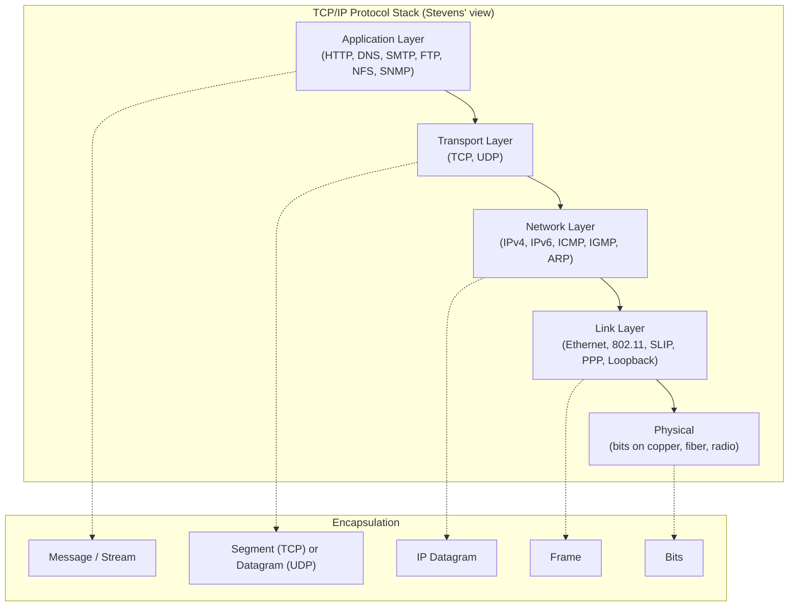

### Encapsulation in Practice

A TCP segment is the payload of an IP datagram. The IP datagram is
the payload of an Ethernet frame. The frame is the payload of the
physical layer's bits. Each layer adds a header (and sometimes a
trailer for error detection), and each layer below treats the layer
above's data as opaque.

---

## Chapter 1–2: Introduction and the Internet Architecture

The Internet is a network of networks. The architectural principles
Stevens calls out:

- **End-to-end argument** — Keep the network core simple. Place
  reliability, security, and application logic at the endpoints.
- **Fate-sharing** — State lives in the endpoints, not in the network.
  If a router fails mid-flow, both endpoints discover it and recover.
- **The hourglass** — IP is the narrow waist. Everything above
  (applications) and everything below (link technologies) can change
  without affecting each other.
- **Best-effort delivery** — IP makes no guarantees. The endpoints
  build reliability on top with TCP.

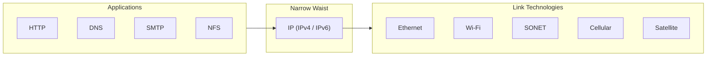

This is why IPv6 is even possible: you change the narrow waist
without touching the application layer.

---

## Chapter 3–4: Link Layer — Ethernet, 802.11, SLIP, PPP

The link layer moves frames between adjacent nodes. Stevens covers the
classical serial protocols (SLIP, PPP) and then Ethernet and 802.11
in detail, including:

- The Ethernet II frame format (6-byte destination, 6-byte source,
  2-byte type, 46–1500 byte payload, 4-byte CRC)
- MTU and the fragmentation that occurs when packets exceed it
- Path MTU Discovery (RFC 1191) using the DF bit and ICMP "fragmentation
  needed" messages
- The loopback interface as a special case (`127.0.0.1`, the
  `lo0` device)

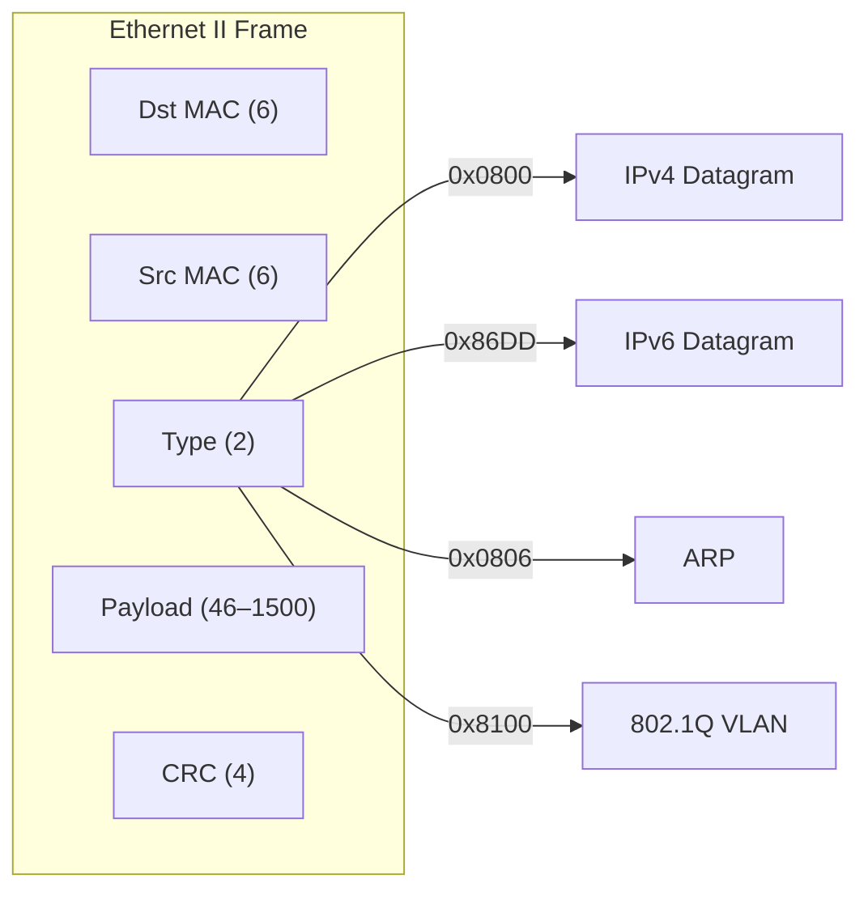

The Type field is what makes Ethernet multiprotocol — the same
physical medium carries IP, ARP, and tagged VLAN frames.

---

## Chapter 5–6: ARP and RARP

ARP is the bridge between IP addresses and link-layer addresses. Given
a destination IP, the host broadcasts "who has 192.168.1.1?" and the
owner replies with its MAC. The result is cached in the ARP table.

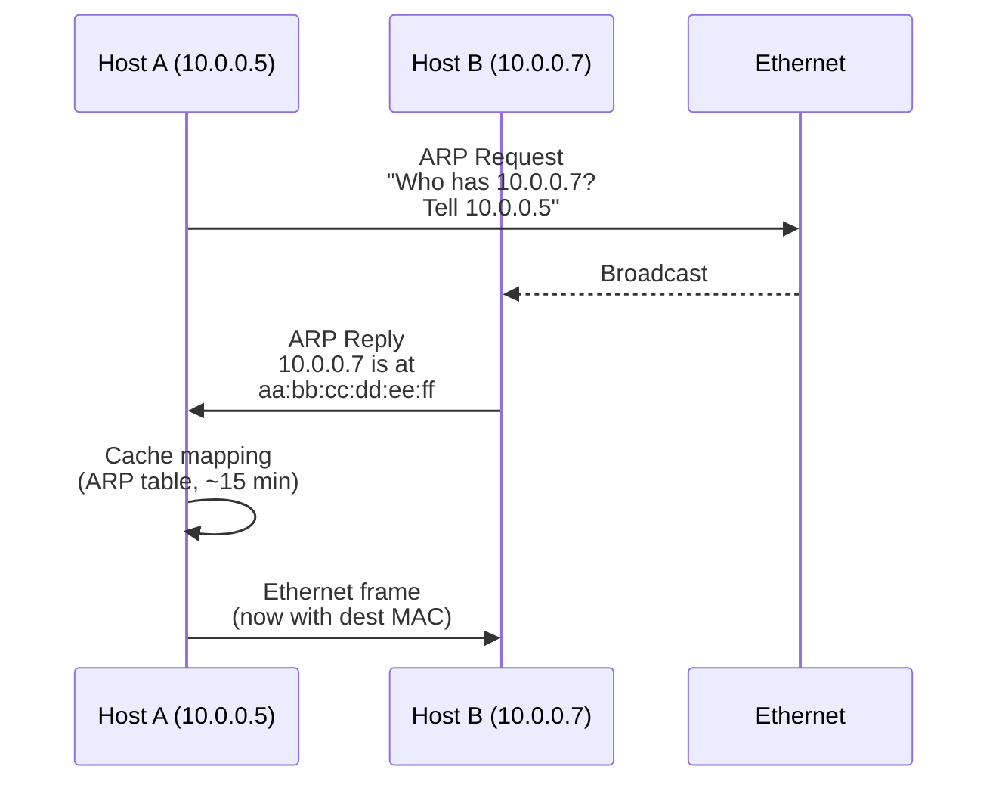

Stevens shows the actual ARP packet, including the Ethernet header,
the ARP payload (HTYPE, PTYPE, HLEN, PLEN, OPER, SHA, SPA, THA, TPA),
and discusses:

- ARP caching, timeouts, and gratuitous ARP
- ARP proxy and "publish" / "permanent" entries
- RARP (reverse ARP) and how it was replaced by BOOTP and then DHCP
- The ARP packet format in both hex and decoded form

---

## Chapter 7–9: IP — IPv4 Headers, Forwarding, Subnetting

The IPv4 header is 20 bytes (minimum) and the chapter prints it
field-by-field:

```mermaid
block-beta
    columns 16
    block:row1
        VER["Ver(4)"]
        IHL["IHL(4)"]
        TOS["TOS(8)"]
        TOTLEN["Total Len(16)"]
    end
    block:row2
        ID["ID(16)"]
        FLG["Flags(3)"]
        FOFF["Frag Off(13)"]
    end
    block:row3
        TTL["TTL(8)"]
        PROTO["Proto(8)"]
        CKSUM["Checksum(16)"]
    end
    block:row4
        SRC["Source IP (32)"]
    end
    block:row5
        DST["Dest IP (32)"]
    end
    block:row6
        OPT["Options (0–320)"]
        PAD["Padding"]
    end
```

Critical fields:

- **TTL** — decremented at every hop; a packet with TTL=0 is dropped
  and an ICMP "time exceeded" is returned. `traceroute` exploits this.
- **Protocol** — 1 = ICMP, 6 = TCP, 17 = UDP, 41 = IPv6 encapsulation,
  89 = OSPF, 132 = SCTP. Stevens prints the IANA registry.
- **Fragmentation fields** — ID, Flags (DF, MF), Fragment Offset.
  Modern networks usually set DF and rely on Path MTU Discovery.
- **Header checksum** — recomputed at every hop because TTL changes.

### Subnetting and CIDR

Stevens walks classful addressing (A, B, C) for historical context,
then moves to CIDR (Classless Inter-Domain Routing), subnet masks, and
VLSM. The exercises include the kind of bit-twiddling that shows up in
network-engineering interviews.

---

## Chapter 10: ICMP — Internet Control Message Protocol

ICMP is the "housekeeping" protocol. It rides inside IP (protocol=1)
and is used for:

- **Destination unreachable** (type 3) — network, host, protocol, port,
  fragmentation needed, source route failed
- **Redirect** (type 5) — "use this router instead"
- **Time exceeded** (type 11) — TTL hit zero (`traceroute`)
- **Echo request / reply** (types 8/0) — `ping`
- **Router advertisement / solicitation** (types 9/10) — ICMPv6
  neighbor discovery (replaces ARP)

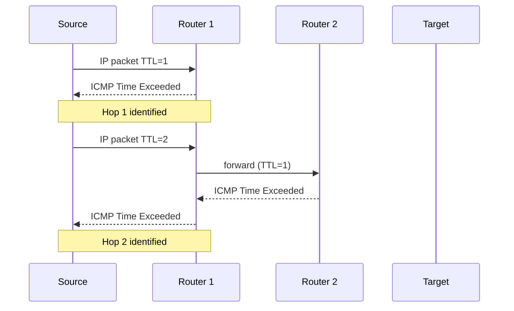

`traceroute` is essentially a graduated series of TTL-limited probes
followed by a final UDP packet to an unlikely port.

---

## Chapter 11–18: UDP and TCP

### UDP — User Datagram Protocol

UDP is the simplest transport: 8-byte header, no connection, no
reliability, no ordering, no congestion control. Stevens argues for
its use case: DNS, VoIP, real-time video, NFS in some configurations.

```
+--------+--------+--------+--------+
| SrcPort| DstPort| Length | ChkSum |
+--------+--------+--------+--------+
```

The pseudo-header used in the UDP checksum ties the datagram to its
source and destination IP addresses, catching misdelivery.

### TCP — Transmission Control Protocol

TCP is the heart of the book. Stevens devotes eight chapters to it,
because the protocol is genuinely complex.

```mermaid
block-beta
    columns 16
    block:row1
        SP["SrcPort(16)"]
    end
    block:row2
        DP["DstPort(16)"]
    end
    block:row3
        SEQ["Seq(32)"]
    end
    block:row4
        ACK["Ack(32)"]
    end
    block:row5
        OFF["Off(4)"]
        FLG["Flags(6)"]
        WIN["Window(16)"]
    end
    block:row6
        CKSUM["Checksum(16)"]
        URG["Urgent(16)"]
    end
    block:row7
        OPT["Options + Padding"]
    end
```

**TCP state machine (simplified):**

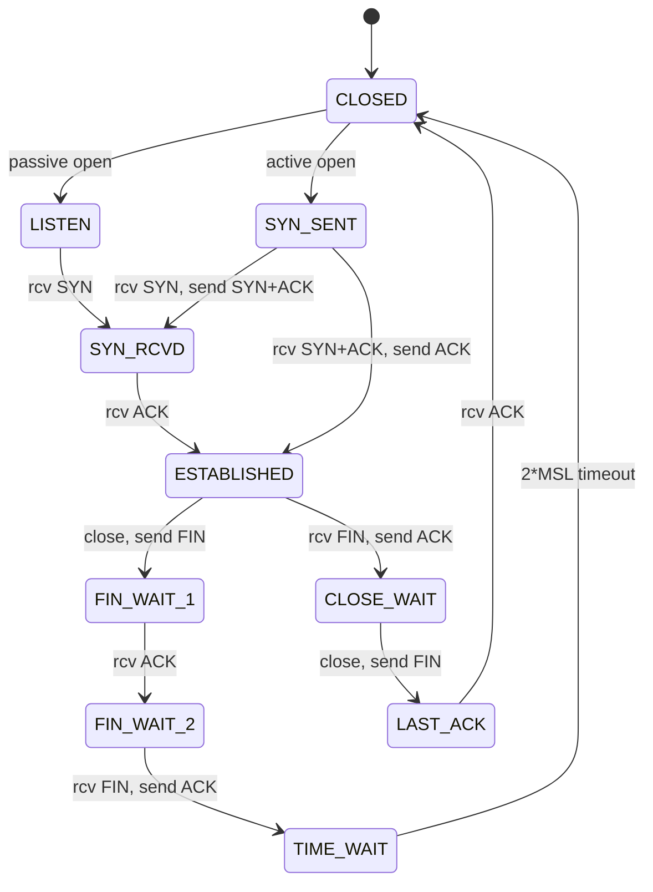

Stevens draws every transition and ties each one to a packet trace
on the wire. He explains why TIME_WAIT exists (to prevent old
duplicates from being accepted by a new incarnation of the same
connection).

### The Seven TCP Timers

Stevens names them. The book carefully explains each:

| Timer | Purpose |
|-------|---------|
| Connection-establishment | Bound SYN retransmissions to prevent SYN flood |
| Retransmission | Karn's algorithm + exponential backoff |
| Delayed ACK | 40 ms typical, to batch with data |
| Persist | Break the deadlock when receiver advertises window 0 |
| Keep-alive | Detect half-open peers |
| FIN_WAIT_2 | Prevent indefinite hang if peer never sends FIN |
| TIME_WAIT | 2*MSL to absorb stray segments |

### Sliding Window and Flow Control

The receiver advertises a window of bytes it can buffer. The sender
keeps a copy of unacknowledged data and slides the window forward as
ACKs arrive. Flow control prevents a fast sender from overwhelming a
slow receiver.

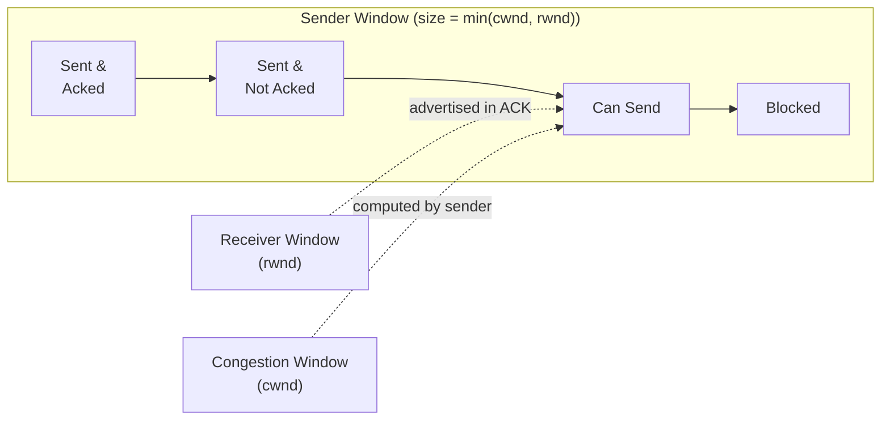

### Congestion Control

TCP's congestion control is what keeps the Internet from collapsing.
Stevens documents the four classic algorithms:

1. **Slow Start** — Begin with cwnd = 1 MSS. Double cwnd every RTT
   (effectively, increment by 1 MSS per ACK) until cwnd reaches
   `ssthresh`.
2. **Congestion Avoidance** — Once past ssthresh, increase cwnd
   linearly (1 MSS per RTT) — Additive Increase.
3. **Fast Retransmit** — On 3 duplicate ACKs, retransmit immediately
   without waiting for the retransmission timer.
4. **Fast Recovery** — After fast retransmit, set ssthresh = cwnd/2
   and cwnd = ssthresh + 3 (the three duplicate ACKs that triggered
   the retransmit represent segments that have left the network).
   On timeout, fall back to slow start.

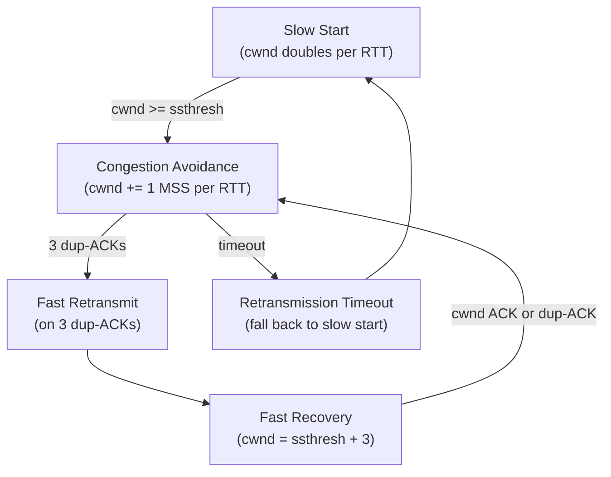

The 2nd edition adds a treatment of modern variants (TCP Reno, TCP
Tahoe, TCP Vegas, SACK, TSO, and the linux `tcp_*` sysctl knobs).

---

## Chapter 19–28: Application Protocols

### DNS — Domain Name System (Ch 14)

DNS is a hierarchical, distributed, primarily-UDP database. Stevens
walks through the message format (header, question, answer,
authority, additional) and shows real queries for A, AAAA, MX, PTR,
and SOA records.

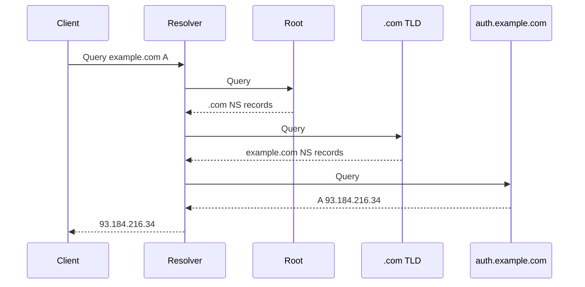

### TFTP, BOOTP, DHCP (Ch 15–16)

- **TFTP** — Trivial File Transfer over UDP. Used for bootstrapping
  diskless devices. Acknowledged-by-block protocol with optional
  option negotiation (RFC 2347).
- **BOOTP** — Bootstrap Protocol. The first widely deployed way for
  a diskless host to learn its IP, the server's IP, and a boot
  filename. UDP-based, with the `bootpc`/`bootps` port pair
  (67/68).
- **DHCP** — Dynamic Host Configuration Protocol. A superset of
  BOOTP that adds lease semantics, address pools, and the
  DORA exchange:

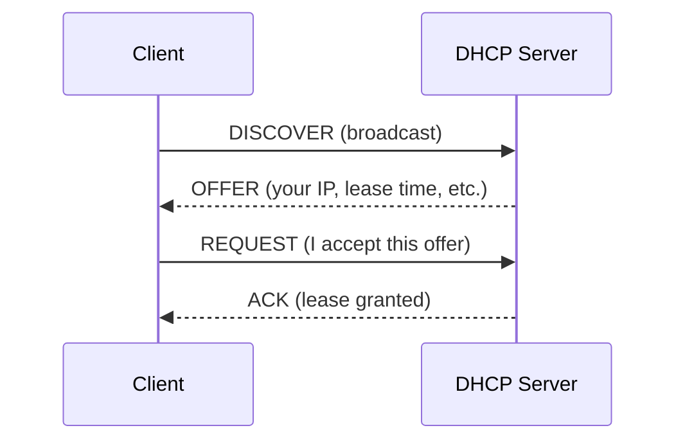

### SNMP — Simple Network Management Protocol (Ch 25)

SNMP is the operations-and-management protocol for IP networks. It
rides over UDP (typically port 161) and uses an ASN.1/BER-encoded
PDU. Stevens covers the SMI, the MIB, the operations (GET, GET-NEXT,
SET, TRAP, GET-BULK, INFORM), and the v2c / v3 security model.

### HTTP, FTP, SMTP, NFS, RPC, telnet, SSH (Ch 17, 19–24, 26–28)

Each of these chapters is a packet-by-packet tour:

- **HTTP/1.0** — Request/response, one object per connection, the
  `If-Modified-Since` conditional GET, the `Content-Length` header.
- **FTP** — Two channels: control (port 21) and data (port 20 in
  active mode, ephemeral in passive). The PASV command in detail.
- **SMTP** — The HELO/EHLO exchange, the MAIL FROM/RCPT TO/DATA
  sequence, MIME extensions, pipelining (RFC 2920).
- **NFS** — Sun's Network File System. Built on ONC RPC, which uses
  XDR encoding and UDP (typically) for the mount and NFS protocols.
  Stevens shows the file-handle-based stateless server model.
- **telnet and SSH** — Telnet's NVT (Network Virtual Terminal) and
  the SSHv2 protocol stack (transport, user-auth, connection layers).

---

## Chapter 29–30: Multicast and IGMP

Multicast is one-to-many delivery. The IP class D range
(224.0.0.0–239.255.255.255) is reserved for it. Stevens covers:

- **IGMPv2 and IGMPv3** — how hosts signal group membership to their
  local router.
- **Routing** — DVMRP, PIM-SM, PIM-SSM, MOSPF. The Reverse Path
  Forwarding algorithm for shared trees and source trees.
- **Application examples** — video streaming, service discovery
  (mDNS, SSDP), routing protocol control traffic (OSPF, RIPv2 use
  224.0.0.x).

---

## Chapter 31: Security Hooks and the IPv6 Transition

The final chapter covers:

- **IPsec** — ESP, AH, IKE, transport vs. tunnel mode. Why
  end-to-end IPsec has been hard to deploy (NAT, middleboxes).
- **DNS Security (DNSSEC)** — chain of trust from the root, NSEC
  records, the algorithms.
- **TLS at the application layer** — why the smarts moved up the
  stack to where they're easier to deploy.
- **Dual-stack operation** — A and AAAA records, Happy Eyeballs
  (RFC 6555), 6to4 and Teredo tunneling, the role of NAT64/DNS64.

---

## Key Lessons

- **The protocol suite is engineered for heterogeneity.** IPv4 over
  Ethernet over fiber or over radio over LTE — the layering holds.
- **TCP is engineered for the worst case.** Timeouts, retransmissions,
  the seven timers — every mechanism is a hedge against packet loss
  on an unreliable substrate.
- **The end-to-end principle is a design philosophy, not a law.**
  NAT, firewalls, and middleboxes have all been added to a network
  originally designed to be dumb. The book explains how the protocols
  cope.
- **State machines are how to read a spec.** A protocol is a
  finite-state automaton with timers; understanding the states
  clarifies every packet you see on the wire.
- **C is the lingua franca.** The socket API is C; the protocol
  examples are C; the trace tools are C. Read the book with a C
  reference nearby and you will learn two things at once.

---

## Practical Applications

### For Network Engineers
- Diagnose intermittent slowness by recognizing TCP retransmissions
  and duplicate ACKs in a trace
- Tune `tcp_rmem`, `tcp_wmem`, `tcp_congestion_control` based on
  Stevens' models
- Understand MTU and Path MTU issues in tunneled networks

### For Backend Developers
- Pick TCP vs. UDP for a service based on real tradeoffs, not
  fashion
- Set sensible socket options (`SO_KEEPALIVE`, `TCP_NODELAY`,
  `SO_REUSEADDR`)
- Use connection pooling with awareness of TIME_WAIT and ephemeral
  port exhaustion

### For Security Researchers
- Recognize scans, SYN floods, and unusual flag combinations in
  packet traces
- Understand how middleboxes and NAT break end-to-end security
- Read RFCs with Stevens as a guide

### For Students
- Move beyond the survey textbook to understand the protocols
  deeply
- Implement a simple TCP/IP stack on a micro-controller or in a
  network simulator
- Read RFC 793 (TCP), RFC 791 (IPv4), and RFC 8200 (IPv6) with
  Stevens as a guide
