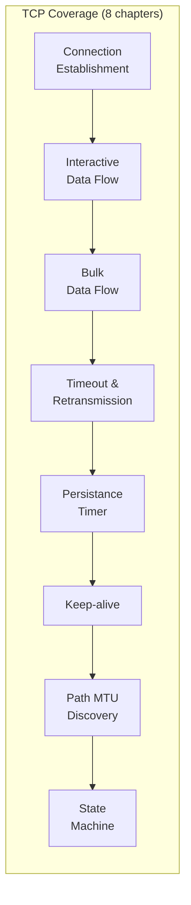
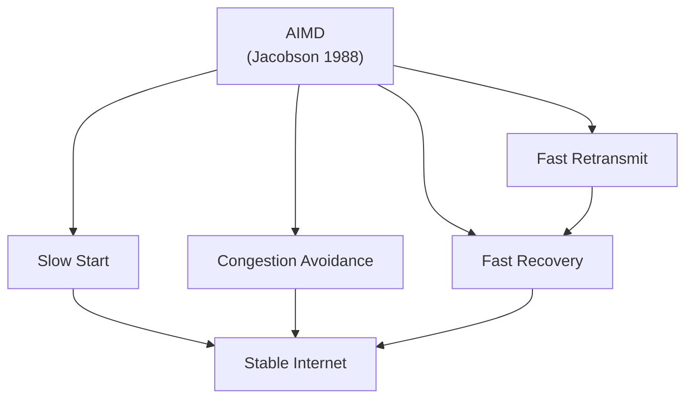
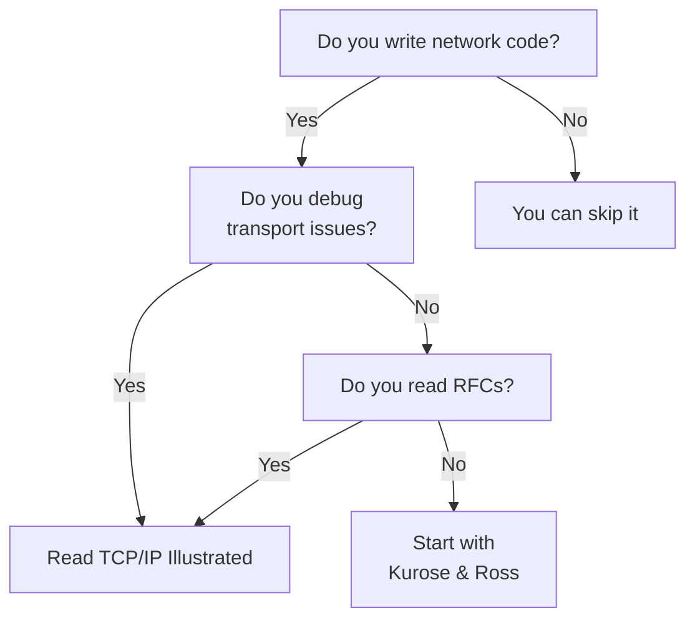

## Introduction

Welcome to BookAtlas. Today: *TCP/IP Illustrated, Volume 1: The
Protocols*, by W. Richard Stevens and Kevin R. Fall. First edition
1994. Second edition 2011. Often called the gold standard of
networking texts.

The book's central method is the trace. Where other textbooks draw
diagrams, Stevens prints the actual bytes on the wire and walks you
through them. It is a technique that has never been bettered. Let's
talk about why.

---

## The Stevens Method

**Engineer:** What makes Stevens different from every other
networking author is that he doesn't trust the diagram. He trusts
the packet capture. Every chapter opens with a `tcpdump` run, and
the discussion is anchored in the hex dump.

**Curious Reader:** Why is that better? Diagrams are clearer.

**Engineer:** Diagrams show what the *author* thinks happens. Packet
captures show what *actually* happens — including the bugs, the
middlebox interference, the kernel quirks, the option negotiations.
The trace is ground truth. Stevens was a programmer first, an
author second. He writes like someone who has spent hundreds of
hours debugging real networks.

**Curious Reader:** So is this a debugging manual or a textbook?

**Engineer:** It is both. It is the kind of book you read linearly
once to learn the protocols, and then keep on the shelf forever to
consult when something breaks. The state diagrams alone are worth
the price of admission.

---

## The Eight Chapters on TCP

The book's most famous stretch is the eight-chapter arc on TCP —
roughly chapters 17 through 24 in the 2nd edition. Stevens devotes
nearly 300 pages to a single protocol.

**Engineer:** The reason this is necessary is that TCP is not a
protocol — it is a small operating system. It has a state machine,
seven timers, a congestion controller, a flow controller, a
retransmission engine, and a path-discovery engine. You cannot
understand it from a single chapter.

**Skeptic:** But eight chapters? That's almost a third of the book.

**Engineer:** And the other two-thirds cover IP, ICMP, ARP, UDP,
DNS, DHCP, HTTP, FTP, SMTP, NFS, SNMP, multicast, and the BSD
sockets API. The book is comprehensive because the subject is
comprehensive.

---

## The State Machine

The TCP state machine is the centerpiece. Stevens draws every
transition, ties it to a packet trace, and explains the failure
modes (simultaneous open, half-open connections, the FIN_WAIT_2 hang,
TIME_WAIT semantics).

**Skeptic:** I memorized the state machine in college. It's just
eleven states.

**Engineer:** Eleven states, twenty-something transitions, and at
least four failure modes that you only learn by reading a packet
trace. Stevens shows all of them. The chapter on the TIME_WAIT
state, in particular, is required reading for anyone who has ever
deployed a service that opens a lot of short-lived connections.

**Skeptic:** OK, but practically — when does the state machine
actually matter?

**Engineer:** Every time you set up a load balancer, every time
you tune `tcp_tw_reuse`, every time you debug a "connection reset"
error, every time you wonder why the server has run out of
ephemeral ports. The state machine is the only way to reason about
these problems.

---

## Congestion Control: The Internet's Stability Mechanism

TCP's congestion control is what keeps the Internet from collapsing
under its own load. Stevens documents the four canonical
algorithms: slow start, congestion avoidance, fast retransmit, fast
recovery.

**Skeptic:** I thought TCP just had a window size.

**Engineer:** The window size is the mechanism. The congestion
controller is the policy. Jacobson in 1988 showed that if every
sender uses AIMD — Additive Increase, Multiplicative Decrease —
the network converges to a fair and efficient operating point.
That single observation is what makes the modern Internet possible.

**Skeptic:** So the Internet works because of one paper from 1988?

**Engineer:** Essentially, yes. The end-to-end argument, the IP
hourglass, and AIMD-based TCP congestion control — those three
ideas are the Internet's foundation. Stevens explains all of them
with traces and timing diagrams.

---

## Why the Book Endures

**Curious Reader:** The first edition is from 1994. Why is anyone
still reading it in 2026?

**Engineer:** Because the protocols it describes are still
fundamentally unchanged. TCP is TCP. IP is IP. The DNS message
format is the DNS message format. The novelty in 2026 is QUIC and
HTTP/3 and BBR, but those are all *on top of* the substrate Stevens
describes. If you understand Stevens' TCP, you can read the QUIC
RFC and understand why it exists. If you don't, you can't.

**Curious Reader:** What about IPv6? That's a big change.

**Engineer:** The 2nd edition handles this well. IPv6 is presented
in parallel with IPv4 throughout. By the time you finish, you can
read a dual-stack trace and identify the protocol by the header.
The IPv6 transition mechanisms — dual stack, tunneling, NAT64 — are
covered in the final chapter. It is enough to be conversant in the
modern Internet.

**Curious Reader:** And security?

**Engineer:** The 2nd edition has a single chapter on security,
covering IPsec, DNSSEC, and TLS hooks. It is honest: the Internet
was not designed for security, and the security retrofits have all
been awkward. The reader who finishes this book and wants to go
deeper on security should pair it with Rescorla's *SSL and TLS* or
Galbraith's *Mathematics of Public-Key Cryptography*.

---

## The Bottom Line

**Skeptic:** So who is this book actually for? Not the
undergraduate, surely. Not the modern web developer.

**Engineer:** It is for the engineer who has to understand what is
happening at the transport layer. That includes backend
programmers debugging connection-pool exhaustion, SREs
troubleshooting TLS handshakes, kernel developers implementing
sockets, security researchers reading PCAPs, and network engineers
designing WAN topologies. It is also for the reader who has
finished a survey text and wants depth.

**Skeptic:** And the modern web developer?

**Engineer:** Should still read chapters 1, 17, and 19. Chapter 1
for the architecture. Chapter 17 for TCP. Chapter 19 for HTTP.
That is the minimum viable Stevens. The rest is bonus.

---

## A Note on Stevens

**Curious Reader:** Who was W. Richard Stevens, anyway?

**Engineer:** A pilot, a programmer, and an author. He flew
commercial aircraft for a living — the books were a side career.
He wrote the canonical texts on Unix programming and TCP/IP, was
awarded the USENIX Lifetime Achievement posthumously, and died in
1999 at 48. His books remain in print because no one has written
better ones. The voice — patient, precise, never condescending,
always grounded in code and trace — is unmistakable. Kevin Fall's
2nd edition preserves that voice.

---

## Final Thoughts

*TCP/IP Illustrated, Volume 1* is the rare technical book that is
both a first read and a permanent reference. It teaches the
protocols by showing them on the wire, and it documents TCP with a
depth no other source has matched. The 2nd edition is the definitive
version: it carries Stevens' original genius forward into the IPv6
era without dilution.

Read it once to learn the protocols. Keep it on the shelf for the
rest of your career. When a connection behaves strangely, when a
traceroute doesn't match your mental model, when a socket option
mystifies you — reach for Stevens.

This has been a BookAtlas narration of *TCP/IP Illustrated,
Volume 1: The Protocols* by W. Richard Stevens and Kevin R. Fall.
Thanks for listening.
