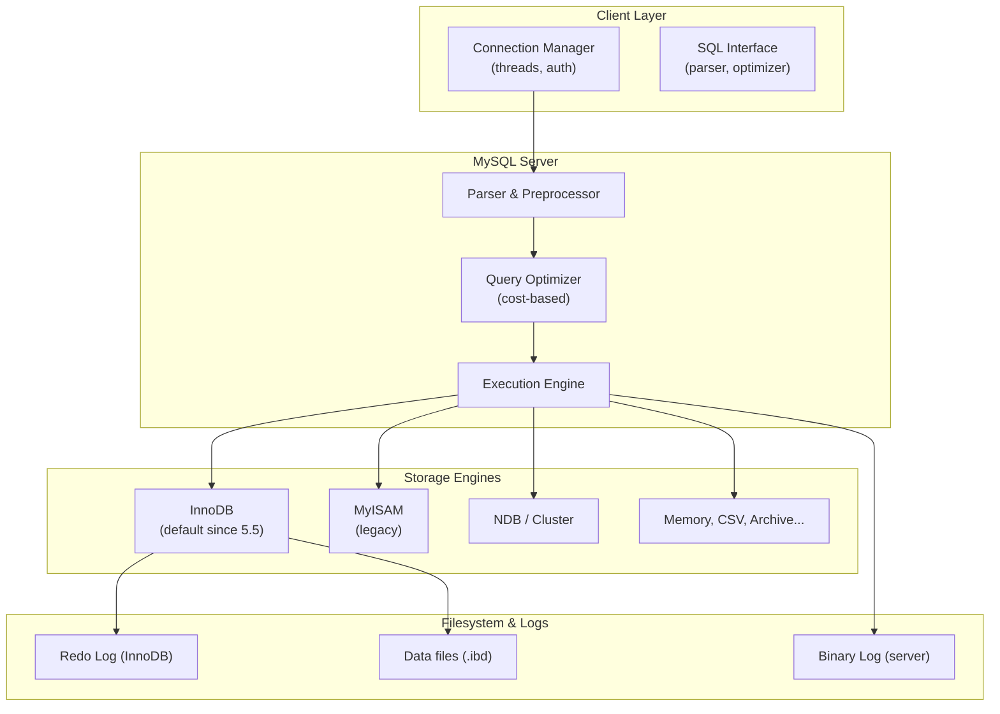
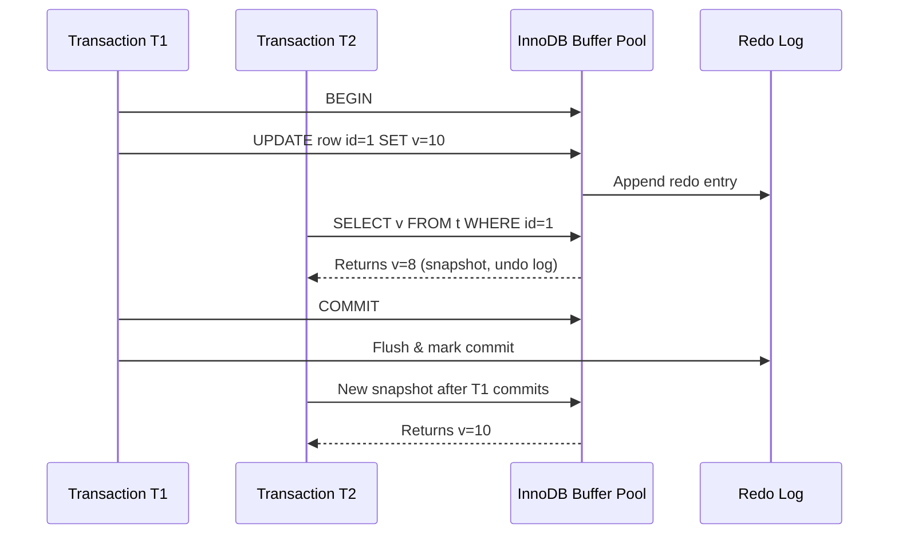
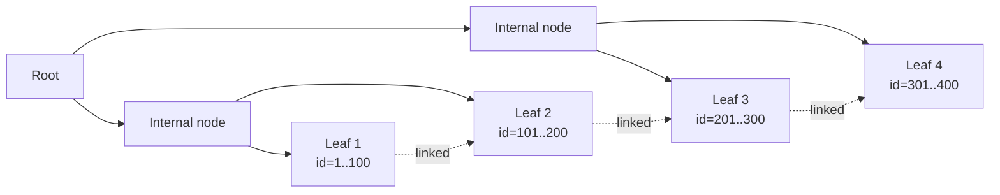
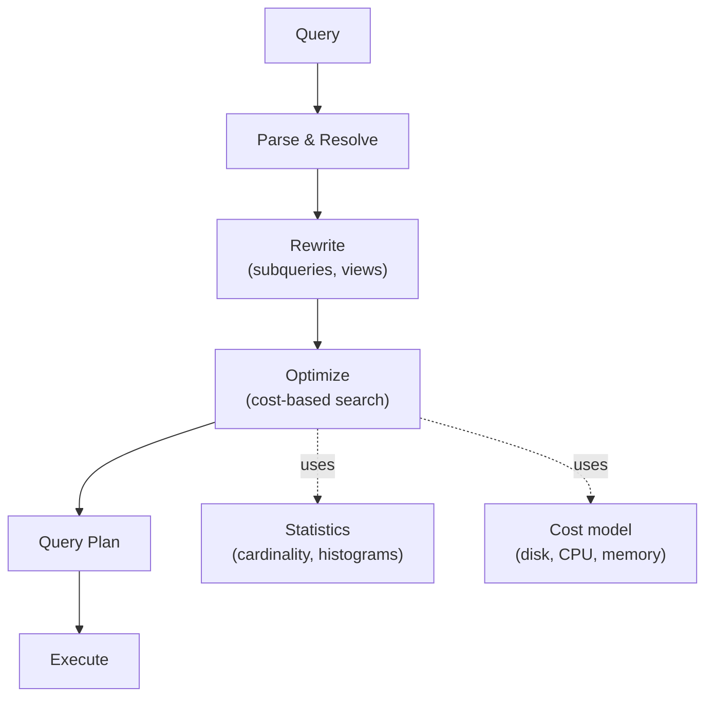
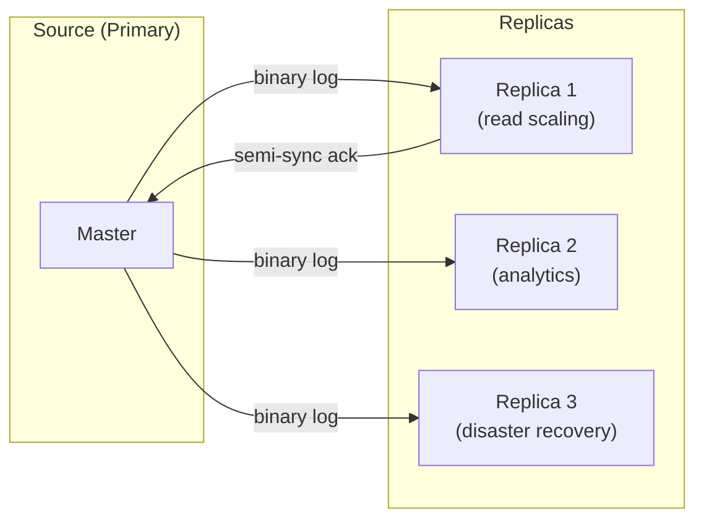
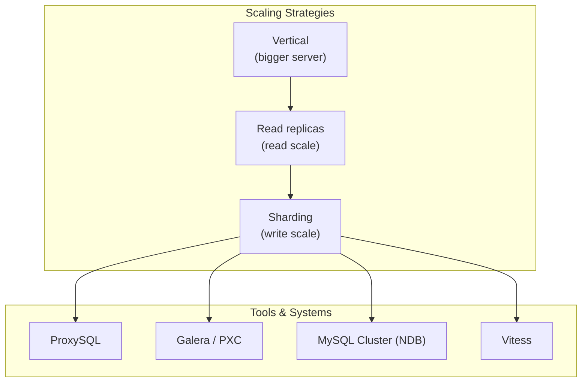

## MySQL Architecture at a Glance



MySQL is a pluggable storage engine architecture. The server layer
handles connection management, parsing, optimization, and execution.
Each storage engine owns its on-disk format, locking, and indexing.
InnoDB is the only engine that should be on your radar for OLTP.

---

## InnoDB Internals: MVCC and Locking



InnoDB implements **Multi-Version Concurrency Control**: writers
create new row versions in the clustered index, readers see a
consistent snapshot built from the undo log. Locks are mostly
row-level, with **gap locks** and **next-key locks** preventing
phantoms at the cost of occasional deadlocks.

Key consequences:

- `REPEATABLE READ` (InnoDB's default) gives a true snapshot, not
  the "no phantoms" of the SQL standard.
- Long-running transactions bloat the undo log and slow purges.
- Hot rows cause lock contention that no amount of indexing fixes.

---

## Indexing Strategies

### B-Tree Indexes

B-tree indexes are the bread and butter of MySQL. They are ordered,
support range scans, and can serve `ORDER BY` and `GROUP BY` without
a sort.



### Composite, Covering, and Prefix Indexes

| Index Type | Best For | Trade-off |
|---|---|---|
| Single-column | Equality lookups | Limited selectivity |
| Composite (leftmost) | Range + sort, multi-column filters | Order matters; cannot skip columns |
| Covering | Queries whose columns are all in the index | Larger indexes, slower writes |
| Prefix | `VARCHAR`/`TEXT` columns | Cannot be used for range or sort |

A **covering index** is the most powerful optimization in MySQL: when
the index contains every column the query needs, InnoDB never touches
the table. `EXPLAIN` shows this as `Extra: Using index`.

### Hash and Fulltext

- `MEMORY` engine supports hash indexes, but you should not use
  `MEMORY` for anything serious in 2026.
- MySQL 8.0 added functional indexes (`CREATE INDEX ... ON ((LOWER(name)))`)
  and descending indexes for `ORDER BY ... DESC`.

---

## Reading EXPLAIN

```sql
EXPLAIN FORMAT=JSON
SELECT u.id, u.name, COUNT(*) AS n
FROM users u
JOIN orders o ON o.user_id = u.id
WHERE u.country = 'US' AND o.created_at > '2024-01-01'
GROUP BY u.id, u.name
ORDER BY n DESC
LIMIT 10;
```

What to look for in `EXPLAIN`:

| Column | Watch For |
|---|---|
| `type` | `system` / `const` / `eq_ref` / `ref` / `range` / `index` / `ALL` |
| `key` | The index actually used (vs. `possible_keys`) |
| `rows` | Estimated row count; huge gaps from reality signal bad stats |
| `Extra` | `Using filesort`, `Using temporary`, `Using index`, `Impossible WHERE` |
| `filtered` | Percentage of rows that pass the WHERE |

The fourth edition dedicates an entire chapter to walking through
EXPLAIN output and using `OPTIMIZER_TRACE` to see why the optimizer
chose a particular plan.

---

## The Query Optimizer



The optimizer is **not magic**. It does a cost-based search: it
estimates row counts from index statistics, considers access paths
(full scan, range, ref, join order), and picks the cheapest plan.

When it is wrong:

- **Bad stats** → run `ANALYZE TABLE` to refresh histograms (MySQL 8+)
- **Skewed data** → use query hints or rewrite the query
- **Missing index** → add the right covering index
- **Optimizer limitations** → hints (`/*+ INDEX(...) */`) or `STRAIGHT_JOIN`

---

## Transactions and Isolation

| Isolation | Dirty Read | Non-Repeatable Read | Phantom | InnoDB Default |
|---|---|---|---|---|
| READ UNCOMMITTED | yes | yes | yes | no |
| READ COMMITTED | no | yes | yes | no |
| REPEATABLE READ | no | no | yes (mostly) | **yes** |
| SERIALIZABLE | no | no | no | no |

InnoDB's `REPEATABLE READ` uses gap locks to prevent most phantoms.
It is "snapshot isolation" in practice — your transaction sees the
data as it was when the first read happened, and reads are consistent
within the transaction.

Pitfalls the book covers in detail:

- **Deadlocks** — pick a consistent lock order; keep transactions
  short; use `SELECT ... FOR UPDATE` deliberately
- **Lock waits** — monitor `information_schema.innodb_trx` and
  `performance_schema.data_locks`
- **Long transactions** — fill the undo log, block purges, slow
  replication

---

## Replication



Replication modes the book covers:

- **Asynchronous** (default): primary doesn't wait for replicas
- **Semi-synchronous**: primary waits for at least one replica to
  acknowledge receipt
- **Group Replication** (MySQL 8+): Paxos-inspired, single-primary
  or multi-primary with built-in conflict detection
- **Galera / Percona XtraDB Cluster**: virtually synchronous, cert-
  based replication

Replication is for **read scale** and **availability**, not write
scale. For write scale, you need sharding.

---

## Backup and Recovery

| Method | Granularity | Locking | Speed | Use Case |
|---|---|---|---|---|
| `mysqldump` | Logical, full | Various | Slow | Small DBs, schema migrations |
| `mydumper` | Logical, parallel | Minimal | Fast | Large DBs, logical backups |
| `Percona XtraBackup` | Physical, online | None | Fast | Hot backups of InnoDB |
| Filesystem snapshot (LVM/ZFS) | Physical | Brief FS freeze | Fast | Large DBs, full snapshots |
| Binary log + PITR | Time | None | Continuous | Replay to a point in time |

The book's advice: **the only backup that exists is one you have
restored from**. Test restores. Verify checksums. Store backups off-
site. Document the time-to-restore.

---

## Scaling Beyond a Single Server



| Approach | Solves | Trade-off |
|---|---|---|
| Vertical scaling | Most early bottlenecks | Hardware limits, single point of failure |
| Read replicas | Read throughput, some HA | Replication lag, write contention on primary |
| Vitess / ProxySQL | Sharding, connection pooling | Operational complexity, query restrictions |
| MySQL Cluster (NDB) | Write scale + HA | Very different SQL surface, in-memory focus |
| Galera / PXC | Multi-master with sync | Conflict detection, schema migration pain |
| Group Replication | HA with built-in quorum | Throughput limits, network requirements |

The fourth edition adds a chapter on MySQL in the cloud (RDS,
Aurora, Cloud SQL, PlanetScale) and the new realities of running
MySQL on Kubernetes.

---

## Key Lessons

- **Measure before you optimize.** Use `sysbench`, `mysqlslap`, or
  production traffic replay. The bottleneck is rarely where you
  think.
- **Indexes are the most leveraged optimization.** A well-chosen
  covering index beats a faster server.
- **InnoDB is the default — and the right default.** Master its
  MVCC model, its redo log, and its lock types.
- **EXPLAIN is the diagnostic tool.** If you cannot read EXPLAIN,
  you cannot reason about query performance.
- **Configuration has high-leverage knobs** (`innodb_buffer_pool_size`,
  `innodb_log_file_size`, `innodb_flush_log_at_trx_commit`) but
  defaults are usually fine. Change with a benchmark.
- **Replication is a fact of life.** Choose the right topology
  for your RTO/RPO and test failover regularly.
- **Backups are a discipline.** Automate, verify, restore.
- **Sharding is the last resort, not the first.** Most applications
  can run on a single primary for years with the right schema and
  indexes.

---

## Practical Applications

### For the Backend Engineer

- Always check the EXPLAIN of a slow query before reaching for a
  cache
- Use composite indexes in the same order as your `WHERE` and
  `ORDER BY` columns
- Wrap related writes in a single transaction; keep it short
- Profile with `performance_schema` and `sys` schema, not just
  slow query log

### For the DBA

- Set `innodb_buffer_pool_size` to 50-75% of server memory
- Use `innodb_log_file_size` large enough to avoid checkpointing
  storms (often 2-4 GB on busy servers)
- Monitor replication lag, lock waits, and buffer pool hit rate
- Rotate `binlog_expire_logs_seconds` aggressively (default 30 days
  in MySQL 8) to avoid filling disk

### For the SRE

- Practice failover — make it routine, not a fire drill
- Keep three copies of every backup, on two media, in one
  geographic region (3-2-1 rule)
- Alert on replication lag, disk space, and `Threads_connected`
- Treat schema migrations like production deploys: reversible,
  staged, monitored

### For the Architect

- Choose the replication topology that matches your RPO/RTO
- Plan the sharding key before you need it (user_id, tenant_id,
  region)
- Use Vitess or ProxySQL as the routing layer, not the application
- Consider managed services (Aurora, PlanetScale, RDS) for
  operational leverage — at the cost of some control
