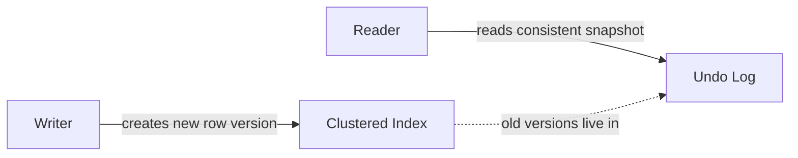
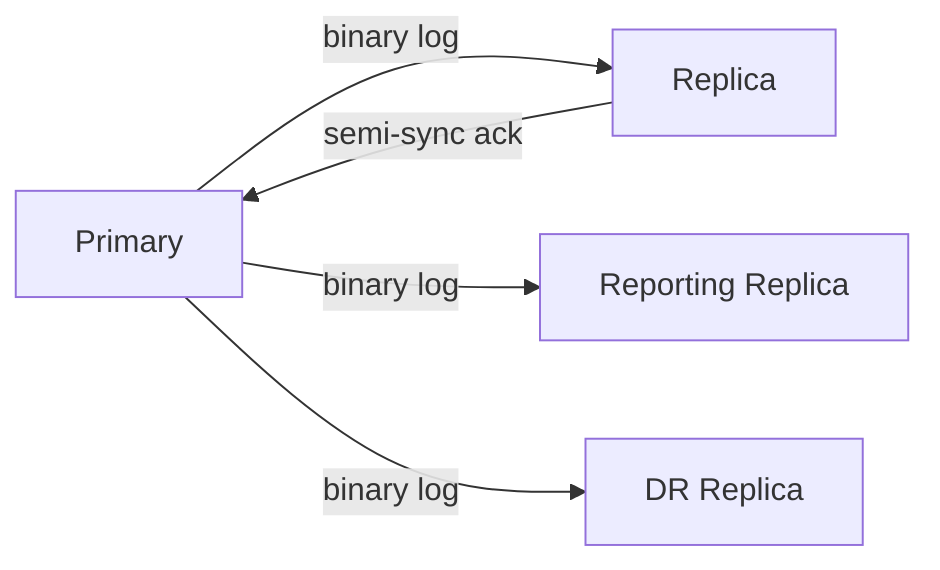

## Introduction

Welcome to BookAtlas. Today: *High Performance MySQL: Proven
Strategies for Operating at Scale*. Fourth edition, 2022. Six
authors, including the founders of Percona. 950 pages. The book
that has sat on every MySQL DBA's desk for nearly twenty years.

This is the book you read when the database is on fire, or when you
want to make sure it does not catch fire in the first place.

---

## Why This Book Exists

**Engineer:** MySQL has a reputation as the "simple" database. It
is the default in LAMP stacks. It is the database you reach for
when you want something to just work.

**Skeptic:** And that is the problem, right? The defaults take you
80% of the way. The last 20% is where you find yourself in a
war room at 3 a.m.

**Engineer:** Exactly. Most MySQL books stop at `CREATE TABLE` and
basic `SELECT`. This book starts where they end. Indexing strategy,
InnoDB internals, EXPLAIN plans, the optimizer's cost model,
replication topologies, backup verification, sharding. The kind of
stuff that separates a developer from an operator.

---

## InnoDB: The Engine That Matters

**Engineer:** Let's start with InnoDB. It is the default storage
engine since MySQL 5.5, and for good reason. It is the only engine
in MySQL that gives you transactions, foreign keys, MVCC, and
crash-safe replication. Everything else is legacy.

**Skeptic:** MVCC is the magic word, isn't it? Multi-version
concurrency control.

**Engineer:** Right. InnoDB keeps multiple versions of each row in
the clustered index. Writers create new versions; readers see a
consistent snapshot built from the undo log. This is why readers
don't block writers and vice versa. It is also why long-running
transactions bloat the undo log and slow down purges.

**Skeptic:** So the trade-off is memory. Long transactions = lots
of undo.

**Engineer:** Exactly. And the book hammers this: keep transactions
short. Don't open one in your application server and wait for a
user to click a button.

---

## Indexing: The Highest-Leverage Optimization

**Skeptic:** Most of my slow queries come down to missing indexes.
Is that a coincidence?

**Engineer:** It is not a coincidence. Indexing is the single most
leveraged optimization in MySQL. A well-chosen composite or
covering index can turn a 10-second query into a 10-millisecond
query. A new server, with the same indexes, will not.

**Skeptic:** Walk me through the "covering index" idea.

**Engineer:** Imagine a phone book. You want to find everyone named
"Schwartz" and you only need their last name and city. A regular
index finds the page; the table is the alphabetical entries with
phone numbers and addresses you don't need. A *covering* index
includes only the columns you actually want. The query never
touches the table at all.

**Skeptic:** So bigger index, faster query.

**Engineer:** Bigger index, faster query, slower writes. Every
index is overhead on every `INSERT`, `UPDATE`, `DELETE`. The art is
matching indexes to actual query patterns, not to the schema.

---

## Reading EXPLAIN

**Engineer:** The second most important skill is reading EXPLAIN.

**Skeptic:** Just put `EXPLAIN` in front of a query?

**Engineer:** In MySQL 8, use `EXPLAIN ANALYZE` — it actually runs
the query and shows you the real numbers, not just estimates.
Or `EXPLAIN FORMAT=JSON` for a structured plan.

**Skeptic:** And you read this to know what the optimizer is
*going* to do?

**Engineer:** Exactly. The output tells you the join order, which
indexes it picked (or didn't), how many rows it thinks it will
scan, whether it needs to sort or use a temp table. If the
optimizer's row estimates are wildly wrong — say it thinks a query
will return 10 rows but actually returns 10 million — that is
almost always a missing or broken index.

**Skeptic:** And if the optimizer is just wrong?

**Engineer:** Hints. `SELECT /*+ INDEX(t users_name_idx) */ ...`.
But the book is clear: hints are a last resort, not a first
option. If you need a hint, ask why the optimizer made the wrong
choice. Usually, the answer is "the schema or the stats are wrong."

---

## Replication and High Availability

**Skeptic:** Replication in MySQL has always had a reputation for
being fragile. Is that still true?

**Engineer:** It is more accurate to say it has more knobs now.
Asynchronous replication (the default) is fast but lossy. Semi-
synchronous replication waits for at least one replica to
acknowledge. Group Replication uses Paxos to keep a quorum in
sync. Galera is virtually synchronous, cert-based.

**Skeptic:** And the failover story?

**Engineer:** Better than it was. With GTIDs and orchestrators
like Orchestrator, MHA, or the cloud-native solutions, failover
is mostly routine — if you have rehearsed it. The book is clear:
failover that you have not practiced is a fire drill. Failover
that you have practiced is a deploy.

---

## Backup: The Discipline Most Teams Skip

**Engineer:** Here is the most underrated chapter: backup and
recovery.

**Skeptic:** Backups are boring. Everyone knows you need them.

**Engineer:** Everyone knows they need them. Very few teams have
actually restored from one. The book covers the tools — mysqldump,
mydumper, Percona XtraBackup, filesystem snapshots, binary log
PITR — and then spends half the chapter on verification.

**Skeptic:** "The only backup that exists is one you have restored
from."

**Engineer:** That is literally the line. The book is opinionated
about this. 3-2-1 backup strategy (three copies, two media, one
off-site). Automated restores. Checksum verification. Documented
RTO and RPO.

---

## Sharding: The Last Resort

**Skeptic:** When do you shard?

**Engineer:** When you have to. Most applications run on a single
primary for years with the right schema, indexes, and read
replicas. Sharding adds operational complexity that you do not
want to pay for unless you have to.

**Skeptic:** And when you have to?

**Engineer:** Vitess. ProxySQL. MySQL Cluster (NDB). Galera. Each
solves a different problem. Vitess is the modern default for
sharded MySQL — it sits between your application and your
shards, routing queries and managing topology. The book covers
all of these, with realistic advice on when each makes sense.

---

## The Verdict

**Engineer:** *High Performance MySQL* is not a book you read
once. It is a reference you return to. The 950 pages are
deliberately comprehensive — you will not need every chapter
on day one, but the chapter you need at 2 a.m. will save your
on-call rotation.

**Skeptic:** It is also not a beginner book. If you have never
written a JOIN, this is not where you start.

**Engineer:** Correct. Read a SQL primer first. Then read
Karwin's *SQL Antipatterns*. Then read this. By the time you
finish, you will be the person your team pings when MySQL is
misbehaving.

**Skeptic:** Final rating?

**Engineer:** 9.5 out of 10. The definitive MySQL book. The fact
that it is on its fourth edition, written by the people who
built Percona, and still current in 2026 is a testament to
both the book's quality and the longevity of MySQL itself.

This has been a BookAtlas narration of *High Performance MySQL*
by Baron Schwartz, Peter Zaitsev, Vadim Tkachenko, Jeremy
Zawodny, Arjen Lentz, and Derek J. Balling. Thanks for
listening.
