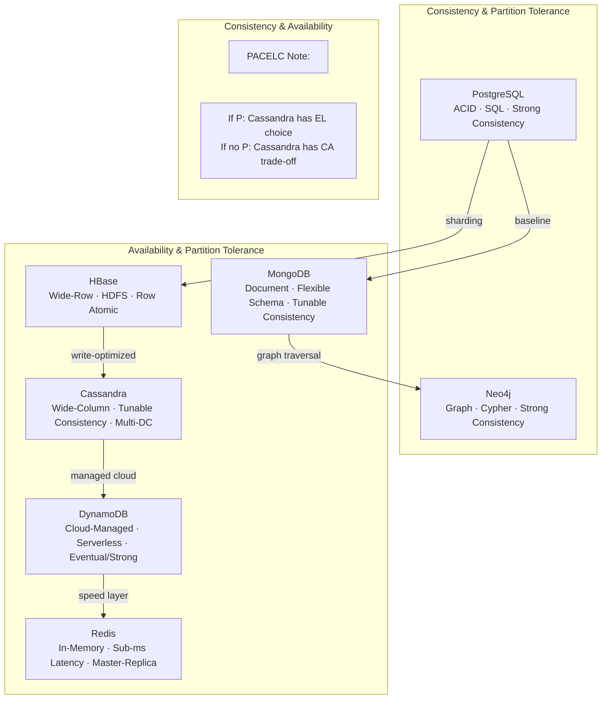

# Part I: Relational Foundations — PostgreSQL

## Context and Why It's Here

The book begins with PostgreSQL, the most mature and technically advanced open-source relational database. Choosing it first grounds every subsequent NoSQL exploration in a trusted baseline: ACID transactions, SQL, and normalized schemas. Only by understanding what relational databases excel at can readers appreciate where NoSQL alternatives actually win.

PostgreSQL sets the bar for the "consistency" end of the CAP spectrum.

## Core Concepts Covered

### Relational Model Refresher
- Tables, rows, columns, primary keys, foreign keys
- Normal forms (1NF through BCNF) as a design tool, not dogma
- SQL as a declarative query language

### PostgreSQL-Specific Power Features
- JSON/JSONB support, blurring the NoSQL/relational divide
- Array types, hstore (key-value within a row)
- Full-text search built in
- Window functions and CTEs for complex analytics
- Extensions (PostGIS, pgcrypto)

### ACID Guarantees in Depth
- **Atomicity**: transactions are all-or-nothing
- **Consistency**: constraints and invariants enforced
- **Isolation levels**: read uncommitted through serializable
- **Durability**: WAL (Write-Ahead Log)

## Key Exercises

<Exercise type="setup" week="1">
Install PostgreSQL, create a library database, and load initial data.sql. Practice joins across authors, books, and publishers.
</Exercise>

<Exercise type="query" week="2">
Write window-function queries to rank books by publish date per publisher. Use CTEs to build a recursive author co-authorship graph inside SQL.
</Exercise>

## Takeaways

PostgreSQL is not the "default" database—it is the reference point. Every subsequent chapter asks: what does this database give up compared to PostgreSQL, and what does it gain?

---

# Part II: Distributed Columnar — HBase

## Context

HBase is an open-source, distributed, versioned, non-relational database modeled after Google's Bigtable paper. Running on top of HDFS, it serves as the bridge from relational databases to the distributed, eventually-consistent NoSQL world.

## Core Concepts Covered

### Architecture
- HRegion: the unit of distribution and load balancing
- HStore (MemStore + StoreFile) per region
- HDFS as the backing store (Write-Ahead Log, block replication)
- Zookeeper for cluster coordination

### Data Model: Wide Rows
- Row keys (sorted lexicographically — a critical design decision)
- Column families (physical storage grouping)
- Qualifiers (dynamic, sparse columns)
- Timestamps (built-in versioning)

### Consistency Caveats
HBase provides **row-level atomicity** and strong consistency for single-row operations. Multi-row or cross-region scans are not atomic. The book emphasizes that HBase is not eventually consistent in the CAP sense for single-row reads—it lies toward the CP side.

## Key Exercises

<Exercise type="modeling" week="3">
Design a wide-row schema for time-series IoT sensor data. Deploy a single-node HBase cluster. Insert and scan 100,000 rows; observe HBase's random read performance (ubiquitous in real-world HBase use cases).
</Exercise>

<Exercise type="modeling" week="4">
Model a social-network follower graph in HBase wide rows. Discuss why this is an anti-pattern and how a graph database handles the same problem differently.
</Exercise>

## Takeaways

HBase teaches that row-key design is everything. Change the row key and you change the entire access pattern. It also surfaces the first real CAP tension: does the system optimize for availability or consistency under partition?

---

# Part III: Document Databases — MongoDB

## Context

MongoDB is the most widely adopted document database. Its BSON document model maps naturally to application object graphs, eliminating the object-relational impedance mismatch that plagues ORM-based PostgreSQL applications.

## Core Concepts Covered

### Document Model
- BSON: binary JSON with extended types (ObjectId, Date, binary)
- Embedded documents vs. references
- Schema flexibility: no schemas, schema-on-read, schema-on-write via validation rules

### CRUD and Query Language
- `find`, `findOne`, projection, operators (`$gt`, `$in`, `$regex`)
- Update operators (`$set`, `$inc`, `$push`, `$addToSet`)
- Atomicity at the **document level** — multi-document transactions require explicit handling

### Indexing Strategies
- Single-field, compound, multikey (arrays), geospatial
- Text indexes, TTL indexes
- Index intersection (MongoDB 2.6+)

### Consistency and Replication
- Primary-secondary replication (replica sets)
- Read preference: primary, secondary, nearest
- Write concern: acknowledged, majority, fsync
- Tunable consistency via read/write concern combinations

## Key Exercises

<Exercise type="modeling" week="5">
Model a blog with embedded comments. Then model a many-to-many relationship between posts and tags using references. Compare query complexity in both.
</Exercise>

<Exercise type="query" week="6">
Perform aggregation pipeline queries: `$match`, `$group`, `$sort`, `$lookup` (join-like), `$unwind`.measure query performance with `explain("executionStats")`.
</Exercise>

## Takeaways

MongoDB trade-off: developer velocity and schema flexibility at the cost of transactional scope and referential integrity guarantees. It is AP-oriented (availability + partition tolerance) with tunable consistency knobs.

---

# Part IV: Graph Databases — Neo4j

## Context

Neo4j is the leading native graph database. After spending two weeks in document- and column-oriented models, the book pivots to a fundamentally different paradigm: relationships as first-class citizens, navigated through graph traversal rather than joins or map-reduce.

## Core Concepts Covered

### Property Graph Model
- Nodes: entities with labels and properties
- Relationships: directed, typed, with properties, connecting exactly two nodes
- Labels: semantic grouping of node types
- The graph is the schema — schema flexibility here means adding new node/relationship types

### Cypher Query Language
- Pattern-matching syntax inspired by ASCII art: `(person:Author)-[:WROTE]->(book:Book)`
- `MATCH`, `WHERE`, `RETURN`, `CREATE`, `MERGE`
- Variable-length path patterns: `-[:WROTE*2..4]->`

### Why Graph Queries Are Different
- Relational joins grow exponentially with depth; graph traversals are O(depth)
- Recommendations, fraud detection, knowledge graphs, and network analysis are natural graph problems
- Schema-on-read via labels, but performance requires thoughtful indexing

## Key Exercises

<Exercise type="modeling" week="7">
Build a movie recommendation graph: `(Person)-[:ACTED_IN|:DIRECTED]->(Movie)` with genres. Write Cypher to find "collaborators of collaborators."
</Exercise>

<Exercise type="query" week="8">
Model a dependency/citation graph. Write a shortest-path Cypher query to find the citation distance between two papers.
</Exercise>

## Takeaways

Neo4j is fundamentally about depth queries. Where PostgreSQL needs JOIN explosions and MongoDB needs multi-stage $lookups, Neo4j traverses relationships in near-constant time for most practical graph depths. It is a CP system under CAP.

---

# Part V: Wide-Column Stores — Cassandra

## Context

Cassandra was born at Facebook for inbox search. It inherits from Amazon's Dynamo paper (availability via vector clocks and hinted handoff) and Google's Bigtable (data model). The result is a database optimized for **write-heavy workloads across multiple data centers** with tunable consistency.

## Core Concepts Covered

### Data Model
- Keyspace: top-level namespace (analogous to a schema)
- Table: row-based, but rows are not required to share columns (sparse)
- Partition key: determines node placement and distribution
- Clustering columns: determine sort order within a partition

### Distribution and Replication
- Consistent hashing via the partitioner (Murmur3 by default)
- Replication factor and replication strategy (SimpleStrategy, NetworkTopologyStrategy)
- Tunable consistency per operation: `QUORUM`, `LOCAL_QUORUM`, `ONE`, `ALL`

### CAP and Consistency Math
- For a write with replication factor RF and consistency level CL=QUORUM:
  - Write quorum = floor(RF/2) + 1
  - Paxos-style lightweight transactions (IF NOT EXISTS) via LWT protocol
- CAP position: AP by default, can offer CP via LWT and QUORUM reads/writes

## Key Exercises

<Exercise type="modeling" week="9">
Design a Cassandra schema for a multi-region e-commerce catalog. Choose partition keys and clustering columns. Explain why this design cannot efficiently answer "top 10 cheapest products across all regions."
</Exercise>

<Exercise type="query" week="10">
Model a time-series user activity feed using time-based partition keys. Discuss TTL patterns and compaction strategies.
</Exercise>

## Takeaways

Cassandra demands that you design your schema for your queries, not for data normalization. The partitioning model is non-negotiable. Its superpower is Multi-DC replication with per-operation consistency control.

---

# Part VI: Cloud-Managed — DynamoDB

## Context

While Cassandra is self-hosted, DynamoDB is Amazon's fully managed equivalent. A third of the way through the book, the focus shifts to the operational simplicity of a serverless database where capacity planning, replication, and patching are someone else's problem.

## Core Concepts Covered

### Data Model
- Tables, items, attributes
- Simple primary key (partition key only) or composite primary key (partition + sort key)
- Typed scalar attributes: String, Number, Binary, Boolean, Null
- Set types: String Set, Number Set, Binary Set
- Document types: List, Map

### DynamoDB's Consistency Trade-offs
- Eventually consistent reads (default, ~100ms latency, two AZs)
- Strongly consistent reads (single AZ, ~200ms, not available for global tables)
- Transactions: ACID across up to 25 items or 4 MB (added in 2018)

### Access Patterns Drive Schema
- Single-table design: multiple entity types in one table with composite sort keys
- Secondary indexes (GSI with its own partition/sort key projection)
- Access patterns must be known before table creation

## Key Exercises

<Exercise type="modeling" week="11">
Design a single DynamoDB table for an e-commerce system storing Users, Orders, and Products in one physical table. Explain how the composite sort key encodes entity type and attributes.
</Exercise>

<Exercise type="modeling" week="12">
Add a GSI to support "find all orders for a given user." Discuss GSI read/write capacity and its impact on cost and latency.
</Exercise>

## Takeaways

DynamoDB compresses everything—schema design, consistency, access patterns, and cost—into explicit upfront decisions. There is no migration path once a table is live. The CAP trade-off is managed through configurable RCU/WCU and eventual vs. strong consistency.

---

# Part VII: In-Memory Key-Value — Redis

## Context

Redis closes the book at the infrastructure layer: a sub-millisecond, in-memory key-value store used as a cache, message broker, session store, leaderboard engine, and sometimes a primary database. Its breadth of data structures is unmatched among key-value stores.

## Core Concepts Covered

### Data Structures
- String: O(1) get/set; binary-safe
- List: O(1) push/pop from both ends; queue and stack semantics
- Set: unordered unique collection; O(1) member add/remove
- Sorted Set (ZSET): score-ordered; O(log N) insert; leaderboard natural fit
- Hash: field-value map within a key; partial updates without reading whole value
- Bitmaps, HyperLogLog, Geospatial indexes

### Persistence Models
- RDB: point-in-time snapshot to disk
- AOF: every write operation appended to a log; fsync configurable
- Hybrid: RDB + AOF for fast restarts and minimal data loss

### Replication and High Availability
- Master-replica replication (asynchronous by default)
- Redis Sentinel: automatic failover with quorum
- Redis Cluster: sharding across 1,024 hash slots; eventual consistency between masters

## Key Exercises

<Exercise type="setup" week="13">
Install Redis, configure AOF with fsync-every-second, stop the process, corrupt the AOF, repair with `redis-check-aof`, and restart. Observe the persistence guarantees in practice.
</Exercise>

<Exercise type="modeling" week="14">
Build a rate limiter using Redis sorted sets: `ZADD rate-limit:user123 <timestamp> <requestId>`. Implement sliding-window logic with `ZREMRANGEBYSCORE` and `ZCARD`. Measure latency with `redis-benchmark`.
</Exercise>

## Takeaways

Redis is AP-oriented and prioritized for speed and data structure richness over transactional guarantees. Its polymodel nature (not just key-value) makes it relevant for many problem categories, but requires operational expertise around persistence, memory management, and cluster topology.

---

# Cross-Database Comparison Summary

The following Mermaid diagram maps each database along the two CAP dimensions most discussed in the book, illustrating approximate positioning as the authors describe them in production contexts:

## Key Themes That Bind All Seven

<Theme priority="critical">
**Polyglot Persistence**: Use PostgreSQL for financial transactions requiring ACID guarantees, Redis for the caching layer, Neo4j for the social graph, MongoDB for the product catalog, and Cassandra for the time-series metrics. The book's bottom line: every architecture that requires more than one of these patterns is a polyglot persistence architecture.
</Theme>

<Theme priority="high">
**Consistency Is a Slider, Not a Switch**: From PostgreSQL's SERIALIZABLE isolation through Cassandra's LOCAL_QUORUM and DynamoDB's strongly consistent reads, every system discussed offers a point on the C-A spectrum in a distributed system.
</Theme>

<Theme priority="high">
**Schema Design Encodes Access Patterns**: HBase row keys, Cassandra partition keys, DynamoDB sort keys, Neo4j relationship types—failure to design your schema around your reads means you've designed it for failure.
</Theme>

<Theme priority="medium">
**BASE vs ACID**: BASE (Basically Available, Soft state, Eventually consistent) describes the trade-off envelope for AP systems. ACID describes the CP guarantee envelope. Neither is inherently better—they solve different problems under different assumptions.
</Theme>

<Theme priority="medium">
**Operational Complexity Trade-off**: Self-managed (HBase, Cassandra, self-hosted Redis) vs. fully managed (DynamoDB) vs. has-open-source-managed (PostgreSQL via RDS, MongoDB Atlas, Neo4j Aura). Planning for operational burden is a first-class architectural decision.
</Theme>
