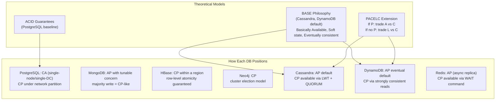
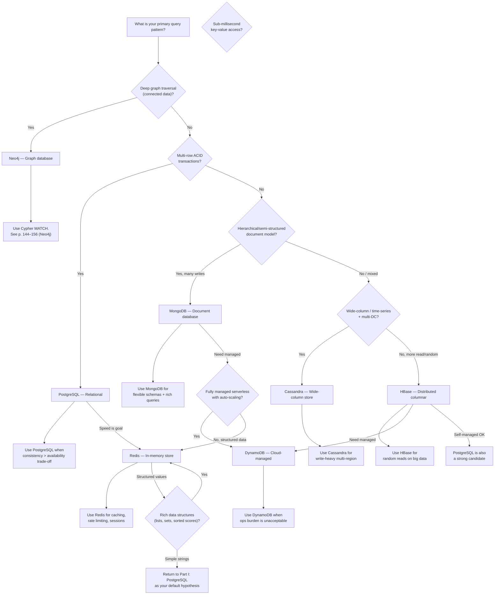

# Part II: Critical Analysis

## The Book's Thesis in One Sentence

*A developer who understands seven databases, their data models, their consistency semantics, and their operational costs can design systems that use the right tool for each data domain—polyglot persistence—instead of forcing every problem into a single database paradigm.*

## Strengths

### 1. Structure Forces Real Engagement

A week per database, with exercises at the end of each day, means the reader *does* the work. The book is not reference material—it's a structured apprenticeship. The exercises are carefully sequenced: install → model → query → compare.

### 2. Comparative Framework Is Explicit

Rather than treating each database in isolation, the authors repeatedly draw comparisons: "PostgreSQL does this with a JOIN; MongoDB does this with `$lookup`; Neo4j does this with a MATCH pattern." This comparative lens—built into the book's DNA—is its most important intellectual contribution.

### 3. CAP and CAP-Adjacent Theory Is Accessible

The book introduces PACELC (if there's a Partition, your system must trade Availability against Consistency; Else, you can trade Latency against Consistency) without overwhelming the reader with formal proofs. It translates Brewer's theorem from a research paper into a decision-making tool.

### 4. Materials Age Better Than Most Tech Books

Published 10 years after the first edition, the 2nd edition replaces CouchDB with DynamoDB—recognition that cloud-managed databases changed the landscape. PostgreSQL coverage was upgraded to include JSONB. The core framework (compare 7 systems, model, query, reason) remains evergreen.

## Weaknesses

### 1. No Depth on Operational Production Concerns

The book covers installation and basic configuration but omits production-critical topics: backup/restore procedures, disaster recovery planning, monitoring essential metrics (latency P99, replication lag, connection pool saturation), upgrade procedures, and capacity planning. This is a significant gap for the stated audience of practitioners.

### 2. DynamoDB Coverage Is Thin on Modern Features

The 2022 edition covers DynamoDB at a time when DynamoDB Standard-IA tables, DynamoDB Streams with Kinesis Data Streams integration, and IAM condition-based access control were all available. The book predates significant serverless-native features and doesn't address DynamoDB pricing models in operational depth.

### 3. No Coverage of PostgreSQL Internals

Given PostgreSQL is book one and the reference standard, readers might expect deeper internals coverage: MVCC mechanism, VACUUM, autovacuum tuning, WAL archiving, PITR configuration, and the postmaster process. These topics are absent.

### 4. Elasticsearch and Couchbase Omissions

The book's subtitle is "Seven Databases in Seven Weeks" but the ecosystem has expanded. Elasticsearch—ubiquitous for search workloads—is not covered. Couchbase, which combines document and key-value models, appears in the index but not as a core chapter. These gaps could mislead readers about the full NoSQL landscape.

## Core Frameworks Extracted from the Book

<Framework title="Polyglot Persistence Selection Matrix" priority="critical">

Use this matrix when evaluating which database to introduce for a given data domain:

| Question | PostgreSQL | MongoDB | Neo4j | Cassandra | DynamoDB | Redis |
|---|---|---|---|---|---|---|
| Do you need multi-row ACID transactions? | ✅ Yes | ❌ No | ❌ No | ❌ No | ⚠️ Limited | ❌ No |
| Is your primary access pattern deep graph traversals? | ❌ No | ❌ No | ✅ Yes | ❌ No | ❌ No | ❌ No |
| Is availability across multiple DCs the top priority? | ⚠️ Yes | ⚠️ Yes | ❌ No | ✅ Yes | ⚠️ Managed | ❌ No |
| Is your workload write-heavy (>70% writes)? | ⚠️ Yes | ⚠️ Yes | ❌ No | ✅ Yes | ⚠️ Yes | ✅ Yes |
| Do you need sub-millisecond reads? | ❌ No | ❌ No | ⚠️ Sometimes | ❌ No | ⚠️ Sometimes | ✅ Yes |
| Do you want zero operational burden? | ⚠️ Managed | ⚠️ Managed | ⚠️ Managed | ❌ No | ✅ Yes | ⚠️ Managed |
| Is your data naturally hierarchical? | ⚠️ Yes | ✅ Yes | ❌ No | ❌ No | ⚠️ Yes | ❌ No |

</Framework>

## CAP and Consistency Trade-Off Analysis

## Decision Flowchart: Which Database Fits Your Needs?

## Critique of Specific Chapters

### PostgreSQL (Chapters 1–2)
**What works**: Grounding NoSQL exploration in a rigorous ACID baseline. JSONB introduction is forward-looking.
**What's missing**: No coverage of connection pooling (PgBouncer), replication modes (streaming replication, logical replication), or PostgreSQL as a reasoning tool for eventual consistency via read-only replicas.

### HBase (Chapters 3–4)
**What works**: Row-key design as a first-class design concern is handled well. The HDFS prerequisite is acknowledged honestly.
**What's missing**: No coverage of coprocessors, Phoenix SQL layer, or the fact that most modern HBase users have moved to cloud-managed HBase (via Google Cloud Bigtable, AWS Managed HBase).

### MongoDB (Chapters 5–6)
**What works**: Aggregation pipeline is well demonstrated. Schema validation rules are introduced without overcomplicating things.
**What's missing**: Change Streams (a production-critical feature for event sourcing), sharding architecture, and the security model (auth, TLS, role-based access) are absent.

### Neo4j (Chapters 7–8)
**What works**: Cypher's ASCII-art syntax is perfectly suited to a book format. Graph algorithms (PageRank, shortest path) are introduced practically.
**What's missing**: Neo4j Fabric (deploying across multiple databases), APOC library, and the Bloom filter optimization layer. These are core production concerns.

### Cassandra (Chapters 9–10)
**What works**: Lightweight transactions (LWT) and consistency math (quorum arithmetic) are handled with unusual clarity. The multi-DC replication strategy is essential and well-taught.
**What's missing**: SSTable compaction strategies (SizeTiered vs Leveled vs TimeWindow), materialized views (deprecated but in the book at time of writing), and tombstone management—critical for long-lived Cassandra clusters.

### DynamoDB (Chapters 11–12)
**What works**: Single-table design philosophy is articulated as clearly as anywhere in print. GSI modeling is practical.
**What's missing**: As noted in weaknesses: modern features, detailed cost modeling, and serverless application integration patterns (Step Functions, AppSync).

### Redis (Chapters 13–14)
**What works**: The breadth of data structures covered in a short chapter is impressive. The rate-limiter exercise is immediately production-applicable.
**What's missing**: Redis as a primary data store (RedisJSON, RediSearch, RedisTimeSeries modules), cluster resharding, and Lua scripting for atomic complex operations.

## Originality and Contribution to the Field

The book's primary original contribution is its **format**: forced sequential, hands-on comparison of diverse database systems rather than categorical encyclopedic treatment. This format directly encodes polyglot persistence philosophy into the reading experience itself. No single chapter stands as groundbreaking contributions to database theory or practice, but the aggregate effect—a practitioner fluent in seven paradigms—is genuinely rare.

## Final Verdict

<Rating category="Practicality" value="9/10" />
<Rating category="Theoretical Depth" value="7/10" />
<Rating category="Production Relevance" value="6/10" />
<Rating category="Writing Quality" value="8/10" />
<Rating category="Overall" value="8/10" />

**Recommended for**: Backend engineers, data engineers, technical architects who need to evaluate database technologies for production systems. The book assumes programming fluency and basic familiarity with database terminology—beginners should pair it with a fundamentals text.

**Not recommended for**: Database administrators needing production operations depth, or specialists seeking deep expertise in a single database system.
