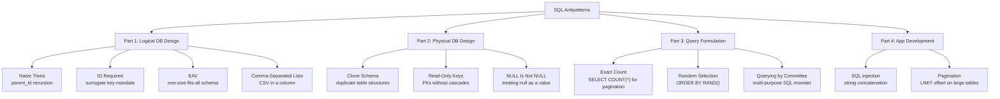
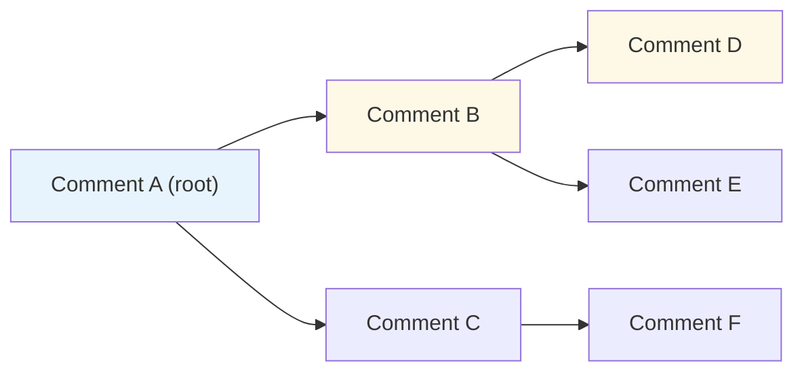
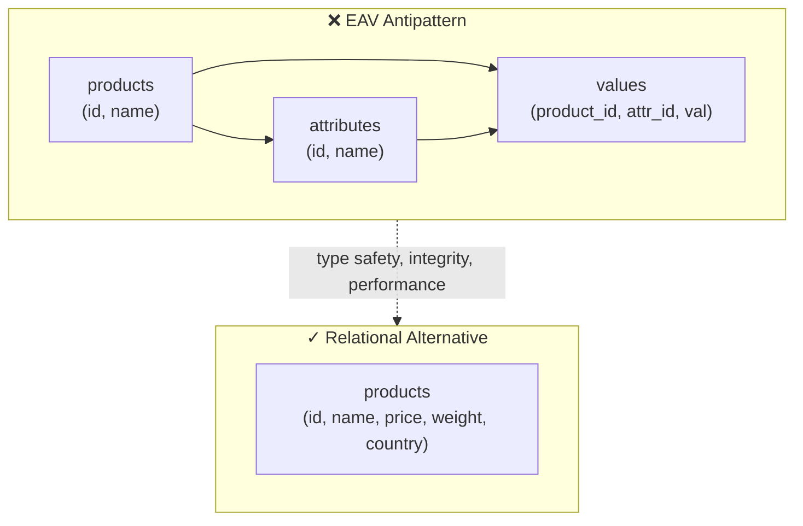
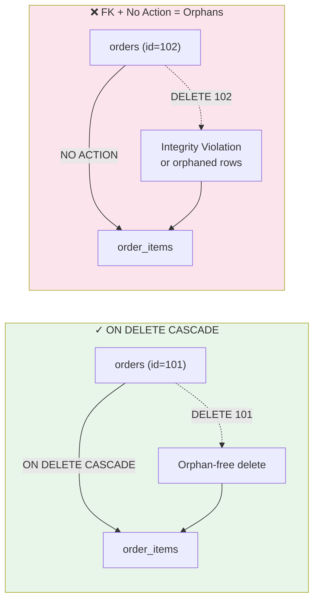
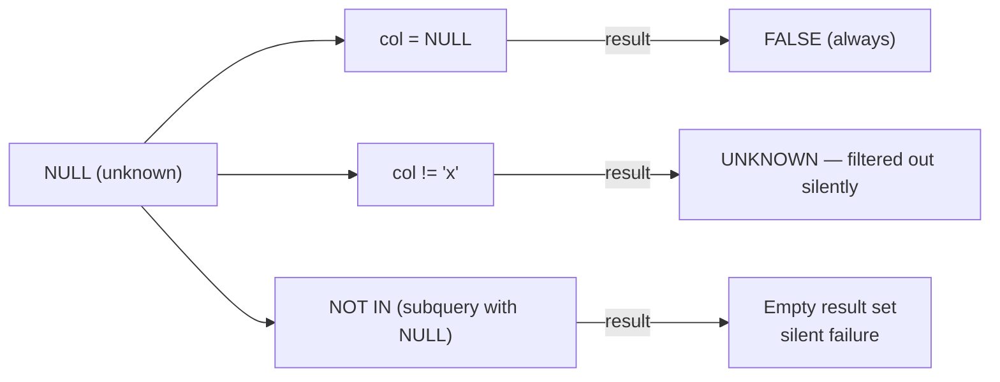
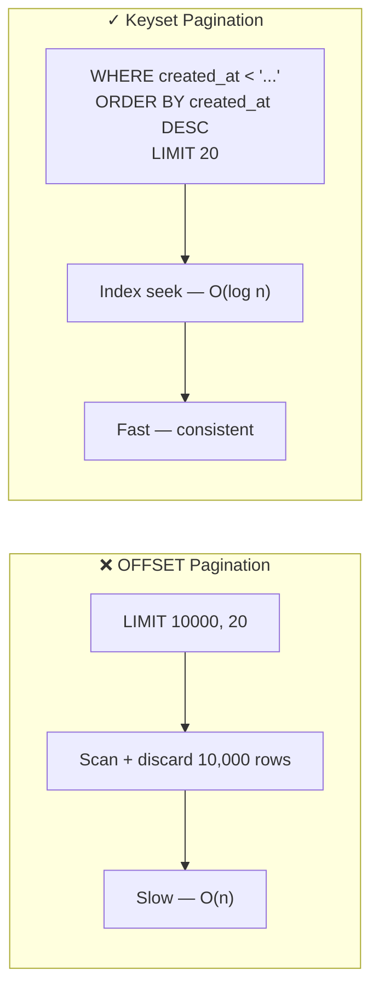

## Antipatterns by Layer



Each antipattern follows a structure: *why the naive choice feels reasonable*, *how it breaks*, and *the pragmatic alternative*.

---

## Naive Trees: Hierarchical Data in a Flat Table

The most common way to represent a tree (categories, org charts, threaded comments) is a self-referential foreign key:

```sql
CREATE TABLE comments (
  id INT PRIMARY KEY AUTO_INCREMENT,
  parent_id INT NULL REFERENCES comments(id),
  body TEXT
);
```

This works until you need to query the entire subtree of a comment. Recursive joins in MySQL before 8.0 required as many application-level round-trips as the tree was deep.



**The fix depends on your read/write balance:**

- **Recursive CTE** (MySQL 8+, PostgreSQL, SQL Server): readable, standards-based.
- **Nested set model**: encodes left/right boundaries; fast subtree reads, moderate writes.
- **Closure table**: a separate `path` table; the most flexible, but requires extra maintenance.
- **Materialized path**: stores the full path in each row; simple but fragile.

Karwin's rule: do not choose a tree model without first counting your reads against your writes.

---

## EAV: The Anti-Relational Schema



The *Entity-Attribute-Value* (EAV) antipattern replaces a table with typed columns by three generic tables: entities, attributes, and values. It trades every relational advantage — type checking, unique constraints, foreign keys, index usage — for illusory flexibility.

Karwin argues EAV is almost always wrong:

- Values are stored as strings, requiring implicit casts.
- Foreign keys to the same lookup table become circular or impossible.
- Every query devolves into pivot logic or application-level re-assembly.
- Adding a real column later requires migrating millions of sparse EAV rows.

**The real fix:** use a wide table with typed columns, a JSON column (with a check constraint) for genuinely optional attributes, or a vertical partitioning strategy.

---

## Referential Integrity: Keys Without Cascades Are Worse Than No Keys

A **foreign key without `ON DELETE` or `ON UPDATE` action** creates a runtime invariant the database cannot enforce:

```sql
-- Declares a relationship but enforces nothing
ALTER TABLE order_items
  ADD CONSTRAINT fk_order
  FOREIGN KEY (order_id) REFERENCES orders(id);
```

If the order is deleted, the database rejects the cascade — *or*, if the FK is deferrable / ignored, orphaned rows accumulate silently.



**The fixes:**

- `ON DELETE CASCADE` for dependent rows (order_items → orders).
- `ON DELETE SET NULL` for optional relationships.
- `ON DELETE RESTRICT` (or `NO ACTION`) where orphan prevention is essential.

If DDL-level cascades are not an option, Karwin insists the application must enforce the invariant — but this is fragile and almost always worthwhile to move into the database.

---

## Comma-Separated Lists and the Set-Valued Column

Storing a list in a string column:

```sql
-- ❌ Antipattern
CREATE TABLE posts (
  id INT PRIMARY KEY,
  tags VARCHAR(255)  -- e.g. 'sql,antipatterns,database'
);
```

This breaks every relational operation: finding all posts with tag `sql` requires `LIKE '%sql%'` (false positives), enforcing tag spelling is manual, and adding composite queries with multiple tags is combinatorial.

**The fix** is a bridging table:

```sql
CREATE TABLE post_tags (
  post_id INT NOT NULL REFERENCES posts(id),
  tag_id  INT NOT NULL REFERENCES tags(id),
  PRIMARY KEY (post_id, tag_id)
);
```

Karwin notes that modern PostgreSQL and MySQL 8+ support JSON arrays — but even JSON defer the same problem: you cannot enforce foreign-key constraints or efficient joins on unindexed array elements. A normalized table is still correct.

---

## NULL Is Not NULL: The Three-Valued Logic Trap

SQL NULL represents "unknown," not zero, not empty, not "no value." Conflating it causes silent logical errors:

| Query | What It Does | Common Bug |
|-------|-------------|-----------|
| `WHERE col = NULL` | Always FALSE | Developer means "is null"; should use `IS NULL` |
| `WHERE col != 'x'` | Skips rows where col IS NULL | Rows with missing data disappear invisibly |
| `WHERE col NOT IN (subquery)` | Evaluates to UNKNOWN if subquery contains NULL | Entire predicate returns no rows |



Karwin's guidance: avoid NULL when a sentinel value is clearer; when NULL is semantically legitimate, always use `IS NULL` / `IS NOT NULL` / `COALESCE()`, and never rely on `!=` to find missing data.

---

## Exact Count: SELECT COUNT(*) Is Not Free

```sql
-- ❌ Antipattern
SELECT COUNT(*) FROM orders WHERE user_id = 42;
-- OR, for pagination:
SELECT * FROM articles LIMIT 10000, 20;
```

`COUNT(*)` over a large matching set forces a full scan. `LIMIT 10000, 20` asks the engine to find and discard the first 10,000 rows before returning 20. On a table indexed on `created_at`, both operations are O(n).

**The fixes:**

- *Does data exist?* Use `SELECT 1 FROM ... WHERE ... LIMIT 1` or `EXISTS()`.
- *How many exactly?* Approximate from metadata when precise count is not required.
- *Pagination?* Use keyset pagination: `WHERE created_at < 'last_seen_value' ORDER BY created_at DESC LIMIT 20`.



Keyset pagination requires a stable, unique sort column. Karwin's recommendation: use it for any feed, list, or search result beyond a few hundred rows.

---

## Random Selection: ORDER BY RAND()

```sql
-- ❌ Antipattern on a table with 1M rows
SELECT * FROM articles ORDER BY RAND() LIMIT 10;
```

The database must assign a random float to every row, sort the entire table, then return 10. Cost: full sort — O(n log n) with allocation per row.

**The fixes depend on scale:**

| Scale | Approach |
|-------|---------|
| < 10K rows | `ORDER BY RAND()` is fast enough in practice |
| 10K–1M | Precompute a random column; index it; select a range |
| > 1M | Reservoir sampling (single pass, O(n) memory bounded) |
| Any | Fetch IDs with a fast random function, join back |

Karwin's principle: if a query takes proportional time to table size, it is a candidate for redesign, not caching.

---

## SQL Injection: Concatenation as Attack Vector

The antipattern with the most severe consequences:

```sql
-- ❌ Antipattern (Python / pseudo-code)
query = "SELECT * FROM users WHERE name = '" + user_input + "'"
```

If `user_input` is `'; DROP TABLE users; --`, the query becomes:

```sql
SELECT * FROM users WHERE name = ''; DROP TABLE users; --'
```

**The fix** is parameterized queries (prepared statements):

```python
# Python / psycopg2 example
cursor.execute(
  "SELECT * FROM users WHERE name = %s",
  (user_input,)
)
```

Parameters are sent separately from the query plan. The database treats user input as data, never as SQL syntax. Karwin is unambiguous: there is no circumstance where concatenating user input into a raw query is acceptable.

---

## Querying by Committee: Every Feature in One Query

A query that tries to serve five different use cases:

```sql
-- ❌ Antipattern
SELECT u.id, u.name,
  COUNT(o.id) AS order_count,
  SUM(o.total) AS lifetime_value,
  MAX(o.created_at) AS last_order,
  p.country,
  CASE WHEN p.vip THEN 'Yes' ELSE 'No' END AS is_vip,
  ... -- 12 more columns
FROM users u
JOIN orders o ON o.user_id = u.id
JOIN profiles p ON p.user_id = u.id
GROUP BY u.id, p.country, p.vip -- mixed group keys
HAVING COUNT(o.id) > 0
  OR p.country = 'US'
```

This violates single-responsibility for queries. The correct approach: one purpose, one query, compose at the application layer if needed.
