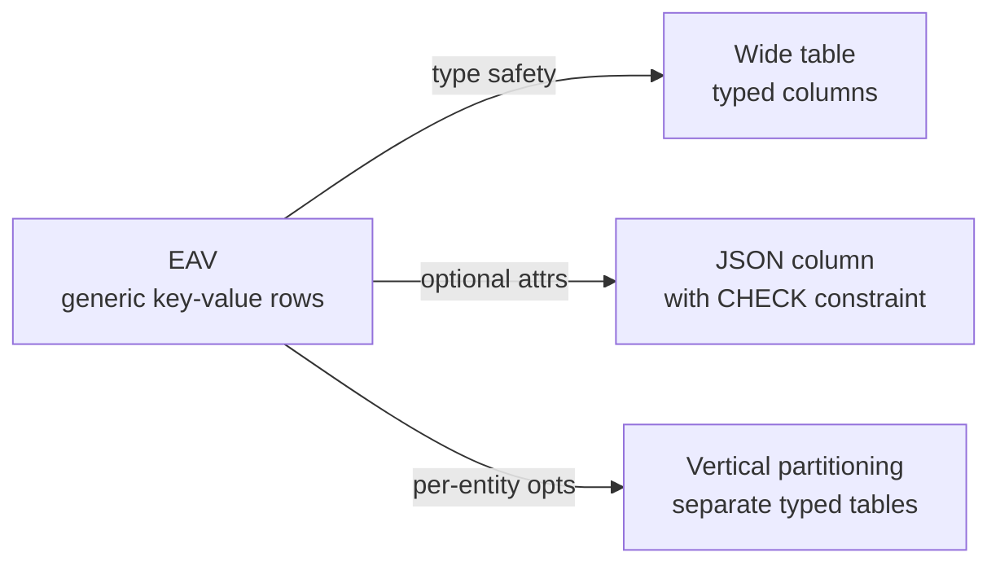
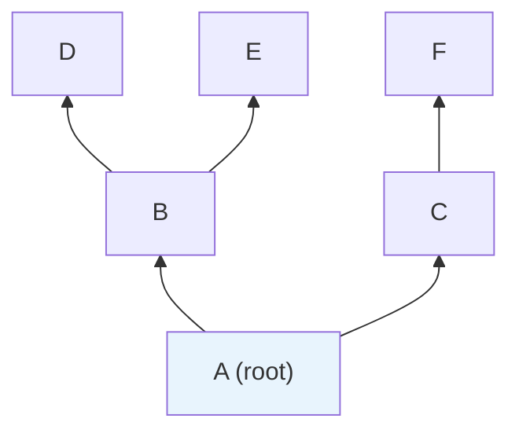
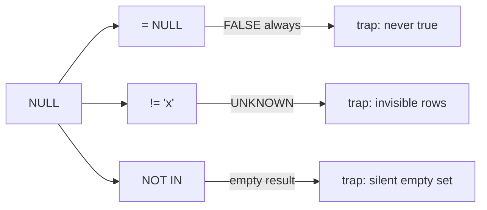
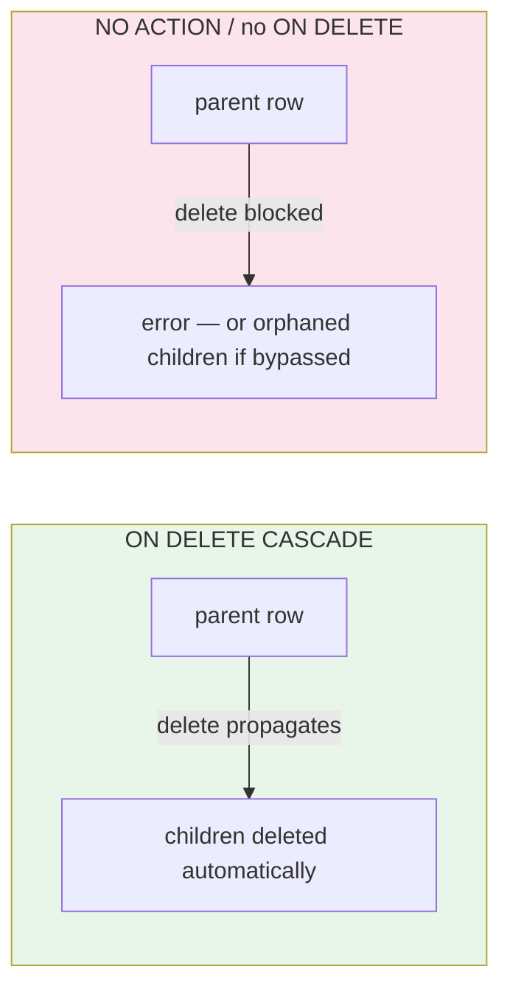
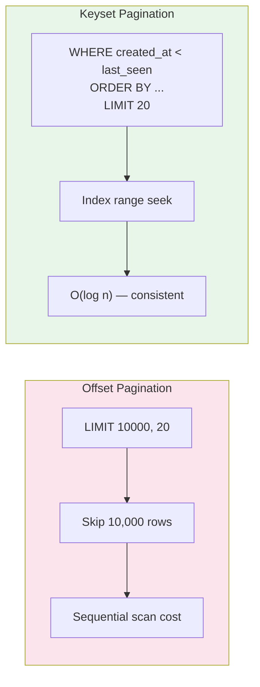

## Introduction

Welcome to BookAtlas. Today: *SQL Antipatterns: Avoiding the Pitfalls of Database Programming*. Bill Karwin, Pragmatic Bookshelf, revised edition 2022. About 320 pages. This is the book that will change how you look at every schema and every query you write.

Karwin is a software engineer, a database architect, a Caltech alum, and a conference speaker who has seen enough bad SQL to write a field guide instead of a textbook.

---

## Why This Book Exists

**Engineer:** Most SQL books teach syntax. `CREATE TABLE`, `SELECT`, `WHERE`, `JOIN`. They are syntax references, not judgment references.

**Skeptic:** And judgment is the hard part, right?

**Engineer:** Exactly. You can memorize `LEFT OUTER JOIN` and still design a schema that silently corrupts data for years. Karwin's insight is that the mistakes are *consistent* — developers with no shared training keep making the same bad decisions. The book names them, explains why they feel right, and shows the correct alternative.

---

## The EAV Antipattern: Flexibility That Becomes Liability

**Skeptic:** Let me guess — every developer eventually hits the moment where they say "what if the product has arbitrary attributes?" and reach for EAV?

**Engineer:** That is exactly the moment Karwin is writing for. Entity-Attribute-Value replaces a table with typed columns by three generic ones: entities, attributes, and values. And it breaks almost everything.

**Skeptic:** Break it for me.

**Engineer:** Type safety is gone — everything is a string. Foreign keys become circular. Finding all products with weight > 1kg requires joining to three tables and applying implicit casts. And adding a new real column later means migrating millions of sparse EAV rows that are either NULL or actual values in the same column.

**Skeptic:** So it is an anti-relational design.

**Engineer:** Exactly. Karwin's preferred alternatives are a wide table with typed columns, a JSON column with a check constraint for genuinely optional attributes, or vertical partitioning if you have genuinely different attribute sets. The key test he provides: *will you ever need to constrain, index, or join against this attribute?* If yes, EAV is wrong.



**Skeptic:** So when is EAV actually right?

**Engineer:** Karwin is honest about the boundary: systems that genuinely require user-defined, dynamic attributes without schema migrations — some metadata stores or scientific data pipelines. But for a business application where requirements are known, it is almost always wrong. The flexibility is illusory because the cost of querying cleanly far exceeds the cost of adding a column.

---

## Naive Trees and Hierarchical Data

**Skeptic:** Hierarchical data is everywhere — categories, org charts, threaded comments. Is the recursive join really the naive view?

**Engineer:** It is, and it surprises people. The most natural schema is a self-referencing `parent_id`:

```sql
CREATE TABLE comments (
  id INT PRIMARY KEY,
  parent_id INT NULL REFERENCES comments(id),
  body TEXT
);
```

This works. It breaks when you need to find all descendants of a comment, or all ancestors. In MySQL before 8.0 you would recurse in application code — one query per level. The database has no idea about the full tree.



**Skeptic:** And the fix?

**Engineer:** It depends on your read/write balance: **nested sets** encode left/right boundaries and enable fast subtree reads but expensive inserts. **Closure tables** store every path in a separate table — the most flexible. **Materialized paths** store the path as a string in each row. And from MySQL 8.0 onward, **recursive CTEs** make this cleanest without any schema trickery.

Karwin's principle: choose tree structure by counting reads against writes. If your tree is written heavily but read lightly, nested sets are a liability. If it is read heavily and written rarely, they are a victory.

---

## NULL Is Not NULL: The Subtle Bug Generator

**Skeptic:** NULL — everyone knows it is "no value," right?

**Engineer:** That is precisely the mistake. NULL means "unknown." Not zero, not empty, not a placeholder. Three-valued logic — TRUE, FALSE, UNKNOWN — is SQL's spec, but most developers reason in two-valued Boolean. The difference produces silent failures.

**Skeptic:** Why silent?

**Engineer:** Because NULL comparisons return UNKNOWN, which `WHERE` filters out without warning:

| Query | Actual Result | Developer Expects |
|-------|--------------|-------------------|
| `WHERE col = NULL` | Always FALSE | rows with NULL |
| `WHERE col != 'x'` | Skips col IS NULL | all non-'x' rows |
| `WHERE x NOT IN (...)` | Returns 0 rows if list contains NULL | all rows not in list |



**Skeptic:** So what does Karwin recommend?

**Engineer:** Avoid NULL when a sentinel value is more explicit. When NULL is correct semantically, *always* use `IS NULL` and `IS NOT NULL`. Use `COALESCE()` generously. And be deeply suspicious of any `NOT IN` that touches a subquery — Karwin suggests always using `NOT EXISTS` instead, where NULL behavior is unambiguous.

---

## Keys Without Cascades Are Worse Than No Keys

**Skeptic:** I have seen teams add foreign key constraints in schema migrations but never use ON DELETE at all. Is that really worse than nothing?

**Engineer:** Karwin argues yes. A foreign key with default `NO ACTION` enforces that the referenced row exists at insert/update time — but provides no guarantee about what happens when you delete the parent. The result is one of two things:

1. **Application errors:** `DELETE FROM orders WHERE id = 101` fails because `order_items` still references it. The application was not written to handle this, and the user sees an opaque error.
2. **Silent orphans:** if the FK was defined `DEFERRABLE` or if the application bypasses the constraint (some ORMs do this), rows accumulate forever with a foreign key pointing to a non-existent row.



Karwin's rule: foreign keys without `ON DELETE` action are a sword without a sheathe. If you declare the relationship, declare the lifecycle.

---

## Pagination: Keyset vs. Offset

**Skeptic:** `LIMIT 10000, 20` — surely that works fine?

**Engineer:** It works. It just gets slower linearly with offset. On a 5-million-row table, `LIMIT 100000, 20` requires scanning and discarding 100,000 rows. The database does the work whether or not you see it.

Karwin's alternative is keyset pagination (also called the seek method):

```sql
-- ✓ Keyset pagination
SELECT * FROM articles
WHERE created_at < '2026-06-04T23:59:00Z'
  AND (created_at, id) < ('2026-06-04T23:59:00Z', 9999)
ORDER BY created_at DESC, id DESC
LIMIT 20;
```

This is an index seek — O(log n) — not a table scan. The `(created_at, id)` tuple handles the case where multiple rows share the same `created_at`, making the sort stable.



Karwin's recommendation: keyset pagination for any feed, list, or search result beyond a few hundred rows. Offset pagination for the first page and admin views where bounded data makes offset cost negligible.

---

## Closing Thoughts

Karwin closes the revised edition with a message that holds for all four parts: *the database is the longest-lived component of most systems*. Application code gets rewritten. Schemas persist. Queries get copied into new services. Antipatterns — once introduced — propagate precisely because they were never flagged as problems.

Read this book once. Read it again before your next schema review.

**Rating: 9/10** — Essential foundational reading for anyone who writes SQL.
