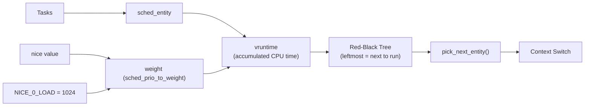
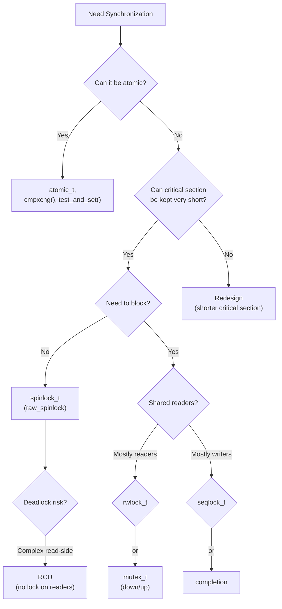
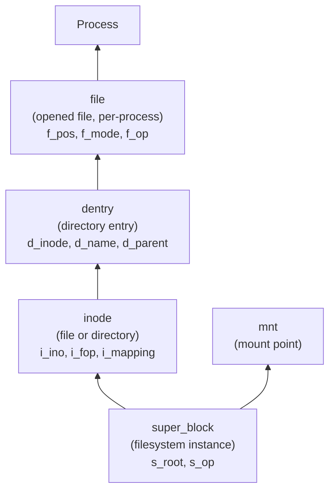

## The Linux 2.6 Kernel: A Subsystem Map

```mermaid
graph TB
  A["Linux Kernel 2.6.x"] --> B["Process Management"]
  A --> C["Memory Management"]
  A --> D["VFS and Filesystems"]
  A --> E["Network Subsystem"]
  A --> F["Device Drivers"]
  A --> G["Interrupt and Timer"]
  A --> H["System Call Interface"]

  B --> B1["task_struct\n(PID, mm, files, signal)"]
  B --> B2["do_fork / clone flags"]
  B --> B3["kernel threads\n(mm NULL, active_mm borrowed)"]
  B --> B4["CFS Scheduler"]
  B4 --> B4a["vruntime"]
  B4 --> B4b["sched_entity"]
  B4 --> B4c["red-black tree"]

  C --> C1["struct page"]
  C --> C2["slab allocator"]
  C --> C3["kmalloc (phys contiguous)"]
  C --> C4["vmalloc (virt contiguous)"]
  C --> C5["GFP flags"]

  D --> D1["super_block"]
  D --> D2["inode"]
  D --> D3["dentry (dcache)"]
  D --> D4["file"]
  D --> D5["ext4 extent trees"]

  E --> E1["sk_buff"]
  E --> E2["sock / sock_ops"]
  E --> E3["net_device"]
  E --> E4["NAPI"]

  F --> F1["cdev (char)"]
  F --> F2["gendisk (block)"]
  F --> F3["bio (I/O vector)"]
  F --> F4["I/O schedulers"]

  G --> G1["request_irq"]
  G --> G2["softirqs"]
  G --> G3["tasklets"]
  G --> G4["workqueues"]

  H --> H1["sys_call_table"]
  H --> H2["sys_open / sys_read / sys_write"]
  H --> H3["sysctl / procfs"]
```



---

## 1 — Introduction and Getting Started

### What the Kernel Is

The kernel is the portion of the operating system responsible for managing system resources: the CPU, memory, and I/O devices. It provides the abstractions (processes, files, sockets) that user-space programs consume. Love positions the Linux kernel as a **monolithic kernel** — a single address-space process — but one with loadable modules, which makes it functionally similar to a microkernel without the IPC overhead.

Linux versions follow the `major.minor.patch` scheme. Odd-numbered minors (e.g., 2.5.x, 2.7.x) are development branches; even-numbered minors (2.4.x, 2.6.x) are stable. At the time of writing, the relevant stable branch was 2.6.x.

### Getting the Source and Building

- Source: `git clone git://git.kernel.org/pub/scm/linux/kernel/git/torvalds/linux.git` or download the tarball.
- Configuring: `make menuconfig` (or `xconfig`, `gconfig`) — generates the `.config` file driven by `Kconfig` files spread through the tree.
- Building: `make` (runs in parallel by default on multi-core hosts via `-j`); `make modules` for loadable modules.
- Installing: `sudo make modules_install`, copy `arch/x86/boot/bzImage` to the boot directory, update `grub.cfg`.

---

## 2 — The Process Model

### task_struct: The ProcessDescriptor

Every process in the system is represented by a `task_struct`. This is the single most important data structure in the kernel; it contains:

| Field | Purpose |
|-------|---------|
| `pid` | Process ID (within PID namespace) |
| `tgid` | Thread group ID (equals `pid` for single-threaded processes) |
| `mm` | Pointer to memory descriptor (`mm_struct`); NULL for kernel threads |
| `active_mm` | Active address space — borrowed from another task for kernel threads |
| `files` | Pointer to `files_struct` (open file descriptors) |
| `fs` | Pointer to `fs_struct` (root cwd, umask, filesystem info) |
| `signal` | Pointer to `signal_struct` (pending signals, signal handlers) |
| `parent` / `children` / `sibling` | Listed relationships for the process tree |
| `state` | TASK_RUNNING, TASK_INTERRUPTIBLE, TASK_UNINTERRUPTIBLE, TASK_STOPPED, TASK_TRACED |
| `cpu` | CPU currently running this task |

PID allocation uses a bitmap (`pidmap_array`). Linux supports 32-bit PIDs by default (up to ~4 billion), with `CONFIG_BASE_SMALL` reducing the default to 2^15 (~32,768) on memory-constrained systems.

### Process Creation: clone(), fork(), vfork()

All three are handled by `do_fork()`:

- **`fork()`** → `clone(SIGCHLD, 0)` — parent and child share nothing.
- **`vfork()`** → `clone(CLONE_VFORK | CLONE_VM | SIGCHLD)` — child shares address space; parent is suspended until child calls `exec()`.
- **`clone()`** → takes live flags argument: `CLONE_VM`, `CLONE_FS`, `CLONE_FILES`, `CLONE_SIGHAND`, `CLONE_THREAD`, `CLONE_PARENT`, `CLONE_CHILD_CLEARTID`, etc.

Threads in Linux are processes with `CLONE_THREAD` set (and `/proc/[pid]/task/[tid]/` for each thread). A kernel thread has `mm = NULL` and `active_mm` pointing to the address space of whatever task was running when it was switched in.

Kernel threads are created via `kthread_create()` (unstable — not scheduled until `wake_up_process()`) or the convenience `kthread_run()` (creates + wakes in one call). They are stopped via `kthread_stop()` (sets a flag and wakes the thread, then waits for it to exit). A kernel thread main loop must call `kthread_should_stop()` regularly.

---

## 3 — The CFS Scheduler

### The vruntime Idea

The Completely Fair Scheduler (CFS), merged in 2.6.23, has one core idea:

> An "ideal multitasking CPU" would give each task exactly 1/Nth of the processor.

CFS models this by tracking each task's accumulated runtime (`vruntime`) and storing all runnable tasks in a red-black tree keyed by `vruntime`. The task with the *lowest* vruntime — the one that has received the *least* CPU time — is always at the leftmost node of the tree and is always the next task scheduled.

`vruntime` is incremented by `delta * NICE_0_LOAD / weight(task->load)`. Higher weights (lower nice values) mean vruntime grows more slowly per wall-clock second. This is the entire scheduling policy — no fixed time slices, no round-robin accounting.



### Real-Time and CONFIG_PREEMPT

Two real-time scheduling policies exist alongside CFS: `SCHED_FIFO` (first-in, first-out; runs until it yields or blocks) and `SCHED_RR` (round-robin among equal-priority RT tasks). Real-time tasks always preempt non-RT tasks.

`CONFIG_PREEMPT` (default disabled in the standard kernel) allows the kernel to preempt a running process in kernel mode to handle interrupt-driven events with lower latency — critical for desktop and embedded workloads.

---

## 4 — System Calls

### The Interface

A system call is the controlled transition from user-space to kernel-space:
1. User-space places arguments in registers and issues `syscall` (or `int 0x80` on legacy x86).
2. The CPU switches to kernel mode.
3. The syscall number indexes into `sys_call_table` (in `arch/x86/kernel/syscall_table.S`).
4. The kernel function executes, places its result in `rax` (or `eax` on 32-bit), with a negative value for error.

```c
// Typical syscall fast path, abstracted
asmlinkage long sys_open(const char __user *filename, int flags, umode_t mode) {
  // filename comes from user address space
  // flags: O_RDONLY | O_WRONLY | O_RDWR | O_CREAT | O_TRUNC | ...
  // mode: file permissions (e.g., 0644)
  // returns: fd (non-negative) on success, -ERRNO on failure
  struct filename *tmp = getname(filename);   // copy from user, validate
  if (IS_ERR(tmp)) return PTR_ERR(tmp);
  long ret = do_filp_open(AT_FDCWD, tmp, flags, mode);  // find inode, open file
  putname(tmp);
  return ret;
}
```

The `ioctl` interface (`unlocked_ioctl`) is the kernel's catch-all for device-specific control operations, avoiding the overhead of adding new syscalls for every parameterized device command.

---

## 5 — Kernel Data Structures (new in 3rd ed.)

This chapter fills a genuine gap: a taxonomy of the container types used throughout kernel code (not general-purpose programming).

| Structure | Purpose | Key API |
|-----------|---------|---------|
| `list_head` | Doubly-linked list (embeddable) | `list_add()`, `list_del()`, `list_for_each_entry()` |
| `hlist_head / hlist_node` | Hash-list: O(1) deletion via pointer-to-pointer | `hlist_add_head()` |
| `kfifo` | Ring buffer (FIFO) | `kfifo_alloc()`, `kfifo_in()`, `kfifo_out()` |
| `idr / ida` | Integer ID allocator (map from ID → pointer) | `idr_preload()`, `idr_alloc()`, `ida_simple_get()` |
| `rb_root / rb_node` | Red-black tree (ordered) | `rb_insert_color()`, `rb_erase()`, `rb_first()` |
| `rbtree` (C++ style) | Alternative RB-tree implementation | `rb_link_node()`, `rb_insert_color()` |

Love's key insight: the wrong structure costs you more than the wrong algorithm. Use a list when you need insertion/deletion by pointer; a hash table when you need O(1) lookup by key; a radix/interval tree for range-based lookups (the kernel uses this for memory management); a bitmap when you need simple set-of-integer membership testing.

---

## 6 — Interrupt Handlers and Bottom Halves

### Top-half / Bottom-half Split

Hardware interrupts run in **interrupt context** (no process backing, cannot block, `TIF_NEED_RESCHED` set). If an ISR were to do all its work inline, it would hold the CPU with interrupts disabled, starving other devices and degrading system responsiveness.

Linux splits processing into:
- **Top-half (ISR)**: Acknowledges the device, reads data from the hardware register into a buffer, schedules the bottom-half. Must complete quickly.
- **Bottom-half**: The heavy work, done at a safer time.


### Registering an Interrupt Handler

```c
// Register an interrupt handler for IRQ 42
irqreturn_t my_handler(int irq, void *dev_id) {
  // Read device status register
  // Copy data from device to kernel buffer
  // Schedule bottom-half (tasklet_schedule(&my_tasklet))
  return IRQ_HANDLED;  // or IRQ_NONE if not ours
}

int ret = request_irq(42, my_handler,
              IRQF_SHARED,   // allow shared IRQ line
              "my_device",   // name in /proc/interrupts
              dev_id);        // passed back to handler
// Free with: free_irq(42, dev_id);
```

Shared IRQs require each handler to check whether the interrupt actually came from its device before acting. The `IRQF_DISABLED` flag causes local interrupts to be disabled throughout the handler's execution.

### Softirqs, Tasklets, and Workqueues

| Mechanism | Context | Can Block | Used By |
|-----------|---------|-----------|---------|
| Softirq | Softirq context (immediately after hard IRQ or ksoftirqd) | No | Networking, block I/ |
| Tasklet (built on softirq) | Softirq context | No | Drivers, legacy subsystems |
| Workqueue | Process context (kworker thread) | **Yes** | General deferrable work |

Tasklets of the same type serialize per-CPU — they never run simultaneously on the same CPU. `tasklet_init()`, `tasklet_schedule()`. Workqueues can sleep, making them the preferred choice for work that could take more than a few milliseconds.

`ksoftirqd` (`ksoftirqd/N` per CPU) runs softirqs that overflow their in-interrupt budget (`NET_RX_SOFTIRQ` under heavy traffic is the canonical trigger).

---

## 7 — Kernel Synchronization

### From Atomically Simple to Complex

The kernel provides a carefully layered toolkit. Pick the simplest primitive that fits your use case.



### Each Primitive in Context

**Atomics** (`atomic_t`, `atomic_inc()`, `cmpxchg()`, `test_and_set_bit()`): Single operations, no locking required. The `cmpxchg` (compare-and-swap) loop is the building block for lock-free structures.

**Spinlocks** (`spinlock_t`, `spin_lock()`, `spin_unlock()`, `spin_lock_irqsave()`): Busy-wait locks for very short critical sections. Cannot sleep. On uniprocessor kernels, spin_trylock always succeeds and `CONFIG_DEBUG_SPINLOCK` catches violations. Use `spin_lock_irqsave()` when your critical section must not be interrupted by your own ISR.

**Reader-Writer Spinlocks** (`rwlock_t`, `read_lock()`, `write_lock()`): Concurrent readers, exclusive writers. Read-side overhead of an atomic inc/dec; write-side is a full spinlock.

**Seqlocks** (`seqlock_t`, `write_seqlock()`): Writers exclusive, readers retry if a write occurred mid-read (check sequence number before and after). Ideal for the `jiffies` read path: readers don't compete with readers, writers don't wait for readers.

**Mutexes (semaphores)** (`mutex_t`, `mutex_lock()`, `mutex_unlock()`): Sleepable, with ownership. The `struct mutex` is lighter than `struct semaphore` (older API) and is the preferred sleepable lock for most new code. Must not be held across scheduling points that might cause deadlock.

**Completions** (`struct completion`, `init_completion()`, `wait_for_completion()`, `complete()`): A one-shot event signaling mechanism built atop mutexes. Used to coordinate when one thread needs to know that another has finished a setup step (e.g., device probing).

**RCU (Read-Copy-Update)**: Readers proceed entirely lock-free and atomically via `rcu_read_lock()` / `rcu_read_unlock()`. Writers update by making a copy, switching the pointer in a single store, then freeing the old copy after a grace period (`synchronize_rcu()`). Best for data structures read vastly more often than written — the page tables, the routing table.

Love's rule: always start with the simplest primitive. If a mutex works, don't reach for a seqlock. If atomics work, don't reach for a mutex.

---

## 8 — Memory Management

### Physical and Virtual Address Spaces

The kernel uses **paged virtual memory**. Each process sees its own virtual address space; the MMU translates virtual to physical via page tables (`pgd` → `pmd` → `pte`, four levels on x86_64, three on 32-bit).

The basic unit of physical memory management is the **page frame** (typically 4KB on x86, 16KB on some ARM configs). It is represented in the kernel by `struct page` — a header managing the physical page's reference count, mapping information, LRU list position, and flags.

### The Slab Allocator and kmalloc

`kmalloc(size, gfp)` returns physically contiguous and virtually contiguous memory. It is built on the slab allocator — `kmem_cache_create()` creates a named cache for a given object size and constructor/destructor callbacks, and `kmem_cache_alloc()` / `kmem_cache_free()` allocate and free objects from that cache. The slab eliminates per-object setup overhead and provides debugging (`cache->object-size` tracking, redzones, poisoning).

Three slab backends exist in the kernel source: `SLAB` (original, tuned for performance), `SLUB` (the default since 2.6.22, simpler, lower per-CPU overhead), and `SLOB` (minimal, for tiny embedded systems). The `kmem_cache` API is common to all three.

```c
// kmalloc with GFP flags
void *buf = kmalloc(8192, GFP_KERNEL);      // may sleep; safe in process context
void *buf = kmalloc(8192, GFP_ATOMIC);      // cannot sleep; safe in interrupt context
void *buf = kmalloc(8192, GFP_NOWAIT);      // no reclaim, no IO; best effort
```

| GFP Flag | Meaning | May Sleep? |
|----------|---------|------------|
| `GFP_KERNEL` | Normal allocation; may trigger reclaim | Yes |
| `GFP_ATOMIC` | Cannot sleep or reclaim | No |
| `GFP_NOWAIT` | Best-effort, no reclaim, no IO | No |
| `GFP_NOIO` | No I/O during reclaim | No* |
| `GFP_NOFS` | No FS operations during reclaim | No* |

`vmalloc(size)` returns virtually contiguous but physically noncontiguous memory (each page is individually allocated via `__get_free_pages()`). Suitable for large software buffers where physical contiguity is not required. `vmalloc` is slower: it must create page table entries for each page, fragmenting the TLB. `ioremap(phys, size)` creates an uncached/device-memory virtual mapping for hardware registers.

---

## 9 — The Virtual Filesystem (VFS)

### Four Objects, One Tree

The VFS is the abstraction layer that allows Linux to support ext4, XFS, NFS, procfs, sysfs, tmpfs, and network filesystems behind a single interface. It provides four objects:



- **`struct super_block`** (`/fs/ext4/super.c`, `fs/namei.c`): one per mounted filesystem. Points to the filesystem's `super_operations`.
- **`struct inode`** (`include/linux/fs.h`): represents a single filesystem object (file, directory, symlink, socket). Contains `i_ino` (inode number), `i_mode` (permissions), `i_uid`, `i_gid`, `i_size`, `i_fop` (file operations), `i_mapping` (address space for page cache).
- **`struct dentry`** (`include/linux/dcache.h`): maps a name to an inode. Stored in the **dcache** for fast pathname resolution. Dentries contain names, not content. The relationship: `dentry.d_inode = inode`, `dentry.d_parent = parent dentry`.
- **`struct file`** (`include/linux/fs.h`): represents an **opened file for one specific process**. Each process gets its own `file` object with its own `f_pos` (file offset). Multiple processes opening the same file get distinct `file` objects.

The fast path for an open: walk the path component by component, looking up each component's dentry in the dcache (dcache hits are O(1)). On miss, walk the filesystem directory structure and populate the dcache. The result: subsequent `open()`/`stat()`/`unlink()` of the same pathname cost essentially nothing.

---

## 10 — Block I/O and Filesystems

### Block vs. Character Devices

The Linux device model distinguishes between two fundamental types:

- **Character devices** (`cdev`): unbuffered, sequential access (e.g., TTY, `/dev/mem`, `/dev/zero`, `/dev/random`). Operations: `open`, `read`, `write`, `ioctl`, `llseek`. Implemented via `struct cdev` and `struct file_operations`.
- **Block devices**: buffered, random-access, block-oriented I/O (e.g., `/dev/sda`, `/dev/nvme0n1`). All I/O is routed through the **block I/O layer** (`bio`, request queue, I/O scheduler). Implemented via `gendisk` and `block_device_operations`.

### The bio Structure

`struct bio` represents an I/O request. It contains:
- `bi_sector` — starting sector on disk
- `bi_size` — total I/O size in bytes
- `bi_vcnt` — number of `bio_vec` segments (scatter/gather)
- `bi_io_vec` — array of physical page + length pairs

### I/O Schedulers

Four schedulers ship with the 2.6 kernel:
- `noop` — FIFO, minimal complexity; best for SSDs, flash, virtual disks
- `deadline` — FIFO with read priority; read requests aged and promoted
- `CFQ` — fair queuing: per-process queueing with time-slice allotments
- `anticipatory` — retains the last-accessed block and speculatively waits (deprecated in the era of SSDs)

### ext2, ext3, ext4: Evolution of a Filesystem

| | ext2 | ext3 | ext4 |
||---|-----|-----|
| Year | 1993 | 2001 | 2008 (mainline 2.6.19) |
| Journaling | No | Yes (metadata, data modes) | Yes (metadata, data modes) |
| Block map | Indirect blocks | Indirect blocks | Extent tree (`ext4_extent`) |
| Directories | htrees | htrees | htrees + extents + large dirs |
| Max file size | 2 TB | 2 TB | 16 TB |
| Max volumes | 4 TB | 16 TB | 1 EB |
| Inline data | No | No | Yes (small files in inode) |

**ext4's two defining features:**

1. **Extent trees**: Replace indirect blocks with `ext4_extent` tree nodes. An extent maps a contiguous range of logical → physical blocks. A 1MB file can be represented by a single extent (or a handful for fragmented files) instead of thousands of indirect blocks. This is the operational reason ext4 outperforms ext3 on large files.

2. **Delayed allocation**: Instead of allocating physical blocks immediately at `write()`, ext4 defers allocation to `writeback` time (`ext4_da`), when the filesystem can find contiguous space opportunistically. Combined with extent trees, this dramatically reduces fragmentation on copy-heavy workloads.

### The proc Filesystem

`/proc` serves two purposes: system information (read-only) and kernel control (read/write).

**Key system-wide entries:**

| Path | Content |
|------|---------|
| `/proc/cpuinfo` | CPU features and flags |
| `/proc/meminfo` | Memory usage summary |
| `/proc/uptime` | System uptime |
| `/proc/version` | Kernel version string |
| `/proc/modules` | List of loaded kernel modules |
| `/proc/mounts` | Mounted filesystems |

**Per-process entries (under `/proc/[pid]/`):**

| Path | Content |
|------|---------|
| `cmdline` | Command-line arguments (null-byte separated) |
| `environ` | Environment variables |
| `maps` | Mapped memory regions |
| `status` | Human-readable process state |
| `stat` | Detailed process statistics |
| `fd/` | Directory: symlinks to each open file |

**Creating a custom entry (modern seq_file interface):**

```c
static int my_show(struct seq_file *m, void *v) {
  seq_printf(m, "value: %d\n", my_value);
  return 0;
}
static int my_open(struct inode *inode, struct file *file) {
  return single_open(file, my_show, NULL);
}
static const struct proc_ops my_fops = {
  .proc_open    = my_open,
  .proc_read    = seq_read,
  .proc_lseek   = seq_lseek,
  .proc_release = single_release,
};
proc_create("my_entry", 0444, NULL, &my_fops);
// Remove with: proc_remove(proc_remove("my_entry"));
```

`seq_file` handles buffer management and the "read partial line" problem that plagued the old `read_proc_t` interface. It supports `lseek` by re-running the show function from the beginning (acceptable for inexpensive read paths).

---

## 11 — Networking

### The Stack in Brief

The Linux networking stack is organized into layers. From the bottom up:

1. **Network device drivers** (`net_device`, `ndo_start_xmit()`, `napi_struct`): `NAPI` (New API) is the dominant receive-path architecture — the ISR schedules a polling routine (`napi_schedule()` → `netif_receive_skb()`) that processes multiple packets in a softirq loop, avoiding per-packet interrupt overhead under burst traffic.

2. **sk_buff (`struct skb_shared_info`)**: The packet buffer. Functions `skb_put()` (push tail), `skb_pull()` (advance head), `skb_push()` (prepend) manipulate the buffer as different headers are added/removed during protocol processing.

3. **Protocol layers**: IPv4/IPv6, TCP, UDP registered via `inet_add_protocol()`.

4. **Socket layer** (`struct sock`, `sock_ops`): The BSD socket interface. `socket()`, `bind()`, `listen()`, `accept()`, `connect()`, `send()`, `recv()`.

5. **Netfilter**: Five hooks (`NF_INET_PRE_ROUTING`, `NF_INET_LOCAL_IN`, `NF_INET_FORWARD`, `NF_INET_LOCAL_OUT`, `NF_INET_POST_ROUTING`) allow arbitrary filtering (`iptables` / `nftables`) and connection tracking.
