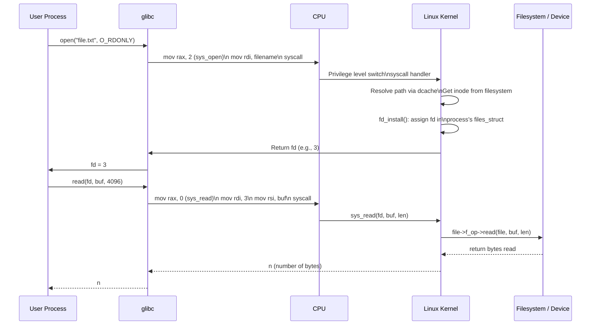
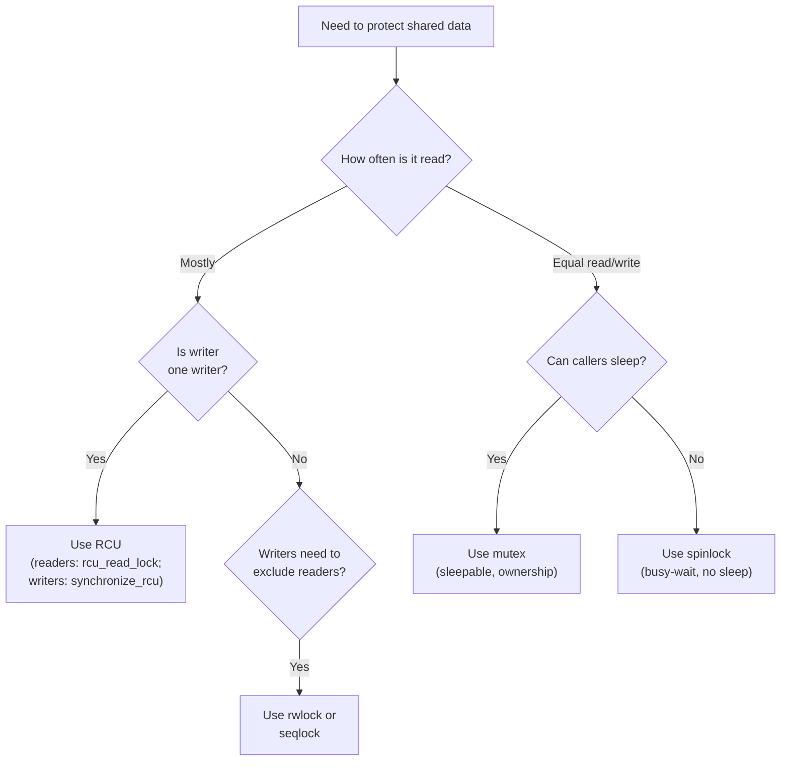

## The Why Behind the Structures

Love's best teaching method is explaining *why* each structure exists and *why* it is designed the way it is. Understanding the motivation makes the details memorable and gives the reader a template for reasoning about similar code.



---

## The Process Model Re-examined: Kernel Threads

A kernel thread is the simplest possible active entity: a `task_struct` with `mm = NULL`. When the scheduler runs it, the task borrows the address space of the previous task via `active_mm`. No page table walk, no TLB shootdown. The transition is essentially free.

This design decision — kernel threads without their own address space — has a profound consequence. **Kernel threads cannot be swapped out** because there is no user-space memory to swap. They also cannot access user-space memory directly (no `copy_to_user()` in kernel thread context — there is no `from` side). They can only touch kernel memory and hardware registers.

Common kernel threads and why they exist as threads:

| Thread | Why It Is a Thread |
|--------|--------------------|
| `ksoftirqd/N` | Softirqs deferred from ISR to avoid starvation; needs a schedulable context |
| `kthreadd` | Parent of all dynamically created threads; manages lifecycle |
| `migration/N` | CPU hotplug: evacuates tasks off a CPU before it goes offline |
| `watchdog/N` | Watchdog timer; detects hard lockups |
| `ecryptfs/kthread` | ecryptfs mount helper; needs to interact with user-keyring |

---

## The CFS In Detail: vruntime, Weight, and the Tree

CFS's "no quantum" design reflects a philosophical commitment: the kernel should not try to guess what "fair" means for every workload. Instead it applies a mathematical model and lets the workload itself reveal its ideal distribution.

The variance in vruntime directly encodes how much CPU a task "deserves" relative to others. A nice-19 task has weight 101 vs. nice-0's 1024, so its vruntime accumulates roughly 10x faster. Without ever being explicitly told "penalize this task," the red-black tree structure makes it vanish to the rightmost position and deprives it of CPU proportionally.

The practical implication of vruntime is enormous: **CFS is self-regulating**. A CPU-bound task that hogs the CPU gets vruntime that grows faster, is scheduled less frequently, and naturally yields to interactive tasks (which tend to have moderate vruntime because they interleave I/O waits). This is what makes Linux feel responsive without explicit priority bumping for I/O tasks.

---

## System Calls: The Cost Trajectory

The syscall path on x86_64 is relatively fast but still involves:
- `syscall` instruction: saves RIP and RSP, switches to kernel GS base.
- Entry code: save registers, verify syscall number, handle 32-bit compat if applicable.
- Function dispatch: indirect jump through `sys_call_table`.
- Return: restore registers, `sysret` instruction (faster than `iret`).

The reason Love emphasizes that `ioctl` exists is that adding a syscall costs this transition twice (in + out). For a device driver with a few control parameters per second, syscall overhead dominates. `ioctl` batches the control work into a single call and avoids the syscall entry/exit for each small command.

---

## Kernel Synchronization: The Rules in Practice

**Rules to live by** (Love states these explicitly and they haven't changed):

| Rule | Why |
|------|-----|
| Do not hold spinlocks while accessing user-space memory | `copy_from_user()` may page fault; page fault handling acquires its own locks → deadlock |
| Do not sleep while holding a spinlock | Sleeping releases the CPU; another task waiting on the same lock spins forever |
| Do not call scheduling functions (schedule()) while holding a spinlock | Prevents preemption; defeats the purpose of preemptive kernel |
| Prefer RCU for read-mostly data structures | Enables readers to skip locking entirely; writer pays amortized cost |



### RCU Walked Through

RCU's guarantee is what makes it safe: after `synchronize_rcu()` returns, all pre-existing RCU read-side critical sections have completed. This means the old pointer is safe to free.

```c
// RCU update pattern
struct my_node {
  struct rcu_head rh;
  int value;
  struct hlist_node node;
};

void update_value(int old_val, int new_val) {
  struct my_node *old = find_node(old_val);
  if (!old) return;
  struct my_node *new = kmalloc(sizeof(*new), GFP_KERNEL);
  *new = *old;
  new->value = new_val;
  hlist_replace_rcu(&old->node, &new->node);  // atomic pointer swap
  call_rcu(&new->rh, free_node);              // free old after grace period
}
```

The reader side: `rcu_read_lock()` / `rcu_read_unlock()` — nothing more. No hash table, no atomic increment, no cacheline ping-pong. Just a compiler barrier. This is why RCU read-side critical sections are often hundreds of times faster than lock-based equivalents on read-heavy workloads.

---

## Memory: kmalloc, GFP, and the Nightmare of Wrong Context

The `GFP_*` flags are a contract with the kernel allocator. Violating the contract produces bugs that are hard to reproduce:

- **`GFP_KERNEL`** in an ISR: The allocator may need to reclaim pages, which requires scheduling. Scheduling while holding an ISR spinlock → deadlock (detected by `lockdep` in debug kernels).
- **`GFP_ATOMIC`** on a cache-cold, memory-starved embedded system: The allocation may fail silently. The caller must check for NULL and handle failure.
- **`vmalloc`** in an ISR: `vmalloc` may call `kmalloc(GFP_KERNEL)` internally, violating the ISR constraint.

Practical tip: define a local macro for your subsystem's recommended GFP:

```c
#define MY_SLAB_GFP GFP_KERNEL   // process context
#define MY_IRQ_GFP  GFP_ATOMIC  // interrupt context
```

---

## The VFS as a Pattern Language

The four VFS objects (superblock → inode → dentry → file) are less a data structure and more a design pattern: each object encapsulates a specific relationship and has a precise lifecycle.

```
Path resolution walk:
  path = "/home/alice/docs/report.pdf"
  1. Start at mount root (super_block.s_root dentry)
  2. Walk "home" → dentry hash lookup → dentry (d_inode points to inode)
  3. Follow d_alias → resolve "docs"
  4. Resolve "report.pdf"
  Result: struct dentry * with d_inode (the file's inode)
```

On resolution, `lookup_fast()` (fast path) uses the dcache. On miss, `lookup_slow()` walks the on-disk directory (ext4 `ext4_lookup()`), populates the dcache, and continues. The first `stat("home/alice/docs/report.pdf")` calls the slow path; all subsequent calls are O(1) dcache hits. This is why Linux `open()` is faster for frequently accessed files than CIFS or NFS mounts without aggressive caching.

---

## ext4's Extent Trees Under the Hood

The key inode field for ext4: `i_blocks` (logical block count) shrinks with extents because a single 128KB extent replaces up to 32 indirect block pointers. For a 1GB file:
- **ext2**: up to 82,000 indirect block reads (double + triple indirect) just to enumerate the inode.
- **ext4 with extents**: ~8 extent tree nodes (a B-tree of height 2–3 at most) covering the entire range.

The actual data structure (`struct ext4_extent` header in `include/linux/ext4_extents.h`):

```
struct ext4_extent_header {
  __le16  eh_magic;      // EXT4_EXT_MAGIC
  __le16  eh_entries;    // number of entries
  __le16  eh_max;        // max entries this node can hold
  __le16  eh_depth;      // depth of this node (0 = leaf)
  __le32  eh_generation; // generation
};
struct ext4_extent {
  __le32  ee_block;      // first logical block extent covers
  __le16  ee_len;        // number of blocks covered
  __le16  ee_start_hi;   // high 16 bits of physical block
  __le32  ee_start_lo;   // low  32 bits of physical block
};
```

If the extent fits in `i_block` inline (small files, `EXT4_INLINE_DATA`), even the tree lookup is skipped. A 4KB file's data may live entirely inside the inode on disk.

---

## Character Devices vs Block Devices: Why It Matters for Driver Writers

| Attribute | Character | Block |
|-----------|-----------|-------|
| Access | Sequential, unbuffered | Random, block-oriented, buffered |
| I/O unit | Byte, character | Block (typically 512B or 4KB) |
| Implemented via | `struct cdev`, `file_operations` | `gendisk`, `block_device_operations` |
| Typical use | TTY, serial, sensors, GPIO | Disk, SSD, flash |
| Buffer | None by default | Block layer + page cache |
| Direct I/O possible | No | Yes (O_DIRECT) |
| Request queue | N/A | `request_queue` (I/O scheduler) |

A driver that misidentifies its device type will produce a non-functional or dangerously incorrect interface. Writing to a block device through `write()` bypasses the request queue and writes to the raw device block device, doing who-knows-what to the filesystem on top.

---

## Practical Lessons from the Book

1. **Use `container_of()` from day one**: Almost every kernel list operation returns a pointer to the embedded `list_head`, not the containing structure. `container_of(ptr, type, member)` recovers the parent. This idiom is pervasive:
   ```c
   struct my_task {
     struct task_struct task;
     struct list_head list;  // embedded list node
   };
   // Given a list_head ptr:
   struct my_task *t = container_of(ptr, struct my_task, list);
   ```

2. **`likely()` and `unlikely()` are branch prediction hints**: GCC's `__builtin_expect()`. They do not change correctness — they allow the compiler to lay out code so the common case falls through without a branch misprediction penalty.
   ```c
   if (likely(ptr))  /* we expect ptr to be non-null */
   if (unlikely(err)) /* errors are rare, most calls succeed */
   ```

3. **`printk()` log levels are filters, not just labels**: `KERN_DEBUG`, `KERN_INFO`, `KERN_WARNING`, `KERN_ERR`. The kernel console loglevel (`/proc/sys/kernel/printk`) controls which messages reach the console at runtime. `KERN_DEBUG` messages are suppressed by default unless `DYNAMIC_DEBUG` is configured. Don't spam `printk()` from a fast path unless you mean it.

4. **`oops` messages are structured**: An oops contains the faulting EIP, the process name and PID, a register dump, and a stack trace. Using `scripts/decode_stacktrace.sh` against a `vmlinux` built with `CONFIG_DEBUG_INFO=y` maps the raw addresses to source file and line number. The `addr2line -e vmlinux 0xADDRESS` trick does the same by hand.

5. **Don't `memcpy` to/from user space**: Always use `copy_from_user()` and `copy_to_user()`. These handle page faults that cross into invalid user-space addresses gracefully (returning the number of bytes not copied), and implicitly check memory permissions. Direct `memcpy` from a userspace pointer silently reads arbitrary kernel memory on fault — a critical security vulnerability.

6. **`jiffies` and HZ define your timer resolution**: On most kernels, `HZ = 1000` (jiffy = 1ms). On some embedded configurations, `HZ = 100` (jiffy = 10ms). Always query `HZ` from `linux/jiffies.h` rather than assuming. High-resolution timekeeping uses `ktime_get()` and `hrtimer`, which provide nanosecond precision independent of `HZ`.

---

## The Arc of What You Learn

Reading this book from cover to cover maps directly onto the kernel's own architectural depth:

1. **Processes and scheduling**: the kernel's primary abstraction — why the CPU does what it does.
2. **System calls**: the user-kernel boundary — how programs ask the kernel to do things.
3. **Memory management**: the physical substrate — how the kernel resources CPU time against memory.
4. **Synchronization**: the coordination layer — how the kernel avoids corrupting shared state at scale.
5. **VFS and I/O**: the storage and device interface — how programs and the kernel share persistent state.
6. **Filesystems and networking**: the high-level subsystems built on the VFS and block/I network layers.
7. **Debugging and community**: the skills for maintaining and extending what you've learned.

Each chapter builds on the previous. By the time you reach the networking chapter, all the synchronization, memory, and process concepts are infrastructure you've already internalized. That ordering is not coincidental — it is how the kernel is organized internally.

**Rating: 9/10** — The best starting point for anyone serious about Linux kernel internals. Acknowledged x86 bias and pre-4.x cutoff keep it from being definitive, but its pedagogical clarity and Love's insider authority make it irreplaceable.
