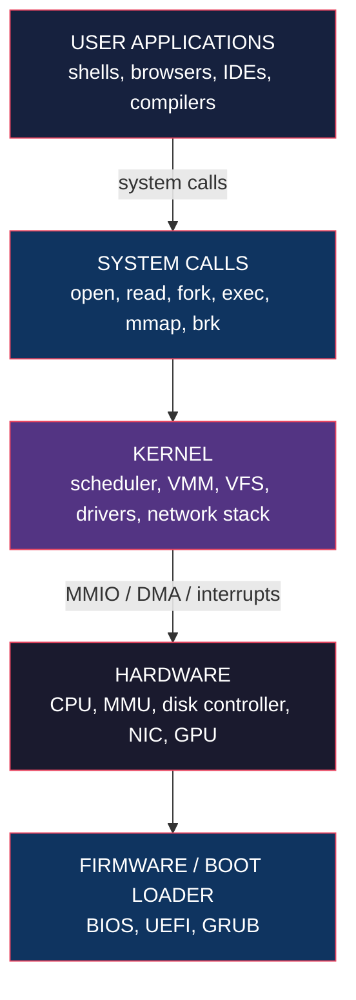
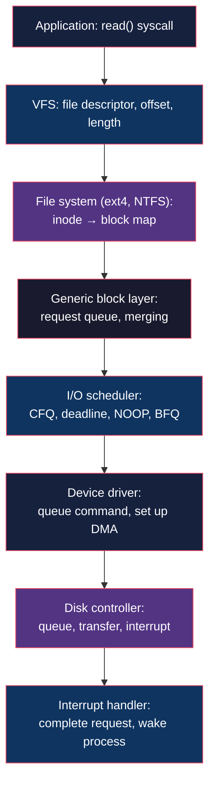
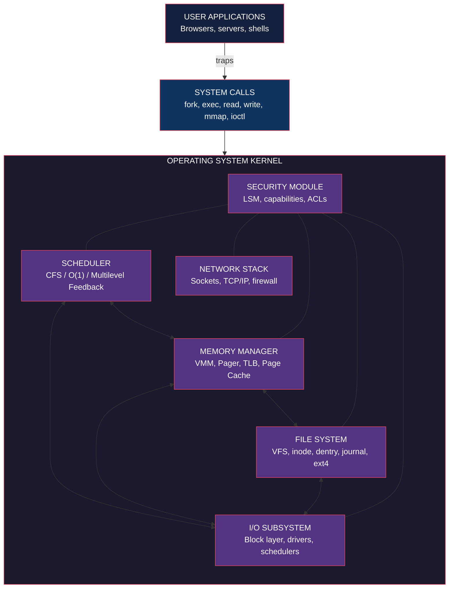

# Core Concepts

## What Is an Operating System

Tanenbaum begins with two views. The **user view** is the API the
shell or desktop exposes: a file system, a process model, a network
interface. The **system view** is the layer that turns limited
hardware into the illusion of unlimited, private, persistent
resources. The two are connected by a thin ring of **system calls**:
the trap into the kernel.

A modern OS implements, at minimum:

- **Process management** — create, schedule, terminate processes
- **Memory management** — allocate, deallocate, and swap memory
- **File system** — organize, store, and retrieve named objects
- **I/O** — drive disks, networks, terminals, and peripherals
- **Protection and security** — enforce boundaries between users
  and processes
- **Networking** — expose the network as a stream or message
  abstraction (typically via the sockets API)

The kernel sits in **privileged mode** (ring 0 on x86). All other
code runs in user mode. The transition between the two is the
**system call**, implemented as a hardware trap that jumps to a
fixed entry point in the kernel.

### The Layered View

The OS is the only software layer that runs in privileged mode. It
is therefore the only thing that can directly touch hardware
registers, configure the MMU, and receive interrupts. The "OS as
extended machine" and "OS as resource manager" are two ways of
saying the same thing: the OS hides ugly hardware behind a clean
interface and arbitrates the use of scarce resources.

---

## Processes and Threads

A **process** is a program in execution. Concretely, it is an
address space plus one or more threads of control. A **thread** is
the scheduled entity: a program counter, a register set, a stack,
and a small block of bookkeeping. Threads within a process share
the address space and most kernel resources; threads across
processes do not.

### The Process Control Block

For every process, the kernel maintains a **process control block
(PCB)** that records:

- Process state (running, ready, blocked, new, terminated)
- Program counter and registers
- Memory management info (page table base, segment limits)
- Open file descriptors
- Scheduling information (priority, accounting)
- Signal handlers and pending signals
- PID, parent PID, user/group IDs

When a thread is preempted, the kernel saves its register state in
the PCB and restores the next thread's state. The thread itself
never knows it was stopped.

### Thread Models

Three implementations are common:

| Model | Description | Example |
|-------|-------------|---------|
| **User-level threads** | Library manages threads; kernel sees one process | Early GNU pthreads, Java green threads |
| **Kernel-level threads** | Kernel schedules each thread; true parallelism | Linux, Windows NT threads |
| **Hybrid** | User threads mapped to kernel threads (M:N) | Windows 8 UMS, some research OS |

The trend is unambiguously toward kernel-level threads because
they are the only model that gives you parallelism on a multicore
processor. A user-level thread library running on a single kernel
thread can be preempted but cannot run in parallel.

### Scheduling

The **scheduler** decides which ready thread runs on which CPU.
Schedulers are characterized by their **policy** (who to run) and
their **mechanism** (preemption, priorities, classes).

| Policy | Description | Use |
|--------|-------------|-----|
| **First-come, first-served (FCFS)** | Run to completion, queue order | Batch systems |
| **Shortest job first (SJF)** | Minimize average turnaround | When runtimes are known |
| **Round-robin** | Time slices, queue order | Interactive systems |
| **Priority** | Higher-priority threads first | Real-time, multi-user |
| **Multilevel feedback queue (MLFQ)** | Adjusts priority based on behavior | Linux CFS, classical UNIX |
| **Earliest deadline first (EDF)** | Run task with closest deadline | Real-time, hard deadlines |
| **CFS (completely fair scheduler)** | Virtual runtime, red-black tree | Linux 2.6+ |
| **O(1) scheduler** | Per-priority run queue | Linux 2.6 (deprecated) |

The chapter ends with a discussion of **real-time scheduling**:
rate-monotonic and EDF, the analysis tools for them, and the
caveats of trying to mix real-time and best-effort workloads.

### Interprocess Communication

Threads in the same process share memory; threads in different
processes do not. To communicate, the OS provides three mechanisms:

1. **Message passing** — `send(pid, msg)`, `receive(pid, &buf)`.
   Simple, requires no shared state. Used in microkernel designs.
2. **Shared memory** — `mmap` a region into two address spaces.
   Fast, requires synchronization. Used in databases and HPC.
3. **Signals** — async notifications. Lightweight, limited payload.
   Used for control (e.g., SIGTERM, SIGSEGV).

Race conditions on shared data are the dominant source of bugs in
concurrent programs. The tools to prevent them are the **mutual
exclusion primitives**: mutexes, semaphores, monitors, condition
variables. The chapter on synchronization covers them in depth, plus
classical problems (producers/consumers, readers/writers, dining
philosophers) and the classical bugs (priority inversion,
deadlock).

---

## Deadlocks

A **deadlock** is a set of processes, each holding resources and
waiting for resources held by others, with no way to make progress.

### The Four Coffman Conditions

All four must hold simultaneously:

1. **Mutual exclusion** — resources cannot be shared
2. **Hold and wait** — process holds one resource while waiting
   for another
3. **No preemption** — kernel cannot forcibly take a resource
4. **Circular wait** — a cycle exists in the wait-for graph

### Handling Strategies

| Strategy | Approach | Cost |
|----------|----------|------|
| **Ignore** | Pretend deadlocks don't happen | Cheapest, used by Windows and most consumer OSes |
| **Detect and recover** | Run a detection algorithm; kill victims | Used in databases and batch systems |
| **Dynamic avoidance** | Banker's algorithm; refuse unsafe allocations | Requires known maximums; rarely used in practice |
| **Prevention** | Break one Coffman condition by design | The realistic approach; ordering of locks is the dominant technique |

The book's lesson: **deadlock prevention by resource ordering** is
the only technique that scales. The other strategies either impose
heavy runtime cost or rely on assumptions that real workloads do
not satisfy. Tanenbaum is honest about this — most production
systems use a combination of prevention (for critical paths) and
ignore (for everything else), with manual intervention for
recovery.

---

## Memory Management

A process lives in an address space that looks contiguous to it
but is in fact scattered across physical memory (or not in memory
at all). The translation from virtual to physical is done by the
**memory management unit (MMU)** on every memory access, using a
**page table** maintained by the kernel.

### Paging

The address space is divided into fixed-size **pages** (typically
4 KiB on x86, but configurable). Physical memory is divided into
**frames** of the same size. The page table maps pages to frames.
A virtual address is split into a page number and an offset; the
MMU looks up the frame number and combines it with the offset to
form the physical address.

### The TLB

A page-table walk is expensive (four memory accesses for a four-
level page table on x86-64). The **translation lookaside buffer
(TLB)** caches recent translations. A TLB miss forces a hardware or
software page-table walk. The kernel's job is to keep the working
set inside the TLB.

### Page Replacement

When all frames are in use and a new page is needed, the kernel
must choose a victim. The classical algorithms:

| Algorithm | Idea | Optimal? |
|-----------|------|----------|
| **Optimal** | Evict the page that will be used farthest in the future | Provably optimal; cannot be implemented (needs future knowledge) |
| **NRU (not recently used)** | Use referenced and dirty bits; pick a "not recently used" class | Cheap, decent |
| **FIFO** | Evict the oldest page | Terrible (Belady's anomaly) |
| **Second chance (clock)** | FIFO, but a referenced page gets a second pass | Cheap, near-LRU |
| **LRU (least recently used)** | Evict the least recently used page | Excellent; expensive to implement |
| **Working set** | Evict pages not in the current working set | Excellent; needs working-set tracking |
| **WSClock** | Clock algorithm with working-set ages | The practical winner in OS textbooks |
| **LFU (least frequently used)** | Evict the page used least | Good for some workloads |

Tanenbaum treats **WSClock** as the most realistic — it
approximates the working set using a single clock hand and
per-page ages, and it handles the case where the working set
exceeds physical memory by cleanly falling back to a "all
hands on deck" eviction mode.

### Virtual Memory and the File System

The virtual-memory subsystem and the file system share more than
they look. Both are **name-to-block** mappings with caching and
write-back. The kernel exploits this: **memory-mapped files** use
the page cache as a file cache, and writes to a file can dirty
memory pages that are then flushed to disk. Linux's
`/proc/meminfo` and Windows' working set manager are both
expressions of the same idea.

---

## File Systems

A file system is a **named, persistent, hierarchical store**. The
kernel exposes it through a uniform API (`open`, `read`, `write`,
`close`, `seek`, plus directory operations). Internally, the
kernel implements this on top of block devices with a stack of
data structures: superblock, inode table, directory entries, free-
space bitmap, and the on-disk layout.

### The UNIX File Abstraction

- **File** — a named byte stream
- **Directory** — a file containing a map of names to inodes
- **Path** — a `/`-separated sequence of directory names ending in
  a file or directory
- **Inode** — the metadata structure: type, permissions, size,
  timestamps, block pointers
- **Mount** — attach a file system at a point in the namespace
  tree

### Allocation Strategies

Where on disk do file blocks go?

| Strategy | Pros | Cons |
|----------|------|------|
| **Contiguous allocation** | Simple, fast sequential read | External fragmentation, hard to grow |
| **Linked list** | No external fragmentation | Random access is slow (chained pointer lookups) |
| **Linked list with FAT** | Random access via the in-memory table | Whole FAT must be in memory |
| **Inodes** | Direct, indirect, double-indirect pointers | Limited file size (until extents) |
| **Extents** | Run-length-encoded runs of contiguous blocks | Internal fragmentation |

Modern file systems (ext4, NTFS, XFS, Btrfs, ZFS) use extents
combined with B-trees for fast lookup. The basic idea is the same
as it was in 1970; the data structures have improved.

### Crash Consistency

What happens if the power dies in the middle of a write? The
file system can be left in a state that does not correspond to
any valid point in time. The defenses:

- **fsck** — at mount, scan the disk and rebuild metadata. Slow
  for large disks; obsolete in modern systems.
- **Journaling (write-ahead log)** — write a log of metadata
  changes before applying them. After a crash, replay the log.
  Used by ext3, ext4, NTFS, XFS. Trades a sequential log write
  for a guaranteed consistent state.
- **Copy-on-write (COW)** — never overwrite a block; write new
  blocks and atomically switch the root. Used by ZFS and Btrfs.
- **Log-structured merge (LSM)** — write everything sequentially,
  compact in the background. Used by flash file systems (F2FS).

The chapter ends with security: ownership, permissions, ACLs, and
capabilities. POSIX permissions (the classic `rwxr-xr-x` triplet)
are simple and widely deployed; ACLs extend them; capabilities are
the theoretically cleaner alternative that the authors prefer but
acknowledge has not been widely adopted.

---

## I/O

I/O is the slowest thing the OS does. Tanenbaum's treatment
emphasizes the principles: the device-driver model, blocking
vs. non-blocking I/O, DMA, and the storage stack.

### The Device-Driver Model

Every I/O device is hidden behind a uniform interface. A device
driver is a kernel module that implements three operations:

1. **Initialize** the device (allocate buffers, register
   interrupts)
2. **Issue a request** (program the controller, set up DMA)
3. **Handle completion** (interrupt handler reads the result and
   wakes the waiting thread)

The OS above the driver sees a uniform interface (`read`, `write`,
`ioctl`). The driver translates to device-specific commands. This
abstraction is what makes it possible to support thousands of
devices with a small core kernel.

### The Storage Stack

For a disk read, the request flows down:

The I/O scheduler is the most interesting piece for performance.
It reorders requests to minimize seek time (for rotating disks) or
to balance latency and throughput (for SSDs). The book covers
classical algorithms: FCFS, SSTF, SCAN, C-SCAN, LOOK, and the
anticipatory scheduler. For SSDs, no scheduling is the right
answer.

### RAID

The chapter covers **RAID levels 0 through 6** in the standard
way: striping, mirroring, parity. The non-obvious lesson: RAID is
not backup. A RAID array protects against disk failure, not
against accidental deletion, software bugs, or ransomware.
Modern systems often use RAID for performance and replication
across machines for durability.

---

## Multiprocessors

Chapter 7 is the book's most concrete treatment of multicore. A
multiprocessor (or multicore) introduces a new class of problems
that do not exist on a uniprocessor:

### Memory Coherence

Each CPU has its own cache. Without coordination, two CPUs can
read the same memory location and see different values. The
hardware maintains **coherence** via a protocol, usually **MESI**
(Modified, Exclusive, Shared, Invalid). The kernel programmer
sees the cache as a transparent abstraction; the hardware
ensures that a write by one CPU eventually becomes visible to
others.

The cost is not zero. **False sharing** — two unrelated variables
on the same cache line — can destroy performance. The cure:
padding to keep hot variables on different cache lines.

### Synchronization Primitives

| Primitive | Use | Cost |
|-----------|-----|------|
| **Spinlock** | Short critical sections, kernel mode | Burns CPU while waiting |
| **Blocking mutex** | User-mode critical sections | Two context switches |
| **Read-copy-update (RCU)** | Mostly-read data structures | Awkward to use; spectacular performance |
| **Sequential lock** | Small data, writers are rare | Cheap readers |
| **Atomic operations** | Counters, flags | The cheapest primitive |

The chapter also covers **lock-free programming** and the
**compare-and-swap (CAS)** loop that underlies most concurrent
data structures. The author's honest take: lock-free is fast and
correctness-hard; most production code should use blocking
primitives unless measurements demand otherwise.

### Multiprocessor Scheduling

Symmetric multiprocessing (SMP) scheduling has its own problems:

- **Affinity** — a thread should ideally run on the CPU it last
  ran on, to keep its cache warm
- **Load balancing** — keep all CPUs busy
- **NUMA** — on non-uniform memory access systems, threads
  should run near their memory

Linux's CFS scheduler, Windows' scheduler, and FreeBSD's ULE all
address these with similar mechanisms: per-CPU run queues with
periodic load balancing and a domain-aware migration policy.

---

## Security and Protection

Security is no longer a chapter at the end of the book. In the
fourth edition it is integrated throughout and given its own
chapter. The model is the **reference monitor**: every access to
every object is mediated by a trusted kernel. The classic
formulation: complete mediation, tamperproof, small enough to
verify.

### The Threat Model

| Threat | Example | Defense |
|--------|---------|---------|
| **Unauthorized disclosure** | Reading another's files | Permissions, encryption |
| **Unauthorized modification** | Writing to system files | Permissions, integrity checks |
| **Unauthorized use of service** | CPU/memory hogging | Quotas, cgroups |
| **Denial of service** | Fork bomb, SYN flood | Resource limits, SYN cookies |
| **Code execution** | Buffer overflow | ASLR, stack canaries, NX, CFI |
| **Side channel** | Cache timing, Spectre/Meltdown | Hardware fixes, microcode, mitigations |
| **Privilege escalation** | Setuid bug | Capabilities, sandboxing |
| **Malware** | Virus, trojan, ransomware | Sandboxing, app permissions, signatures |

### Defenses Built into the OS

- **Authentication** — passwords, biometrics, smart cards,
  Kerberos
- **Access control** — DAC (discretionary), MAC (mandatory),
  RBAC (role-based), capabilities
- **Memory protection** — ASLR, NX bit, guard pages, canaries
- **Cryptography** — TLS in the kernel, dm-crypt, key rings
- **Auditing** — syslog, Windows event log, auditd
- **Secure boot** — signed boot chain (UEFI)
- **Sandboxing** — chroot, namespaces, containers, seccomp
- **Trusted computing base (TCB)** — minimize the trusted code

The book also covers **the cryptography** a working systems
programmer must know: symmetric (AES) and asymmetric (RSA, ECC)
ciphers, hash functions (SHA-2, SHA-3), MACs, and authenticated
encryption (GCM, ChaCha20-Poly1305). The point is not to teach
cryptanalysis but to explain *how* the OS uses crypto to do its
job.

### The Fourth-Edition Reorganization

The 4th edition added material on **virtualization** (Type-1 and
Type-2 hypervisors, hardware assist: VT-x, AMD-V), **cloud
computing** (multi-tenant security), and **mobile security**
(Android's permission model, sandboxing, full-disk encryption).
These are the right additions for a 2014 book and remain
relevant.

---

# Frameworks

---

# Mental Models

| Model | Application |
|-------|-------------|
| **The OS as extended machine** | Hide ugly hardware behind a clean API |
| **The OS as resource manager** | Multiplex scarce resources among competing users |
| **Virtualization** | Every OS mechanism is a translation table: virtual name → physical resource |
| **Layered onion** | Hardware → kernel → syscalls → libraries → applications. Each layer is the abstraction for the one above |
| **The two-level scheduler** | Kernel schedules threads onto CPUs; the user schedules threads onto a thread pool |
| **The page as the universal unit** | A page is a chunk of virtual memory, a chunk of a file, a chunk of the page cache, and a chunk of swap. One concept, many uses |
| **The process is a sandbox** | A process can see only its address space, its file descriptors, and its own signal handlers. Everything else is the kernel's job |
| **The kernel is the only privileged code** | All isolation, all protection, all security, all hardware access goes through the kernel. A bug in the kernel is a bug in the system |
| **Race conditions are bugs in the model** | Whenever two threads access shared data without synchronization, the program is wrong. No language or tool can save you |
| **Deadlocks are architectural** | The only scalable defense is resource ordering. Everything else is recovery, not prevention |

---

# Key Lessons

1. **The OS is a translation layer.** Virtual addresses, file
   paths, sockets, capabilities — every "thing" the programmer
   names is translated by the kernel to a physical resource.
   Learning the OS is learning the translations.

2. **Threads are the unit of execution; processes are the unit of
   isolation.** A process is an address space plus one or more
   threads. The kernel schedules threads, isolates processes, and
   mediates between them. Confusing the two is the source of many
   beginner mistakes.

3. **Most concurrency bugs are race conditions.** Lock the data,
   not the code. Hold locks for the shortest time you can. Use
   higher-level primitives (channels, queues, lock-free data
   structures) wherever possible.

4. **Deadlock prevention beats detection.** Order the locks, and
   deadlock becomes impossible. Detect-and-recover is for
   databases and batch jobs where prevention is genuinely hard.

5. **Virtual memory is the OS's central trick.** Paging, TLBs,
   page replacement, and the page cache form a single coherent
   system. Read the chapter twice — once for the abstraction and
   once for the performance.

6. **File systems are databases that happen to be on disk.**
   Journaling and copy-on-write are the two main techniques for
   crash consistency. ext4 (journaling) and ZFS/Btrfs (COW) are
   the two main modern families.

7. **I/O scheduling is where performance lives.** A bad scheduler
   can turn a fast disk into a slow one. The right scheduler
   depends on the device: SCAN for spinning disks, NOOP for SSDs,
   none for NVMe.

8. **Multicore is the new normal.** A single-threaded program on
   a 16-core machine wastes 94% of the hardware. False sharing
   and cache misses matter more than big-O complexity for
   performance-critical code.

9. **Security is the kernel's job.** Permissions, sandboxes,
   capabilities, ASLR, NX, secure boot, full-disk encryption —
   every one is a kernel mechanism. If the kernel is wrong,
   security is wrong.

10. **The case studies are not decoration.** Linux, Windows, and
    Android are not the only systems, but they are the three most
    important ones. Read those chapters as the practical anchor
    of the book.

---

# Practical Applications

**Writing a concurrent program.** Start from the assumption that
every shared variable is a bug. Identify the invariant. Choose the
smallest lock that protects it. Use higher-level abstractions
(message queues, channels) where possible. Use thread sanitizer
(ThreadSanitizer, helgrind) during development. For performance,
measure with `perf`, profile the cache misses, and only then
optimize.

**Designing a memory allocator.** Learn the brk/mmap API on
Linux. Understand fragmentation (internal and external). Know
your workload (many small allocations, many large, mostly free
on exit). Don't write your own allocator unless you must;
tcmalloc, jemalloc, and mimalloc are battle-tested. If you must
write one, start from a slab or free-list design and benchmark.

**Debugging a deadlock.** Capture stack traces from all threads
(`gcore`, `jstack`, `/proc/<pid>/stack`). Look for the
circular-wait pattern: who holds what, who waits for what. The
fix is almost always to impose a global order on the locks. Add
a runtime check (`lockdep` in Linux) to catch inversions in
development.

**Reasoning about a file system crash.** Mount the file system
read-only. Run `fsck` or its equivalent (NTFS fix, ZFS scrub).
Look at the journal. If a journal is not available, accept the
risk of metadata loss and recover from backups. For a real
system, test recovery: kill the power, restore from
replication, replay from the journal. Repeat.

**Adding a system call.** Read the kernel's syscall table. Add
an entry. Write a handler that copies arguments from user
space, validates them, and copies results back. Use
`copy_from_user` / `copy_to_user` (Linux) or
`ProbeForRead` / `ProbeForWrite` (Windows). Test with a
userspace wrapper. Do not skip validation; the kernel's
contract is that it never crashes the system.

**Designing a permission model.** Decide between **DAC** (each
user owns their files), **MAC** (system-wide policy), **RBAC**
(users belong to roles), and **capabilities** (unforgeable
tokens). For most apps, DAC with ACLs is enough. For
multi-tenant cloud, MAC or RBAC. For high-assurance systems,
capabilities. Test the model: can a user escape their
sandbox?

---

# Examples

**Tanenbaum's MINIX.** Tanenbaum created MINIX in 1987 as a
teaching OS. It was a small UNIX clone with a microkernel
architecture. A young Finnish student named Linus Torvalds
studied MINIX, was inspired to write a "real" kernel, and
released Linux 0.01 in 1991. The book's case study of MINIX is
both historical and pedagogical: it shows the architecture of a
small OS in full and demonstrates that a textbook OS can be
real.

**The UNIX `fork`/`exec` model.** `fork()` creates a child
process that is a copy of the parent. `exec()` replaces the
current process image with a new program. The combination
allows a shell to set up redirection in the child and then
exec the program — without the program knowing that its stdin
is a pipe. The book explains why this design is elegant and
why Windows' `CreateProcess` (which combines the two) is the
alternative.

**The Linux completely fair scheduler.** CFS replaces the
classic priority queues with a red-black tree of "virtual
runtime." A thread that has run less than its fair share is
the leftmost node in the tree and is selected next. The
algorithm is O(log n) per scheduling decision, scales to
thousands of threads, and gives every thread a fair share of
the CPU. The book treats it as a model of how to apply a
classic data structure to a modern problem.

**The Windows NT object manager.** Everything in Windows is an
object with a name, a security descriptor, and a handle. Files,
processes, threads, semaphores, registry keys, even the device
itself. The kernel's object manager is the central abstraction;
it owns the namespace, the security checks, and the reference
counting. Tanenbaum uses this to illustrate the principle: a
small number of well-chosen abstractions can subsume the entire
OS.

**Android's Binder IPC.** Android replaced the Linux process
model's inter-process communication with Binder, an
intent-based mechanism that allows processes to invoke
methods on objects in other processes. Binder adds a kernel
driver, a userspace library, and a language-level
abstraction. It is how the system server, the apps, and
the kernel coordinate. The book uses Binder to show how a
modern OS adds a custom IPC layer on top of a
general-purpose kernel.

---

# Action Plan

1. **Skim chapters 1, 2, 6 first.** Read the introduction, the
   process/thread chapter, and the I/O chapter. This gives you
   the vocabulary for the rest of the book.

2. **For each chapter, write a one-page summary.** Force yourself
   to articulate the central idea. Compare it to the chapter
   summary at the end of the book. If you cannot summarize, you
   have not understood.

3. **Do the problems.** Tanenbaum includes exercises. The
   scheduling problems in chapter 2 and the page replacement
   problems in chapter 4 are the most valuable. Working through
   them is the difference between reading the book and learning
   the book.

4. **Read the case studies alongside the principles.** When you
   finish chapter 4 (memory), read the Linux memory chapter
   in 9. When you finish chapter 5 (file systems), read the
   ext4 and NTFS sections. This pairing turns principles into
   practice.

5. **Implement a small scheduler or a small page replacement
   algorithm.** A few hundred lines in your favorite language
   will make the algorithms concrete. Bonus: add a visualization
   that shows the run queue or the page table changing over
   time.

6. **Read a piece of the Linux kernel source.** Pick something
   small — `sched_fair.c` for scheduling, `mm/page_alloc.c`
   for memory, `fs/ext4/` for the file system. The book
   prepares you; the source tests you.

7. **Set up a kernel-debugging environment.** A virtual machine
   (QEMU) with a custom kernel you can `printk` into. Trigger
   a context switch, a page fault, a file read. Watch the
   output. This is the most direct way to internalize the
   abstractions.

8. **Pair the book with a project.** A small kernel module, a
   userspace file system (FUSE), a custom scheduler in
   user-mode Linux, a toy VM with paging. The book provides
   the map; the project makes you walk the territory.
