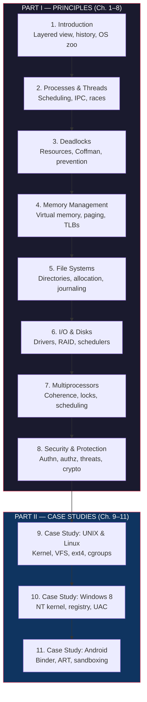

## 📖 Overview

*Modern Operating Systems* is the textbook that has trained several
generations of systems programmers, kernel hackers, and computer
scientists. First published in 1992 and now in its fourth edition
(2014), it is the single most widely assigned OS textbook in the
world. The fourth edition adds a new co-author, **Herbert Bos** of
Vrije Universiteit Amsterdam, and substantially revises the treatment
of security, multiprocessors, virtualization, and mobile systems to
reflect the post-2010 landscape.

The book is built on a single thesis: **modern operating systems
solve a small set of recurring problems — virtualization, concurrency,
persistence, protection, and naming — and a working systems
programmer must understand the design trade-offs behind every
solution.** Tanenbaum and Bos do not merely catalog those solutions;
they explain *why* each design was chosen, what it costs, and when it
breaks. The textbook draws an unbroken line from the abstract
principles of process scheduling and virtual memory down to the
specific data structures and code paths inside Linux, Windows, and
Android.

The structure is stable across editions. **Chapter 1 (Introduction)**
sets the vocabulary: what an OS is, what it is for, and the layered
view (hardware, kernel, system calls, applications). The book then
splits into two large arcs. **Chapters 2–8** cover the principles:
processes and threads, deadlocks, memory management, file systems,
I/O, and security. **Chapters 9–11** (and the case studies sprinkled
throughout) apply those principles to **Linux, Windows 7/8, and
Android**, the three reference systems the authors use to make
abstract ideas concrete.

The book is long — over 1,100 pages — and unapologetically so. It is
designed to be read selectively in a one-semester course and
referenced for years afterward. Every chapter ends with a clear
summary, a list of the problems to know, and a small set of further
readings. There are no code listings to copy; the diagrams are
diagrams, not syntax.

---

## 🧭 Executive Summary

The book is essentially a guided tour of a virtual operating system.
The two arcs are independent enough that the case studies can be read
alongside their corresponding principles chapters. Most instructors
use the book in a 2-semester sequence: principles in the first
semester, case studies in the second.

---

## 🎯 Key Takeaways

- **The OS is a virtual machine and a resource manager.** Every
  design decision can be traced to one of these two goals. Process
  isolation creates the illusion of private machines. Schedulers
  multiplex CPUs, memory allocators multiplex RAM, file systems
  multiplex disks. **If you can describe an OS mechanism in terms
  of "what resource is being virtualized and how," you understand
  the mechanism.**

- **Processes and threads are the units of work.** A process is an
  address space plus one or more threads of control. A thread is a
  scheduled program counter plus a stack. The kernel schedules
  threads, not processes. IPC, signals, shared memory, and
  scheduling are the core of the chapter. The deep insight: most
  correctness bugs in modern systems are race conditions caused by
  thread interactions.

- **Deadlocks arise from four necessary conditions.** Mutual
  exclusion, hold-and-wait, no preemption, and circular wait. Break
  any one and deadlocks become impossible. The algorithms — resource
  allocation graphs, the Banker's algorithm, the dining philosophers
  — are abstractions; the *conditions* are what matter in practice.

- **Virtual memory is the OS's central trick.** Every process gets a
  private, contiguous address space backed by physical pages that
  may live anywhere (in RAM, in swap, or nowhere). Paging, TLBs,
  page replacement algorithms (LRU, clock, working set), and
  handling of page faults form a tightly coupled system. The same
  idea — translation via a table — is reused for file systems
  (inode tables) and security (capabilities).

- **File systems are databases optimized for one writer.** Directories,
  inodes, free-space bitmaps, journaling, copy-on-write, and
  consistency under crash are the key concepts. Modern file systems
  (ext4, NTFS, ZFS, Btrfs) differ in how they order writes and
  recover from crashes, but the underlying model is the same.

- **I/O scheduling and the storage stack matter more than people
  think.** Disk drives, flash, and networks all queue requests. The
  scheduler determines throughput and latency. RAID, the I/O
  elevator algorithms, and the storage stack (block layer, device
  drivers, controllers) are where "real" performance is won or lost.

- **Multiprocessors force every assumption to be re-examined.** A
  shared-memory multiprocessor is not a fast uniprocessor. Memory
  coherence, cache consistency protocols (MESI), spinlocks vs.
  blocking locks, and the difficulty of writing parallel code
  dominate. The authors treat this thoroughly because almost every
  computer sold today is a multicore.

- **Security is everywhere and nowhere.** The OS must enforce
  authentication, authorization, and auditing. The threats range
  from buffer overflows to side channels. Modern OSes add
  cryptographic primitives (TPMs, secure boot, ASLR, canaries)
  directly into the kernel. Security is no longer an add-on.

- **Real systems are messy.** The Linux, Windows, and Android case
  studies show how theory meets constraint: scheduling classes in
  Linux (CFS, real-time), the Windows registry and UAC, Android's
  Binder IPC and ART runtime, sandboxing, and the
  permission-of-the-prompt model.

---

## 👥 Who Should Read

| Read this | Skip this |
|-----------|-----------|
| Upper-division CS undergraduates in an OS course | Beginners with no systems programming background (read Stallings or a lighter intro first) |
| Graduate students preparing for systems qualifying exams | Practitioners looking for hands-on tuning guides (this is principles, not ops) |
| Kernel and platform engineers who want a rigorous foundation | Those looking for a specific Linux distro or Windows manual (this is OS theory applied, not a sysadmin book) |
| Researchers in systems, security, or distributed computing | People wanting a quick read — at 1,100 pages, this is a reference |
| Self-taught engineers who learned Linux by trial and error and want the underlying model | |
| Anyone preparing for OS-related interview questions (Microsoft, Google, Amazon) | |

---

## 🚫 Who Should Skip

If you are looking for a book to teach you Linux administration, the
Linux kernel source, or device driver development, this is not the
right book. The Linux case study is one chapter. If you need
hands-on kernel programming, read *Linux Device Drivers* (Corbet et
al.) or *Understanding the Linux Kernel* (Bovet & Cesati). If your
interest is Windows internals, read *Windows Internals* (Russinovich
et al.). Tanenbaum & Bos is the *principles* book — it explains the
design space, not the daily craft of any one system.

---

## 📊 Core Themes

**Virtualization.** The OS pretends that each process has its own
machine. CPU virtualization, memory virtualization, and even
device virtualization all rely on the same conceptual move: a
translation table from a *virtual* name (a virtual address, a file
descriptor, a device path) to a *physical* resource. Tanenbaum
returns to this idea throughout the book.

**Concurrency and the cost of sharing.** Threads cooperate but
share. Sharing is cheap and dangerous. The book treats the
primitives (mutexes, semaphores, monitors, condition variables) and
the *reason* for them — protecting invariants under interleaving —
as inseparable.

**Trade-offs, not optimality.** OS design is the art of choosing the
right wrong answer. Every scheduling algorithm, every page
replacement policy, every file system layout trades one cost for
another. The book never pretends a solution is best; it always
asks *best for what?*

**The case study as a forcing function.** Linux, Windows, and
Android are not chosen because they are open source or because
Tanenbaum likes them. They are chosen because they embody the
principles in different ways: Linux as the cleanest expression of
UNIX ideas, Windows as a commercial system with different
constraints, Android as a sandboxed mobile OS built on Linux. The
contrast sharpens both the principles and the practice.

**History matters.** Each chapter begins with a short historical
section. The lesson: many "modern" design choices were settled in
the 1960s and 1970s (CTSS, MULTICS, THE, UNIX) and the reasons
survive in the current code. Ignoring the history makes the
present look arbitrary.

---

## 💡 Why This Book Matters

Every programmer interacts with an operating system every day, and
most do not understand the layer beneath their code. *Modern
Operating Systems* is the book that makes the implicit explicit.
Why is a `read()` slow? Why does a context switch cost what it
costs? Why is `O_TRUNC` dangerous? Why does your browser have so
many threads? Why does swapping kill performance but is sometimes
faster than paging? The book answers questions like these with
specific mechanisms, named algorithms, and references to real
systems.

It is also the book the field uses to teach itself. When a
new graduate joins a kernel team, they have almost certainly read
this book (or its predecessor, Tanenbaum's *Operating Systems:
Design and Implementation*). The shared vocabulary — process
control block, virtual address space, page table, dentry,
inode, capability, copy-on-write, scheduling class — is a
Tanenbaum vocabulary. Learning the book is, in part, learning the
field's lingua franca.

Finally, the book has *stayed right*. Tanenbaum revised the fourth
edition in 2014, adding virtualization, multicore, and security
material that earlier editions lacked. The principles have not
changed; the weight has. The fourth edition is still the right
starting point for serious systems work in 2025.

---

## 🔗 Related Books

| Book | Author(s) | How It Connects |
|------|-----------|----------------|
| **Operating Systems: Design and Implementation** | Tanenbaum & Woodhull | The companion volume that uses MINIX to teach the same material hands-on. The "code" version of MOS. |
| **Operating System Concepts** | Silberschatz, Galvin, Gagne | The other canonical OS textbook. More "concepts and definitions," less case study depth. Often paired with MOS in OS courses. |
| **Understanding the Linux Kernel** | Bovet & Cesati | Line-by-line tour of Linux 2.6. Best follow-up after the Linux chapter in MOS. |
| **Linux Kernel Development** | Robert Love | A kernel hacker's view: how subsystems work in practice. |
| **Windows Internals** | Russinovich, Solomon, Ionescu | Deep dive on Windows NT. The Windows chapter of MOS is the textbook introduction; this is the engineering reference. |
| **The Design and Implementation of the 4.4 BSD Operating System** | McKusick et al. | The historical reference for the BSD lineage. |
| **Computer Architecture** | Hennessy & Patterson | The hardware below the OS. Read this if you need to understand caches, TLBs, and coherence. |
| **Operating Systems: Three Easy Pieces** | Arpaci-Dusseau | A free, modern, friendly alternative. Lighter on theory, heavier on intuition. Often a first book; MOS is the second. |
| **Distributed Systems** | Tanenbaum & van Steen | Same authors, sister volume. For after MOS, when you are ready for the network. |

---

## ⭐ Final Verdict

**Rating: 9/10**

*Modern Operating Systems* is the reference textbook for the
field. The fourth edition remains the standard years after
publication because Tanenbaum and Bos treat the OS not as a
catalog of features but as a coherent set of design problems.
Every abstraction is introduced for a reason, every algorithm is
motivated, and every principle is followed by at least one
concrete example from a real system. The writing is plain,
precise, and sometimes dry — but the subject is dry in places,
and the clarity is more valuable than the flair.

**The trade-offs.** At 1,100 pages, this is not a weekend read.
Some chapters (security, multiprocessors) deserve to be books on
their own and are necessarily compressed. The fourth edition is
now a decade old, and some specifics — Linux 3.x, Windows 8, early
Android — feel dated even when the principles underneath are
timeless. A 2025 reader will need to mentally map the case
studies onto current systems (Linux 6.x, Windows 11, Android 14),
which is straightforward but worth doing.

**Bottom line.** If you read this book and do the exercises, you
will understand every operating system you will ever meet, in
detail, from the syscall interface down to the disk. There is no
substitute. For most working systems programmers, this is the
most important single book they will ever read.
